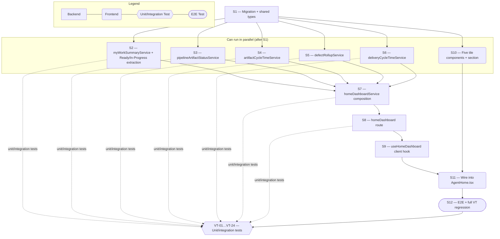

## Target route
`/home`

## Page decision
`update-page`

# Technical Specification — Pipeline Status Dashboard

> **PRD slug:** `status-driven-agent-home` | **Owning layer:** `src/server/services/` (new aggregation services) + `src/client/components/` (new tiles inside `AgentHome.tsx`) | **Surface:** Full stack
> **Verification builds:** `npx tsc -p tsconfig.server.json --noEmit` and `npx tsc -p tsconfig.client.json --noEmit`
> **Open items:** See [design-doc-assumptions.md](design-doc-assumptions.md) (3 unresolved)
> **Design doc:** [design-doc-design.md](design-doc-design.md)

---

## UI Changes (from approved prototype)

- [ ] [impacts-existing] Add a new "Project Status" heading and two tile grid rows directly beneath the existing composer/History-button block on the Agent Home compose (landing) view, increasing the page's scroll height (target area: `AgentHome.tsx`, inside `styles.compose`, after `composeInner`)
- [ ] [additive] Incomplete Pipeline card: five collapsible-by-group lists (Interview, PRD, Test Case, Design Prototype, Design Doc), each with a count badge, up to 20 rows sorted oldest-updated-first, and a "View all" link per group (target area: new card, Project Status row 1, left column)
- [ ] [additive] Artifact Cycle Time card: up to five KPI blocks (Interview, PRD, Test Case, Prototype, Design Doc) each showing a median-days value and caption (target area: new card, Project Status row 1, right column)
- [ ] [additive] My Work card: Ready/In Progress count pair plus a median cycle-time KPI with unit label (target area: new card, Project Status row 2, column 1)
- [ ] [additive] Open Bugs on PBIs card: total-bugs badge in the header plus per-PBI rows (id, title, open-bug count) (target area: new card, Project Status row 2, column 2)
- [ ] [additive] Developer → Production card: single KPI value + caption, entire card clickable to navigate to Releases (target area: new card, Project Status row 2, column 3)
- [ ] [additive] Per-group and per-KPI empty-state copy (e.g. "No incomplete interviews in this project.", em dash + "No completed items in the last 90 days") shown in place of rows/values instead of hiding the card (target area: all five new cards)
- [ ] [additive] Per-card inline error state (icon + message + Retry button) for Incomplete Pipeline, My Work, Open Bugs on PBIs, and Dev → Production; per-KPI inline "Unavailable" state for Artifact Cycle Time so one failed KPI does not blank the whole card (target area: all five new cards)
- [ ] [additive] Full-card skeleton loading state for all five cards on initial dashboard fetch (target area: all five new cards)
- [ ] [additive] Card header timestamp/scope labels ("Updated 2 min ago", "Last 90 days", "90-day") (target area: all five new card headers)
- [ ] [additive] Conditional hide of the Prototype group (Incomplete Pipeline) and Prototype KPI (Artifact Cycle Time) when Design Prototypes are disabled for the project (target area: Incomplete Pipeline card, Artifact Cycle Time card)
- [ ] [additive] Whole-card permission gating: Incomplete Pipeline and Artifact Cycle Time render only with `interviews:view` + Interview menu visibility; My Work only with `dev-workbench:view` + Developer group; Open Bugs on PBIs only with `calendar:view`; Dev → Production only with `planning:releases` (target area: all five new cards)

## Existing Functionality Impact

- **Layout shift on the Agent Home compose (landing) view.** Adding the "Project Status" section below the existing logo/prompt/composer/History-button block makes the compose view taller and pushes `page-bottom-pad` further down. The composer, skill pills, MCP pills, and History toggle keep their existing position, size, and behavior — nothing above the new section is reordered or resized — but a user on a short viewport will now scroll to see the dashboard, which they never had to do before. No code changes are made to the existing `composeInner` block; the new section is a pure append.
- **Added network requests on Home's first paint.** Today, loading `/home` in compose mode issues no data fetch beyond thread-history/skill-config queries. This Feature adds one `GET /api/home-dashboard` call (fanning out to Postgres and Azure DevOps server-side) on every Home load for users who can see at least one tile. The composer must not wait on this call: `HomeDashboardSection` renders its own skeletons and fetches independently via its own TanStack Query hook, so the existing composer remains interactive immediately regardless of dashboard latency (mitigates the P95 NFRs in the PRD, not just a "nice to have").
- **Extraction of Ready/In-Progress logic out of `devWorkbench.ts`.** `myWorkSummaryService.ts` (new) calls a function extracted from the Ready/In-Progress computation that currently lives inline inside `devWorkbench.ts`'s `GET /backlog-features` handler (see Assumptions Accepted). This is a refactor of existing, shipped code: the extraction must preserve `GET /backlog-features`'s existing response byte-for-byte to avoid regressing the My Work page itself. Covered by `VT-24`.

---

## System Boundary and Owning Layer

**Owning layer:** `src/server/services/` for five new aggregation services plus `src/server/routes/homeDashboard.ts`; `src/client/components/` for five new tile components mounted inside the existing `AgentHome.tsx`; `src/shared/types/` for the new payload contract.

**Rationale:** Every one of TBI-001 through TBI-004 is a read-only, multi-source aggregation with real business-rule density (stall rules, done-event freezing, ADO parent/child filtering, cross-system joins) — exactly the shape of an existing Apex "service" (cf. `aiCostAnalyticsService.ts`, `deploymentOutcomeService.ts`), not a route concern and not something that belongs inline in `AgentHome.tsx`. A single new route file composes and exposes them, following the one-router-per-domain convention (`aiCost.ts`, `devWorkbench.ts`). The client side is additive-only inside the existing `AgentHome.tsx` compose branch — there is no new page and no new client route.

**Ownership answers:**
- New or existing Express service in `src/server/services/`? **New** — five new files: `pipelineArtifactStatusService.ts`, `artifactCycleTimeService.ts`, `myWorkSummaryService.ts`, `defectRollupService.ts`, `deliveryCycleTimeService.ts`, composed by a sixth, `homeDashboardService.ts` (TBI-001). No existing service owns any of this aggregation today.
- New or existing route in `src/server/routes/`? **New** — `src/server/routes/homeDashboard.ts`, mounted as `app.use('/api/home-dashboard', ensureAuthenticated, homeDashboardRoutes)` in `src/server/index.ts`, alongside the existing `app.use('/api/ai-cost', ensureAuthenticated, aiCostRoutes)` registration.
- New React component in `src/client/components/`? **New** — `HomeDashboardSection.tsx` plus five tile components (`IncompletePipelineTile.tsx`, `ArtifactCycleTimeTile.tsx`, `MyWorkTile.tsx`, `OpenBugsOnPbisTile.tsx`, `DevToProductionTile.tsx`), each with a co-located `.module.css` per `ui-design-standards.mdc`. `AgentHome.tsx` itself gets one new import and one new JSX block; no existing component is replaced.
- New shared type in `src/shared/types/`? **Yes** — `src/shared/types/homeDashboard.ts`, following the one-domain-per-file convention seen in `menuSettings.ts` and `deploymentOutcome.ts`.
- Database migration needed? **Yes** — a new nullable `completed_at` timestamp on `interviews` and a new nullable `ready_at` timestamp on `test_cases` (frozen done-event columns; see ⚠ Unresolved). No other schema changes are required — PRD/Prototype/Design Doc reuse `document_owner_approvals.respondedAt` pending confirmation of `reopenForReview` behavior.

---

## Security Enforcement

- **Authorization mechanism:** `router.use(requirePermission('home:view'))` plus `requireProjectAccess(getProjectParam)` at the top of `homeDashboard.ts`, mirroring `aiCost.ts`'s `router.use(requirePermission('analytics:ai-cost:view'))` + `requireProjectAccess(getProjectParam)` pattern exactly. This is the only Express-layer gate — it proves the caller can see *some* dashboard, not which tiles.
- **Per-tile enforcement:** inside `homeDashboardService.getDashboard(userId, project)`, each tile is computed only after an explicit permission/group check against the result of `rbacService.getUserPermissions(userId, project)`:
  - Incomplete Pipeline / Artifact Cycle Time: `isSuperAdmin || (menuEnabledViews.includes('backlog') && permissions.includes('interviews:view'))` — `menuEnabledViews` from `menuSettingsService.getMenuConfig(project)`, reproducing `AppSidebar.isItemVisible`'s Interview rule server-side (BR-012).
  - My Work: `permissions.includes('dev-workbench:view') && isInGroup(userId, project, 'Developer')` (BR-013).
  - Open Bugs on PBIs: `permissions.includes('calendar:view')` (BR-014).
  - Dev → Production: `permissions.includes('planning:releases')` (BR-014).
  A tile the caller cannot see is **omitted from the response payload** (`null`), not included and hidden client-side — satisfying TBI-001's DoD line 2 and avoiding a data-exposure gap if a client build is stale.
- **Data scope enforcement:** every module query is scoped by the resolved `project` (from `resolveRequestProject(req)`, same helper `rbacService`/`middleware/rbac.ts` already use). My Work additionally scopes by `userId` from the authenticated session — never accepts a caller-supplied user id, matching PBI-003's security NFR ("requests for another user's items are rejected") by construction (there is no user-id parameter on the endpoint at all).
- **Sensitive data handling:** Not applicable — every payload is counts, statuses, titles, and timestamps only, per the PRD's Security and Data Sensitivity section. No Bug description text, reviewer identity, or chat content is added to any tile response.

---

## Architecture and Approach

### Layers touched

| Layer | Changed | Notes |
|-------|---------|-------|
| Server services (`src/server/services/`) | Yes | 6 new files: `homeDashboardService.ts`, `pipelineArtifactStatusService.ts`, `artifactCycleTimeService.ts`, `myWorkSummaryService.ts`, `defectRollupService.ts`, `deliveryCycleTimeService.ts`; plus a small new `medianDuration.ts` helper |
| Server routes (`src/server/routes/`) | Yes | 1 new file: `homeDashboard.ts`, mounted in `index.ts` |
| Server middleware (`src/server/middleware/`) | No | Reuses `requirePermission`, `requireProjectAccess` unchanged |
| Client components (`src/client/components/`) | Yes | 6 new files (`HomeDashboardSection.tsx` + 5 tiles); `AgentHome.tsx` gets one import + one JSX insertion |
| Client hooks (`src/client/hooks/`) | Yes | 1 new file: `useHomeDashboard.ts` (TanStack Query, mirrors `useAiCostAnalytics.ts`) |
| Shared types (`src/shared/types/`) | Yes | 1 new file: `homeDashboard.ts` |
| Database (`migrations/`) | Yes | 1 new migration adding `interviews.completed_at`, `test_cases.ready_at` |
| Drizzle schema (`src/server/db/schema.ts`) | Yes | Add the two new columns to the `interviews` and `test_cases` table definitions |

### Per-work-item design decisions

**TBI-001 — Build the Home dashboard aggregation service**
- Pattern followed: composition-with-isolated-failure, closest existing precedent is `AiCostAnalytics.tsx`'s independent per-KPI React Query hooks, adapted server-side into a single `Promise.allSettled` fan-out inside `homeDashboardService.getDashboard()`.
- Key decisions: one endpoint, not five (see Assumptions Accepted); each of the 5 module calls is wrapped individually so a rejected promise becomes `{ status: 'error' }` for that tile only, never an HTTP 500 for the whole request. Azure DevOps/Releases-backed tiles (Open Bugs, Dev-to-Prod) additionally race against a per-call timeout and fall back to the in-memory last-known-value cache on timeout or rejection.

**TBI-002 — Compute artifact cycle time medians**
- Pattern followed: `interviewService.listInterviews`/`prdService.listPrds`/etc.'s existing `filters: { status?, project? }` query shape, extended with a `createdAt >= now() - 90d` window; median computed with the new shared `computeMedianDays()` helper (Assumptions Accepted).
- Key decisions: reads the new frozen `completed_at`/`ready_at` columns for Interview/Test Case, and `document_owner_approvals.respondedAt` for PRD/Prototype/Design Doc (pending the reopen-behavior confirmation in ⚠ Unresolved). Prototype is entirely omitted from the response (not computed as zero/null) when `project_skill_settings.prototypeStageEnabled` is `false`, so the client never has to guess why a KPI is missing.

**TBI-003 — Compute developer-to-production cycle time**
- Pattern followed: `azureDevOps.ts`'s existing `getWorkItemsByRelease(releaseVersion)` for the "linked to a Release" half of the join; `deploymentTracking.getLatestDeploymentsByRelease(releaseVersion).production?.deployedAt` for the "reached production" half — no existing function already performs this join, so `deliveryCycleTimeService.ts` is new orchestration over two existing read paths, not a new source of truth.
- Key decisions: "first developer start" is `dev_sessions.createdAt` for Apex/Amego-model work items and the Azure DevOps revision timestamp where `System.State` first entered `In Progress`/`Active` (same revision-walk technique `azureDevOps.calculateCycleTime` already uses, reused rather than reinvented) for ADO-model work items. A work item whose Release has only Development/Staging deployments (no `production` entry) is excluded from the sample, not counted as zero, per TBI-003's DoD.

**TBI-004 — Aggregate open bugs on PBIs from Azure DevOps**
- Pattern followed: `azureDevOps.getQABugStats`'s per-PBI relations-fetch shape, but broadened to all project PBIs (not just Done/Ready-for-Release/Closed) and re-scoped to count only `System.Links.LinkType = 'System.LinkTypes.Hierarchy-Forward'` children whose type is Bug — see ⚠ Unresolved on whether this needs a WIQL-level rewrite to hit the 5s P95 NFR at scale.
- Key decisions: a Bug counts as open unless its state is Done, Closed, Resolved, or Removed (BR-009); Bugs linked by "Related" or "Duplicate" are explicitly excluded by checking the relation's `rel` link-type string, not just its target work-item type.

**TBI-005 — Build dashboard tile components and client data hooks**
- Pattern followed: `AiCostAnalytics.tsx`'s per-section TanStack Query + independent loading/error/empty branch, and `AppSidebar.isItemVisible`'s permission-gate-per-item shape, applied per tile inside `HomeDashboardSection.tsx`.
- Key decisions: a single `useHomeDashboard(project)` hook fetches the composed payload once; each tile component receives its own slice of that payload (or `null`) as a prop and renders `null` immediately (per `react-coding-standards.mdc`'s early-return rule) when its slice is `null`, rather than each tile independently re-fetching or re-checking permissions.

**PBI-001 — View the incomplete pipeline queue**
- Pattern followed: `interviewService.listInterviews`, `prdService.listPrds`, `testCaseService.listLatestTestCaseSummariesForPrds`, `designPrototypeService.listPrototypes`, `designDocService.listDesignDocs` — `pipelineArtifactStatusService.ts` calls all five with `{ project }` filters and applies the stall rules (BR-001 through BR-004) in a thin merge layer rather than duplicating each service's own status logic.
- Key decisions: Test Case rows are entirely omitted for a PRD where `testCasesRequired` (from `PrdSummary`) is `false` (BR-003); rows are capped at 20 and sorted oldest-`updatedAt`-first per group (BR-006); each row's navigation target is that artifact's existing detail route, and each group's "View all" opens the matching `/backlog?tab=...` tab (BR-011).

**PBI-002 — View artifact cycle time**
- Pattern followed: same five-service fan-out as PBI-001, filtered to each type's own terminal/done status instead of "incomplete."
- Key decisions: explicitly independent of PBI-001's stall rule — an Interview's cycle time ends at Mark Complete even if it is still stalled waiting on a PRD (BR-007) — implemented by having `artifactCycleTimeService` read the frozen done-event timestamp directly rather than importing anything from `pipelineArtifactStatusService`.

**PBI-003 — View My Work status and cycle time**
- Pattern followed: extracted Ready/In-Progress function (Assumptions Accepted) plus the existing ADO/Apex branching already encoded in `devWorkbench.ts` and `src/shared/types/devWorkbench.ts`'s `DEV_START_ALLOWED_STATES`.
- Key decisions: cycle-time median mixes `dev_sessions.status = 'completed'` durations (Apex/Amego) and ADO Done/Closed durations (via `azureDevOps.calculateCycleTime`-style revision walk) into one 90-day sample per BR-008, rather than showing two separate numbers.

**PBI-004 — View open bugs on PBIs**
- Pattern followed: see TBI-004 above.
- Key decisions: the tile always renders once `calendar:view` is present, even with zero open bugs (BR-009's second clause plus PBI-004 AC (c)) — `defectRollupService` returns an explicit empty list, never `null`, when the caller is authorized.

**PBI-005 — View developer-to-production cycle time**
- Pattern followed: see TBI-003 above; whole-card click target follows the existing `stat-card.clickable` pattern already shown in the approved prototype.
- Key decisions: KPI-only, no item list, per PBI-005's own out-of-scope line; not hidden by project name (BR-014), consistent with the PRD's explicit note that Amego already integrates with ADO and Apex projects will soon.

---

## Data and Contracts

### API endpoints

| Method | Route | Request shape | Response shape | Auth |
|--------|-------|--------------|----------------|------|
| GET | `/api/home-dashboard` | Query: `project: string` (required) | `HomeDashboardPayload` (below) | `requirePermission('home:view')` + `requireProjectAccess(getProjectParam)`; per-tile checks inside the service |

```typescript
// src/shared/types/homeDashboard.ts

export type TileStatus = 'ok' | 'empty' | 'error';

export interface TileResult<T> {
  status: TileStatus;
  data: T | null;
  /** Present only when status === 'error' and a prior successful fetch exists. */
  lastKnownData?: T;
  /** Present only when status === 'error'. */
  message?: string;
}

export interface PipelineGroupRow {
  id: string;
  name: string;
  route: string;
  updatedAt: string;
  ageDays: number;
}

export interface PipelineGroup {
  key: 'interview' | 'prd' | 'testCase' | 'prototype' | 'designDoc';
  label: string;
  count: number;
  rows: PipelineGroupRow[];
  viewAllHref: string;
}

export interface IncompletePipelineData {
  groups: PipelineGroup[];
  updatedAt: string;
}

export interface CycleTimeKpi {
  medianDays: number | null;
  sampleSize: number;
  windowDays: 90;
}

export interface ArtifactCycleTimeData {
  interview: CycleTimeKpi;
  prd: CycleTimeKpi;
  testCase: CycleTimeKpi;
  /** Omitted (not present) when Design Prototypes are disabled for the project. */
  prototype?: CycleTimeKpi;
  designDoc: CycleTimeKpi;
}

export interface MyWorkData {
  ready: number;
  inProgress: number;
  cycleTime: CycleTimeKpi;
}

export interface OpenBugsRow {
  pbiId: string;
  title: string;
  openBugCount: number;
  updatedAt: string;
}

export interface OpenBugsOnPbisData {
  totalOpenBugs: number;
  rows: OpenBugsRow[];
}

export interface DevToProductionData {
  medianDays: number | null;
  sampleSize: number;
  windowDays: 90;
}

export interface HomeDashboardPayload {
  incompletePipeline: TileResult<IncompletePipelineData> | null;
  artifactCycleTime: TileResult<ArtifactCycleTimeData> | null;
  myWork: TileResult<MyWorkData> | null;
  openBugsOnPbis: TileResult<OpenBugsOnPbisData> | null;
  devToProduction: TileResult<DevToProductionData> | null;
}
```

### Schema / storage changes

| Target | Change | Reason |
|--------|--------|--------|
| `interviews` | Add nullable `completed_at timestamp with time zone`, set once (guarded by `IS NULL`) the first time `status` transitions to `complete` | Freezes the Interview done-event so a later unrelated edit cannot move a previously computed median (TBI-002 NFR) |
| `test_cases` | Add nullable `ready_at timestamp with time zone`, set once the first time `status` transitions to `ready` | Same freezing requirement for Test Case suites |
| `document_owner_approvals` | No change proposed yet — pending confirmation of `reopenForReview` behavior (⚠ Unresolved) | Determines whether `respondedAt` is safe to read directly as PRD/Prototype/Design Doc's frozen done event |

---

## Testing Strategy

**Unit tests:**
- `pipelineArtifactStatusService` — Mark-Complete Interview with no PRD still appears (BR-001); owner-approved Prototype disappears once any Design Doc row exists (BR-004); reviewer-only "Awaiting Owner Approval" PRD/Prototype/Design Doc still counts as incomplete (BR-002); a PRD with `testCasesRequired: false` produces no Test Case row (BR-003); Prototype group entirely absent when `prototypeStageEnabled` is false (BR-005).
- `artifactCycleTimeService` — normal 90-day population; zero completions in the window returns an explicit empty KPI, not `0`/`null` ambiguity; a record edited after its done event does not change a previously computed median (TBI-002 DoD) — this is the direct regression test for the frozen-timestamp migration.
- `deliveryCycleTimeService` — normal linked-and-deployed set; an item linked to a Release with only Development/Staging deployments is excluded, not counted as zero; no qualifying deployments in the window.
- `defectRollupService` — a PBI with a mix of open and closed Bugs; a PBI with zero Bugs; a Bug related to a PBI by a non-child link type is excluded.
- `myWorkSummaryService` — Apex/Amego branch (Ready = approved Feature with no session; In Progress = active session; done = Mark Complete) versus ADO branch (New/Approved/Committed vs. In Progress/Active vs. Done/Closed).
- `medianDuration.computeMedianDays` — even-length and odd-length arrays, empty array.
- Follows the fixture-driven aggregate assertion style already used by `deploymentOutcomeService`'s and `cursorAnalyticsService`'s existing tests: assert against the business rule's visible output, not internal query shape (per the PRD's own Testing Decisions).

**Integration tests:**
- `homeDashboardService.getDashboard()` — a fully-populated project, a project with no qualifying data for a given tile, and a slow/failing upstream source (mocked Azure DevOps timeout) returning the last-known cached value (TBI-001 DoD).
- `GET /api/home-dashboard` route — permission matrix: caller with all five permissions gets all five tiles; caller missing `interviews:view` gets `incompletePipeline: null` and `artifactCycleTime: null` while the other three still populate; caller missing `home:view` gets 403 before any tile is computed.

**E2E tests (if applicable):**
- Playwright, `/home`: full data renders all five tiles with correct row counts; zero-data project shows all five empty states; a permission-scoped user (e.g. no `planning:releases`) sees exactly four tiles, never five with one disabled-looking; clicking an Incomplete Pipeline row navigates to the correct detail route; clicking the Dev-to-Production card navigates to `/planning/releases`.

---

## Observability

- **Custom events/metrics:** Log a structured event per tile computation (`home_dashboard.tile_result`, with `tile`, `project`, `status`, `durationMs`) from `homeDashboardService.ts`, following the existing `telemetry.ts` event-logging convention, so a slow-tile trend is visible before it breaches the P95 NFRs.
- **Alerts:** None beyond standard telemetry — no new alert rule is proposed for this Feature; a future iteration could alert on a sustained `status: 'error'` rate per tile once the events above exist.

---

## Rollback and Deployment

- **Schema changes backward compatible:** Yes — both new columns (`interviews.completed_at`, `test_cases.ready_at`) are nullable additions with no default-value backfill required; existing reads and writes to `interviews`/`test_cases` are unaffected.
- **Rollback procedure:** Revert the client change (remove the `HomeDashboardSection` import/JSX from `AgentHome.tsx`) and stop mounting `homeDashboard.ts` in `index.ts`; the two new nullable columns can remain in place (no data loss) or be dropped in a follow-up migration — either is safe since nothing else reads them.
- **Deployment dependencies:** None beyond the standard migration-then-deploy order (`npm run migrate:up` before the new server code that reads `completed_at`/`ready_at` goes live).
- **Feature flag gates deployment:** No — this Feature ships behind the existing `agent-home` flag only; there is no new flag to sequence.

---

## Verification Test Matrix

| ID | Layer | Arrange | Act | Assert | Linked |
|----|-------|---------|-----|--------|--------|
| VT-01 | Jest (service) | Project with an in-progress Interview, no PRD | Call `pipelineArtifactStatusService.getIncompletePipeline(project)` | Interview group contains the row with correct count | PBI-001 (a) |
| VT-02 | Jest (route) | Mock `pipelineArtifactStatusService` to reject | `GET /api/home-dashboard` | `incompletePipeline.status === 'error'`; other tiles unaffected | PBI-001 (b) |
| VT-03 | Jest (service) | Project with zero incomplete artifacts | Call `getIncompletePipeline(project)` | Each group returns `count: 0`, `rows: []` | PBI-001 (c) |
| VT-04 | Jest (route) | Caller without `interviews:view` | `GET /api/home-dashboard` | `incompletePipeline === null` in response body | PBI-001 (d) |
| VT-05 | Jest (service) | Completed Interview/PRD/Test Case/Prototype/Design Doc within 90 days | Call `artifactCycleTimeService.getMedians(project)` | Each KPI has a non-null `medianDays` and correct `sampleSize` | PBI-002 (a) |
| VT-06 | Jest (route) | Mock the PRD median sub-query to throw | `GET /api/home-dashboard` | PRD KPI reports its own error while Interview/Test Case/Design Doc KPIs still return values | PBI-002 (b) |
| VT-07 | Jest (service) | No completed artifacts of a given type in 90 days | Call `getMedians(project)` | That type's KPI returns `{ medianDays: null, sampleSize: 0 }` | PBI-002 (c) |
| VT-08 | Jest (service) | `project_skill_settings.prototypeStageEnabled = false` | Call `getMedians(project)` | `prototype` key is absent from the response object | PBI-002 (d) |
| VT-09 | Jest (service) | Developer with 2 Ready, 1 In Progress, 3 completed in 90d | Call `myWorkSummaryService.getSummary(userId, project)` | `ready: 2`, `inProgress: 1`, `cycleTime.sampleSize: 3` | PBI-003 (a) |
| VT-10 | Jest (route) | Mock `myWorkSummaryService` to reject | `GET /api/home-dashboard` | `myWork.status === 'error'` | PBI-003 (b) |
| VT-11 | Jest (service) | Developer with Ready/In Progress items but zero completions in 90d | Call `getSummary(userId, project)` | Counts populate; `cycleTime.medianDays === null` | PBI-003 (c) |
| VT-12 | Jest (route) | Caller not in Developer group | `GET /api/home-dashboard` | `myWork === null` in response body | PBI-003 (d) |
| VT-13 | Jest (service) | PBI with 3 open Bugs, 2 closed Bugs | Call `defectRollupService.getOpenBugsByPbi(project)` | Row count = 3 for that PBI; project total includes it | PBI-004 (a) |
| VT-14 | Jest (route) | Mock Azure DevOps client to throw | `GET /api/home-dashboard` | `openBugsOnPbis.status === 'error'` | PBI-004 (b) |
| VT-15 | Jest (service) | Project with zero open Bugs on any PBI | Call `getOpenBugsByPbi(project)` | Returns `{ totalOpenBugs: 0, rows: [] }`, not an error | PBI-004 (c) |
| VT-16 | Jest (route) | Caller without `calendar:view` | `GET /api/home-dashboard` | `openBugsOnPbis === null` in response body | PBI-004 (d) |
| VT-17 | Jest (service) | Work item linked to a Release with a `production` deployment in the window | Call `deliveryCycleTimeService.getMedian(project)` | Returns a non-null `medianDays` including that item's span | PBI-005 (a) |
| VT-18 | Jest (route) | Mock `deploymentTracking` to throw | `GET /api/home-dashboard` | `devToProduction.status === 'error'` | PBI-005 (b) |
| VT-19 | Jest (service) | No Release reached production in the window | Call `getMedian(project)` | Returns `{ medianDays: null, sampleSize: 0 }` | PBI-005 (c) |
| VT-20 | Jest (route) | Caller without `planning:releases` | `GET /api/home-dashboard` | `devToProduction === null` in response body | PBI-005 (d) |
| VT-21 | Jest (service) | A completed Interview whose title is edited after Mark Complete | Recompute `getMedians(project)` before and after the edit | Median is identical before and after the edit | TBI-002 NFR |
| VT-22 | Jest (service) | Work item linked to a Release with only a Staging deployment (no `production` entry) | Call `deliveryCycleTimeService.getMedian(project)` | That item is excluded from `sampleSize`, not counted as a zero-day span | TBI-003 DoD |
| VT-23 | Jest (service) | A Bug linked to a PBI via a "Related" link type (not child) | Call `defectRollupService.getOpenBugsByPbi(project)` | That Bug is not counted in the PBI's `openBugCount` | TBI-004 DoD |
| VT-24 | Jest (integration) | Existing `GET /backlog-features` fixture set, before and after extracting the shared Ready/In-Progress function | Call `GET /backlog-features` | Response is byte-for-byte identical to pre-refactor baseline | Existing Functionality Impact |

---

## Implementation Plan

- [ ] S1 — Migration + shared types: add `interviews.completed_at`/`test_cases.ready_at`, update `schema.ts`, create `src/shared/types/homeDashboard.ts` and `src/server/services/medianDuration.ts` _(no blockers)_
  - Covers: `VT-21`
- [ ] S2 — Extract the shared Ready/In-Progress function out of `devWorkbench.ts` and build `myWorkSummaryService.ts` on top of it _(blocked by S1)_
  - Covers: `VT-09`, `VT-11`, `VT-24`
- [ ] S3 — Build `pipelineArtifactStatusService.ts` (BR-001–006, 011) _(blocked by S1; can run in parallel with S2, S4, S5, S6)_
  - Covers: `VT-01`, `VT-03`
- [ ] S4 — Build `artifactCycleTimeService.ts` (BR-007) _(blocked by S1; parallel with S2, S3, S5, S6)_
  - Covers: `VT-05`, `VT-07`, `VT-08`, `VT-21`
- [ ] S5 — Build `defectRollupService.ts` (BR-009) — resolve the WIQL-vs-N+1 question from ⚠ Unresolved before finalizing _(blocked by S1; parallel with S2, S3, S4, S6)_
  - Covers: `VT-13`, `VT-15`, `VT-23`
- [ ] S6 — Build `deliveryCycleTimeService.ts` (BR-010) _(blocked by S1; parallel with S2, S3, S4, S5)_
  - Covers: `VT-17`, `VT-19`, `VT-22`
- [ ] S7 — Build `homeDashboardService.ts` composition layer (per-tile permission gating, `Promise.allSettled` fan-out, in-memory last-known-value cache) _(blocked by S2, S3, S4, S5, S6)_
  - Covers: `VT-02`, `VT-06`, `VT-10`, `VT-14`, `VT-18`
- [ ] S8 — Build `homeDashboard.ts` route + mount in `index.ts` _(blocked by S7)_
  - Covers: `VT-04`, `VT-12`, `VT-16`, `VT-20`
- [ ] S9 — Build `useHomeDashboard.ts` client hook _(blocked by S8; can run in parallel with S10's markup work once the shared type from S1 exists)_
- [ ] S10 — Build the five tile components + `HomeDashboardSection.tsx` (skeleton/error/empty states, `data-testid`s) _(blocked by S1 for types; parallel with S9)_
- [ ] S11 — Wire `HomeDashboardSection` into `AgentHome.tsx`'s compose branch _(blocked by S9, S10)_
- [ ] S12 — E2E pass + full Verification Test Matrix regression _(blocked by S11)_
  - Covers: all `VT-*`

**Execution lanes:**
- Lane 1 (start immediately): S1
- Lane 2 (after S1): S2, S3, S4, S5, S6, S10 (markup can start once shared types exist, independent of the services)
- Lane 3 (after S2–S6): S7
- Lane 4 (after S7): S8
- Lane 5 (after S8): S9
- Lane 6 (after S9 + S10): S11
- Lane 7 (after S11): S12

---

## Diagram 1 — Code Execution Flow

```mermaid
sequenceDiagram
  actor User
  participant AgentHome as AgentHome.tsx
  participant Hook as useHomeDashboard
  participant Route as GET /api/home-dashboard
  participant Composer as homeDashboardService
  participant Modules as Pipeline/CycleTime/MyWork/Bugs/DevProd services
  participant DB as Postgres + Azure DevOps

  User->>AgentHome: opens /home
  AgentHome->>Hook: mount HomeDashboardSection
  Hook->>+Route: GET /api/home-dashboard?project=...
  Route->>Route: requirePermission('home:view') + requireProjectAccess
  Route->>+Composer: getDashboard(userId, project)
  Composer->>Composer: resolve caller permissions + menu visibility
  par per-tile fan-out
    Composer->>+Modules: getIncompletePipeline(project) [if authorized]
    Modules->>+DB: query interviews/prds/testCases/prototypes/designDocs
    DB-->>-Modules: rows
    Modules-->>-Composer: IncompletePipelineData
  and
    Composer->>+Modules: getOpenBugsByPbi(project) [if authorized]
    Modules->>+DB: WIQL query (Azure DevOps)
    DB-->>-Modules: PBI/Bug rows
    Modules-->>-Composer: OpenBugsOnPbisData
  end
  Composer-->>-Route: HomeDashboardPayload
  Route-->>-Hook: 200 OK
  Hook-->>AgentHome: tiles render with data
  AgentHome-->>User: five tiles populated

  alt one module times out or throws
    Modules-->>Composer: rejected promise
    Composer->>Composer: serve cached last-known value, else status: 'error'
    Composer-->>Route: payload with that tile status: 'error'
    Route-->>Hook: 200 OK (partial)
    Hook-->>AgentHome: that tile renders inline error + Retry; others render normally
  end
```

---

## Diagram 2 — Implementation Dependency Map


