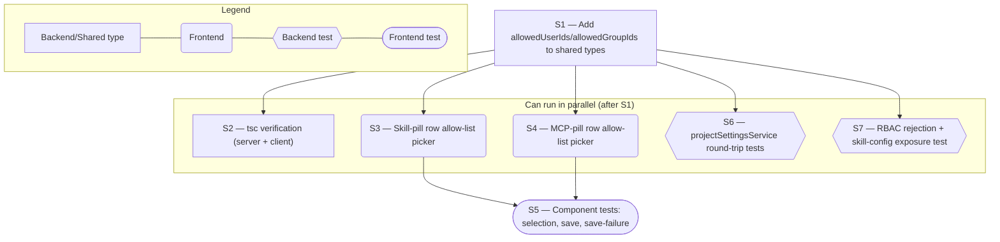

# Technical Specification — Configure Home Pill Allow-Lists

> **PRD slug:** `home-pill-access-control` | **Owning layer:** `src/shared/types/` + `src/client/components/AdminProjectSettings.tsx` | **Surface:** Full stack (shared type + existing route/service pass-through + React admin editor)
> **Verification builds:** `npx tsc -p tsconfig.server.json --noEmit` and `npx tsc -p tsconfig.client.json --noEmit`
> **Open items:** See [configure-home-pill-allow-lists-assumptions.md](configure-home-pill-allow-lists-assumptions.md) (2 unresolved)
> **Design doc:** [configure-home-pill-allow-lists-design.md](configure-home-pill-allow-lists-design.md)

---

## System Boundary and Owning Layer

**Owning layer:** `src/shared/types/projectSettings.ts` (extended) and `src/client/components/AdminProjectSettings.tsx` (extended). No new files, no new services, no new routes, no migration.

**Rationale:** The two new fields live inside pill arrays that are already stored as opaque `jsonb` on `project_skill_settings` and already round-trip unchanged through the existing admin read/write path (`admin.ts` spreads the full request body into `projectSettingsService.upsertSkillConfig`, which persists `quickSkillPills`/`quickMcpPills` verbatim). The only code that needs to exist is (1) the shared-type fields so TypeScript and the React editor can see and bind to them, and (2) the picker UI on each pill row. Pulling read-path filtering or thread-creation enforcement into this Feature would duplicate work chartered to **Enforce Home Pill Access** (`FEAT-002`, which `dependsOn: ["FEAT-001"]`) and violate the backlog's own dependency ordering.

**Ownership answers:**
- New or existing Express service in `src/server/services/`? **No** — `projectSettingsService.ts`'s `upsertSkillConfig`/`getSkillConfig`/`getSkillConfigById` already pass `quickSkillPills`/`quickMcpPills` through unchanged (line 301: `quickSkillPills: opts.quickSkillPills ?? null`). No new service, no modified function signature.
- New or existing route in `src/server/routes/`? **No** — `POST /api/admin/project-settings` and `PUT /api/admin/project-settings/:id` (`admin.ts`) already accept and persist the full pill arrays. `GET /api/admin/project-settings` already spreads `...cfg` (including `quickSkillPills`/`quickMcpPills`) into its response. Zero route code changes.
- New React component in `src/client/components/`? **No** — reuses `GroupAwarePeoplePicker` (`src/client/components/GroupAwarePeoplePicker.tsx`), the same component `renderApproverSection` already binds for design-doc/PRD/prototype/test-case/ADR reviewer pools. Only `AdminProjectSettings.tsx`'s pill-row JSX is extended, not a new component file.
- New shared type in `src/shared/types/`? **Yes** — additive-only: `allowedUserIds?: string[] | null` and `allowedGroupIds?: string[] | null` added to `QuickSkillPill` and `QuickMcpPillBase` in `src/shared/types/projectSettings.ts`.
- Database migration needed? **No** — both fields live inside the existing `quick_skill_pills`/`quick_mcp_pills` `jsonb` columns (`src/server/db/schema.ts`, lines 823–824), which are untyped-at-the-database-level JSON blobs already carrying every other optional pill field (`model`, `effort`, `description`, `bypassScopePolicy`, etc.).

---

## Security Enforcement

- **Authorization mechanism:** `router.use(requirePermission('admin:roles'))` at the top of `src/server/routes/admin.ts` (line ~87) already gates every route in this router, including `POST /project-settings` and `PUT /project-settings/:id`. No new middleware, no new permission key — satisfies BR-001's write-gate requirement and the PRD's Access Control table ("Configure a Home pill's allow-list — Project Admin (existing `admin:roles` gate)"). This is the identical pattern the `rbac-governance.mdc` catalog documents for `admin:roles`.
- **Layer that enforces scope:** Route middleware only, at the router level — unchanged by this Feature. Project scoping of the underlying row (`project_skill_settings.project`) is unchanged; the settings ID path param (`/project-settings/:id`) already resolves to a single project's row via existing `upsertSkillConfig`/`getSkillConfigById` lookups.
- **Sensitive data handling:** `allowedUserIds`/`allowedGroupIds` reference the same internal user/group identifiers a Project Admin can already see via `GET /api/admin/groups` and `GET /api/admin/users` (per the PRD, "the same internal user and group identifiers a Project Admin can already see in Project Settings and the reviewer/approver pools"). **Important boundary this Feature does *not* close:** `GET /api/skill-config` (`api.ts`, ~line 4283) already returns `quickSkillPills`/`quickMcpPills` verbatim to any session-authenticated caller with no field-level filtering. Once TBI-001 ships, the two new fields are exposed on that response until FEAT-002's TBI-004 adds stripping — see the deployment-sequencing risk in the assumptions file and in Rollback and Deployment below.

---

## Architecture and Approach

### Layers touched

| Layer | Changed | Notes |
|-------|---------|-------|
| Server services (`src/server/services/`) | No | `projectSettingsService.ts` already passes pill arrays through unchanged |
| Server routes (`src/server/routes/`) | No | `admin.ts` project-settings routes already accept/return full pill arrays |
| Server middleware (`src/server/middleware/`) | No | Reuses the existing `requirePermission('admin:roles')` guard |
| Client components (`src/client/components/`) | Yes | `AdminProjectSettings.tsx` — add a `GroupAwarePeoplePicker` control to each skill-pill row (~lines 2899–2993) and each MCP-pill row (~lines 3023–3140) |
| Client hooks (`src/client/hooks/`) | No | No new data-fetching hook — `groupsWithMembers`/`allUsers` are already fetched for the reviewer/approver sections and are reused as-is |
| Shared types (`src/shared/types/`) | Yes | `QuickSkillPill` and `QuickMcpPillBase` in `projectSettings.ts` gain `allowedUserIds?: string[] | null` and `allowedGroupIds?: string[] | null` |
| Database (`migrations/`) | No | No migration — additive JSON fields inside existing `jsonb` columns |
| Drizzle schema (`src/server/db/schema.ts`) | No | `quickSkillPills`/`quickMcpPills` columns are already typed as `$type<QuickSkillPill[]>()`/`$type<QuickMcpPill[]>()`; the interface change flows through automatically with zero schema edits |

### Per-work-item design decisions

**TBI-001 — Add allow-list fields to Home pill storage and shared types**
- Pattern followed: identical to how `effort?: EffortLevel | null` was added to the same three interfaces (`InterviewSkillOption`, `QuickSkillPill`, `QuickMcpPillBase`) in the prior `per-module-agent-effort-defaults` epic — purely additive optional fields, no schema or route change required because the column is untyped JSON at the database layer.
- Key decisions:
  - **Two separate fields, not one combined "principals" array.** Mirrors `SetApproversRequest`'s existing `designDocApprovers`/`designDocApproverGroups` split (individual user IDs vs. group IDs kept as separate arrays) rather than a single mixed-type array — keeps the resolver FEAT-002 builds (`homePillAccessResolver` or equivalent) able to do a cheap `Set.has(userId)` check and a separate group-membership expansion, exactly like the existing approver-pool read path does.
  - **`allowedUserIds`/`allowedGroupIds` added only to `QuickMcpPillBase`, not duplicated on `QuickMcpPillHttp`/`QuickMcpPillStdio`.** Both variants extend `QuickMcpPillBase`, so the fields are automatically available on both transports without duplication — same placement `effort` and `systemPromptHint` already use on that base interface.
  - **No field added to `InterviewSkillOption`.** The PRD and backlog scope allow-lists to Home skill and MCP pills only ("Restricting Interview, ADR, or any other non-Home skill selector" is explicitly out of scope); `InterviewSkillOption` backs the Interview module's skill selector, not Home.

**TBI-002 — Extend Admin Project Settings pill editor with allow-list controls**
- Pattern followed: `renderApproverSection` (`AdminProjectSettings.tsx`, ~line 2153) — the existing function that renders a `GroupAwarePeoplePicker` bound to a `userIds`/`setUserIds`/`groupIds`/`setGroupIds` tuple for each reviewer document type (`design_doc`, `prd`, `design_prototype`, `test_case`, `adr`).
- Key decisions:
  - **Per-pill-row picker, not a per-module section.** Unlike reviewer pools (one picker per document type, backed by top-level component state), each pill needs its *own* independent allow-list, so the picker is rendered inline inside the existing `edit.quickSkillPills.map((pill, idx) => ...)` / `edit.quickMcpPills.map((pill, idx) => ...)` loops, with `onUserIdsChange`/`onGroupIdsChange` writing directly into `pills[idx].allowedUserIds`/`allowedGroupIds` via the same `[...edit.quickSkillPills]; pills[idx] = { ...pills[idx], ... }; setEdit(...)` pattern every other per-pill field (`description`, `model`, `effort`) already uses.
  - **Placed in the pill list, not the Add form.** `SkillPillAddForm`/`McpPillAddForm` stay minimal (label, skill/server, model, effort) — consistent with `description` and `bypassScopePolicy`, which are also edit-list-only fields. An admin adds the pill first, then configures its allow-list in the same edit session before saving the form.
  - **`groupsWithMembers`/`allUsers` are the exact same arrays already loaded for `renderApproverSection`.** No new query, no new hook — the picker's `groups`/`availableUsers` props are wired to the same component-level values.
  - **No new validation function.** `handleSave`'s existing `upsert` mutation already sends the entire `edit` object (including `quickSkillPills`/`quickMcpPills`) in one `PUT`/`POST`; a failure fails the whole request and leaves the DB row untouched, which already satisfies AC (b) ("previously saved allow-list remains in effect... error indicating the save did not succeed") for free, identical to how a failed save today already protects every other pill field.

---

## Data and Contracts

### API endpoints

| Method | Route | Request shape | Response shape | Auth |
|--------|-------|--------------|----------------|------|
| POST | `/api/admin/project-settings` | `UpsertProjectSkillConfigRequest` — `quickSkillPills[].allowedUserIds`/`allowedGroupIds` and `quickMcpPills[].allowedUserIds`/`allowedGroupIds` now recognized fields inside the existing pill array shape | `201` `ProjectSkillConfigResponse & { approvalModes }` (unchanged shape; new fields flow through automatically as part of the pill objects) | `requirePermission('admin:roles')` |
| PUT | `/api/admin/project-settings/:id` | Same as above | `200` `ProjectSkillConfigResponse & { approvalModes }` | `requirePermission('admin:roles')` |
| GET | `/api/admin/project-settings` | — | `200` `Array<ProjectSkillConfig & { approvalModes, ...ApproverCounts }>` — already spreads all columns; allow-list fields included automatically once the shared type and pill objects carry them | `requirePermission('admin:roles')` |
| GET | `/api/skill-config?project=\|settingsId=` | Query params only | `200` explicit field-by-field JSON (`api.ts`, ~line 4297) — `quickSkillPills`/`quickMcpPills` returned **verbatim**, meaning `allowedUserIds`/`allowedGroupIds` are exposed on this response until FEAT-002's TBI-004 strips them (see Rollback and Deployment) | Session-scoped, unauthenticated-but-logged-in pattern (existing, unchanged by this Feature) |

### Schema / storage changes

| Target | Change | Reason |
|--------|--------|--------|
| `project_skill_settings.quick_skill_pills` (`jsonb`) | No DDL change — two new optional keys appear inside individual pill objects in the existing array | Column is already untyped JSON at the database layer; only the TypeScript shape changes |
| `project_skill_settings.quick_mcp_pills` (`jsonb`) | No DDL change — same as above | Same reasoning |

**Extended shared types (`src/shared/types/projectSettings.ts`, additive only):**

```typescript
export interface QuickSkillPill {
  label: string;
  skillPath: string;
  model?: string | null;
  effort?: EffortLevel | null;
  description?: string | null;
  bypassScopePolicy?: boolean | null;
  /** Individual user OIDs allowed to see/start this pill on Home. Empty/omitted means everyone with Home access (BR-001). */
  allowedUserIds?: string[] | null;
  /** Group IDs allowed to see/start this pill on Home, expanded to live members at read time (mirrors the reviewer/approver pool pattern). */
  allowedGroupIds?: string[] | null;
}

interface QuickMcpPillBase {
  label: string;
  description?: string | null;
  mcpServerName: string;
  model?: string | null;
  effort?: EffortLevel | null;
  systemPromptHint?: string | null;
  /** Individual user OIDs allowed to see/start this pill on Home. Empty/omitted means everyone with Home access (BR-001). */
  allowedUserIds?: string[] | null;
  /** Group IDs allowed to see/start this pill on Home, expanded to live members at read time. */
  allowedGroupIds?: string[] | null;
}
```

No changes to `QuickMcpPillHttp`, `QuickMcpPillStdio`, `ProjectSkillConfig`, `UpsertProjectSkillConfigRequest`, or `ProjectSkillConfigResponse` themselves — all four already type `quickSkillPills?: QuickSkillPill[] | null` / `quickMcpPills?: QuickMcpPill[] | null` and inherit the new fields automatically.

---

## Testing Strategy

**Unit tests:**
- `src/server/__tests__/projectSettingsService.test.ts` — extend the existing mocked `upsertSkillConfig` round-trip assertions with a pill object containing `allowedUserIds`/`allowedGroupIds`, proving the fields pass through unchanged (same style as the existing effort-field round-trip coverage in this file).
- `src/client/components/__tests__/AdminProjectSettings.test.tsx` — extend the existing "reviewer pools and module approval modes" describe block (or add a sibling) to cover: selecting a user/group on a skill-pill row updates `edit.quickSkillPills[idx].allowedUserIds`/`allowedGroupIds`; the same for an MCP-pill row; saving submits the updated pill array through the mocked `upsert` mutation (mirrors the existing `quickMcpPills: [expect.objectContaining({ mcpServerName: 'sendgrid', effort: 'low' })]` assertion pattern at line 322, extended with `allowedUserIds`/`allowedGroupIds`).

**Integration tests:**
- `src/server/__tests__/apiRoutes.skillConfig.test.ts` — add a case confirming `GET /api/skill-config` currently returns `allowedUserIds`/`allowedGroupIds` verbatim when present (documents the exposure window called out in Rollback and Deployment; this assertion should be updated to assert *stripping* once FEAT-002's TBI-004 ships, not deleted).
- `src/server/__tests__/rbacMiddleware.test.ts` / `src/server/__tests__/superAdmin.test.ts` pattern — confirm a request without `admin:roles` calling `PUT /project-settings/:id` with an `allowedUserIds` change is rejected before `upsertSkillConfig` runs (AC (d) for both PBI-001 and PBI-002).

**E2E tests:** Not required for this Feature — no new Home-facing behavior exists yet to exercise end-to-end. E2E coverage of allow-list *effect* (pill visibility, thread-creation denial) belongs to **Enforce Home Pill Access**.

---

## Observability

- **Custom events/metrics:** None beyond standard telemetry. Saving a pill's allow-list flows through the same `PUT /api/admin/project-settings/:id` request already logged/traced like every other project-settings edit; no new event is warranted for a data-model-only change with no runtime consumer yet.

---

## Rollback and Deployment

- **Schema changes backward compatible:** **Yes.** Both new fields are optional and nullable inside an already-untyped JSON column; existing pills with no allow-list fields round-trip unchanged (TBI-001 DoD).
- **Rollback procedure:** Revert the shared-type and `AdminProjectSettings.tsx` changes. Any `allowedUserIds`/`allowedGroupIds` values already saved on pills remain harmlessly in the JSON blob (ignored by every reader that predates this Feature) — no data cleanup required.
- **Deployment dependencies:** **This Feature must not ship to production ahead of FEAT-002's TBI-004** (public skill-config filtering) without an explicit, confirmed exception. Because `GET /api/skill-config` already returns `quickSkillPills`/`quickMcpPills` verbatim to any session-authenticated caller, shipping TBI-001 alone creates a live window where `allowedUserIds`/`allowedGroupIds` — private admin configuration data — are visible on an existing public-ish endpoint with no flag to hide behind. Coordinate the FEAT-001/FEAT-002 release train accordingly (see the assumptions file's primary ⚠ item).
- **Feature flag gates deployment:** **No** — consistent with the epic ("Flag required: No"). The deployment-sequencing risk above is a release-process concern, not something a flag can mitigate cleanly, since the exposure lives in an existing unflagged endpoint.

---

## Verification Test Matrix

| ID | Layer | Arrange | Act | Assert | Linked |
|----|-------|---------|-----|--------|--------|
| VT-01 | Jest / tsc (compile) | `allowedUserIds?: string[] \| null` and `allowedGroupIds?: string[] \| null` added to `QuickSkillPill` and `QuickMcpPillBase` | Run `npx tsc -p tsconfig.server.json --noEmit` and `npx tsc -p tsconfig.client.json --noEmit` | Zero compile errors; `schema.ts`'s `$type<QuickSkillPill[]>()`/`$type<QuickMcpPill[]>()` columns typecheck unmodified | TBI-001 (a) |
| VT-02 | Jest (unit/service) | Mocked `upsertSkillConfig` call with a `quickSkillPills` entry containing `allowedUserIds: ['u1']`, `allowedGroupIds: ['g1']` | Call `upsertSkillConfig(opts)` | Returned/persisted pill object includes both fields unchanged | TBI-001 (a), PBI-001 (a) |
| VT-03 | Jest (unit/service) | Existing pill row with no allow-list fields (legacy data) | Call `getSkillConfigById`/`getSkillConfig` | Pill round-trips with `allowedUserIds`/`allowedGroupIds` simply absent — no error, no coercion | TBI-001 (a) |
| VT-04 | Jest / RTL (component) | `AdminProjectSettings` rendered with one existing skill pill and a mocked `groupsWithMembers`/`allUsers` | Select a user and a group via `ps-skill-pill-allowlist-0`'s `GroupAwarePeoplePicker` | `edit.quickSkillPills[0].allowedUserIds`/`allowedGroupIds` update; the picker chip list reflects the selection | PBI-001 (a), TBI-002 |
| VT-05 | Jest / RTL (component) | Same as VT-04, for an MCP pill row (`ps-mcp-pill-allowlist-0`) | Select a user and a group | `edit.quickMcpPills[0].allowedUserIds`/`allowedGroupIds` update | PBI-002 (a), TBI-002 |
| VT-06 | Jest / RTL (component) | `edit.quickSkillPills[0]` has `allowedUserIds`/`allowedGroupIds` set; mocked `upsert` mutation | Click Save | Mutation payload's `quickSkillPills[0]` includes `expect.objectContaining({ allowedUserIds: [...], allowedGroupIds: [...] })` | PBI-001 (a) |
| VT-07 | Jest / RTL (component) | Mocked `upsert` mutation configured to reject | Click Save after editing a pill's allow-list | Form shows the existing save-error state; `edit.quickSkillPills`/`quickMcpPills` in local state are unchanged from before the failed save | PBI-001 (b), PBI-002 (b) |
| VT-08 | Jest (unit/service) | A skill pill and an MCP pill both with `allowedUserIds`/`allowedGroupIds` omitted | Read the config (any consumer) | Both pills are treated identically to today's pre-Feature shape — no default value is written in, consistent with BR-001's "everyone" default living in the *absence* of the fields | PBI-001 (c), PBI-002 (c) |
| VT-09 | Jest (route/middleware) | Request without `admin:roles` | `PUT /api/admin/project-settings/:id` with a body changing a pill's `allowedUserIds` | `403`; no DB write occurs (`requirePermission('admin:roles')` short-circuits before `upsertSkillConfig` runs) | PBI-001 (d), PBI-002 (d) |
| VT-10 | Jest (route) | A pill with `allowedUserIds`/`allowedGroupIds` set, requested via `GET /api/skill-config?project=X` (session-authenticated, non-admin) | Inspect the response body | **Currently** returns `allowedUserIds`/`allowedGroupIds` verbatim (documents the exposure window in Rollback and Deployment; this assertion is expected to change to "stripped" once FEAT-002's TBI-004 ships) | Assumptions ⚠-1 |

---

## Implementation Plan

- [ ] S1 — Add `allowedUserIds?: string[] | null` and `allowedGroupIds?: string[] | null` to `QuickSkillPill` and `QuickMcpPillBase` in `src/shared/types/projectSettings.ts` _(no blockers)_
  - Covers: `VT-01`
- [ ] S2 — Run `npx tsc -p tsconfig.server.json --noEmit` and `npx tsc -p tsconfig.client.json --noEmit` to confirm the additive fields compile cleanly through `schema.ts` and every existing consumer _(blocked by S1)_
  - Covers: `VT-01`
- [ ] S3 — Add a `GroupAwarePeoplePicker`-backed allow-list control to each skill-pill row in `AdminProjectSettings.tsx` (`edit.quickSkillPills.map(...)`, ~lines 2899–2993), wired to `pills[idx].allowedUserIds`/`allowedGroupIds` via the existing `groupsWithMembers`/`allUsers` state; add `data-testid="ps-skill-pill-allowlist-{idx}"` _(blocked by S1; can run in parallel with S4)_
  - Covers: `VT-04`
- [ ] S4 — Same for each MCP-pill row (`edit.quickMcpPills.map(...)`, ~lines 3023–3140); add `data-testid="ps-mcp-pill-allowlist-{idx}"` _(blocked by S1; can run in parallel with S3)_
  - Covers: `VT-05`
- [ ] S5 — Extend `src/client/components/__tests__/AdminProjectSettings.test.tsx` with allow-list selection, save-payload, and save-failure coverage for both pill types _(blocked by S3, S4)_
  - Covers: `VT-06`, `VT-07`
- [ ] S6 — Extend `src/server/__tests__/projectSettingsService.test.ts` with an allow-list round-trip case, and add the legacy-pill-shape regression case _(blocked by S1; can run in parallel with S3, S4)_
  - Covers: `VT-02`, `VT-03`, `VT-08`
- [ ] S7 — Add the `admin:roles` rejection case for a pill allow-list write to the existing RBAC middleware test suite, and add the documentation-of-exposure case to `apiRoutes.skillConfig.test.ts` _(blocked by S1; can run in parallel with S3, S4, S6)_
  - Covers: `VT-09`, `VT-10`

**Execution lanes:**
- Lane 1 (start immediately): S1
- Lane 2 (after S1): S2, S3, S4, S6, S7 — all run in parallel
- Lane 3 (after S3 + S4): S5

---

## Diagram 1 — Code Execution Flow

```mermaid
sequenceDiagram
  actor ProjectAdmin
  participant Picker as GroupAwarePeoplePicker
  participant Settings as AdminProjectSettings.tsx
  participant Route as PUT /api/admin/project-settings/:id
  participant Service as projectSettingsService.upsertSkillConfig
  participant DB as project_skill_settings (jsonb)

  ProjectAdmin->>Picker: select user/group on a pill row
  Picker->>Settings: onUserIdsChange / onGroupIdsChange
  Settings->>Settings: setEdit — pills[idx].allowedUserIds/allowedGroupIds updated
  ProjectAdmin->>Settings: click Save
  Settings->>+Route: PUT { quickSkillPills / quickMcpPills, ...rest }
  Route->>Route: requirePermission('admin:roles')
  Route->>+Service: upsertSkillConfig({ id, quickSkillPills, quickMcpPills, ... })
  Service->>+DB: UPDATE project_skill_settings SET quick_skill_pills = $1, quick_mcp_pills = $2
  DB-->>-Service: updated row
  Service-->>-Route: ProjectSkillConfig
  Route-->>-Settings: 200 { ...config, approvalModes }
  Settings-->>ProjectAdmin: form closes / shows saved state

  alt admin:roles missing
    Route-->>Settings: 403 Forbidden
    Settings-->>ProjectAdmin: save rejected before reaching Service/DB
  end

  alt save request fails (network/500)
    Route-->>Settings: non-2xx / mutation error
    Settings-->>ProjectAdmin: previously saved allow-list unchanged; error message shown (AC PBI-001/002 (b))
  end
```

---

## Diagram 2 — Implementation Dependency Map


