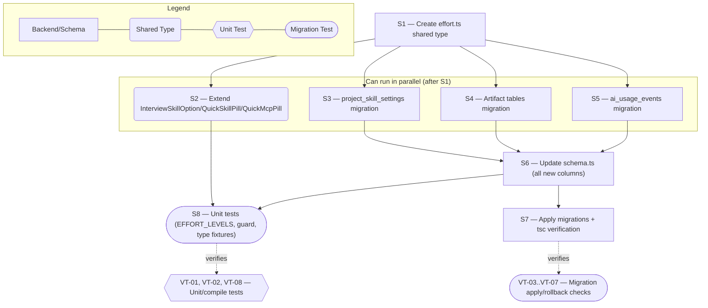

# Technical Specification — Effort Data Model & Shared Allow-List Foundations

> **PRD slug:** `per-module-agent-effort-defaults` | **Owning layer:** `src/shared/types/` + `src/server/db/schema.ts` + `migrations/` | **Surface:** Backend/shared types only (no client runtime change)
> **Verification builds:** `npx tsc -p tsconfig.server.json --noEmit` and `npx tsc -p tsconfig.client.json --noEmit`
> **Open items:** See [design-doc-assumptions.md](design-doc-assumptions.md) (1 unresolved)
> **Design doc:** [design-doc-design.md](design-doc-design.md)

---

## System Boundary and Owning Layer

**Owning layer:** `src/shared/types/effort.ts` (new), `src/shared/types/projectSettings.ts` (extended), `src/server/db/schema.ts` (extended), `migrations/` (three new files).

**Rationale:** This Feature is pure data-model groundwork — it does not resolve, validate at write time, or display effort anywhere. The only code that needs to exist is (1) the closed allow-list type both future client and server code will import, (2) the Drizzle column definitions that make the type queryable, and (3) the DDL that makes the columns exist in Postgres. Every consuming behavior (admin write validation, kickoff resolution, artifact/cost display) is chartered to FEAT-002, FEAT-003, and FEAT-004 respectively, per their own TBI Definition of Done lists — pulling any of that logic into this Feature would duplicate work those features are scoped to do and violate the backlog's `dependsOn` ordering (FEAT-002/003/004 all `dependsOn: ["FEAT-001"]`, not the reverse).

**Ownership answers:**
- New or existing Express service in `src/server/services/`? **No** — no service is created or modified. `projectSettingsService.ts`, `chatAgentService.ts`, and `aiUsageService.ts`-equivalent recording logic are untouched; they gain effort-aware behavior in FEAT-002/003/004.
- New or existing route in `src/server/routes/`? **No** — no route is created or modified. The admin project-settings write/read endpoints keep accepting/returning exactly what they do today until FEAT-002's TBI-004.
- New React component in `src/client/components/`? **No** — no UI exists yet. `AdminProjectSettings.tsx` is untouched.
- New shared type in `src/shared/types/`? **Yes** — a new `effort.ts` file exporting the closed `EffortLevel` union, a runtime `EFFORT_LEVELS` array, and a type-guard function; plus an additive `effort?: EffortLevel | null` field on three existing interfaces in `projectSettings.ts` (`InterviewSkillOption`, `QuickSkillPill`, `QuickMcpPillBase`).
- Database migration needed? **Yes** — three migrations: one adding 20 columns to `project_skill_settings`, one adding 1 column to each of 5 artifact tables, one adding 1 column to `ai_usage_events`.

---

## Security Enforcement

- **Authorization mechanism:** Not applicable at this layer. No new endpoint or UI action is introduced, so there is no new authorization decision to enforce. The existing `admin:roles` gate on the project-settings write endpoint (`AdminProjectSettings.tsx` → project-settings PUT route) is completely unaffected because this Feature does not touch that route — it only adds columns the route does not yet select or accept. FEAT-002's TBI-004 is where `admin:roles` will be checked against the new fields, exactly as it already is checked for the existing `*Model` fields on the same endpoint.
- **Layer that enforces scope:** Not applicable — there is no runtime read/write path through these columns yet. Project-scoping of the underlying rows (`project_skill_settings.project`, and each artifact table's existing project/thread linkage) is unchanged; no new enforcement surface is introduced, per the PRD's own "Data scope enforcement: Unchanged" statement.
- **Sensitive data handling:** Not applicable — effort is non-sensitive operational metadata, the same class of field as the existing `model` identifier (per PRD "Security and Data Sensitivity": no encryption, masking, or redaction required).

---

## Architecture and Approach

### Layers touched

| Layer | Changed | Notes |
|-------|---------|-------|
| Server services (`src/server/services/`) | No | Zero services touched — deferred to FEAT-002/003/004 |
| Server routes (`src/server/routes/`) | No | Zero routes touched |
| Server middleware (`src/server/middleware/`) | No | No new authorization surface |
| Client components (`src/client/components/`) | No | No UI in this Feature |
| Client hooks (`src/client/hooks/`) | No | No data-fetching hook touches the new columns yet |
| Shared types (`src/shared/types/`) | Yes | New `effort.ts`; `InterviewSkillOption`, `QuickSkillPill`, `QuickMcpPillBase` in `projectSettings.ts` gain an optional `effort` field |
| Database (`migrations/`) | Yes | Three new migration files (see Data and Contracts below) |
| Drizzle schema (`src/server/db/schema.ts`) | Yes | Import `EffortLevel`; add 20 columns to `projectSkillSettings`, 1 column to each of 5 artifact tables, 1 column to `aiUsageEvents` |

### Per-work-item design decisions

**TBI-001 — Add shared effort allow-list type and per-module effort columns to `project_skill_settings`**
- Pattern followed: mirrors the existing `*Model` `text()` column precedent on `project_skill_settings` (e.g. `calendarAssistantModel: text('calendar_assistant_model')`, `designModuleScopingModel: text('design_module_scoping_model')`) — plain nullable `TEXT`, no DB `CHECK` constraint.
- Key decisions:
  - **New dedicated shared-type file, not colocated in `projectSettings.ts`.** `EffortLevel` lives in `src/shared/types/effort.ts`, following the `ApprovalMode`-in-`approvals.ts` precedent — a small cross-cutting union consumed by multiple domains (project settings, artifact tables, usage events) shouldn't force every consumer to import the full project-settings type surface.
  - **Every new column gets `.$type<EffortLevel>()`**, unlike the untyped `model` columns. This gives compile-time safety to future readers without adding any runtime cast, Zod validation, or DB constraint — a corrupted legacy string still flows through Drizzle as a plain string at runtime, exactly satisfying BR-005 ("an unknown or corrupted stored effort value at run time is treated as unset ... rather than failing the run"). Alternative rejected: leaving columns untyped like `model` — rejected because BR-003 requires a genuinely *closed* allow-list (model's list is dynamically fetched from the Cursor SDK and deliberately open), and the stronger typing costs nothing at runtime.
  - **No DB `CHECK` constraint** (unlike `approval_mode`, which does have one). A `CHECK` constraint would make BR-005's own test scenario — a legacy/manually-edited row holding a corrupted value — impossible to construct through normal SQL, and would move the failure mode from "silently treated as unset" (what BR-005 wants) to "write rejected by the database" (a harder failure BR-003 already covers at the *application* layer in FEAT-002). Enforcement stays where the PRD puts it: the admin write endpoint (FEAT-002), not the schema.
  - **Runtime validator ships alongside the type**, not deferred to FEAT-003: `effort.ts` exports `EFFORT_LEVELS: readonly EffortLevel[]` and `isEffortLevel(value: unknown): value is EffortLevel` so FEAT-002's write-path validation and FEAT-003's runtime resolver both import the *same* guard instead of each hand-rolling their own — avoiding the drift risk of two independent allow-list checks.

**TBI-002 — Add nullable effort snapshot column to artifact audit tables**
- Pattern followed: mirrors the existing nullable `model` `TEXT` column already present on `interviews`, `adrs`, `prds`, `design_docs`, and `design_prototypes` — same column shape, same "populated once at creation, then immutable for that artifact" intent that FEAT-004 will implement.
- Key decisions:
  - **No conditional/partial constraint scoping `design_prototypes.effort` to `prototypeEngine = 'agent'`.** `design_prototypes` has no `prototypeEngine` column of its own (that setting lives on `project_skill_settings`), so there is no row-level value to constrain against even if desired. This exactly mirrors how `design_prototypes.model` is unconstrained by engine today — the Bedrock-path model ID lives on the entirely separate `project_skill_settings.designPrototypeBedrockModelId` column. The "agent-engine path only" rule from the PRD is an application-level write-time decision that FEAT-004 implements, not a schema-level one.
  - **One migration file for all five tables**, since they share no FK relationship with each other and the change is mechanically identical across all five (add one nullable `TEXT` column) — reviewing five near-identical `ALTER TABLE` statements together is clearer than five separate files.

**TBI-003 — Add nullable effort column to `ai_usage_events`**
- Pattern followed: mirrors the existing nullable `model_id` `TEXT` column on `ai_usage_events`, which is the row-level audit column every provider/feature already writes into.
- Key decisions:
  - **No index**, deliberately diverging from `model_id`'s own `idx_ai_usage_events_model` index — the NFR is explicit ("no new index — effort is not filtered in WHERE clauses at this stage"), and the epic's Out-of-Scope confirms no cost-dashboard filter-by-effort capability is planned yet.
  - **One universal column on the shared table**, not per-feature columns, so stages with no dedicated artifact table (Standup, Feature Request, Technical, Issue, Calendar Assistant, Load Test Generation, Design Module, Design Module Scoping) get audit coverage without any new table — the same reasoning `ai_usage_events` already applies to `model_id` for exactly those same stages.

---

## Data and Contracts

### API endpoints

| Method | Route | Request shape | Response shape | Auth |
|--------|-------|--------------|----------------|------|
| — | — | — | — | **None.** This Feature adds zero endpoints and modifies zero existing endpoints. The admin project-settings write/read endpoints continue to accept/return exactly their current shapes until FEAT-002 (TBI-004) extends them to include the columns this Feature creates. |

### Schema / storage changes

| Target | Change | Reason |
|--------|--------|--------|
| `project_skill_settings` | Add 19 nullable `TEXT` columns, one per existing `*_model` stage (`interview_effort`, `prd_effort`, `adr_effort`, `design_doc_effort`, `design_doc_assistant_effort`, `design_prototype_effort`, `test_case_effort`, `design_doc_validation_effort`, `prd_assistant_effort`, `prd_validation_effort`, `development_effort`, `standup_effort`, `feature_request_effort`, `technical_effort`, `issue_effort`, `calendar_assistant_effort`, `load_test_generation_effort`, `design_module_effort`, `design_module_scoping_effort`), plus 1 nullable `TEXT` project-wide `default_effort` column (20 total) | Sibling per-module override + project default, mirroring the existing `*_model` + `default_model` columns exactly, so FEAT-002/FEAT-003 can resolve effort via the identical module-override → project-default → omit chain already used for model |
| `interviews`, `adrs`, `prds`, `design_docs`, `design_prototypes` | Add 1 nullable `TEXT` `effort` column to each (5 total) | Snapshot target for the resolved effort at artifact-creation time, mirroring each table's existing nullable `model` column; `design_prototypes.effort` is populated only for the agent-engine path once FEAT-004 ships (no schema-level enforcement of that scoping — see Architecture decisions above) |
| `ai_usage_events` | Add 1 nullable `TEXT` `effort` column | Universal audit column so every Cursor-backed usage/cost row — including the 8 stages with no dedicated artifact table — can record resolved effort once FEAT-004 ships; mirrors the existing nullable `model_id` column's role, but with no matching index (explicit NFR) |

**New shared type (`src/shared/types/effort.ts`, new file):**

```typescript
/** Closed reasoning-effort allow-list for Cursor-backed modules. null means "inherit" (module override → project default → omit). */
export type EffortLevel = 'low' | 'medium' | 'high';

export const EFFORT_LEVELS: readonly EffortLevel[] = ['low', 'medium', 'high'] as const;

/** Runtime guard shared by the admin write-path validator (FEAT-002) and the kickoff resolver (FEAT-003), so both check the identical allow-list. */
export function isEffortLevel(value: unknown): value is EffortLevel {
  return typeof value === 'string' && (EFFORT_LEVELS as readonly string[]).includes(value);
}
```

**Extended shared types (`src/shared/types/projectSettings.ts`, additive only):**

```typescript
export interface InterviewSkillOption {
  path: string;
  friendlyName: string;
  model?: string | null;
  /** Effort override for this interview skill; null/undefined uses project default. */
  effort?: EffortLevel | null;
  wantsDesignPrototype?: boolean;
  wantsTestCases?: boolean;
}

export interface QuickSkillPill {
  label: string;
  skillPath: string;
  model?: string | null;
  /** Effort override for this pill's kickoff; null/undefined uses project default. */
  effort?: EffortLevel | null;
  description?: string | null;
  bypassScopePolicy?: boolean | null;
}

interface QuickMcpPillBase {
  label: string;
  description?: string | null;
  mcpServerName: string;
  model?: string | null;
  /** Effort override for this MCP pill's kickoff; null/undefined uses project default. */
  effort?: EffortLevel | null;
  systemPromptHint?: string | null;
}
```

**Drizzle schema additions (`src/server/db/schema.ts`, additive only):**

```typescript
import type { EffortLevel } from '../../shared/types/effort';

// Inside export const projectSkillSettings = pgTable('project_skill_settings', { ... }):
interviewEffort: text('interview_effort').$type<EffortLevel>(),
prdEffort: text('prd_effort').$type<EffortLevel>(),
adrEffort: text('adr_effort').$type<EffortLevel>(),
designDocEffort: text('design_doc_effort').$type<EffortLevel>(),
designDocAssistantEffort: text('design_doc_assistant_effort').$type<EffortLevel>(),
designPrototypeEffort: text('design_prototype_effort').$type<EffortLevel>(),
testCaseEffort: text('test_case_effort').$type<EffortLevel>(),
designDocValidationEffort: text('design_doc_validation_effort').$type<EffortLevel>(),
prdAssistantEffort: text('prd_assistant_effort').$type<EffortLevel>(),
prdValidationEffort: text('prd_validation_effort').$type<EffortLevel>(),
developmentEffort: text('development_effort').$type<EffortLevel>(),
standupEffort: text('standup_effort').$type<EffortLevel>(),
featureRequestEffort: text('feature_request_effort').$type<EffortLevel>(),
technicalEffort: text('technical_effort').$type<EffortLevel>(),
issueEffort: text('issue_effort').$type<EffortLevel>(),
calendarAssistantEffort: text('calendar_assistant_effort').$type<EffortLevel>(),
loadTestGenerationEffort: text('load_test_generation_effort').$type<EffortLevel>(),
designModuleEffort: text('design_module_effort').$type<EffortLevel>(),
designModuleScopingEffort: text('design_module_scoping_effort').$type<EffortLevel>(),
defaultEffort: text('default_effort').$type<EffortLevel>(),

// Inside export const interviews / adrs / prds / designDocs / designPrototypes = pgTable(...):
effort: text('effort').$type<EffortLevel>(),

// Inside export const aiUsageEvents = pgTable('ai_usage_events', { ... }):
effort: text('effort').$type<EffortLevel>(),
```

**Migration files (allocate each with `node scripts/next-migration-timestamp.mjs <slug>` per the `postgresql-migrations` skill — do not hand-write timestamps):**

1. `<ts>_<token>_project-skill-settings-effort-defaults.sql` — 20 `ALTER TABLE project_skill_settings ADD COLUMN IF NOT EXISTS ... TEXT;` statements; down migration drops the same 20 columns.
2. `<ts>_<token>_artifact-effort-snapshot-columns.sql` — one `ALTER TABLE ... ADD COLUMN IF NOT EXISTS effort TEXT;` per `interviews`, `adrs`, `prds`, `design_docs`, `design_prototypes`; down migration drops `effort` from each.
3. `<ts>_<token>_ai-usage-events-effort-column.sql` — `ALTER TABLE ai_usage_events ADD COLUMN IF NOT EXISTS effort TEXT;`; down migration drops it. No index statement.

---

## Testing Strategy

**Unit tests:**
- New `src/shared/types/__tests__/effort.test.ts` (or colocated with an existing shared-type test) — asserts `EFFORT_LEVELS` equals exactly `['low', 'medium', 'high']` (proves TBI-001's closed union has no 4th value), and asserts `isEffortLevel('low')` is `true` while `isEffortLevel('urgent')` / `isEffortLevel(null)` / `isEffortLevel(undefined)` are all `false` (proves the guard FEAT-002/FEAT-003 will both depend on is correct before either feature is built).
- A `.test-d.ts`-style compile fixture (or inline `// @ts-expect-error` assertions inside an existing test file) proving `effort: 'high'` and `effort: null` are valid on `InterviewSkillOption`, `QuickSkillPill`, and `QuickMcpPillHttp`/`QuickMcpPillStdio`, and that `effort: 'urgent'` fails to compile — directly exercises TBI-001's DoD line "Optional effort field added to InterviewSkillOption, QuickSkillPill, and QuickMcpPill shared types."

**Integration tests:**
- Extend the existing Drizzle-mock harness in `src/server/__tests__/projectSettingsService.test.ts` (mocked `db.select`/`db.insert`/`db.update` chains, no real database) with an assertion that a mocked row containing all 20 new effort keys still round-trips through the mocked `select().from().where().limit()` chain without the existing test's shape assumptions breaking — proves the schema change is additive and doesn't silently break the current mock contract, even though read/write mapping itself isn't wired until FEAT-002's TBI-004.
- Migration apply/rollback smoke test (run manually or as a CI step, not a Jest test): `npm run migrate:local:up` then `npm run migrate:local:down` for all three new migration files against a local Postgres instance, confirming clean apply and clean rollback with zero data loss on pre-existing rows — required by the `postgresql-migrations` skill before any migration ships to a shared environment.

**E2E tests:** Not applicable — this Feature has no UI, no endpoint, and no user-visible behavior to exercise end-to-end. End-to-end coverage of effort begins once FEAT-002 ships the admin selector.

---

## Observability

**Custom events/metrics:** None beyond standard telemetry. No new columns are queried, aggregated, or displayed by any code path yet, so there is nothing new to instrument.

---

## Rollback and Deployment

- **Schema changes backward compatible:** **Yes.** Every new column across all three migrations is nullable with no `NOT NULL` constraint and no default-value backfill requirement. Existing `INSERT`/`UPDATE` statements that don't mention these columns continue to work unchanged; no existing query breaks.
- **Rollback procedure:** Run `npm run migrate:down` three times (once per migration, most-recently-applied first) to drop the new columns. Because no code in this Feature — or in the wider codebase before FEAT-002/003/004 ship — ever writes a non-null value into these columns, rollback carries zero data-loss risk within this Feature's scope.
- **Deployment dependencies:** None. This is pure additive DDL with no data migration, no backfill job, and no coordinated multi-service deploy — the three migrations can apply independently of any application code deploy.
- **Feature flag gates deployment:** No. Consistent with the epic's "Flag required: No" — every new column defaults to `null`, which is a safe no-op until a Project Admin explicitly sets a value through FEAT-002.

---

## Verification Test Matrix

| ID | Layer | Arrange | Act | Assert | Linked |
|----|-------|---------|-----|--------|--------|
| VT-01 | Jest / tsc (compile) | `EffortLevel` import + 20 new columns added to `projectSkillSettings` in `schema.ts` | Run `npx tsc -p tsconfig.server.json --noEmit` | Zero compile errors; existing `ProjectSkillConfig`-adjacent consumers still typecheck unmodified | TBI-001 (a) |
| VT-02 | Jest (unit) | Import `EFFORT_LEVELS` and `isEffortLevel` from `src/shared/types/effort.ts` | Assert array contents/length and guard behavior on valid/invalid inputs | `EFFORT_LEVELS` equals exactly `['low','medium','high']`; `isEffortLevel` is `true` only for those three strings | TBI-001 (a), (d) |
| VT-03 | Manual/CI (migration) | Fresh local DB at pre-Feature schema | Run `npm run migrate:local:up` for the `project_skill_settings` migration | All 20 columns exist, all nullable; a pre-existing row reads back with every new column `null` | TBI-001 (a) |
| VT-04 | Manual/CI (migration) | DB state from VT-03 | Run `npm run migrate:local:down` for the same migration | All 20 columns removed; table returns to its exact pre-migration shape with no error | TBI-001 (b) |
| VT-05 | Manual/CI (migration) | Fresh local DB at pre-Feature schema | Run the artifact-tables migration | `interviews`, `adrs`, `prds`, `design_docs`, `design_prototypes` each gain one nullable `effort TEXT` column; existing rows in each read back with `effort: null` | TBI-002 (a) |
| VT-06 | Manual/CI (migration) | DB state from VT-05; a project with `prototypeEngine = 'bedrock'` | Insert a `design_prototypes` row omitting `effort` | Insert succeeds with `effort: null`; no constraint references `prototypeEngine` because none exists on this table | TBI-002 (c) |
| VT-07 | Manual/CI (migration) | Fresh local DB at pre-Feature schema | Run the `ai_usage_events` migration, then inspect via `\d ai_usage_events` | Table gains one nullable `effort TEXT` column; **no** new index is present | TBI-003 (a), (b) |
| VT-08 | Jest / tsc (compile) | `effort?: EffortLevel \| null` added to `InterviewSkillOption`, `QuickSkillPill`, `QuickMcpPillBase` | Assign `effort: 'high'`, `effort: null`, and (separately) `effort: 'urgent'` to each type in a test fixture | The first two assignments compile; the third fails `tsc` with a type error | TBI-001 (d) |

---

## Implementation Plan

- [ ] S1 — Create `src/shared/types/effort.ts` exporting `EffortLevel`, `EFFORT_LEVELS`, and `isEffortLevel` _(no blockers)_
  - Covers: `VT-02`, `VT-08`
- [ ] S2 — Add `effort?: EffortLevel | null` to `InterviewSkillOption`, `QuickSkillPill`, and `QuickMcpPillBase` in `src/shared/types/projectSettings.ts` _(blocked by S1)_
  - Covers: `VT-08`
- [ ] S3 — Allocate a migration filename via `node scripts/next-migration-timestamp.mjs project-skill-settings-effort-defaults`; write the 20-column `project_skill_settings` migration (up + down) _(blocked by S1; no blocker on S2)_
  - Covers: `VT-03`, `VT-04`
- [ ] S4 — Allocate + write the 5-table artifact-effort-column migration (`interviews`, `adrs`, `prds`, `design_docs`, `design_prototypes`) _(blocked by S1; can run in parallel with S3)_
  - Covers: `VT-05`, `VT-06`
- [ ] S5 — Allocate + write the `ai_usage_events` effort-column migration _(blocked by S1; can run in parallel with S3, S4)_
  - Covers: `VT-07`
- [ ] S6 — Update `src/server/db/schema.ts`: import `EffortLevel`; add the 20 `projectSkillSettings` columns, the 5 artifact-table columns, and the 1 `aiUsageEvents` column _(blocked by S3, S4, S5)_
  - Covers: `VT-01`
- [ ] S7 — Apply all three migrations locally (`npm run migrate:local:up`) and run `npx tsc -p tsconfig.server.json --noEmit` + `npx tsc -p tsconfig.client.json --noEmit` _(blocked by S6)_
  - Covers: `VT-01`, `VT-03`, `VT-05`, `VT-07`
- [ ] S8 — Add the Jest unit tests for `EFFORT_LEVELS`/`isEffortLevel` and the shared-type assignability fixture _(blocked by S2, S6)_
  - Covers: `VT-02`, `VT-08`

**Execution lanes:**
- Lane 1 (start immediately): S1
- Lane 2 (after S1): S2, S3, S4, S5 — all four run in parallel
- Lane 3 (after S3 + S4 + S5): S6
- Lane 4 (after S6): S7, S8 — run in parallel

---

## Diagram 1 — Code Execution Flow

This Feature has no end-user runtime path — its only "execution" is the build/deploy-time flow of applying the migration and compiling the shared type into both bundles. The user-facing runtime flow (server resolving and applying effort on an actual kickoff) does not exist until FEAT-003.

```mermaid
sequenceDiagram
  actor Developer
  participant SharedType as effort.ts (shared type)
  participant Schema as schema.ts (Drizzle)
  participant Migrate as node-pg-migrate
  participant DB as PostgreSQL
  participant TSC as tsc (server + client builds)

  Developer->>SharedType: define EffortLevel, EFFORT_LEVELS, isEffortLevel
  Developer->>Migrate: node scripts/next-migration-timestamp.mjs <slug>
  Migrate-->>Developer: allocated migration filename
  Developer->>Migrate: npm run migrate:local:up
  Migrate->>+DB: ALTER TABLE ... ADD COLUMN IF NOT EXISTS *_effort / effort TEXT
  DB-->>-Migrate: columns added (nullable, no backfill, no new index)
  Developer->>Schema: import EffortLevel; add matching .$type<EffortLevel>() columns
  Developer->>+TSC: npx tsc -p tsconfig.server.json --noEmit
  TSC->>SharedType: resolve EffortLevel import from schema.ts
  TSC-->>-Developer: 0 errors
  Developer->>+TSC: npx tsc -p tsconfig.client.json --noEmit
  TSC->>SharedType: resolve EffortLevel import from projectSettings.ts consumers
  TSC-->>-Developer: 0 errors — shared type usable by both bundles

  alt migration fails (e.g. column name collision on re-run)
    DB-->>Migrate: no-op — IF NOT EXISTS guards prevent duplicate-column errors
  end

  alt tsc fails (e.g. EffortLevel misused as a non-nullable field)
    TSC-->>Developer: non-zero exit with the specific type error; fix before merge
  end
```

---

## Diagram 2 — Implementation Dependency Map


