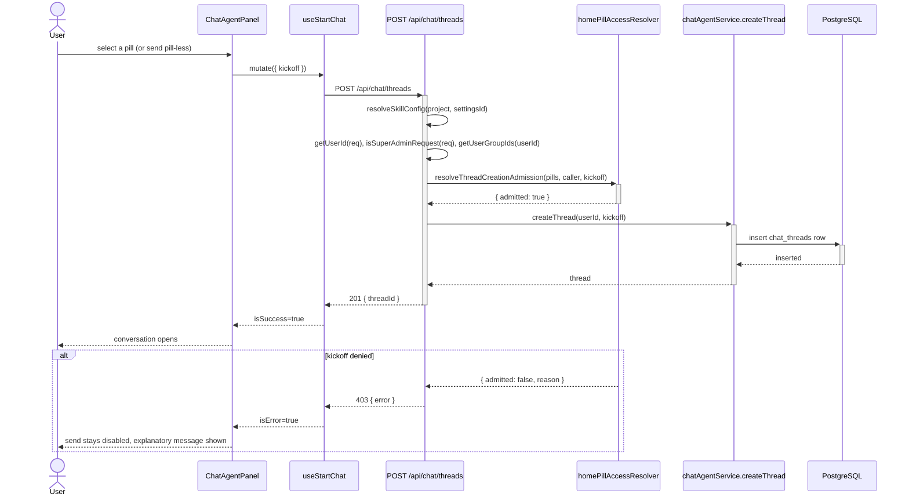
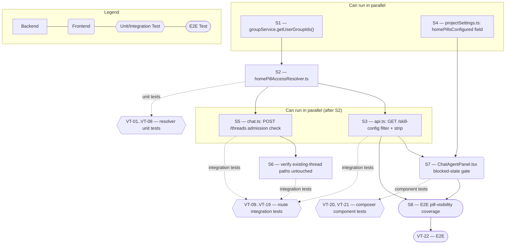

# Technical Specification — Enforce Home Pill Access

> **PRD slug:** `home-pill-access-control` | **Owning layer:** `src/server/services/` | **Surface:** Full stack
> **Verification builds:** `npx tsc -p tsconfig.server.json --noEmit` and `npx tsc -p tsconfig.client.json --noEmit`
> **Open items:** See [design-doc-assumptions.md](design-doc-assumptions.md) (2 unresolved)
> **Design doc:** [design-doc-design.md](design-doc-design.md)

---

## System Boundary and Owning Layer

**Owning layer:** `src/server/services/`

**Rationale:** The core of this Feature is one rule — "which pills, and whether pill-less chat, may this caller use given this project's pill configuration" — evaluated identically by two independent callers (a read path and a write path). Per TBI-003, that rule must be a pure, framework-agnostic function so both callers get the same answer without re-implementing it. `src/server/services/` is where every other pure/deep-module resolver in this codebase already lives (`agentEffortResolver.ts`, `groundingProfileResolver.ts`), and it is the layer both `src/server/routes/api.ts` and `src/server/routes/chat.ts` already import services from.

**Ownership answers:**
- New or existing Express service in `src/server/services/`? **New** — `homePillAccessResolver.ts`, a pure resolver module with no DB/HTTP calls of its own (per TBI-003's explicit NFR). Also **existing, extended** — `groupService.ts` gains one new exported function, `getUserGroupIds()`, so callers can pass live group-ID membership into the resolver (see ⚠ Unresolved item in the assumptions file).
- New or existing route in `src/server/routes/`? **Existing, extended** — `api.ts` (`GET /skill-config`, ~line 4283) filters and strips pills and adds `homePillsConfigured`; `chat.ts` (`POST /threads`) calls the resolver's admission check before `createThread`. No new endpoints.
- New React component in `src/client/components/`? **No** — extends the existing Home-compose branch of `ChatAgentPanel.tsx`. The blocked-state notice is a conditional JSX block alongside the existing `needsSkillSelection` gate, not a new component file.
- New shared type in `src/shared/types/`? **Yes** — one new field, `homePillsConfigured?: boolean`, added to `ProjectSkillConfigResponse` in `src/shared/types/projectSettings.ts` (see ⚠ Unresolved item in the assumptions file for why this one field is necessary).
- Database migration needed? **No** — FEAT-001 (dependency) already adds `allowedUserIds`/`allowedGroupIds` inside the existing JSON-backed `quick_skill_pills`/`quick_mcp_pills` columns on `project_skill_settings`. This Feature only reads and evaluates those fields; it introduces no new persisted state.

---

## Security Enforcement

- **Authorization mechanism:** Pill-level enforcement is a data-scoping rule, not a new RBAC permission — it layers underneath the existing `requirePermission('chat:view')` router-wide gate on `chat.ts` and the client-side `can('chat:view') && can('chat:create')` check in `App.tsx`. The Platform Admin bypass reuses the existing `isSuperAdminRequest(req)` utility (`src/server/utils/superAdmin.ts`) — the same check `requirePermission`/`requireGroupMembership`/`requireProjectAccess` (`src/server/middleware/rbac.ts`) already short-circuit on. The resolver never re-derives admin status itself; each route resolves `isSuperAdminRequest(req)` and passes the boolean in, keeping the resolver HTTP-agnostic per TBI-003.
- **Layer that enforces scope:** Both, at two different boundaries. **Data-exposure boundary** — `GET /api/skill-config` (`api.ts`) filters `quickSkillPills`/`quickMcpPills` to the caller's allowed subset and strips `allowedUserIds`/`allowedGroupIds` from every returned pill before the response leaves the server, so a non-admin caller can never see who else is allowed on a pill. **Mutation boundary** — `POST /api/chat/threads` (`chat.ts`) calls the resolver's admission check before `createThread()` persists a row; a denied kickoff creates nothing.
- **Sensitive data handling:** `allowedUserIds`/`allowedGroupIds` are omitted field-by-field when the `GET /skill-config` handler maps each pill for the public response (an explicit allow-list of fields to include, not a blocklist of fields to remove, so a future field added to `QuickSkillPill`/`QuickMcpPill` does not leak by default). The admin project-settings read/write path (`admin.ts`, gated by the router-wide `requirePermission('admin:roles')`) is untouched — it continues to return and persist the full pill list including allow-list fields, exactly as FEAT-001 leaves it.

---

## Architecture and Approach

### Layers touched

| Layer | Changed | Notes |
|-------|---------|-------|
| Server services (`src/server/services/`) | Yes | New `homePillAccessResolver.ts`; `groupService.ts` gains `getUserGroupIds()` |
| Server routes (`src/server/routes/`) | Yes | `api.ts` — `GET /skill-config` filters/strips pills, adds `homePillsConfigured`; `chat.ts` — `POST /threads` gains a pre-`createThread` admission check |
| Server middleware (`src/server/middleware/`) | No | Reuses `isSuperAdminRequest()` directly inside the route handler; no new middleware function |
| Client components (`src/client/components/`) | Yes | `ChatAgentPanel.tsx` — blocked-state notice and `canSend` gate in the Home-compose branch |
| Client hooks (`src/client/hooks/`) | No | `useProjectSkillConfig.ts` picks up the new `homePillsConfigured` field automatically via its existing `ProjectSkillConfigResponse` type import |
| Shared types (`src/shared/types/`) | Yes | `ProjectSkillConfigResponse.homePillsConfigured?: boolean` in `projectSettings.ts` |
| Database (migrations/) | No | No schema change |
| Drizzle schema (`src/server/db/schema.ts`) | No | No schema change |

### Per-work-item design decisions

**TBI-003 — Build a pill access resolver for live allow-list evaluation**
- Pattern followed: pure resolver module with no DB/HTTP coupling, matching `agentEffortResolver.ts`/`groundingProfileResolver.ts`.
- Key decisions: exports two functions from `homePillAccessResolver.ts` — `resolveHomePillAccess()` (returns the allowed pill subset plus `canStartPillessChat`) and `resolveThreadCreationAdmission()` (built on top of the first, adds the kickoff-matching logic TBI-005 needs). Both take `{ skillPills, mcpPills, callerId, callerGroupIds, isSuperAdmin }` so every caller passes identical shapes. `canStartPillessChat` is computed as `(skillPills.length === 0 && mcpPills.length === 0) || (allowedSkillPills.length + allowedMcpPills.length > 0)` — directly encoding BR-005/BR-006's "zero configured pills always allows pill-less; otherwise pill-less requires being allowed on at least one" rule, and satisfying PBI-006(d)'s "evaluated on its own terms" requirement without special-casing it. A deleted/missing `allowedGroupIds` reference (PBI-003(b)) needs no special-case code: the resolver only ever asks "is any of `callerGroupIds` in this pill's `allowedGroupIds`," so a group ID that no longer exists simply never appears in a live `callerGroupIds` lookup and naturally grants no access — rejected alternative: pre-validating group existence inside the resolver, which would require the "pure function, no DB coupling" resolver to make a DB call, violating TBI-003's own NFR.

**TBI-004 — Filter and strip Home pills on the public skill-config read path**
- Pattern followed: existing `GET /skill-config` handler in `api.ts` (~line 4283) already builds its response as an explicit field-by-field object literal, not a type-cast spread of the raw config row — this Feature extends that same explicit-field style for the pill fields instead of introducing a new response-shaping helper.
- Key decisions: resolve `getUserId(req)`, `isSuperAdminRequest(req)`, and `groupService.getUserGroupIds(userId)` at the top of the handler (mirroring how `chat.ts` already resolves `getUserId(req)` per request), call `resolveHomePillAccess()`, then map each allowed pill to an explicit subset of fields (omitting `allowedUserIds`/`allowedGroupIds`) before assigning to `quickSkillPills`/`quickMcpPills` in the response object. `homePillsConfigured` is computed directly from the *unfiltered* `config.quickSkillPills`/`config.quickMcpPills` lengths (project-level fact, independent of caller) rather than from the resolver's caller-specific output, since it must be true even for a caller who is filtered down to zero pills. Rejected alternative: reusing `canStartPillessChat` for this purpose — that value is caller-specific and would be `true` for a caller with no configured pills to worry about but also `true` for a caller allowed on the project's only pill, collapsing exactly the distinction TBI-006 needs.

**TBI-005 — Enforce pill access on Home thread creation**
- Pattern followed: `POST /threads` in `chat.ts` already resolves `resolveSkillConfig({ project, settingsId })` before building the kickoff (existing code, unchanged); this Feature inserts the admission check immediately after that resolution and before the `createThread()` call, using the same early-return-with-4xx style already used by the route's existing `kickoff.project`/`kickoff.repo` validation.
- Key decisions: `resolveThreadCreationAdmission()` takes the kickoff's `skillPath` and `mcpPill?.mcpServerName` (both already present on `ChatThreadKickoff`, `src/shared/types/chat.ts` — no kickoff shape change needed) and applies the match rule from the PRD's stated assumption: a kickoff matches a configured skill pill only on exact `skillPath` equality, matches a configured MCP pill only on exact `mcpServerName` equality, and is otherwise treated as pill-less (including an unmatched `skillPath`, per PBI-005(c)). A denied kickoff returns `403` with an explicit error message before `createThread()` runs, so no thread row is ever persisted for a denied request — satisfying TBI-005's "check runs before a new thread row is persisted" NFR without touching `createThread()` itself. Platform Admin exemption is the same `isSuperAdmin` boolean threaded through from TBI-003, not a second bypass path.

**TBI-006 — Update Home composer for filtered pills and blocked-start state**
- Pattern followed: the existing `needsSkillSelection` boolean and its wiring into `AgentComposer`'s `disabled`/`canSend`/`shellDisabled`/`placeholder` props in `ChatAgentPanel.tsx` (the empty-composer branch) is the direct template for the new gate — this Feature adds a sibling boolean rather than a new mechanism.
- Key decisions: add `blockedNoAllowedPills = isHomeCompose && Boolean(skillConfig?.homePillsConfigured) && quickSkillPills.length === 0 && quickMcpPills.length === 0`, and fold it into the existing `canSend`/`disabled`/`shellDisabled` expressions alongside `needsSkillSelection` (the two are mutually exclusive by construction — `needsSkillSelection` requires `hasHomePills` to be true, `blockedNoAllowedPills` requires the filtered pills to be empty). When the `skill-config` query is loading or has errored, `skillConfig` is `undefined`/stale, so `Boolean(skillConfig?.homePillsConfigured)` defaults to `false` — the PRD's "defaulting to disabled rather than allowing an unchecked send" NFR is satisfied not by defaulting to blocked, but because `hasHomePills` also depends on the same possibly-stale `skillConfig` and the pre-existing `needsSkillSelection`/`canStartNewChat` gates already fail closed in that state; no new loading-state logic is required.

---

## Data and Contracts

### API endpoints

| Method | Route | Request shape | Response shape | Auth |
|--------|-------|--------------|----------------|------|
| GET | `/api/skill-config?project=&settingsId=` | Query params only (unchanged) | Existing explicit-field response, extended: `quickSkillPills`/`quickMcpPills` now contain only the caller's allowed pills with `allowedUserIds`/`allowedGroupIds` omitted from each; new `homePillsConfigured: boolean` field | Authenticated session (existing pattern for this route, unchanged) |
| POST | `/api/chat/threads` | `StartChatRequest` (unchanged shape) | `201 { threadId }` on success (unchanged); **new:** `403 { error: string }` when the kickoff names a pill the caller isn't allowed on, or is pill-less while the caller is allowed on none of the project's configured pills | `requirePermission('chat:view')` (router-wide, unchanged) + new pill-admission check (not an RBAC permission) |

### Schema / storage changes

| Target | Change | Reason |
|--------|--------|--------|
| `project_skill_settings.quick_skill_pills` / `quick_mcp_pills` (jsonb) | None — read-only for this Feature | FEAT-001 (dependency) already added `allowedUserIds`/`allowedGroupIds` inside these existing JSON-backed columns; this Feature only evaluates them |

---

## Testing Strategy

**Unit tests:**
- `homePillAccessResolver.test.ts` (new) — `resolveHomePillAccess()`: empty-allow-list-means-everyone default (both fields absent and both present-but-empty), direct user-ID match, group-ID match, a stale/deleted group reference granting no access, Platform Admin bypass returning every pill unfiltered, and the `canStartPillessChat` truth table across {zero configured pills, configured-and-allowed, configured-and-none-allowed}. `resolveThreadCreationAdmission()`: allowed skill pill accepted, disallowed MCP pill denied, unmatched `skillPath` treated as pill-less, Platform Admin accepted regardless of allow-list.
- `groupService.test.ts` (extend) — `getUserGroupIds()` returns the caller's current group ID memberships, matching the existing `getUserGroupNames()` coverage shape.

**Integration tests:**
- `apiRoutes.skillConfig.test.ts` (extend) — `GET /api/skill-config` returns only allowed pills and never returns `allowedUserIds`/`allowedGroupIds`, exercised across an Authenticated User (partial access), a Project Admin (no bypass), and a Platform Admin (full access) caller on the same project/pill configuration; `homePillsConfigured` is `true` when the project has pills regardless of caller filtering, and `false` only when the project has none.
- `chatRoutes.test.ts` (extend, `describe('POST /api/chat/threads', ...)`) — the full accept/deny matrix: allowed skill pill (create), disallowed MCP pill (deny, no thread persisted), unmatched skillPath with zero allowed pills (deny), pill-less with zero configured pills (create, unchanged), pill-less with zero allowed pills on a project with configured pills (deny), pill-less with at least one allowed pill (create), Platform Admin against any pill (create).

**E2E tests (if applicable):**
- Playwright, Home page — a pill with a non-empty allow-list is hidden for a user not on it and appears after being added (paired with the companion Feature's admin editor); the Home composer shows the new blocked-start message and disables send when the signed-in user is allowed on none of a project's configured pills.

---

## Observability

- **Custom events/metrics:** None beyond standard request telemetry. A denied `POST /api/chat/threads` already surfaces as a `4xx` response and is covered by existing request logging; no new named event is needed to prove the accept/deny behavior, per the PRD's own testing guidance to "assert on the visible pill set and on thread-creation accept/deny outcomes... not on which internal helper was called."
- **Alerts:** None.

---

## Rollback and Deployment

- **Schema changes backward compatible:** Not applicable — no schema change in this Feature.
- **Rollback procedure:** Revert the `api.ts`/`chat.ts`/`ChatAgentPanel.tsx`/`groupService.ts`/`homePillAccessResolver.ts` changes as a single deploy; because FEAT-001's allow-list fields are additive and optional, a rollback of this Feature alone leaves every pill behaving exactly as it does today (empty/absent allow-lists mean everyone), with no data cleanup required.
- **Deployment dependencies:** FEAT-001 ("Configure Home Pill Allow-Lists") must be deployed first so `allowedUserIds`/`allowedGroupIds` exist on the pill types and are persisted by the admin path before this Feature's resolver has anything meaningful to read.
- **Feature flag gates deployment:** No — this ships GA directly, per the PRD's explicit "no feature flag" decision.

---

## Verification Test Matrix

| ID | Layer | Arrange | Act | Assert | Linked |
|----|-------|---------|-----|--------|--------|
| VT-01 | Jest (unit) | Skill pill with empty/absent `allowedUserIds`/`allowedGroupIds` | `resolveHomePillAccess()` for an arbitrary non-admin caller | Pill is included in the allowed subset | PBI-003 (c) |
| VT-02 | Jest (unit) | Skill pill with `allowedUserIds: [callerId]`, another pill with `allowedUserIds: [otherId]` | `resolveHomePillAccess()` for `callerId` | Only the first pill is in the allowed subset | PBI-003 (a) |
| VT-03 | Jest (unit) | MCP pill with `allowedGroupIds: ['stale-group-id']` that does not appear in `callerGroupIds` | `resolveHomePillAccess()` for the caller | MCP pill is excluded from the allowed subset (no error thrown) | PBI-003 (b) |
| VT-04 | Jest (unit) | Two pills, both with non-empty allow-lists the caller is not on | `resolveHomePillAccess()` with `isSuperAdmin: true` | Both pills are included, unfiltered | PBI-004 (a) |
| VT-05 | Jest (unit) | Same pill configuration as VT-04 | `resolveHomePillAccess()` with `isSuperAdmin: false` for a Project Admin's `callerId` (not on either allow-list) | Both pills are excluded | PBI-004 (d) |
| VT-06 | Jest (unit) | Project with zero configured skill/MCP pills | `resolveHomePillAccess()` for any caller | `canStartPillessChat` is `true` | PBI-003 (c), PBI-006 (c) |
| VT-07 | Jest (unit) | Project with configured pills, caller allowed on zero | `resolveHomePillAccess()` for that caller | `canStartPillessChat` is `false` | PBI-006 (a) |
| VT-08 | Jest (unit) | Project with configured pills, caller allowed on at least one | `resolveHomePillAccess()` for that caller | `canStartPillessChat` is `true` | PBI-006 (d) |
| VT-09 | Jest (integration, route) | Project with a skill pill allowed for the caller | `POST /api/chat/threads` naming that pill's `skillPath` | `201`, thread created | PBI-005 (a) |
| VT-10 | Jest (integration, route) | Project with an MCP pill not allowed for the caller | `POST /api/chat/threads` naming that pill's `mcpServerName` directly (bypassing the composer) | `403`, no thread row persisted | PBI-005 (b) |
| VT-11 | Jest (integration, route) | Project with configured pills, kickoff `skillPath` matches none of them, caller allowed on zero configured pills | `POST /api/chat/threads` with that `skillPath` | `403` | PBI-005 (c) |
| VT-12 | Jest (integration, route) | Project with configured pills the caller is not allowed on, caller is Platform Admin | `POST /api/chat/threads` naming any configured pill | `201`, thread created | PBI-005 (d) |
| VT-13 | Jest (integration, route) | Project with configured pills, caller allowed on zero | `POST /api/chat/threads` with no `skillPath` and no `mcpPill` | `403` | PBI-006 (a), (b) |
| VT-14 | Jest (integration, route) | Project with zero configured pills | `POST /api/chat/threads` with no `skillPath` and no `mcpPill` | `201`, thread created (unchanged) | PBI-006 (c) |
| VT-15 | Jest (integration, route) | Existing thread owned by the caller on a pill; admin removes the caller from that pill's allow-list after thread creation | `POST /api/chat/threads/:id/messages` on the existing thread | `202`, message accepted | PBI-007 (a) |
| VT-16 | Jest (integration, route) | Same setup as VT-15 | `POST /api/chat/threads` for a *new* thread on the same pill | `403` | PBI-007 (c) |
| VT-17 | Jest (integration, route) | `GET /api/skill-config` for a project with configured pills, caller allowed on some | Inspect response body | `quickSkillPills`/`quickMcpPills` contain only allowed pills; no `allowedUserIds`/`allowedGroupIds` key present anywhere in the response | PBI-003 (a), (d) |
| VT-18 | Jest (integration, route) | `GET /api/skill-config` for a project with configured pills, caller allowed on zero | Inspect response body | `quickSkillPills: []`, `quickMcpPills: []`, `homePillsConfigured: true` | PBI-003 (d), PBI-006 (a) |
| VT-19 | Jest (integration, route) | `GET /api/skill-config` for a project with zero configured pills | Inspect response body | `quickSkillPills: []`, `quickMcpPills: []`, `homePillsConfigured: false` | PBI-006 (c) |
| VT-20 | RTL (component) | `ChatAgentPanel` in Home-compose mode, `skillConfig` = `{ quickSkillPills: [], quickMcpPills: [], homePillsConfigured: true }` | Render, attempt to send a pill-less message | Send is disabled, blocked-state notice with `data-testid="chat-agent-home-blocked-notice"` is rendered | PBI-006 (a) |
| VT-21 | RTL (component) | Same as VT-20 but `homePillsConfigured: false` | Render, attempt to send a pill-less message | Send proceeds unchanged (existing pill-less behavior) | PBI-006 (c) |
| VT-22 | Playwright (E2E) | Two users on a project with one allow-listed skill pill; only one user is on the allow-list | Both load `/home` | The allow-listed user sees the pill; the other does not | PBI-003 (a) |

---

## Implementation Plan

- [ ] S1 — Add `getUserGroupIds(userId): Promise<string[]>` to `groupService.ts` _(no blockers; requires FEAT-001 merged for `allowedGroupIds` to exist on pill types)_
  - Covers: `VT-03`
- [ ] S2 — Build `homePillAccessResolver.ts` (`resolveHomePillAccess()`, `resolveThreadCreationAdmission()`) _(blocked by S1)_
  - Covers: `VT-01`, `VT-02`, `VT-03`, `VT-04`, `VT-05`, `VT-06`, `VT-07`, `VT-08`
- [ ] S3 — Extend `GET /api/skill-config` in `api.ts`: call the resolver, strip allow-list fields from each returned pill, add `homePillsConfigured` _(blocked by S2)_
  - Covers: `VT-17`, `VT-18`, `VT-19`
- [ ] S4 — Add `homePillsConfigured?: boolean` to `ProjectSkillConfigResponse` in `projectSettings.ts` _(no blockers; can run in parallel with S1/S2)_
- [ ] S5 — Extend `POST /api/chat/threads` in `chat.ts`: call `resolveThreadCreationAdmission()` before `createThread()`, return `403` on denial _(blocked by S2)_
  - Covers: `VT-09`, `VT-10`, `VT-11`, `VT-12`, `VT-13`, `VT-14`
- [ ] S6 — Verify no regression on existing-thread read/write and reopen flows (no code change expected — proves TBI-005's "existing-thread paths untouched" NFR) _(blocked by S5)_
  - Covers: `VT-15`, `VT-16`
- [ ] S7 — Update `ChatAgentPanel.tsx` Home-compose branch: `blockedNoAllowedPills` gate, blocked-state notice _(blocked by S3, S4)_
  - Covers: `VT-20`, `VT-21`
- [ ] S8 — E2E coverage for allow-listed vs. non-allow-listed pill visibility on `/home` _(blocked by S3, S7; also requires the companion Feature's admin editor to configure an allow-list)_
  - Covers: `VT-22`

**Execution lanes:**
- Lane 1 (start immediately): S1, S4
- Lane 2 (after S1): S2
- Lane 3 (after S2): S3, S5
- Lane 4 (after S3 + S4): S7
- Lane 5 (after S5): S6
- Lane 6 (after S3 + S7): S8

---

## Diagram 1 — Code Execution Flow

---

## Diagram 2 — Implementation Dependency Map

