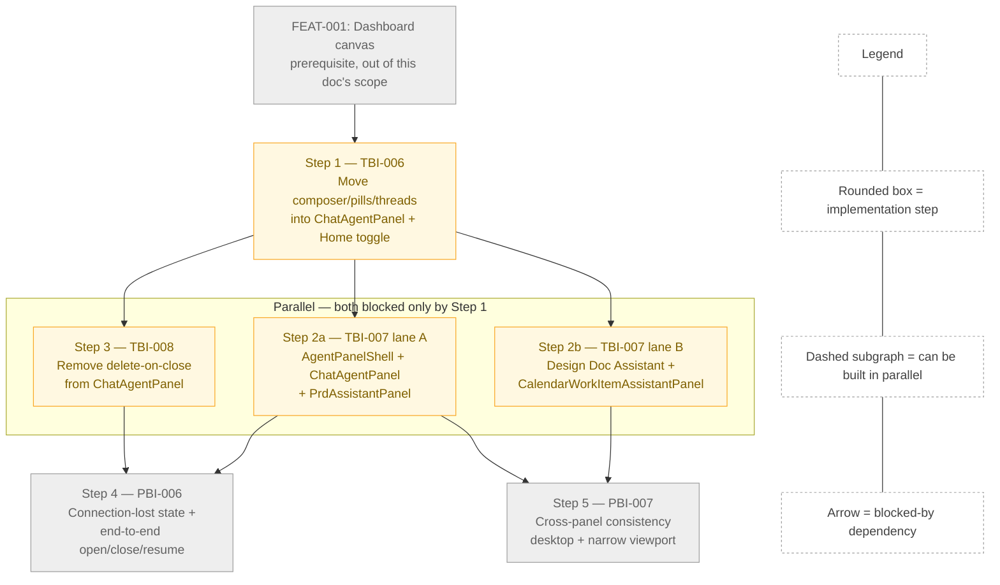

## Target route
`/home`

## Page decision
`update-page`

# Tech Spec — Shared Cursor-like Slide-out Chat

## 1. Header

**Feature title:** Shared Cursor-like Slide-out Chat
**PRD slug:** `status-driven-agent-home`
**Feature ID:** FEAT-002
**Owning layer:** `src/client/components/` (React) — client-only feature; one existing server call site is *removed* (no new server code)
**Surface:** Full-stack per the PRD's Target Surface, but this Feature's delta is client-side; see §2
**Depends on:** FEAT-001 (dashboard canvas), TBI-006 → {TBI-007, TBI-008} → {PBI-006, PBI-007}

**Verification commands:**
```bash
npm test -- ChatAgentPanel AgentHome PrdAssistantPanel CalendarWorkItemAssistantPanel DesignDocReviewView
npm run lint:eslint
npm run test:e2e -- --grep @a11y
npm run test:e2e -- --grep @smoke
```

## UI Changes (from approved prototype)

- [ ] [additive] Add a fixed right-edge Chat toggle button on the Agent Home dashboard canvas that opens/closes the shared slide-out panel (target area: Agent Home page, right viewport edge, outside the header)
- [ ] [impacts-existing] Replace Agent Home's current full-page compose experience (skill/MCP pill selector, composer, message transcript, context meter, "+ New chat" header, in-page History toggle) with the shared `ChatAgentPanel` slide-out opened by the new toggle (target area: `/home` main canvas — `AgentHome.tsx` compose-mode and chat-mode branches)
- [ ] [impacts-existing] Move the "Skills" and "MCP Servers" quick-pill rows (currently rendered only in Agent Home's compose-mode body) into the slide-out panel, displayed above the transcript/composer (target area: shared slide-out panel body, top section)
- [ ] [impacts-existing] Add a persistent "Recent Threads" preview list with a "See all" link inside the slide-out panel body, shown alongside the transcript rather than only behind the panel's existing toggle-based full history view (target area: shared slide-out panel body, under the pills section)
- [ ] [impacts-existing] Restyle the slide-out panel header to a single-line title ("Agent Chat") + close control, replacing each panel's current bespoke header (Home's chat-mode header with subtitle/context meter/new-chat button; PRD/Design Doc Assistant's "Apex Assistant" header with a new-conversation icon button; Calendar Assistant's draggable header with scope/minimize controls) (target area: all four panel headers)
- [ ] [impacts-existing] Reposition the Calendar Work-Item Assistant from a centered, user-draggable, resizable floating card to a right-edge slide-out matching the shared frame (target area: `CalendarWorkItemAssistantPanel.tsx`)
- [ ] [additive] Add a full-height overlay presentation (no border, no side gap) on narrow viewports for the PRD Assistant, Design Doc Assistant, and Calendar Work-Item Assistant panels, matching the pattern already implemented for `ChatAgentPanel` (target area: `PrdAssistantPanel.module.css`, the assistant styles in `DesignDocReviewView.module.css`, `CalendarWorkItemAssistantPanel.module.css`)
- [ ] [additive] Add a prominent centered "Disconnected" status badge in the panel header and an "Unable to connect" / "Retry Connection" state in the transcript area when the SSE stream drops (target area: shared slide-out panel, top bar + transcript)
- [ ] [additive] Add a skeleton-loading presentation (header, pills, thread list, transcript, composer skeletons) while a newly opened panel's session/thread is still initializing (target area: shared slide-out panel, all sections)
- [ ] [impacts-existing] Change Close from ending the active thread (current `ChatAgentPanel` behavior calls the thread-delete endpoint on close) to only hiding the panel while preserving the thread for resume (target area: `ChatAgentPanel.tsx` `handleClose`)
- [ ] [additive] Add quick-start skill suggestion pills ("Write a PRD", "Review my code", "Plan a sprint") inside the panel's empty/no-thread state (target area: shared slide-out panel, empty state)
- [ ] [impacts-existing] Simplify the composer's visible chrome in the mock (no visible model selector or microphone button) relative to the composer's current feature set in `ChatAgentPanel`/`AgentHome` (target area: shared slide-out panel composer)

## Existing Functionality Impact

- **Replacing Home's inline compose experience (UI Change #2).** `AgentHome.tsx` currently owns two full render branches: `styles.compose` (skill/MCP pills, composer, quick-start) when no thread is active, and `styles.chat` (header with context meter and "+ New chat", message list, PRD banner, composer) when one is. Both are removed. Any bookmarked `/home?thread=<id>` link and the `agentHomeThreadId:{project}` sessionStorage restore currently drive which thread renders inline on load; removing the inline body means that restore path must now open the slide-out panel instead, or the "resume where I left off" behavior silently regresses. See `design-doc-assumptions.md` U-2 / sign-off question 1.
- **Relocating Skill/MCP pills (UI Change #3).** The pill-select handlers in `AgentHome.tsx` (`onClick` on `quickSkillPills`/`quickMcpPills`) currently also call `setModel(pill.model ?? globalDefaultModel?.value ?? DEFAULT_MODEL_ID)` — selecting or deselecting a pill silently changes the model the next message will use. If this side effect is not ported exactly into `ChatAgentPanel.tsx`, pill-launched skills will start on the wrong model with no visible error. See sign-off question 2.
- **Adding a persistent Recent Threads preview (UI Change #4).** `ChatAgentPanel.tsx` already has a toggle-based history view (`showHistory` state renders `ThreadHistorySidebar` in place of the message list). Adding an always-visible preview list is a second, simultaneous surface for the same underlying `chat-thread-list` query family; both must read `useChatThreadList`/`useChatThreads` so a flagged/deleted thread updates in both places at once, or the preview and the "See all" sidebar can show contradictory state.
- **Restyling all four headers (UI Change #5).** `PrdAssistantPanel.tsx` and the Design Doc Assistant panel (defined inline in `DesignDocReviewView.tsx`) both expose a header icon button that opens a confirm-before-discard dialog (`showNewConvConfirm`) before starting a fresh thread — this is the only way those two surfaces start a new conversation without losing history. The restyled shared header must keep an equivalent action or that capability disappears. See sign-off question 4.
- **Converting Calendar's floating card to a slide-out (UI Change #6).** `CalendarWorkItemAssistantPanel.tsx` is `position: fixed` with a `headerDraggable` drag handle, four independent resize edges/corners (`resizeLeft`/`resizeRight`/`resizeBottom`/`resizeBL`/`resizeBR`), and a `panelMinimized` collapsed state — none of which exist on `ChatAgentPanel`. Adopting the shared right-edge frame removes drag positioning, per-edge resize, and minimize; a Calendar user who currently drags the assistant beside a specific week or minimizes it while scheduling loses that ability. See `design-doc-assumptions.md` U-3 / sign-off question 5.
- **Removing the delete-on-close call (UI Change #10).** `ChatAgentPanel.tsx`'s current `handleClose` awaits `useCloseThread().mutateAsync(thread.id)` before calling `onClose()`. `useCloseThread` posts `DELETE /api/chat/threads/:id`, which server-side resolves to `permanentlyDeleteThread` in `chatAgentService.ts` (see `src/server/routes/chat.ts`, `router.delete('/threads/:id', ...)`, comment: "Permanently delete the thread from memory, workspace, and database"). Today, clicking Close on this panel **permanently destroys the thread** rather than closing it. Removing this call is required by BR-015/TBI-008, but it also removes the only path today by which a user can discard a scratch conversation from inside this panel. See sign-off question 6.
- **Simplifying the composer (UI Change #12).** The prototype's composer shows only a textarea, an attach icon, and a send button. Production's `ChatAgentPanel` composer additionally exposes a model `<select>` (via `AgentComposer`'s `model`/`models`/`onModelChange` props, backed by `useAvailableModels()`) and, on Home specifically, a microphone button wired to the Web Speech API (`isListening`, `toggleSpeechRecognition` in `AgentHome.tsx`). Matching the mock literally would remove both. See sign-off question 7.

## 2. System Boundary and Owning Layer

- **New or existing Express service in `src/server/services/`?** Existing — no new service. `chatAgentService.ts` and `chatThreadRepository.ts` are unchanged. The only server-adjacent change is a client stops calling an existing endpoint (see below); no server code is modified.
- **New or existing route in `src/server/routes/`?** Existing, unchanged. `src/server/routes/chat.ts`'s `DELETE /api/chat/threads/:id` route stays exactly as-is (it is still needed for the genuine "permanently delete a thread" action reachable from `ThreadHistorySidebar`); this Feature only stops one client call site (`ChatAgentPanel.handleClose`) from invoking it on every Close.
- **New React component(s) in `src/client/components/`?** Yes:
  - New: `src/client/components/agentChat/AgentPanelShell.tsx` + `AgentPanelShell.module.css` — the shared "deep module" frame (fixed right-edge positioning, resize handle, header slot, status/connection badge slot, and the narrow-viewport full-height-overlay media query) extracted from `ChatAgentPanel.module.css` into the existing shared `agentChat/` module that already owns `AgentComposer`, `AgentTranscript`, `AgentMessage`, `ChoiceBlock`.
  - Modified: `ChatAgentPanel.tsx` (gains pills row, Recent Threads preview, connection-lost state, fixed Close behavior; body now composed inside `AgentPanelShell`), `AgentHome.tsx` (loses its compose/chat render branches; gains the right-edge toggle and a callback prop to open the panel), `PrdAssistantPanel.tsx`, `DesignDocReviewView.tsx` (the inline `DesignDocAssistantPanel`), `CalendarWorkItemAssistantPanel.tsx` (all four re-platformed onto `AgentPanelShell`), `App.tsx` (removes the `currentView === 'home'` auto-close guard on `chatOpen`; wires the new toggle callback into `AgentHome`).
- **New shared type in `src/shared/types/`?** No new shared type is required. `ChatThread`, `ChatThreadStatus`, `QuickSkillPill`, `QuickMcpPill` (all in `src/shared/types/chat.ts` / `src/shared/types/projectSettings.ts`) already cover every payload this Feature moves between components.
- **Database migration?** No. No schema change; no new table, column, or permission row.

## 3. Security Enforcement

- **Authorization mechanism:** RBAC permission checks via `useAppShell().can()`, following the existing client gating pattern documented in `.cursor/rules/rbac-governance.mdc`. No new permission key is added — `chat:view` and `chat:create` already exist in the permission catalog (category `chat`, roles `admin, member`) and already gate chat access everywhere else in the app.
- **RBAC guard on the new toggle:** the right-edge toggle on `AgentHome.tsx` renders only when `can('chat:view')` (PBI-006 AC4), mirroring `App.tsx`'s existing `onOpenAgentChat={currentView !== 'home' ? () => setChatOpen(true) : undefined}` gate and the note in `design-docs/menu-view-rbac.md`: *"Also gate the `ChatAgentPanel` open flow: suppress `setChatOpen(true)` when `!can('chat:view')` (in `onOpenAgentChat` callback)."* The same suppression pattern is reused for the new Home-only toggle's `onClick`.
- **Data scope enforcement:** unchanged. Thread reads/writes continue to go through `requireThreadRead` / `requireThreadWrite` middleware in `src/server/routes/chat.ts`, which resolve access via `resolveThreadAccess` / `canWriteThread` in `threadAccessService.ts` — this Feature does not touch that middleware or its callers.
- **No new data exposure across the shared shell.** PBI-007's NFR explicitly requires this: "Each assistant keeps its existing confirm-before-write and diff-review gates; the shared shell introduces no new data exposure." Because `AgentPanelShell` is a pure presentational wrapper (header/frame/positioning only) and never touches `session`, `messages`, or any assistant-specific fetch, none of PRD Assistant's/Design Doc Assistant's/Calendar Work-Item Assistant's existing authorization checks (`canCreateDesignDocAssistantThread`, the calendar assistant's proposal-only MCP surface, revision-guarded ADO writes — see `design-docs/calendar-work-item-assistant.md`) are altered.
- **Delete-endpoint exposure unchanged.** `permanentlyDeleteThread` remains reachable only through `requireThreadWrite`-gated `DELETE /api/chat/threads/:id`; this Feature reduces the number of client call sites that invoke it (removing it from `ChatAgentPanel.handleClose`), which is a strict reduction in destructive-action surface area, not an increase.

## 4. Architecture and Approach

### Layers touched

| Layer | Files | Change type |
|-------|-------|--------------|
| Client — shared deep module | `src/client/components/agentChat/AgentPanelShell.tsx` (new), `AgentPanelShell.module.css` (new) | New shared panel-frame component |
| Client — Home Chat | `src/client/components/AgentHome.tsx`, `AgentHome.module.css` | Remove compose/chat branches; add right-edge toggle |
| Client — Home slide-out | `src/client/components/ChatAgentPanel.tsx`, `ChatAgentPanel.module.css` | Add pills/threads/connection UI; adopt `AgentPanelShell`; fix `handleClose` |
| Client — App shell wiring | `src/client/App.tsx` | Remove Home auto-close guard; pass open-panel callback into `AgentHome` |
| Client — PRD Assistant | `src/client/components/PrdAssistantPanel.tsx`, `PrdAssistantPanel.module.css` | Adopt `AgentPanelShell`; add narrow-viewport overlay rule |
| Client — Design Doc Assistant | `src/client/components/DesignDocReviewView.tsx` (`DesignDocAssistantPanel`), `DesignDocReviewView.module.css` | Adopt `AgentPanelShell`; add narrow-viewport overlay rule |
| Client — Calendar Work-Item Assistant | `src/client/components/CalendarWorkItemAssistantPanel.tsx`, `CalendarWorkItemAssistantPanel.module.css` | Replace floating/draggable card with `AgentPanelShell`; keep scope-selection step as the "extra action" content |
| Client — hooks (reused, unmodified) | `useAgentChatSession.ts`, `useChatStream.ts`, `useChatThreads.ts`, `useProjectSkillConfig.ts`, `useBreakpoint.ts` | No change — consumed as-is |
| Server | `src/server/routes/chat.ts` | No change — one client call site to `DELETE /threads/:id` is removed |

### Per-work-item design decisions

**TBI-006 — Move the Home chat composer, skill pills, and thread history into the slide-out**

- Extract `AgentHome.tsx`'s `contextPills` block (quick skill/MCP pill rendering + selection state: `selectedQuickSkill`, `selectedMcpPill`, and the model-override side effect on select/deselect) into `ChatAgentPanel.tsx`, sourced from the same `useProjectSkillConfig(selectedProject, selectedSkillSettingsId)` call already used by `AgentHome`. Render the pills row above the transcript, matching the prototype's `.drawer-skills` placement, using `AgentComposer`'s existing `before` slot pattern (already used today for the `/`-skill picker popover) or a new dedicated block directly above it.
- Delete `AgentHome.tsx`'s entire `isCompose` / non-compose render branches (the `styles.compose` and `styles.chat` JSX, their supporting state — `input`, `attachments`, `isSending`, speech recognition, `contextEstimate`, `showPrdPreview`) once the panel owns all of it. `AgentHome.tsx` becomes solely the FEAT-001 dashboard canvas plus the new right-edge toggle.
- Add a new prop to `AgentHome`, e.g. `onOpenChatPanel: () => void`, supplied by `App.tsx` as `() => setChatOpen(true)` (the same setter that already opens `ChatAgentPanel` for every other view). Render the toggle as `{can('chat:view') && <button className={styles.rightEdgeToggle} onClick={onOpenChatPanel} aria-label={isChatOpen ? 'Close chat panel' : 'Open chat panel'} data-testid="chat-agent-home-toggle">…</button>}`, passing `isChatOpen` down from `App.tsx`'s existing `chatOpen` state so the icon/aria-label flips exactly like the prototype's `toggleDefaultDrawer()`.
- In `App.tsx`, delete the render-time guard `if (currentView === 'home' && chatOpen) { setChatOpen(false); }` (lines ~217–222 today) — this is the literal cause of Home never being allowed to show the panel. Leave `onOpenAgentChat={currentView !== 'home' ? () => setChatOpen(true) : undefined}` on `AppHeader` unchanged: the header opener stays suppressed on Home per PBI-006's explicit out-of-scope ("Home keeps only the right-edge toggle").
- Migrate thread history: `AgentHome.tsx`'s dedicated `ThreadHistorySidebar` (rendered full-width beside the page body today) is dropped in favor of `ChatAgentPanel`'s existing `showHistory` toggle (already renders the same `ThreadHistorySidebar` component inside the panel). Add the new "Recent Threads" preview (top 3 via `useChatThreadList(3, selectedProject)`) as an always-visible summary above the transcript, with "See all" flipping `showHistory` to `true`.
- Preserve the `/home?thread=<id>` and `agentHomeThreadId:{project}` sessionStorage restore behavior (see `design-doc-assumptions.md` U-2) by moving that restore logic from `AgentHome.tsx` into the `App.tsx`/`AgentHome.tsx` boundary: on mount, if a thread id is present, call `onOpenChatPanel()` and pass the resolved thread id into `ChatAgentPanel`'s existing `activeThreadId`/`onSelectThread` flow (already wired in `App.tsx` via `setActiveThreadId`).

**TBI-007 — Restyle and share the slide-out shell**

- Introduce `AgentPanelShell` in `src/client/components/agentChat/`: a presentational component owning (a) `position: fixed; top: 0; right: 0; height: 100vh` right-edge placement with the existing resize-handle pattern from `ChatAgentPanel.module.css`, (b) a header region accepting `title`, `onClose`, and an `extraActions` slot (for PRD's diff-review entry point, Calendar's scope/minimize-equivalent, Design Doc's discuss-context entry point), (c) a `bodyBefore` slot (pills/threads for Home; scope pane for Calendar; nothing for PRD/Design Doc), (d) the transcript/composer children, and (e) the `@media (max-width: 768px)` full-height-overlay rule already proven in `ChatAgentPanel.module.css` (`width: 100% !important; border-left: none; box-shadow: none;`), generalized into `AgentPanelShell.module.css` so all four panels inherit it identically.
- Refactor `ChatAgentPanel.tsx`, `PrdAssistantPanel.tsx`, the inline `DesignDocAssistantPanel` in `DesignDocReviewView.tsx`, and `CalendarWorkItemAssistantPanel.tsx` to render their existing bodies inside `AgentPanelShell` instead of each owning its own `.panel`/`.header`/`.resizeHandle` CSS. Each keeps its distinctive extra content (PRD/Design Doc's new-conversation confirm dialog and diff-review banner; Calendar's scope-selection pane and per-item change review) as children passed into the shell's slots — satisfying PBI-007 AC1 and AC4 (Calendar shows no Home-only pills/threads).
- Calendar's `resizeLeft/Right/Bottom/BL/BR` handles, `headerDraggable`, and `panelMinimized` states are removed in favor of the shell's single right-edge resize handle, matching BR-016's "right-side overlay on desktop... full-height overlay on narrow viewports" (see Existing Functionality Impact above and `design-doc-assumptions.md` U-3).
- `PrdAssistantPanel.module.css` and `CalendarWorkItemAssistantPanel.module.css` currently have no `@media (max-width: 768px)` rule at all (confirmed absent; `ChatAgentPanel.module.css` is the only one of the four with one today) — this Feature is the first time those two panels get any narrow-viewport treatment.

**TBI-008 — Keep the active thread alive when the slide-out is closed**

- In `ChatAgentPanel.tsx`, change:
  ```ts
  const handleClose = async () => {
    if (thread) await closeThread.mutateAsync(thread.id).catch(() => {});
    onClose();
  };
  ```
  to simply:
  ```ts
  const handleClose = () => {
    onClose();
  };
  ```
  removing the `useCloseThread()` import/usage entirely from this component. `PrdAssistantPanel.tsx` and the Design Doc Assistant panel already behave correctly (their close buttons call only the parent-supplied `onClose`, and both already persist `threadId` in `localStorage` keyed by document id for resume) — no change needed there. `CalendarWorkItemAssistantPanel.tsx`'s close handler should be audited for the same anti-pattern during implementation, though no equivalent call was found in the excerpt reviewed for this design.
- New Chat is unaffected: `handleStartPanelChat` in `App.tsx` already calls `setActiveThreadId(null)` and starts a fresh `POST /api/chat/threads`, independent of Close.

### Reused building blocks (do not duplicate)

- `src/client/components/agentChat/AgentComposer.tsx` — the shared composer already used by `ChatAgentPanel`, `AgentHome`, and `PrdAssistantPanel`. Its `before`/`after`/`trailingActions` slots are reused for the pills row and connection hints; no composer logic is re-implemented per panel.
- `useAgentChatSession` (`src/client/hooks/useAgentChatSession.ts`) — already exposes `isConnected`, `status`, `retryLast()`, and `showTypingIndicator`, which are the exact primitives the "Disconnected"/"Unable to connect"/"Retry Connection" UI needs. No new hook or server endpoint is required for the connection-lost state.
- `ThreadHistorySidebar` — reused unchanged as the "See all" destination from the new Recent Threads preview.
- `useBreakpoint` (`src/client/hooks/useBreakpoint.ts`) exists for JS-level `isMobile`/`isDesktop` branching elsewhere (`AppHeader`, `AppSidebar`, `DesktopOnlyGate`), but the narrow-viewport overlay switch for panels should stay a pure CSS media query in `AgentPanelShell.module.css` (matching `ChatAgentPanel`'s proven approach and the PRD's own testing note: "layout follows viewport width, not an internal panel flag").

## 5. Data and Contracts

**API endpoints:** No new endpoints. One existing endpoint loses a caller:

| Method | Route | Change |
|--------|-------|--------|
| `DELETE` | `/api/chat/threads/:id` | Unchanged server-side. `ChatAgentPanel.tsx` stops calling it from `handleClose` (TBI-008). Still reachable from `ThreadHistorySidebar`'s existing thread-management actions and from `useDeleteThread()` callers elsewhere. |
| `GET` | `/api/chat/threads` (via `useChatThreadList`) | Unchanged. Reused for the new Recent Threads preview with `limit=3`. |
| `POST` | `/api/chat/threads` | Unchanged. Used by the relocated "start new thread from a pill" flow in `ChatAgentPanel.tsx`, mirroring `AgentHome.tsx`'s existing kickoff payload shape (`project`, `repo`, `branch`, `skillPath`, `model`, `pillLabel`, `pillDescription`, `mcpPill`). |
| `GET` | `/api/chat/threads/:id/stream` (SSE, via `useChatStream`) | Unchanged. Drives the connection-lost state via its existing `isConnected` signal. |

**Schema changes:** None. No table intent, no column addition, no new permission row.

## 6. Testing Strategy

- **Unit (Jest + React Testing Library):**
  - `ChatAgentPanel.test.tsx` (new/extended): Close no longer calls `useCloseThread`/`DELETE`; reopening after Close resumes the same thread and transcript unchanged (PBI-006 AC3); the pills row renders `quickSkillPills`/`quickMcpPills` from `useProjectSkillConfig` and applies the model override on select; the Recent Threads preview renders top-3 and "See all" opens `ThreadHistorySidebar`; the connection-lost state renders when `isConnected` is false and Retry calls `retryLast()`.
  - `AgentHome.test.tsx` (extended): the right-edge toggle renders only when `can('chat:view')` is true (PBI-006 AC4) and calls the `onOpenChatPanel` prop; the compose/chat inline branches no longer render (only the dashboard canvas from FEAT-001 renders on `/home`).
  - `App.homeAccessRouting.test.tsx` (extended — this suite already mocks `ChatAgentPanel`): assert `chatOpen` is **not** force-closed when `currentView === 'home'`, updating the removed guard's coverage.
  - `PrdAssistantPanel.test.tsx`, `DesignDocReviewView.AssistantPanel.test.tsx`, and a new `CalendarWorkItemAssistantPanel.test.tsx` narrow-viewport case: all three render inside `AgentPanelShell` and present as a full-height overlay under a mocked narrow viewport (matching the existing pattern of mocking media queries / `useBreakpoint` seen in `AppHeader.test.tsx`, `AppSidebar.test.tsx`).
  - `AgentPanelShell.test.tsx` (new): header slot, `extraActions` slot, and `bodyBefore` slot render their children; the `@media (max-width: 768px)` class toggles per PBI-007 AC3.
- **Integration:** none required — no new server route or DB write path is introduced.
- **E2E (Playwright):**
  - Home flow: sign in as a `chat:view` user → dashboard renders by default with chat closed → click the right-edge toggle → panel opens with pills/threads/composer → send a message → close → reopen → same thread/transcript resumes (PBI-006 AC1, AC3).
  - Permission flow: sign in as a user without `chat:view` → the right-edge toggle is absent (PBI-006 AC4) — extend the existing `@a11y`/RBAC-flavored E2E suite pattern already used for other menu-gated controls.
  - Cross-panel consistency: open PRD Assistant, Design Doc Assistant, and Calendar Work-Item Assistant in sequence on a desktop viewport and assert identical frame/header/composer chrome (PBI-007 AC1); repeat at a narrow viewport width and assert full-height overlay presentation for all four (PBI-007 AC3).
  - Prior-art pattern: reuse the existing narrow-viewport responsive E2E template already used for other overlay panels (per the PRD's Testing Decisions: "Existing narrow-viewport responsive tests for other overlay panels are the template for the shared shell's overlay-mode tests").

## 7. Observability

None beyond standard telemetry. No new metric or event is introduced by this Feature. Existing `trackEvent('chat.messages.accepted', ...)` / `trackEvent('chat.send.failed', ...)` calls in `src/server/routes/chat.ts` are unaffected since no server code changes.

## 8. Rollback and Deployment

- **Schema backward compatibility:** not applicable — no migration ships with this Feature.
- **Feature flag gating:** none. The Feature ships under the existing `agent-home` flag with no independent kill switch (per the PRD's Feature Flag section: "Rollout sequence: GA from launch"). Rollback is a standard revert of the client-side commit(s); because no schema or API contract changes, a revert carries no data-migration risk.
- **Deployment order:** single deploy — this is a client-only change plus the removal of one client call site; no coordinated server/client rollout sequencing is required.

## 9. Verification Test Matrix

| VT ID | Layer | Arrange | Act | Assert | Linked AC/DoD |
|-------|-------|---------|-----|--------|---------------|
| VT-01 | Client (unit) | Render `AgentHome` with `can('chat:view') = true`, `chatOpen = false` | — | Right-edge toggle renders with `aria-label="Open chat panel"` | PBI-006 AC1, AC4 |
| VT-02 | Client (unit) | Render `AgentHome` with `can('chat:view') = false` | — | Right-edge toggle is absent from the DOM | PBI-006 AC4 |
| VT-03 | Client (unit) | Click the right-edge toggle | `onOpenChatPanel` fires | `App.tsx`'s `chatOpen` becomes `true` and is not reset by the `currentView === 'home'` guard | PBI-006 AC1; TBI-006 DoD |
| VT-04 | Client (unit) | Mount `ChatAgentPanel` with an active thread, click Close | `handleClose` runs | `useCloseThread`/`DELETE /api/chat/threads/:id` is **not** called; `onClose` is called | TBI-008 DoD; PBI-006 AC3 |
| VT-05 | Client (unit) | Close then reopen the panel with the same `threadId` | Panel remounts | The same transcript (message list) renders unchanged | PBI-006 AC3; TBI-008 DoD |
| VT-06 | Client (unit) | Click "+ New" after closing a prior thread | New thread starts | A distinct `threadId` is created, independent of the prior Close | TBI-008 DoD |
| VT-07 | Client (unit) | Mock `useAgentChatSession` returning `isConnected: false` | Panel renders | "Disconnected" badge and "Unable to connect" / "Retry Connection" render instead of an unresponsive panel | PBI-006 AC2 |
| VT-08 | Client (unit) | Click "Retry Connection" | — | `session.retryLast()` (or equivalent reconnect action) is invoked | PBI-006 AC2 |
| VT-09 | Client (unit) | Render `ChatAgentPanel` with `selectedProject` whose `useProjectSkillConfig` returns `quickSkillPills`/`quickMcpPills` | Click a pill | `model` updates to the pill's model (or global default on deselect); kickoff payload includes `pillLabel`/`pillDescription` | TBI-006 DoD; `design-doc-assumptions.md` sign-off Q2 |
| VT-10 | Client (unit) | Render the panel with 5 existing threads | — | Recent Threads preview shows the 3 most recent; "See all" opens `ThreadHistorySidebar` | TBI-006 DoD |
| VT-11 | Client (unit) | Render `PrdAssistantPanel`, `DesignDocAssistantPanel`, `CalendarWorkItemAssistantPanel`, `ChatAgentPanel` under a mocked narrow viewport (`useBreakpoint`/media-query mock) | — | All four present full-height, no side border/shadow (shared `AgentPanelShell` class) | PBI-007 AC3; TBI-007 DoD |
| VT-12 | Client (unit) | Render all four panels on a desktop viewport | — | All four share identical header/transcript/composer markup structure; each renders its own extra action (diff review / scope pane) unchanged | PBI-007 AC1; TBI-007 DoD |
| VT-13 | Client (unit) | Render `CalendarWorkItemAssistantPanel` | — | No skill pills, MCP pills, or thread history render (Home-only content) | PBI-007 AC4 |
| VT-14 | Client (unit) | Force the diff-review/extra-action fetch to fail inside the shared shell | Panel renders | Transcript and composer still render normally; only the failed section shows an inline error | PBI-007 AC2 |
| VT-15 | Client (E2E, keyboard) | Tab to the right-edge toggle and to the panel's title/close/composer | Activate via keyboard | All are reachable and operable without a mouse; panel announces as `role="complementary"` on open | PBI-006 NFR; PBI-007 NFR |
| VT-16 | Client (E2E) | Open the panel; assert time from click to visible panel | — | Panel opens/closes within 300ms of the toggle click | PBI-006 NFR |

## 10. Implementation Plan

- [ ] **Step 1 — TBI-006:** Extract composer, skill/MCP pills, and thread-history access out of `AgentHome.tsx` into `ChatAgentPanel.tsx`; add the right-edge toggle and its `App.tsx` wiring; remove the Home auto-close guard. *(VT-01–VT-03, VT-09, VT-10)*
- [ ] **Step 2a — TBI-007 (parallel lane A, blocked by Step 1):** Build `AgentPanelShell` in `src/client/components/agentChat/`; migrate `ChatAgentPanel.tsx` and `PrdAssistantPanel.tsx` onto it; add the narrow-viewport overlay rule to `PrdAssistantPanel.module.css`. *(VT-11, VT-12)*
- [ ] **Step 2b — TBI-007 (parallel lane B, blocked by Step 1, runs alongside Step 2a):** Migrate the Design Doc Assistant panel (`DesignDocReviewView.tsx`) and `CalendarWorkItemAssistantPanel.tsx` onto `AgentPanelShell`, dropping Calendar's drag/resize/minimize in favor of the shared frame; add the narrow-viewport overlay rule to both stylesheets. *(VT-11, VT-13, VT-14)*
- [ ] **Step 3 — TBI-008 (blocked by Step 1, can run alongside Steps 2a/2b):** Remove the `useCloseThread` call from `ChatAgentPanel.handleClose`; verify `PrdAssistantPanel`/Design Doc Assistant already satisfy BR-015; audit `CalendarWorkItemAssistantPanel`'s close handler for the same anti-pattern. *(VT-04–VT-06)*
- [ ] **Step 4 — PBI-006 (blocked by Steps 1 and 3):** Wire the connection-lost/"Retry Connection" state using the existing `isConnected`/`retryLast()` primitives; validate the full open → chat → close → reopen → resume flow end-to-end. *(VT-07, VT-08, VT-15, VT-16)*
- [ ] **Step 5 — PBI-007 (blocked by Steps 2a and 2b):** Cross-panel consistency pass — verify all four panels share identical frame/header/composer chrome on desktop and narrow viewports, and that each keeps only its own extra actions. *(VT-11–VT-14)*

## 11. Diagram 1 — Code Execution Flow

```mermaid
sequenceDiagram
    participant User
    participant AgentHome as AgentHome.tsx (right-edge toggle)
    participant App as App.tsx (chatOpen state)
    participant Panel as ChatAgentPanel.tsx
    participant Hook as useAgentChatSession / useChatStream
    participant API as Express /api/chat routes
    participant Service as chatAgentService.ts
    participant DB as PostgreSQL (chat threads/messages)

    User->>AgentHome: Click right-edge Chat toggle
    AgentHome->>App: onOpenChatPanel()
    App->>App: setChatOpen(true)
    App->>Panel: render ChatAgentPanel(isOpen=true, thread)
    Panel->>Hook: useAgentChatSession(threadId)
    Hook->>API: GET /api/chat/threads/:id/stream (SSE)
    API->>Service: subscribeToThread / getThread
    Service->>DB: read thread + messages
    DB-->>Service: thread row + message history
    Service-->>API: replay messages + status
    API-->>Hook: SSE message + status events
    Hook-->>Panel: messages, isConnected=true, status='idle'
    Panel-->>User: Transcript, pills, Recent Threads, composer render

    User->>Panel: Type message, click Send
    Panel->>Hook: session.send(text, {model})
    Hook->>API: POST /api/chat/threads/:id/messages
    API->>Service: sendMessage(threadId, text, model)
    Service->>DB: persist user message
    Service-->>API: 202 Accepted (fire-and-forget)
    API-->>Hook: 202 ack
    Service-->>API: agent run streams tokens via SSE
    API-->>Hook: message/status events (streaming)
    Hook-->>Panel: streamingText, then final agent message
    Panel-->>User: Agent reply rendered in transcript

    alt SSE connection drops
        API--xHook: stream closed / no heartbeat
        Hook-->>Panel: isConnected=false
        Panel-->>User: "Disconnected" badge + "Unable to connect" / Retry Connection
        User->>Panel: Click Retry Connection
        Panel->>Hook: retryLast() / reconnect stream
        Hook->>API: GET /api/chat/threads/:id/stream (reconnect)
        API-->>Hook: resumed stream
        Hook-->>Panel: isConnected=true
    end

    User->>Panel: Click Close
    Panel->>App: onClose() [no DELETE call — TBI-008]
    App->>App: setChatOpen(false)
    App-->>User: Dashboard fully visible; thread preserved

    User->>AgentHome: Click right-edge toggle again
    AgentHome->>App: onOpenChatPanel()
    App->>Panel: render ChatAgentPanel(isOpen=true, same thread)
    Panel->>Hook: useAgentChatSession(same threadId)
    Hook->>API: GET /api/chat/threads/:id/stream
    API-->>Hook: replay same message history
    Panel-->>User: Same transcript resumes unchanged
```

## 12. Diagram 2 — Implementation Dependency Map


