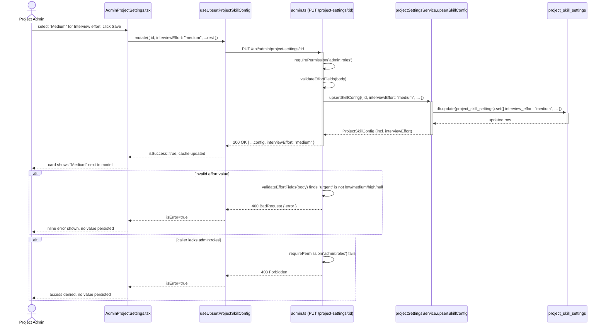
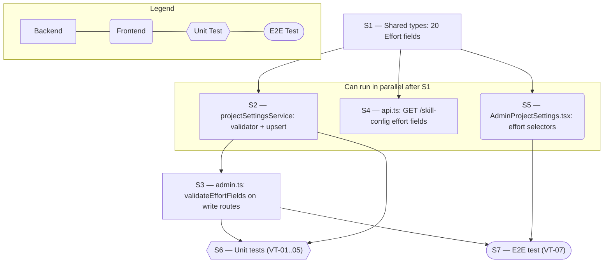

# Technical Specification — Admin Per-Module Effort Defaults

> **PRD slug:** `per-module-agent-effort-defaults` | **Owning layer:** `src/server/services/`, `src/server/routes/`, `src/client/components/`, `src/shared/types/` | **Surface:** Full stack
> **Verification builds:** `npx tsc -p tsconfig.server.json --noEmit` and `npx tsc -p tsconfig.client.json --noEmit`
> **Open items:** See [design-doc-assumptions.md](design-doc-assumptions.md) (2 unresolved)
> **Design doc:** [design-doc-design.md](design-doc-design.md)

---

## System Boundary and Owning Layer

**Owning layer:** `src/server/services/projectSettingsService.ts` (write/read logic), `src/server/routes/admin.ts` + `src/server/routes/api.ts` (HTTP surface), `src/client/components/AdminProjectSettings.tsx` (UI), `src/shared/types/projectSettings.ts` (contracts).

**Rationale:** This feature is a pure extension of the existing per-module model-override vertical slice — it adds a sibling field to every layer that field already flows through today, with **no new service, no new route, no new component, and no new database migration**. `projectSettingsService.upsertSkillConfig()` is the single write chokepoint for `project_skill_settings` (it already owns the analogous `*Model` fields plus the closed-enum `approvalMode`/`approvalModes` validation precedent this feature follows), so it owns the effort fields too. The admin router (`admin.ts`) already owns request-shape validation for this resource (see `validateApprovalModeRequest`), so it owns the new `validateEffortFields` check. `AdminProjectSettings.tsx` already owns the one authoring surface for every model override, so it owns the effort selectors.

**Ownership answers:**
- New or existing Express service in `src/server/services/`? **Existing** — `projectSettingsService.ts`. `upsertSkillConfig()`'s `UpsertSkillConfigOptions` and `values` object get 20 new optional fields, wired identically to the 19 existing `*Model` fields (`opts.xEffort ?? null`).
- New or existing route in `src/server/routes/`? **Existing** — `admin.ts` (`POST /project-settings`, `PUT /project-settings/:id`) and `api.ts` (`GET /skill-config`). No new endpoints.
- New React component in `src/client/components/`? **No** — `AdminProjectSettings.tsx`'s `PipelineStageDef`/`PipelineStageCard` mechanism and its two standalone fields (`adrModel`, `defaultModel`) are extended in place.
- New shared type in `src/shared/types/`? **Yes, but only additive fields** — `ProjectSkillConfig`, `UpsertProjectSkillConfigRequest`, and `ProjectSkillConfigResponse` in `src/shared/types/projectSettings.ts` each get 20 new optional `AgentEffort | null` fields. The `AgentEffort` union itself is delivered by the FEAT-001 prerequisite, not this feature.
- Database migration needed? **No** — FEAT-001 (TBI-001) already adds the 20 nullable `TEXT` columns to `project_skill_settings`. This feature performs zero DDL and zero Drizzle schema edits.

---

## Security Enforcement

- **Authorization mechanism:** `router.use(requirePermission('admin:roles'))` at the top of `src/server/routes/admin.ts` already gates every route in this router, including `POST /project-settings` and `PUT /project-settings/:id`. No new middleware, no new permission key — this satisfies BR-001 and TBI-004's explicit non-functional requirement ("No new RBAC permission key — reuses the existing `admin:roles` write gate").
- **Layer that enforces scope:** Both. RBAC (who may write) is enforced at the route/middleware layer (`requirePermission`); the closed-value-set constraint (what may be written) is enforced in the route handler before the service call, following the existing `validateApprovalModeRequest()` pattern in `admin.ts` — a new `validateEffortFields(body)` helper checks every `*Effort` key against the allow-list and returns a `{ error }` string on the first violation, exactly like `validateApprovalModeRequest` does for `approvalModes`/`approvalMode` today.
- **Sensitive data handling:** Not applicable. Per the PRD's Security and Data Sensitivity section, effort is "operational metadata... the same class of field as the existing model identifier" — no encryption, masking, or redaction beyond what already applies to `model`.

---

## Architecture and Approach

### Layers touched

| Layer | Changed | Notes |
|-------|---------|-------|
| Server services (`src/server/services/`) | Yes | `projectSettingsService.ts` — add `AGENT_EFFORTS`/`isAgentEffort()`, extend `UpsertSkillConfigOptions` and the `values` object in `upsertSkillConfig()` with 20 new `*Effort`/`defaultEffort` fields |
| Server routes (`src/server/routes/`) | Yes | `admin.ts` — add `validateEffortFields()`, call from `POST /project-settings` and `PUT /project-settings/:id` before `upsertSkillConfig`; `api.ts` — add the 20 effort fields to the `GET /skill-config` response object |
| Server middleware (`src/server/middleware/`) | No | Reuses the existing `requirePermission('admin:roles')` guard already applied to this router |
| Client components (`src/client/components/`) | Yes | `AdminProjectSettings.tsx` — `EffortKey` type, `PipelineStageDef.effortKey`, `EditState` fields, `emptyEdit()`, `handleSave()` payload, `PipelineStageCard` 3-column render, standalone ADR/Default Effort fields |
| Client hooks (`src/client/hooks/`) | No (pass-through only) | `useProjectSkillConfig.ts`'s upsert mutation already forwards the entire `EditState`/`UpsertProjectSkillConfigRequest` object it is given; it needs no logic change, only to pick up the widened shared type |
| Shared types (`src/shared/types/`) | Yes | `projectSettings.ts` — 20 new optional fields on `ProjectSkillConfig`, `UpsertProjectSkillConfigRequest`, `ProjectSkillConfigResponse`. `AgentEffort` union itself comes from the FEAT-001 prerequisite |
| Database (`migrations/`) | No | Columns already added by FEAT-001 / TBI-001 |
| Drizzle schema (`src/server/db/schema.ts`) | No | Columns already added by FEAT-001 / TBI-001 |

### Per-work-item design decisions

**PBI-001 — Set a default effort level per agent module in Project Settings**
- Pattern followed: identical end-to-end flow to the existing per-module Model override — admin form field → `PUT /api/admin/project-settings/:id` → `upsertSkillConfig()` → `project_skill_settings` row → `GET /api/skill-config` for readback.
- Key decisions: Effort gets its **own closed-set validator**, unlike Model (which accepts any string `Cursor.models.list()` returns via `modelsService.fetchAvailableModels()`, with no server-side allow-list at all today). This is a deliberate deviation from the Model precedent, required by BR-003 and AC (b)/(d): the PRD requires a 400 on any value outside `low`/`medium`/`high`/Inherit, and requires the write to be denied server-side regardless of what the client sends. Reusing the free-text Model path unmodified was rejected because it would satisfy neither requirement. The nearest and correct precedent is the existing `isApprovalMode()`/`validateApprovalModeRequest()` closed-enum check already on this same route.

**TBI-004 — Extend project-settings admin API and UI with per-module effort fields**
- Pattern followed: `validateApprovalModeRequest()` in `admin.ts` (closed-enum validation with an early 400 return, called from both `POST` and `PUT` handlers before the service call) is the template for the new `validateEffortFields()` helper.
- Key decisions:
  - Extend `PipelineStageDef` with an optional `effortKey?: EffortKey` field (mirroring `modelKey?: ModelKey`), so every entry in `FEATURE_PIPELINE_STAGES` and `SIDECAR_STAGES` that already declares a `modelKey` gets a paired `effortKey` for free through the existing `PipelineStageCard` render path, without duplicating stage-card JSX.
  - This codebase has **two established patterns** for surfacing a model override, and effort must mirror whichever pattern each field's Model counterpart already uses:
    1. Declarative `PipelineStageDef.modelKey` + `PipelineStageCard`, used by `interviewModel`, `prdModel`, `designDocModel`, `designDocAssistantModel`, `testCaseModel`, `designDocValidationModel`, `prdValidationModel`, `developmentModel`, `standupModel`, `featureRequestModel`, `technicalModel`, `issueModel`, `loadTestGenerationModel`, `designModuleModel`, `designModuleScopingModel`.
    2. Standalone fields rendered directly in accordion JSX outside the stage-card loop, used by `adrModel` (near `ps-adrModel`) and `defaultModel` (in the Repository & Defaults block). `designPrototypeModel`, `prdAssistantModel`, and `calendarAssistantModel` also fall outside the `ModelKey` union used by `PipelineStageDef` and must be located and mirrored the same way at implementation time.
  - Alternative rejected: introducing a brand-new generic "field pair" abstraction that unifies both patterns. Rejected because it would touch every existing stage definition and card render for a feature whose PRD explicitly asks for a minimal, additive change ("No new settings screen") — the two-pattern mirror keeps the diff proportional to the feature.

---

## Data and Contracts

### API endpoints

| Method | Route | Request shape | Response shape | Auth |
|--------|-------|--------------|----------------|------|
| POST | `/api/admin/project-settings` | `UpsertProjectSkillConfigRequest` (+ 20 new optional `*Effort`/`defaultEffort` fields) | `201` `ProjectSkillConfigResponse & { approvalModes }` | `requirePermission('admin:roles')` |
| PUT | `/api/admin/project-settings/:id` | `UpsertProjectSkillConfigRequest` (+ 20 new optional `*Effort`/`defaultEffort` fields) | `200` `ProjectSkillConfigResponse & { approvalModes }` | `requirePermission('admin:roles')` |
| GET | `/api/admin/project-settings` | — | `200` `Array<ProjectSkillConfig & { approvalModes, ...ApproverCounts }>` (already spreads all columns, effort fields included automatically once the shared type and schema carry them) | `requirePermission('admin:roles')` |
| GET | `/api/skill-config?project=\|settingsId=` | Query params only | `200` explicit field-by-field JSON (existing handler in `api.ts`) — extended with the 20 new `*Effort`/`defaultEffort` fields | Authenticated session (existing pattern for this endpoint; unchanged by this feature) |

### Schema / storage changes

| Target | Change | Reason |
|--------|--------|--------|
| `project_skill_settings` | **None in this feature.** Already extended by the FEAT-001 prerequisite with 20 nullable `TEXT` columns (19 per-module `*_effort` columns + `default_effort`). This feature only reads and writes those existing columns through `upsertSkillConfig()`. | Effort defaults must live on the same row as the model override they sit beside, per the PRD's "Project settings configuration (deep module)" decision. |

---

## Testing Strategy

**Unit tests:**
- `projectSettingsService.test.ts` — `upsertSkillConfig()` round-trips `interviewEffort` (representative per-module field) and `defaultEffort` through `low`/`medium`/`high`/`null`, extending the existing model-override round-trip test in the same file/`describe` block rather than a new file, per the PRD's testing decision ("extend those same tests in parallel rather than create a new, separate test file per module").
- `admin.ts` route tests (or equivalent supertest suite) — `PUT /project-settings/:id` and `POST /project-settings`: accept `low`/`medium`/`high`/`null` for `interviewEffort` and `defaultEffort`; reject any other string (e.g. `"urgent"`) with `400` and assert the DB row is unchanged afterward.
- `isAgentEffort()` — unit-test the guard directly against valid values, invalid strings, `null`, and `undefined`.

**Integration tests:**
- Full request → DB → response round trip for one representative module (`interviewEffort`) plus `defaultEffort`: `PUT /project-settings/:id` with a new effort value, then `GET /api/skill-config?project=X` confirms the persisted value is echoed back.
- `requirePermission('admin:roles')` short-circuit: a session without `admin:roles` calling `PUT /project-settings/:id` with any `*Effort` field gets `403` before `validateEffortFields` or `upsertSkillConfig` ever runs, and the row is unchanged.

**E2E tests (if applicable):**
- Playwright — extend the existing Admin Project Settings spec (do not create a new spec file): select "Medium" in the Interview module's new Effort override, save, reload the page, and assert the dropdown still shows "Medium." Add one negative-path assertion that selecting an out-of-range value is impossible through the UI (the `<select>` only offers the four valid options), confirming the UI cannot itself produce an invalid request.

---

## Observability

- **Custom events/metrics:** None beyond standard request telemetry. The existing admin settings save/read path emits no custom metrics for `model`, so `effort` follows that same precedent. Telemetry for the effort value actually resolved and applied at kickoff is FEAT-003 scope, not this feature.
- **Alerts:** None.

---

## Rollback and Deployment

- **Schema changes backward compatible:** Yes. This feature performs no DDL; it only reads/writes the nullable columns FEAT-001 already added, which are backward-compatible by construction (nullable, no backfill, no NOT NULL constraint).
- **Rollback procedure:** Revert the `admin.ts` / `api.ts` / `projectSettingsService.ts` / `AdminProjectSettings.tsx` changes. Any effort values already persisted by admins during the window this feature was live remain harmlessly stored (nullable columns, unread by any pre-FEAT-003 code path) until FEAT-003 ships and starts resolving them.
- **Deployment dependencies:** FEAT-001 must be deployed first so the columns and shared `AgentEffort` type exist. No manual provisioning beyond the standard migration deploy step already required for FEAT-001.
- **Feature flag gates deployment:** No. Per the PRD, no flag is needed — the `admin:roles` write gate plus null/Inherit-by-default columns make this safe to ship ungated; existing behavior is unchanged until a Project Admin opts in.

---

## Verification Test Matrix

| ID | Layer | Arrange | Act | Assert | Linked |
|----|-------|---------|-----|--------|--------|
| VT-01 | Jest (unit/service) | Seed a `project_skill_settings` row with `interviewEffort: null` | Call `upsertSkillConfig({ id, interviewEffort: 'medium', ... })` | Returned row and re-fetched row both have `interviewEffort: 'medium'` | PBI-001 (a) |
| VT-02 | Jest (unit/route) | Authenticated admin session, existing config row | `PUT /api/admin/project-settings/:id` with `interviewEffort: 'urgent'` | `400` response with an error message; DB row's `interviewEffort` unchanged | PBI-001 (b) |
| VT-03 | Jest (unit/service + route) | Row with `interviewEffort: 'high'` | `PUT /api/admin/project-settings/:id` with `interviewEffort: null` | Row updates to `null`; subsequent `GET /api/skill-config?project=X` returns `interviewEffort: null` | PBI-001 (c) |
| VT-04 | Jest (integration) | Authenticated session **without** `admin:roles` | `PUT /api/admin/project-settings/:id` with any `*Effort` field set | `403` response (via `requirePermission`, short-circuiting before `validateEffortFields` runs); row unchanged | PBI-001 (d) |
| VT-05 | Jest (unit/service) | `UpsertSkillConfigOptions` with all 20 `*Effort` keys set to a mix of `'low'`/`'medium'`/`'high'`/`null` | `upsertSkillConfig(opts)` | Returned row and DB row match every one of the 20 fields exactly | TBI-004 |
| VT-06 | RTL/Jest (component) | `AdminProjectSettings` rendered with a loaded config | User selects "High" in Interview's Effort override `<select>` and clicks Save | Mutation payload includes `interviewEffort: 'high'`; card re-renders showing "High" | PBI-001 (a) |
| VT-07 | Playwright (E2E) | Logged in as Project Admin on `/admin/project-settings` | Select "Medium" effort for Interview, Save, reload page | Effort dropdown for Interview still shows "Medium" after reload | PBI-001 (a) |

---

## Implementation Plan

- [ ] S1 — Extend `src/shared/types/projectSettings.ts`: add the 20 optional `*Effort`/`defaultEffort` fields (typed `AgentEffort | null`) to `ProjectSkillConfig`, `UpsertProjectSkillConfigRequest`, and `ProjectSkillConfigResponse` _(no blockers — assumes the FEAT-001 `AgentEffort` union and columns already exist)_
  - Covers: `VT-05`
- [ ] S2 — Extend `src/server/services/projectSettingsService.ts`: add `AGENT_EFFORTS`/`isAgentEffort()`, extend `UpsertSkillConfigOptions` and the `values` object inside `upsertSkillConfig()` with the 20 fields, following the exact `opts.xEffort ?? null` wiring already used for `*Model` fields _(blocked by S1)_
  - Covers: `VT-05`
- [ ] S3 — Extend `src/server/routes/admin.ts`: add `validateEffortFields()`, call it from `POST /project-settings` and `PUT /project-settings/:id` before `upsertSkillConfig`, returning `400` on the first invalid field found _(blocked by S2)_
  - Covers: `VT-01`, `VT-02`, `VT-03`, `VT-04`
- [ ] S4 — Extend `src/server/routes/api.ts`: add the 20 `*Effort`/`defaultEffort` fields to the `GET /skill-config` response object, alongside the corresponding `*Model` fields already listed there _(blocked by S1; runs in parallel with S3)_
  - Covers: `VT-03`
- [ ] S5 — Extend `src/client/components/AdminProjectSettings.tsx`: add `EffortKey` type, `PipelineStageDef.effortKey` on every stage that has a `modelKey`, `EditState` fields, `emptyEdit()`, `handleSave()` payload, the 3-column `PipelineStageCard` render, and the two standalone ADR/Default Effort fields _(blocked by S1; can start once S1 lands)_
  - Covers: `VT-06`, `VT-07`
- [ ] S6 — Unit tests: `projectSettingsService` round-trip + `admin.ts` accept/reject/permission-denied cases _(blocked by S2, S3)_
  - Covers: `VT-01`, `VT-02`, `VT-03`, `VT-04`, `VT-05`
- [ ] S7 — E2E: extend the existing Playwright Admin Project Settings spec with the Effort-selector save/reload case _(blocked by S3, S5)_
  - Covers: `VT-07`

**Execution lanes:**
- Lane 1 (start immediately): S1
- Lane 2 (after S1): S2, S4, S5 — all three can run in parallel once the shared types exist
- Lane 3 (after S2): S3
- Lane 4 (after S3, S5): S6, S7

---

## Diagram 1 — Code Execution Flow

---

## Diagram 2 — Implementation Dependency Map

