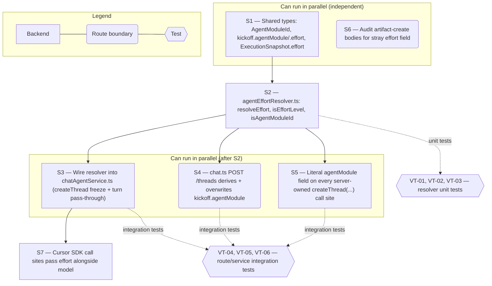

# Technical Specification — Server-Authoritative Effort Resolution at Kickoff

> **PRD slug:** `per-module-agent-effort-defaults` | **Owning layer:** `src/server/services/` | **Surface:** Backend only
> **Verification builds:** `npx tsc -p tsconfig.server.json --noEmit` and `npx tsc -p tsconfig.client.json --noEmit` (shared types touch `src/shared/types/`)
> **Open items:** See [design-doc-assumptions.md](design-doc-assumptions.md) (5 unresolved)
> **Design doc:** [design-doc-design.md](design-doc-design.md)

---

## System Boundary and Owning Layer

**Owning layer:** `src/server/services/`

**Rationale:** The Cursor SDK is invoked from exactly two call sites — `acquireInteractiveCursorAgent` in `src/server/services/interactiveActorHost/interactiveCursorExecution.ts` (`agentOptions = { apiKey, model: { id: snapshot.model }, local, mcpServers: {} }`) and the equivalent background-lane path in `src/server/services/aiRunsWorker/cursorExecution.ts` (`model: { id: snapshot.model }`). Both read from the immutable `ExecutionSnapshot` (`src/shared/types/agentRunLifecycle.ts`) built by `src/server/services/chatAgentService.ts`. Effort must reach the SDK through the exact same pipe as model, so the new resolution logic belongs beside `chatAgentService.ts`, not in a route or a React component. No route middleware and no client code can enforce "ignore any client-supplied effort" — only the service layer that builds `ExecutionSnapshot` can.

**Ownership answers:**
- New or existing Express service in `src/server/services/`? **New** — `src/server/services/agentEffortResolver.ts`, a small, focused module exporting `resolveEffort(...)` and the `isEffortLevel`/`isAgentModuleId` guards. Kept separate from the 6,500-line `chatAgentService.ts` rather than growing it further, mirroring the existing pattern of narrow sibling services (`agentRunAbort.ts`, `agentRunLifecycleService.ts`) next to that file. `chatAgentService.ts` itself is **existing** and modified: `createThread`, `sendMessage`, `tryDispatchInteractiveTurn`, and `prepareBackgroundWorkflowTurn` each gain an `effort` alongside their existing `model: resolveModelId(...)` line.
- New or existing route in `src/server/routes/`? **Existing** — `src/server/routes/chat.ts`'s `POST /threads` handler is extended to derive and overwrite `kickoff.agentModule` before calling `createThread` (see § Architecture and Approach). `src/server/routes/adr.ts` and `src/server/routes/interviews.ts` are **not** changed at the route level for effort resolution itself — their `createThread(...)` call sites (ADR finalize, ADR assistant, PRD assistant, Design Doc, Design Doc assistant) already build the kickoff object entirely server-side and simply gain one new literal field (`agentModule: 'adr'`, etc.).
- New React component in `src/client/components/`? **No.** PBI-002 has no UI (see design doc § UI/UX). No client file changes.
- New shared type in `src/shared/types/`? **Yes** — `AgentModuleId` (closed union) and two new optional fields on `ChatThreadKickoff` (`agentModule`, `effort`) in `src/shared/types/chat.ts`; a new optional `effort` field on `ExecutionSnapshot` in `src/shared/types/agentRunLifecycle.ts`.
- Database migration needed? **No.** The `project_skill_settings.*Effort` / `defaultEffort` columns are delivered by FEAT-001 (TBI-001), a declared dependency (`dependsOn: ["FEAT-001"]`). This feature only reads them.

---

## Security Enforcement

- **Authorization mechanism:** Unchanged. Starting a module still requires that module's existing create/run permission (`adr:create`, `chat:create`, `interviews:view`-gated creation flow, etc.) — no new permission key, per the PRD's explicit Out-of-Scope line and confirmed against the permission catalog in `.cursor/rules/rbac-governance.mdc`. Effort resolution is a data-plane concern layered underneath an already-authorized request, not a new access gate.
- **Layer that enforces "ignore client-supplied effort":** Service layer only, and specifically at the narrowest possible point — `agentEffortResolver.resolveEffort()` never accepts an `effort` argument sourced from request bodies; its only inputs are the resolved `ProjectSkillConfig` (read from Postgres) and the server-computed `agentModule` (never the client's `kickoff.agentModule`, which `chat.ts` overwrites unconditionally before use — see § Architecture and Approach, Step 1). `SendMessageRequest` (`src/shared/types/chat.ts`) is not extended with an `effort` field at all, so a per-turn override is structurally impossible, not just discarded. Artifact-create bodies (`POST /api/adr`, `POST /api/interviews`, and the PRD/Design-Doc equivalents) are audited to confirm none of them destructure or forward an `effort` key from `req.body` even if one is present — this is a one-line check per route handler, not a schema change, since these bodies are typed narrowly today (e.g., `adr.ts`'s `router.post('/')` already destructures a closed `{ project, repo, title, chatThreadId, model, skillSettingsId, reviewerIds }` shape with no `effort`).
- **Sensitive data handling:** Not applicable. Per the PRD's Security and Data Sensitivity section, effort is non-sensitive operational metadata — the same class as the existing `model` identifier. No masking, encryption, or redaction; the concern here is data integrity (which value actually ran), not confidentiality.

---

## Architecture and Approach

### Layers touched

| Layer | Changed | Notes |
|-------|---------|-------|
| Server services (`src/server/services/`) | Yes | New `agentEffortResolver.ts`; `chatAgentService.ts` gains effort resolution at `createThread` and effort pass-through at every `ExecutionSnapshot` build site |
| Server routes (`src/server/routes/`) | Yes | `chat.ts`'s `POST /threads` derives and overwrites `kickoff.agentModule`; `adr.ts` / `interviews.ts` add one literal `agentModule` field per existing `createThread(...)` call; audit artifact-create bodies for a stray `effort` field |
| Server middleware (`src/server/middleware/`) | No | No new RBAC guard; existing `requirePermission(...)` calls are untouched |
| Client components (`src/client/components/`) | No | No UI; no kickoff-building client code is changed to populate `agentModule`/`effort` |
| Client hooks (`src/client/hooks/`) | No | `useStartChat` / `useChatThreads` payload shapes are unchanged |
| Shared types (`src/shared/types/`) | Yes | `chat.ts`: `AgentModuleId` union, `ChatThreadKickoff.agentModule` / `.effort` (both documented server-set-only); `agentRunLifecycle.ts`: `ExecutionSnapshot.effort` |
| Database (`migrations/`) | No | Owned by FEAT-001 (dependency), already landed by the time this feature ships |
| Drizzle schema (`src/server/db/schema.ts`) | No | Reads only; FEAT-001 owns the `projectSkillSettings` column additions this feature depends on |

### Per-work-item design decisions

**PBI-002 — Automatically run each agent module at its configured effort level**
- Pattern followed: mirrors the existing `resolveModelId(model?: string): string` fallback pattern in `chatAgentService.ts` (line ~3075), but — unlike `resolveModelId`, which is a trivial trim/default with no project-settings lookup — effort resolution is genuinely centralized, because model resolution today is duplicated ad hoc at ten-plus call sites (`adr.ts`: `skillConfig?.adrModel ?? adr.model ?? await getDefaultModel()`; `interviews.ts`: `skillConfig?.designDocModel ?? globalModel`, etc.) and the PRD explicitly wants effort to close the gap that duplication left open (a client-computed `model` value is trusted as-is on the initial kickoff; a client-computed `effort` value must never be).
- Key decisions: effort is resolved exactly once, inside `createThread`, and frozen onto `state.thread.kickoff.effort` for the life of the thread (BR-004); every later turn (`sendMessage`, `tryDispatchInteractiveTurn`, `prepareBackgroundWorkflowTurn`) reads that frozen value and never re-resolves or accepts an override, in deliberate contrast to `model`, which does support a per-turn `modelOverride`. Alternative rejected: re-resolving effort on every turn (matching the `model` pattern) — rejected because BR-004 requires the value to survive an admin changing the default mid-conversation, which per-turn re-resolution would violate.

**TBI-005 — Introduce server-set agentModule identity and effort resolution in the kickoff/config-resolution service**
- Pattern followed: `assistantType: 'adr' | 'prd' | 'design-doc' | 'calendar-work-item'` already on `ChatThreadKickoff` is a precedent for a closed-union field that calling services set as a literal when they build a kickoff server-side (e.g., `adr.ts`'s ADR-assistant-thread handler passes `assistantType: 'adr'` directly in the object literal, with zero client input). `agentModule` extends that same precedent to every module, including ones with no `assistantType` today (Interview, Design Prototype, Standup, Feature Request, Development).
- Key decisions:
  1. **Server-owned kickoff builders** (ADR finalize/assistant in `adr.ts`; PRD/PRD-assistant, Design Doc/Design-Doc-assistant in `interviews.ts`; Feature Request analysis, walkthrough generation/discovery/smart-tagging, load-test generation, design-module scoping, standup, development) each add one literal `agentModule: '<module>'` field to the object they already pass to `createThread(...)`. Zero client influence — these kickoffs never touch a request body the browser controls.
  2. **The one client-facing generic route**, `chat.ts`'s `POST /threads`, is used by Interview, ADR-interview, and every Agent Home thread. It cannot use a request-body field as the module identifier (the browser controls the whole `kickoff` object), so it derives `agentModule` from a small, closed, deterministic mapping and **overwrites** whatever the client sent:
     - `kickoff.mode === 'development'` → `'development'`
     - `kickoff.assistantType === 'design-doc'` → `'designDocAssistant'`; `'prd'` → `'prdAssistant'`; `'adr'` → `'adr'` (see ⚠ open item on the missing `adrAssistantEffort` column); `'calendar-work-item'` → `'calendarAssistant'`
     - Otherwise, resolve `skillConfig` via `resolveSkillConfig({ project: kickoff.project, settingsId: kickoff.skillSettingsId })` and compare `kickoff.skillPath` against `skillConfig.interviewSkillPath` (or the matching `InterviewSkillOption.path`) → `'interview'`; against `skillConfig.adrInterviewSkillPath` → `'adr'`
     - No match (Agent Home free chat, skill pill, or MCP pill) → leave `agentModule` unset
     This is not a new trust boundary: `skillPath` already determines which skill file the agent actually loads (`injectKickoffFiles`), so matching on it is exactly as reliable as the behavior it already drives — a client cannot get "Interview's effort" while actually running the ADR skill, because setting `skillPath` to the ADR skill makes it genuinely an ADR run.
  3. **Alternative rejected:** trusting a client-supplied `kickoff.agentModule` directly. Rejected outright — this is the literal vulnerability BR-002/PBI-002(d) describes.
  4. **Alternative rejected:** splitting `POST /api/chat/threads` into per-surface endpoints (`POST /api/interviews/threads`, `POST /api/adr/threads`) to hardcode `agentModule` the same way the server-owned builders do. Not rejected outright — flagged as the fallback design if the skillPath-matching heuristic above is not acceptable (see ⚠ open item); deferred here because it is a larger diff across two client components and one router for a threat model the PRD itself rates as low-severity (effort is non-sensitive operational metadata, not an access grant).

---

## Data and Contracts

### API endpoints

No new endpoints. Existing endpoints gain server-internal behavior only — none of their request/response JSON shapes change.

| Method | Route | Request shape | Response shape | Auth |
|--------|-------|--------------|----------------|------|
| POST | `/api/chat/threads` | `StartChatRequest` (unchanged shape; `kickoff.agentModule`/`kickoff.effort`, if present in the raw body, are ignored and overwritten server-side) | `StartChatResponse` (unchanged) | `requirePermission('chat:view')` (unchanged; module-specific creation still gated by e.g. `adr:create` upstream of this call) |
| POST | `/api/chat/threads/:id/messages` | `SendMessageRequest` (unchanged; no `effort` field exists on this type) | `202 { ok: true }` (unchanged) | `requireThreadWrite` (unchanged) |
| POST | `/api/adr` | `{ project, repo, title, chatThreadId, model, skillSettingsId, reviewerIds }` (unchanged; audited to confirm no `effort` passthrough) | `{ adrId, threadId }` (unchanged) | `requirePermission('adr:create')` (unchanged) |
| POST | `/api/interviews` | Existing interview-create shape (unchanged; audited to confirm no `effort` passthrough) | Existing (unchanged) | Existing interview-create permission (unchanged) |

### Schema / storage changes

| Target | Change | Reason |
|--------|--------|--------|
| `project_skill_settings` | None in this feature — reads the `*Effort` / `defaultEffort` columns delivered by FEAT-001/TBI-001 | This feature is resolution-only; column ownership is FEAT-001 |

---

## Testing Strategy

**Unit tests:**
- `agentEffortResolver.test.ts` (new) — pure-function coverage of `resolveEffort()`'s branching: pill/option effort wins over module override; module override wins over `defaultEffort`; `defaultEffort` wins over omit; an unrecognized stored string (e.g., `'ultra'`) or `null` resolves to `undefined` without throwing (BR-005); a valid module override of `'low'`/`'medium'`/`'high'` passes through unchanged. Mirrors the existing table-driven style in `src/server/__tests__/projectSettingsService.test.ts`.
- `chatAgentService.test.ts` (existing file, extended) — `createThread()` freezes `resolvedKickoff.effort` once and `sendMessage()` never re-resolves it even when a fresh call supplies a `modelOverride`; a raw `kickoff` object containing a client-set `agentModule`/`effort` is confirmed overwritten/ignored before `createThread` uses it.

**Integration tests:**
- `chatRoutes.test.ts` (existing file, extended) — `POST /api/chat/threads` with an Interview-shaped kickoff resolves `agentModule: 'interview'` and applies the Interview module's configured effort to the resulting `ExecutionSnapshot`; the same request with a raw `{ kickoff: { ..., effort: 'high' } }` body against a module configured for `'low'` results in `'low'` reaching the snapshot (PBI-002 AC-d), following the existing pattern in this file of asserting on the thread/agent state after a route call rather than mocking the Cursor SDK.
- `adrReviewRoutes.test.ts` (existing file, extended) — the ADR-finalize and ADR-assistant `createThread(...)` calls in `adr.ts` carry `agentModule: 'adr'` and resolve the ADR module's effort, proving the pattern generalizes beyond the generic chat route to a second, independently-built kickoff (TBI-005 DoD's "at least two representative modules").

**E2E tests:** Not applicable — this feature has no UI surface to drive end-to-end; behavior is verified at the integration layer against `ExecutionSnapshot`, since a true end-to-end assertion would require inspecting the live Cursor SDK call, which the existing test suite already avoids for `model` resolution.

---

## Observability

- **Custom events/metrics:** None beyond standard telemetry. Optionally, extend the existing `trackEvent('chat.send.start', { threadId, ... })` / `chat.messages.accepted` calls in `chat.ts` with a `resolvedEffort` tag for debugging parity with the existing `attachmentCount` tag pattern — useful but not required for this feature to ship correctly, since FEAT-004 (out of scope here) is the feature responsible for durable effort visibility.
- **Alerts:** None.

---

## Rollback and Deployment

- **Schema changes backward compatible:** Not applicable to this feature directly (no schema change here); the columns this feature reads (FEAT-001) are nullable with no backfill, so a database that has FEAT-001's migration applied but this feature's code not yet deployed simply has unused columns — no risk in either deployment order once FEAT-001 has landed, which the backlog already enforces via `dependsOn: ["FEAT-001"]`.
- **Rollback procedure:** Revert the `chatAgentService.ts` / `agentEffortResolver.ts` / route changes; every code path that reads `state.thread.kickoff.effort` treats a missing field as `undefined`, so an in-flight thread created post-deploy and rolled back mid-conversation degrades gracefully to "no effort argument passed" rather than erroring.
- **Deployment dependencies:** None beyond the existing requirement that FEAT-001's migration has already run.
- **Feature flag gates deployment:** No — the PRD specifies no flag; null/omitted effort is indistinguishable from today's behavior, so this ships GA per the PRD's Feature Flag section.

---

## Verification Test Matrix

| ID | Layer | Arrange | Act | Assert | Linked |
|----|-------|---------|-----|--------|--------|
| VT-01 | Jest (unit) | `ProjectSkillConfig` with `interviewEffort: 'high'`, `defaultEffort: 'low'`, no pill effort | Call `resolveEffort({ agentModule: 'interview' }, skillConfig)` | Returns `'high'` (module override wins over project default) | PBI-002 (a) |
| VT-02 | Jest (unit) | `ProjectSkillConfig` with `interviewEffort: 'not-a-real-value'` (simulated corrupted row) | Call `resolveEffort({ agentModule: 'interview' }, skillConfig)` | Returns `undefined`; function does not throw | PBI-002 (b) |
| VT-03 | Jest (unit) | `ProjectSkillConfig` with `interviewEffort: null`, `defaultEffort: null` | Call `resolveEffort({ agentModule: 'interview' }, skillConfig)` | Returns `undefined` (omit — SDK default applies) | PBI-002 (c) |
| VT-04 | Jest (integration, `chatRoutes.test.ts`) | Interview module configured with effort `'low'` in `project_skill_settings`; POST body's `kickoff` includes a raw `effort: 'high'` key alongside a valid Interview `skillPath` | `POST /api/chat/threads` | Resulting `ExecutionSnapshot.effort` is `'low'`, not `'high'` — client value ignored | PBI-002 (d) |
| VT-05 | Jest (integration, `chatAgentService.test.ts`) | Thread created with Interview module resolving to effort `'medium'`; admin default changed to `'high'` mid-thread | `sendMessage()` called for a second turn on the same thread | `ExecutionSnapshot.effort` for the second turn is still `'medium'` | BR-004 |
| VT-06 | Jest (integration, `adrReviewRoutes.test.ts`) | ADR module configured with effort `'high'`; ADR-finalize `createThread(...)` call in `adr.ts` | `POST /api/adr/:id/generate` | Resulting `ExecutionSnapshot.effort` is `'high'`, proving the pattern generalizes to a second, server-owned kickoff builder | TBI-005 DoD |

---

## Implementation Plan

- [ ] S1 — Add `AgentModuleId` union and `ChatThreadKickoff.agentModule` / `.effort` fields to `src/shared/types/chat.ts`; add `ExecutionSnapshot.effort` to `src/shared/types/agentRunLifecycle.ts` _(no blockers; requires FEAT-001's `EffortLevel` type to exist)_
  - Covers: type-checks only, no VT yet
- [ ] S2 — Create `src/server/services/agentEffortResolver.ts` with `resolveEffort()`, `isEffortLevel()`, `isAgentModuleId()` _(blocked by S1)_
  - Covers: `VT-01`, `VT-02`, `VT-03`
- [ ] S3 — Wire `agentEffortResolver` into `chatAgentService.ts`: resolve-and-freeze at `createThread`; read-only pass-through at `sendMessage` / `tryDispatchInteractiveTurn` / `prepareBackgroundWorkflowTurn` `ExecutionSnapshot` builds _(blocked by S2)_
  - Covers: `VT-05`
- [ ] S4 — Extend `chat.ts`'s `POST /threads` to derive and overwrite `kickoff.agentModule` (mode → assistantType → skillPath-match → unset) _(blocked by S2; can parallel with S3)_
  - Covers: `VT-04`
- [ ] S5 — Add the literal `agentModule` field to every server-owned `createThread(...)` call site (`adr.ts` ×2, `interviews.ts` ×4, `featureRequestAnalysisService.ts`, `walkthroughGenerationService.ts`, `walkthroughAnchorDiscoveryService.ts`, `walkthroughAnchorSmartTaggingService.ts`, `loadTestAiGenerationService.ts`, `designModuleScopingService.ts`, `standupService.ts`, `devSessionSetupService.ts`) _(blocked by S2; can parallel with S3, S4)_
  - Covers: `VT-06`
- [ ] S6 — Audit artifact-create route bodies (`POST /api/adr`, `POST /api/interviews`, and equivalents) to confirm no `effort` field is destructured or forwarded from `req.body` _(no blockers; can start immediately, independent of S1–S5)_
  - Covers: PBI-002 (d) (defense-in-depth)
- [ ] S7 — Cursor SDK call sites (`interactiveCursorExecution.ts`, `aiRunsWorker/cursorExecution.ts`) pass `effort: snapshot.effort` alongside `model: { id: snapshot.model }`, pending SDK parameter confirmation (⚠ open item) _(blocked by S3)_
  - Covers: end-to-end effort delivery (verified indirectly via VT-04–VT-06 against `ExecutionSnapshot`, since the SDK boundary itself is not mocked in existing tests)

**Execution lanes:**
- Lane 1 (start immediately): S1, S6
- Lane 2 (after S1): S2
- Lane 3 (after S2): S3, S4, S5 (parallel)
- Lane 4 (after S3): S7

---

## Diagram 1 — Code Execution Flow

```mermaid
sequenceDiagram
  actor BA
  participant InterviewChatView
  participant chatRoute as chat.ts (POST /threads)
  participant chatAgentService
  participant agentEffortResolver
  participant projectSettingsService
  participant CursorSDK as Cursor SDK (Agent.create)

  BA->>InterviewChatView: click "Start New Interview"
  InterviewChatView->>chatRoute: POST /api/chat/threads { kickoff }
  chatRoute->>projectSettingsService: resolveSkillConfig({ project, settingsId })
  projectSettingsService-->>chatRoute: ProjectSkillConfig
  chatRoute->>chatRoute: derive kickoff.agentModule (mode -> assistantType -> skillPath match); overwrite any client-supplied value
  chatRoute->>chatAgentService: createThread(userId, kickoff)
  chatAgentService->>agentEffortResolver: resolveEffort(kickoff.agentModule, skillConfig)
  agentEffortResolver-->>chatAgentService: resolvedEffort ('high' | 'medium' | 'low' | undefined)
  chatAgentService->>chatAgentService: freeze resolvedKickoff.effort = resolvedEffort
  chatAgentService->>CursorSDK: Agent.create({ model: { id }, effort: resolvedEffort })
  CursorSDK-->>chatAgentService: agent handle
  chatAgentService-->>chatRoute: ChatThread
  chatRoute-->>InterviewChatView: 201 { threadId }

  alt corrupted or unrecognized stored effort value
    agentEffortResolver->>agentEffortResolver: isEffortLevel(stored) fails
    agentEffortResolver-->>chatAgentService: undefined (treated as unset)
    chatAgentService->>CursorSDK: Agent.create({ model: { id } })  %% no effort argument
  end
```

---

## Diagram 2 — Implementation Dependency Map


