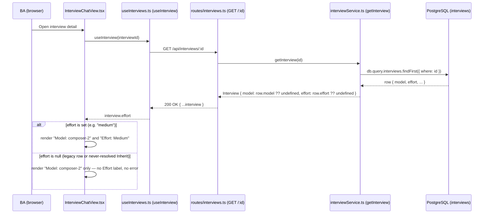
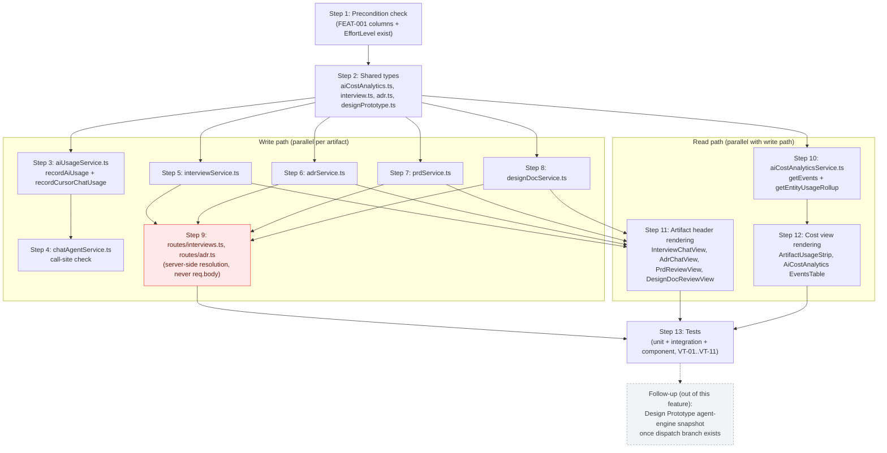

# Effort Snapshot on Audit & Cost History — Technical Specification

## 1. Header

| Field | Value |
|---|---|
| Feature title | Effort Snapshot on Audit & Cost History |
| PRD slug | `per-module-agent-effort-defaults` |
| Work items | PBI-003, TBI-006 |
| Owning layer | Full-stack — `src/server/services/*`, `src/server/routes/*`, `src/client/components/*`, `src/shared/types/*` |
| Surface | Full-stack (server snapshot write + client render) |
| Depends on | FEAT-001 (schema + `EffortLevel` type), FEAT-002 (admin settings that populate non-null values), FEAT-003 (kickoff/config-resolution service that stamps `ChatThreadKickoff.effort`) |

**Verification commands**

```bash
npm test -- aiUsageService.test.ts adrService.test.ts entityUsageRollup.test.ts
npm test -- InterviewChatView.ExistingInterview.test.tsx AdrChatView.NewAdrCompose.test.tsx ArtifactUsageStrip.test.tsx
npm run typecheck
npm run lint
```

---

## 2. System Boundary and Owning Layer

- **Express service:** No new service. Existing services extended: `src/server/services/aiUsageService.ts` (usage/cost recording — deep module, per PRD's own description), `src/server/services/interviewService.ts`, `src/server/services/adrService.ts`, `src/server/services/prdService.ts`, `src/server/services/designDocService.ts` (artifact create/read paths), `src/server/services/aiCostAnalyticsService.ts` (cost read paths: `getEvents()`, `getEntityUsageRollup()`).
- **Express route:** No new route. Existing routes extended: `src/server/routes/interviews.ts` (`POST /`, PRD/design-doc creation, `GET` list/detail), `src/server/routes/adr.ts` (`POST /`, `GET` list/detail). `src/server/routes/aiCost.ts` requires no route-level change — its single `router.use(requirePermission('analytics:ai-cost:view'))` gate (line 13) already covers the new field.
- **React component:** No new component. Existing components extended: `InterviewChatView.tsx`, `AdrChatView.tsx`, `PrdReviewView.tsx`, `DesignDocReviewView.tsx` (artifact headers), `ArtifactUsageStrip.tsx` (per-run breakdown), `AiCostAnalytics.tsx` (Interaction Log table).
- **Shared type:** Yes — `src/shared/types/aiCostAnalytics.ts` (`RecordUsageInput.effort`, `AiCostEvent.effort`, `EntityUsageRun.effort`), `src/shared/types/interview.ts` (`InterviewSummary`/`Interview`, `PrdSummary` gain `effort?: EffortLevel`), `src/shared/types/adr.ts` (`Adr`/`AdrSummary` gain `effort?: EffortLevel`), `src/shared/types/designPrototype.ts` (`DesignPrototypeSummary` gains `effort?: EffortLevel`, read-only per UNRESOLVED-1). `EffortLevel` itself is not defined here — it is imported from wherever FEAT-001 places it (assumed `src/shared/types/projectSettings.ts`, see `design-doc-assumptions.md`).
- **Database migration:** None. `effort TEXT NULL` already exists on `interviews`, `adrs`, `prds`, `design_docs`, `design_prototypes`, and `ai_usage_events` per FEAT-001 (TBI-002, TBI-003). This feature reads/writes those columns; it does not alter the schema.

---

## 3. Security Enforcement

- **Authorization mechanism (read):** Artifact effort is visible to whoever can already open that Interview/PRD/ADR/Design Doc — no new check, it rides the existing `requirePermission('interviews:manage'|'interviews:view'|'adr:view'|...)` guards already on those routes. Cost-history effort is visible only to `analytics:ai-cost:view` holders, enforced by the existing `router.use(requirePermission('analytics:ai-cost:view'))` in `src/server/routes/aiCost.ts:13` — this single middleware already wraps every `/api/ai-cost/*` handler, so adding an `effort` field to those response payloads inherits the gate automatically. No new RBAC permission key is introduced (epic out-of-scope: "writes stay on `admin:roles`; runtime apply and audit/cost reads stay on each module's existing permissions").
- **Authorization mechanism (write — the one that matters here):** BR-002 requires the server to be the sole authority on effort and to ignore any client-supplied value on kickoff, later turns, *and artifact-create request bodies*. This feature's artifact-create paths must honor that boundary even though the pre-existing `model` snapshot does not (see `design-doc-assumptions.md` UNRESOLVED-2):
  - `POST /api/interviews` (`src/server/routes/interviews.ts:187-244`) must **not** destructure `effort` from `req.body`. Instead, `createInterview()` (or the route, before calling it) resolves effort by loading the already-started chat thread's persisted kickoff — `getThread(opts.chatThreadId)` (`chatAgentService.ts:3027`) → `.kickoff.effort` — because FEAT-003 already stamped that field durably via `pgUpsertThread()` (`chatAgentService.ts:4624`) before this route ever runs.
  - `POST /api/adrs` (`src/server/routes/adr.ts:106`) follows the identical pattern: resolve from `getThread(chatThreadId).kickoff.effort`, never `req.body.effort`.
  - PRD and Design Doc creation resolve `model` **server-side before the thread exists** (`const model = skillConfig?.designDocModel ?? globalModel;` at `interviews.ts:605`, then `createThread(userId, { ..., model }, ...)` at `interviews.ts:739-753`, then `createDesignDoc({ ..., model })` at `interviews.ts:757`). Effort follows the same shape: resolve `effort` alongside `model` at that same call site (using whatever resolution primitive FEAT-003 exposes for "module override → project default → omit"), pass it into both the `createThread()` kickoff object and `createDesignDoc({ ..., effort })`.
  - This is a deliberate, stricter posture than the `model` precedent sitting right next to it in the same files. It is called out so a future refactor doesn't "simplify" effort to match `model`'s client-trust and reopen the exact spoofing surface BR-002 exists to close.
- **Data scope enforcement:** Unchanged — effort rides the same project-scoped rows (`interviews`, `adrs`, `prds`, `design_docs`, `ai_usage_events`) that already enforce project scoping today. No new enforcement surface (matches the PRD's own "Security and Data Sensitivity" section: effort is operational metadata, same sensitivity class as `model`).

---

## 4. Architecture and Approach

### Layers touched

| Layer | Files | Nature of change |
|---|---|---|
| Shared types | `src/shared/types/aiCostAnalytics.ts`, `interview.ts`, `adr.ts`, `designPrototype.ts` | Add `effort?: EffortLevel` fields, mirroring existing `model` fields |
| Usage/cost recording (deep module) | `src/server/services/aiUsageService.ts` | `recordAiUsage()` writes `effort` to `ai_usage_events`; `recordCursorChatUsage()` forwards `kickoff.effort` |
| Kickoff execution | `src/server/services/chatAgentService.ts` | Every existing `recordCursorChatUsage({ kickoff: ..., modelId: resolvedModel, ... })` call site passes `kickoff.effort` (already present on `state.thread.kickoff` per FEAT-003) through unchanged — the `kickoff` object is already spread as-is, so most call sites need **no** line-level edit beyond confirming the field flows through |
| Artifact services | `interviewService.ts`, `adrService.ts`, `prdService.ts`, `designDocService.ts` | Create functions accept/store `effort`; summary mappers return `row.effort ?? undefined` |
| Artifact routes | `routes/interviews.ts`, `routes/adr.ts` | Resolve `effort` server-side (never `req.body`); pass to service create calls |
| Cost analytics read (deep module) | `src/server/services/aiCostAnalyticsService.ts` | `getEvents()` maps `e.effort`; `getEntityUsageRollup()` maps `row.effort` onto each `EntityUsageRun` |
| Artifact headers (client) | `InterviewChatView.tsx`, `AdrChatView.tsx`, `PrdReviewView.tsx`, `DesignDocReviewView.tsx` | Render `Effort: {label}` next to existing `Model: {model}` when present |
| Cost views (client) | `ArtifactUsageStrip.tsx`, `AiCostAnalytics.tsx` | Render effort next to model in the per-run breakdown and the Interaction Log table |

### Per-work-item design decisions

**TBI-006 — Persist resolved effort snapshot on artifact create paths and usage events; render next to model in existing views**

- *Interview:* `createInterview(opts)` (`interviewService.ts`, function starting at the `export async function createInterview` declaration) gains `effort?: EffortLevel` in its options and `effort: opts.effort ?? null` in the `.values({...})` insert — identical shape to the existing `model: opts.model ?? null` line already in that same `.values()` call. `listInterviews()`'s explicit column `db.select({...})` gains `effort: interviews.effort`, and its row-mapper gains `effort: row.effort ?? undefined` next to the existing `model: row.model ?? undefined`. `getInterview()`'s `db.query.interviews.findFirst()` result already returns all columns (no explicit column projection), so its return object only needs `effort: row.effort ?? undefined` added next to `model: row.model ?? undefined`.
- *ADR:* `createAdr(opts)` (`adrService.ts:108`) gains `effort?: EffortLevel`, included in the `.values({...})` insert at the same place as `model: opts.model ?? null`. `withSettingsName()` (the shared row→`Adr` mapper used by both `listAdrs()` and `getAdr()`) gains `effort: row.effort ?? undefined` next to its existing `model: row.model ?? undefined` line.
- *PRD:* `createPrd(opts)` (`prdService.ts:183`) follows the same pattern; its summary mapper (`rowToPrdSummary()`) gains `effort: row.effort ?? undefined`.
- *Design Doc:* `createDesignDoc(opts)` (`designDocService.ts:163`) follows the same pattern; `rowToSummary()` (`designDocService.ts:1328`) gains `effort: row.effort ?? undefined` next to its existing `model: row.model ?? undefined` (`designDocService.ts:1360`).
- *Design Prototype:* Read path only (`DesignPrototypeSummary.effort`, mapped from `row.effort ?? undefined`) — no write-side snapshot call, per UNRESOLVED-1. This keeps the type and display ready for the day the agent-engine dispatch branch exists, with zero additional work at that point.
- *Usage/cost recording:* `RecordUsageInput` (`shared/types/aiCostAnalytics.ts`) gains `effort?: EffortLevel`. `recordAiUsage()` (`aiUsageService.ts`) gains `effort: input.effort ?? null` in its `.values({...})` insert, next to the existing `modelId: input.modelId` line. `recordCursorChatUsage()`'s `kickoff` parameter object gains `effort?: EffortLevel`, and its call into `recordAiUsage({...})` gains `effort: opts.kickoff.effort` — this is the single choke point every Cursor-backed module's usage event flows through (`chatAgentService.ts` calls it with `modelId: resolvedModel` at every `recordCursorChatUsage(...)` call site — the same `kickoff` object already carries `.effort` once FEAT-003 sets it, so most call sites require no edit beyond ensuring the object literal being spread includes it). Bedrock-only call sites (`bedrockService.ts`, `uiLabBedrockService.ts`, `aiCostInsightsService.ts`, `aiCostDailyBriefService.ts`) call `recordAiUsage()` directly and are **not** touched — they simply never pass `effort`, which resolves to `null`, matching the epic's Bedrock out-of-scope line.
- *Rendering:* Each of the four artifact header components gets a one-line addition mirroring its existing `{entity.model && (...)}` guard. `ArtifactUsageStrip.tsx`'s per-run `<li>` line (`{run.label} · {run.modelId} · ...`) gains `{run.effort ? ` · ${effortLabel(run.effort)}` : ''}` immediately after `run.modelId`. `AiCostAnalytics.tsx`'s `EventsTable` gains an `<th>Effort</th>` column header and a matching `<td>` rendering `e.effort` with the same null-guard pattern already used for `e.costSource`'s badge.

A small shared `effortLabel()` helper (e.g. co-located in `ArtifactUsageContext.ts`-style utility or inlined per component, following the existing pattern where `FEATURE_LABELS`/`featureLabel()` is duplicated per-file rather than over-abstracted) maps `'low' → 'Low'`, `'medium' → 'Medium'`, `'high' → 'High'`, and any other stored string → itself unchanged (defensive display for BR-005's "unknown value" case — resolution-time rejection already happened upstream in FEAT-002/FEAT-003; this layer never re-validates, it only avoids crashing on `.toUpperCase()`-style transforms).

---

## 5. Data and Contracts

### API endpoints touched (no new endpoints)

| Method | Route | Change |
|---|---|---|
| `POST` | `/api/interviews` | Server resolves `effort` from the persisted thread kickoff; `req.body.effort` (if sent) is ignored. Response shape (`{ interviewId, threadId }`) is unchanged. |
| `GET` | `/api/interviews` | Response `InterviewSummary[]` items gain `effort?: EffortLevel`. |
| `GET` | `/api/interviews/:id` | Response `Interview` gains `effort?: EffortLevel`; nested `prds[]` items gain `effort?: EffortLevel`. |
| `POST` | `/api/adrs` | Server resolves `effort` from the persisted thread kickoff; `req.body.effort` ignored. Response shape unchanged. |
| `GET` | `/api/adrs`, `GET /api/adrs/:id` | Response gains `effort?: EffortLevel`. |
| `POST` | `/api/interviews/:interviewId/prds` (PRD creation) | Effort resolved the same way `model` is resolved on this path; `req.body.effort` ignored. |
| `POST` | `/api/interviews/prds/:prdId/design-docs` | Effort resolved server-side alongside `model` (`interviews.ts:605`), before `createThread()`; no client input accepted. |
| `GET` | `/api/interviews/design-docs`, per-doc detail | Response gains `effort?: EffortLevel`. |
| `GET` | `/api/ai-cost/events` | `AiCostEvent[]` items gain `effort: EffortLevel | null`. Already gated end-to-end by `requirePermission('analytics:ai-cost:view')`. |
| `GET` | `/api/{interviews,adrs,prds,design-docs}/:id/usage` (entity usage rollup) | `EntityUsageRollup.runs[]` items gain `effort: EffortLevel | null`. |

### Schema (already delivered by FEAT-001 — restated for traceability, no new DDL in this feature)

| Table | Column | Type |
|---|---|---|
| `interviews` | `effort` | `TEXT NULL` |
| `adrs` | `effort` | `TEXT NULL` |
| `prds` | `effort` | `TEXT NULL` |
| `design_docs` | `effort` | `TEXT NULL` |
| `design_prototypes` | `effort` | `TEXT NULL` |
| `ai_usage_events` | `effort` | `TEXT NULL` |

### Shared type additions

```typescript
// src/shared/types/aiCostAnalytics.ts
export interface RecordUsageInput {
  // ...existing fields...
  effort?: EffortLevel;
}

export interface AiCostEvent {
  // ...existing fields...
  effort: EffortLevel | null;
}

export interface EntityUsageRun {
  // ...existing fields...
  effort: EffortLevel | null;
}
```

```typescript
// src/shared/types/interview.ts, adr.ts — additive, mirrors the existing `model?: string` field
effort?: EffortLevel;
```

---

## 6. Testing Strategy

- **Unit (server):**
  - `src/server/__tests__/aiUsageService.test.ts` — extend to assert `recordAiUsage()` writes `effort` to the inserted row, and `recordCursorChatUsage()` forwards `opts.kickoff.effort` unchanged into `recordAiUsage()`.
  - `src/server/__tests__/adrService.test.ts` — extend `createAdr` fixtures to assert the row's `effort` column matches what was passed, mirroring how these tests already assert `model` round-trips.
  - `src/server/__tests__/entityUsageRollup.test.ts` — extend to assert `getEntityUsageRollup()`'s `runs[]` include `effort` per row, including a case where `effort` is `null`.
- **Integration (server, routes):**
  - Extend `adrReviewRoutes.test.ts`-style route tests to assert `POST /api/adrs` and `POST /api/interviews` ignore an `effort` field sent in the request body (i.e. the created row's `effort` reflects the persisted thread kickoff, not the request payload) — this is the direct regression test for UNRESOLVED-2 / BR-002.
  - Extend `tests/integration/rbac.integration.test.ts`-style coverage to confirm a user without `analytics:ai-cost:view` still cannot read `effort` off `/api/ai-cost/events` (it inherits the existing 403 from `requirePermission`, so this is a coverage extension, not new middleware).
- **Component (client):**
  - `InterviewChatView.ExistingInterview.test.tsx` — extend with a case mirroring the existing "falls back to interview.model when kickoff.model is missing" test: assert the header shows "Effort: Medium" when `interview.effort === 'medium'`, and shows nothing when `interview.effort` is `undefined`.
  - `AdrChatView.NewAdrCompose.test.tsx` / a new `AdrChatView` existing-ADR test — same pattern for the ADR header.
  - `ArtifactUsageStrip.test.tsx` — extend the `EntityUsageRollup` fixture with `runs[].effort` and assert the expanded run line includes it when present and omits it when `null`.
  - Add/extend an `AiCostAnalytics.tsx` test asserting the Interaction Log table renders an Effort column and null-hides per row.
- **E2E / Playwright:** None new. This is an inline-display-only feature layered on existing, already-covered navigation flows (opening an interview, opening AI Cost Analytics) — no new user journey to script.
- **What NOT to test here:** Effort *resolution* correctness (module override → project default → omit) is FEAT-003's test surface, not this feature's. This feature's tests assert pass-through and display, not resolution logic.

---

## 7. Observability

None beyond standard telemetry. `effort` rides the same `ai_usage_events` row and artifact-audit columns that are already covered by existing logging (`recordAiUsage()`'s fire-and-forget `console.error` on insert failure, `aiUsageService.ts`) — no new metric, event, or alert is introduced. If effort visibility needs to be tracked as an adoption metric later (e.g. "% of runs with non-null effort"), that is a straightforward `SELECT` against the already-indexed `ai_usage_events` table and does not require new instrumentation.

---

## 8. Rollback and Deployment

- **Schema backward compatibility:** Fully compatible in both directions. The `effort` columns are owned by FEAT-001 and already exist before this feature deploys; rolling this feature's code back removes only the read/write/render logic, not the columns — the columns simply go unused again, exactly as they were pre-FEAT-004. Rolling forward again requires no re-migration.
- **Feature flag gating:** None — no flag exists for this feature (or the epic). Ship as a normal deploy behind standard PR review and CI. If a regression is found post-deploy, revert the display/write commits; there is no data migration to reverse.
- **Deployment ordering:** This feature must deploy after (or in the same release as) FEAT-001's migration and FEAT-003's kickoff-resolution changes are live — otherwise `state.thread.kickoff.effort` and the `effort` columns this feature reads from would not exist yet. If FEAT-001/003 are not yet deployed, this feature's code should defensively treat a missing `kickoff.effort` field as `undefined` (already the natural TypeScript behavior for an optional field) rather than throwing.

---

## 9. Verification Test Matrix

| VT | Layer | Arrange | Act | Assert | Linked AC / Item |
|---|---|---|---|---|---|
| VT-01 | Server (unit) | `state.thread.kickoff.effort = 'high'` for a new interview thread | Call `createInterview({ chatThreadId, ... })` with no `effort` in the request body | `interviews.effort` row = `'high'`; the value came from the thread kickoff, not the request | PBI-003 AC1, TBI-006 |
| VT-02 | Server (unit) | An `interviews` row has `effort = NULL` (legacy row) | Call `getInterview(id)` | `Interview.effort === undefined`; no exception thrown | PBI-003 AC2, TBI-006 |
| VT-03 | Server (integration) | Thread kickoff `effort = 'medium'` persisted at creation; Project Admin later sets the Interview module's default to `'high'` | Client sends a second message in the same thread (`SendMessageRequest`), triggering another `recordCursorChatUsage()` call | The new `ai_usage_events` row for that thread has `effort = 'medium'`, not `'high'`; `interviews.effort` is unchanged | PBI-003 AC3, BR-004 |
| VT-04 | Server (integration) | User lacks `analytics:ai-cost:view` | `GET /api/ai-cost/events` | Request is denied by `requirePermission`; response body (including any `effort` field) is never returned | PBI-003 AC4 |
| VT-05 | Server (unit) | An `ai_usage_events` row is written for a module with no artifact table (e.g. `feature-request`) with `effort = 'low'` | Call `getEvents(filters)` | Mapped `AiCostEvent.effort === 'low'` | TBI-006 DoD (non-artifact modules) |
| VT-06 | Server (unit) | `adrs.effort`, `prds.effort`, `design_docs.effort` each hold a valid value | Call `getAdr()`, PRD summary read, `getDesignDoc()`-equivalent | Each summary type returns `effort` unchanged — parity across all four artifact types | TBI-006 DoD |
| VT-07 | Server (unit) | An `ai_usage_events.effort` value is an unrecognized string (e.g. `'ultra'`, simulating BR-005's corrupted-value case) | Call `getEvents()` / `getEntityUsageRollup()` | Value passes through as an opaque string; no throw at the read layer (resolution-time rejection is FEAT-002/003's job) | TBI-006 (defensive read), cross-ref BR-005 |
| VT-08 | Client (component) | `interview.effort = 'medium'`, `interview.model = 'composer-2'` | Render `InterviewChatView`'s existing-interview header | Header shows `Model: composer-2` and `Effort: Medium` | PBI-003 AC1 |
| VT-09 | Client (component) | `interview.effort = undefined` (legacy row) | Render `InterviewChatView`'s existing-interview header | No "Effort:" text anywhere in the rendered header; no console error | PBI-003 AC2 |
| VT-10 | Client (component) | `EntityUsageRollup.runs[0] = { modelId: 'claude-sonnet-4', effort: 'high', ... }` | Expand `ArtifactUsageStrip`'s run breakdown | The run line includes both the model id and "High" | TBI-006 DoD (cost views) |
| VT-11 | Client (component) | `AiCostEvent[]` has one row with `effort: null` and one with `effort: 'low'` | Render `AiCostAnalytics`'s `EventsTable` | The `null` row shows no Effort value; the `'low'` row shows "Low" | TBI-006 DoD |

---

## 10. Implementation Plan

- [ ] **Step 1 — Precondition check.** Confirm FEAT-001's `effort` columns (`interviews`, `adrs`, `prds`, `design_docs`, `design_prototypes`, `ai_usage_events`) and the shared `EffortLevel` type exist in the target branch, and confirm FEAT-003's `ChatThreadKickoff.effort` is set at thread creation. *Blocked by: FEAT-001, FEAT-003 delivery.*
- [ ] **Step 2 — Shared types.** Add `effort?: EffortLevel` to `RecordUsageInput`, `AiCostEvent`, `EntityUsageRun` (`src/shared/types/aiCostAnalytics.ts`); to `Interview`/`InterviewSummary`/`PrdSummary` (`src/shared/types/interview.ts`); to `Adr`/`AdrSummary` (`src/shared/types/adr.ts`); to `DesignPrototypeSummary` (`src/shared/types/designPrototype.ts`). *Blocked by: Step 1.*
- [ ] **Step 3 — Usage/cost recording plumbing.** Extend `recordAiUsage()` and `recordCursorChatUsage()` in `aiUsageService.ts` to accept and persist `effort`. Covers VT-01, VT-03, VT-05. *Blocked by: Step 2.*
- [ ] **Step 4 — Kickoff call-site check.** Confirm every `recordCursorChatUsage({ kickoff: ..., modelId: resolvedModel, ... })` call site in `chatAgentService.ts` spreads a `kickoff` object that already carries `.effort` (set by FEAT-003); no edit needed if the object is already spread as-is. Covers VT-03. *Blocked by: Step 3.*
- [ ] **Step 5 — Interview service.** Extend `createInterview()`, `listInterviews()`, `getInterview()` in `interviewService.ts` with `effort`. Covers VT-01, VT-02, VT-06. *Blocked by: Step 2. Parallel with Steps 6–8.*
- [ ] **Step 6 — ADR service.** Extend `createAdr()` and `withSettingsName()` in `adrService.ts` with `effort`. Covers VT-06. *Blocked by: Step 2. Parallel with Steps 5, 7, 8.*
- [ ] **Step 7 — PRD service.** Extend `createPrd()` and `rowToPrdSummary()` in `prdService.ts` with `effort`. Covers VT-06. *Blocked by: Step 2. Parallel with Steps 5, 6, 8.*
- [ ] **Step 8 — Design Doc service.** Extend `createDesignDoc()` and `rowToSummary()` in `designDocService.ts` with `effort`. Covers VT-06. *Blocked by: Step 2. Parallel with Steps 5–7.*
- [ ] **Step 9 — Route hardening (security-critical).** In `routes/interviews.ts` (`POST /`, PRD creation, design-doc creation) and `routes/adr.ts` (`POST /`), resolve `effort` server-side (thread kickoff lookup or same-site resolution as `model`) and explicitly never read `req.body.effort`. Covers VT-01, and is the direct implementation of UNRESOLVED-2. *Blocked by: Steps 5–8.*
- [ ] **Step 10 — Cost analytics read paths.** Extend `getEvents()` and `getEntityUsageRollup()` in `aiCostAnalyticsService.ts` to map `effort`. Covers VT-05, VT-07, VT-10, VT-11. *Blocked by: Step 3 (data must be writable before it's meaningfully readable, though the read-path code itself only depends on Step 2's types).*
- [ ] **Step 11 — Artifact header rendering.** Add the `effortLabel()` helper and the one-line effort render to `InterviewChatView.tsx`, `AdrChatView.tsx`, `PrdReviewView.tsx`, `DesignDocReviewView.tsx`. Covers VT-08, VT-09. *Blocked by: Steps 5–8 (need the field in the API response).*
- [ ] **Step 12 — Cost view rendering.** Add effort to `ArtifactUsageStrip.tsx`'s run breakdown and `AiCostAnalytics.tsx`'s `EventsTable`. Covers VT-10, VT-11. *Blocked by: Step 10.*
- [ ] **Step 13 — Tests.** Land the unit/integration/component tests listed in Section 6 and the VT matrix rows. *Blocked by: Steps 3–12.*
- [ ] **Follow-up (not part of this feature's delivery):** once an agent-engine dispatch branch exists for Design Prototype generation (see UNRESOLVED-1), add the equivalent snapshot call in `designPrototypeService.ts` and the corresponding header render — the type and column already support it with no further schema work.

---

## 11. Diagram 1 — Code Execution Flow

Primary PBI-003 runtime path: a BA opens an interview and sees the snapshotted effort next to model, with the null-safe branch for legacy/unresolved rows (AC1 vs AC2).



---

## 12. Diagram 2 — Implementation Dependency Map



**Legend:** solid arrows = hard dependency (must land first). Dashed arrow = non-blocking follow-up, tracked separately. Red node (`Step 9`) = security-critical step implementing BR-002's server-authoritative effort resolution — do not skip or simplify to match the legacy `model` client-trust pattern.
