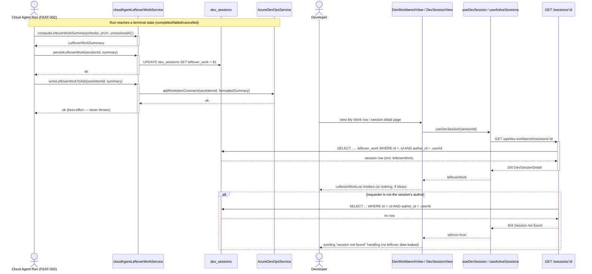
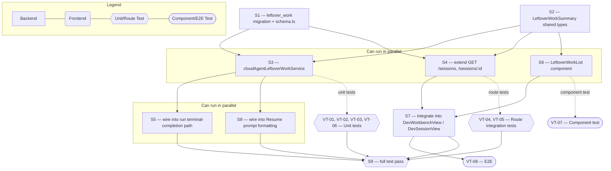

# Technical Specification — Remaining Work Loop-Back to My Work

> **PRD slug:** `start-cloud-development-from-my-work` | **Owning layer:** `src/server/services/` (new pure module) + `src/server/routes/devWorkbench.ts` (extended) + `src/client/components/` (new presentational component) | **Surface:** Full stack
> **Verification builds:** `npx tsc -p tsconfig.server.json --noEmit` and `npx tsc -p tsconfig.client.json --noEmit`
> **Open items:** See [design-doc-assumptions.md](design-doc-assumptions.md) (2 unresolved)
> **Design doc:** [design-doc-design.md](design-doc-design.md)

---

## System Boundary and Owning Layer

**Owning layer:** `src/server/services/` for computation/persistence, `src/server/routes/devWorkbench.ts` for the read-path extension, `src/client/components/` for display.

**Rationale:** This Feature adds no new capability boundary — it attaches a derived, structured summary to the existing `dev_sessions` row that the My Work workbench already owns end-to-end (route, service, schema, and UI). Keeping the computation in one small new pure-function service (rather than folding it into `devWorkbench.ts` directly) mirrors how the codebase already isolates single-purpose logic (`devSessionSetupService.ts`, `myWorkSessionLogger.ts`) from the route file that calls it, and keeps the function unit-testable without a live Cloud Agent run.

**Ownership answers:**
- New or existing Express service in `src/server/services/`? **New** — `src/server/services/cloudAgentLeftoverWorkService.ts`, a small pure-function + persistence module (compute, format, persist, write-to-ADO). It has no HTTP surface of its own.
- New or existing route in `src/server/routes/`? **Existing, extended** — `src/server/routes/devWorkbench.ts`. `GET /sessions` and `GET /sessions/:id` gain a `leftoverWork` field on their existing response shape; no new endpoint is added, matching PBI-008's NFR that the summary is "available on the same session read... with no extra request."
- New React component in `src/client/components/`? **New** — `src/client/components/LeftoverWorkList.tsx`, a small presentational component reused by `DevWorkbenchView.tsx` (My Work row) and `DevSessionView.tsx` (session detail page).
- New shared type in `src/shared/types/`? **Yes, extended** — `src/shared/types/devWorkbench.ts` gains `LeftoverWorkSummary`, `isLeftoverWorkClean(...)`, and a `leftoverWork: LeftoverWorkSummary | null` field on `DevSessionDetail` and `ActiveDevSession`.
- Database migration needed? **Yes** — one additive, nullable JSONB column on the existing `dev_sessions` table.

---

## Security Enforcement

- **Authorization mechanism:** No new permission key. `src/server/routes/devWorkbench.ts` already gates its entire router with `router.use(requirePermission('dev-workbench:view'))` and `router.use(requireGroupMembership('Developer'))` (see existing router setup). This Feature adds fields to responses already served by that router — it inherits the same gate.
- **Layer that enforces scope:** Service/query layer, same as every other session endpoint on this router: every `dev_sessions` read this Feature touches is already scoped with `and(eq(devSessions.id, sessionId), eq(devSessions.authorId, userId))` (see `GET /sessions/:id`, lines ~788-794 of `devWorkbench.ts`) or `eq(devSessions.authorId, userId)` for the list endpoint. No client-supplied `sessionId` can return another developer's `leftoverWork` — a mismatched id/author pair yields the existing 404 (`{ error: 'Session not found' }`), which is how PBI-008 AC-(d) ("the request is rejected") is already satisfied by the current route shape with no new code path.
- **Sensitive data handling:** `leftover_work` may echo acceptance-criteria text and check names sourced from the work item and the Cloud Agent's own output. It follows the same handling as the rest of the session row (no additional encryption or redaction beyond what `dev_sessions` already receives) because it is not more sensitive than the `prUrl`/branch data already stored there. Structured log events for this Feature (see Observability) emit counts only, never the leftover-work item text, consistent with `myWorkSessionLogger.ts`'s existing value-sanitization/truncation approach.

---

## Architecture and Approach

### Layers touched

| Layer | Changed | Notes |
|-------|---------|-------|
| Server services (`src/server/services/`) | Yes | New `cloudAgentLeftoverWorkService.ts`: `computeLeftoverWorkSummary`, `formatLeftoverWorkForAdoComment`, `formatLeftoverWorkForResumePrompt`, `persistLeftoverWork`, `writeLeftoverWorkToAdo`. |
| Server routes (`src/server/routes/`) | Yes | `devWorkbench.ts` — extend the `select`/response object in `GET /sessions` and `GET /sessions/:id` to include `leftoverWork`. No new route handlers. |
| Server middleware (`src/server/middleware/`) | No | Reuses existing `requirePermission` / `requireGroupMembership` already applied at the router level. |
| Client components (`src/client/components/`) | Yes | New `LeftoverWorkList.tsx` + `LeftoverWorkList.module.css`; `DevWorkbenchView.tsx` and `DevSessionView.tsx` each render it once session data includes `leftoverWork`. |
| Client hooks (`src/client/hooks/`) | No | `useDevSession` and `useActiveSessions` (`src/client/hooks/useDevWorkbench.ts`) already return the full session object; the new field arrives automatically once the shared type is extended — no hook code changes. |
| Shared types (`src/shared/types/`) | Yes | `src/shared/types/devWorkbench.ts` — add `LeftoverWorkSummary`, `isLeftoverWorkClean`, and the `leftoverWork` field on `DevSessionDetail` / `ActiveDevSession`. |
| Database (migrations/) | Yes | One additive migration adding `dev_sessions.leftover_work JSONB`. |
| Drizzle schema (`src/server/db/schema.ts`) | Yes | Add `leftoverWork: jsonb('leftover_work').$type<LeftoverWorkSummary>()` to the `devSessions` table definition (~line 151). |

### Per-work-item design decisions

**PBI-008 — See leftover work recorded on my row after a run finishes**
- Pattern followed: identical to how `prUrl` and `branchPushed` are already selected and returned by `GET /sessions` (lines ~763-777) and `GET /sessions/:id` (lines ~802-816) in `devWorkbench.ts` — `leftoverWork` is added as one more column in the same `select`/response object, no new query.
- Key decisions: no new endpoint (rejected alternative: a dedicated `GET /sessions/:id/leftover-work` endpoint) because the PBI's own performance NFR requires zero extra round trips, and every other run-outcome Feature in this epic (checks, PR status) makes the identical choice to piggyback on the current-run projection.

**TBI-007 — Persist and surface leftover-work summary on the run and ADO work item**
- Pattern followed: the ADO write reuses `AzureDevOpsService.addWorkItemComment(workItemId, text)` (existing method, `src/server/services/azureDevOps.ts` ~line 819) rather than introducing a new ADO client call; the non-fatal `try/catch` wrapping mirrors `createSessionPr`'s existing pattern of swallowing ADO write failures so PR/session state still finalizes (`devWorkbench.ts` ~lines 1450-1500).
- Key decisions:
  1. Storage is a new nullable `leftover_work JSONB` column on `dev_sessions`, not a new table — see [design-doc-assumptions.md](design-doc-assumptions.md) for the rejected alternatives (new table; column on `agent_runs`).
  2. The summary is computed and persisted from the Cloud Agent run's terminal-completion path (owned by FEAT-002/TBI-003), which calls `cloudAgentLeftoverWorkService.computeLeftoverWorkSummary(...)` and `persistLeftoverWork(...)` immediately after FEAT-003's check-result capture and FEAT-004's PR-status computation are available, so the summary always reflects the same terminal snapshot the row's own status badge reflects.
  3. Resume's use of the summary is a pure formatter (`formatLeftoverWorkForResumePrompt`) called from FEAT-002's Resume call site when it builds the resumed run's `ExecutionSnapshot.prompt` — this Feature does not own or modify the Resume endpoint itself.

---

## Data and Contracts

### API endpoints

| Method | Route | Request shape | Response shape | Auth |
|--------|-------|--------------|----------------|------|
| GET | `/api/dev-workbench/sessions` (existing, extended) | `?project=<project>` query param | `ActiveDevSession[]` — each item gains `leftoverWork: LeftoverWorkSummary \| null` | `requirePermission('dev-workbench:view')` + `requireGroupMembership('Developer')` + `authorId` filter |
| GET | `/api/dev-workbench/sessions/:id` (existing, extended) | `:id` path param | `DevSessionDetail` — gains `leftoverWork: LeftoverWorkSummary \| null` | Same as above, plus `eq(devSessions.id, sessionId)` scoping (404 if not author's session) |

```typescript
// src/shared/types/devWorkbench.ts (additions)
export interface LeftoverWorkSummary {
  /** Names/labels of unit/e2e/WCAG checks the finished run reported as failing (FEAT-003 data). */
  failingChecks: string[];
  /** True when the run finished without a PR URL at all (BR-004 / FEAT-002 data). */
  missingPr: boolean;
  /** Free-text acceptance criteria the Cloud Agent self-reported as not addressed. */
  incompleteAcceptanceCriteria: string[];
}

export function isLeftoverWorkClean(
  summary: LeftoverWorkSummary | null | undefined,
): boolean {
  if (!summary) return true;
  return (
    summary.failingChecks.length === 0
    && !summary.missingPr
    && summary.incompleteAcceptanceCriteria.length === 0
  );
}
```

### Schema / storage changes

| Target | Change | Reason |
|--------|--------|--------|
| `dev_sessions` | Add nullable `leftover_work JSONB` column | Persist the structured leftover-work summary on the same row/session per BR-007; additive and nullable so every existing row and every existing query against `dev_sessions` is unaffected. |

---

## Testing Strategy

**Unit tests:**
- `cloudAgentLeftoverWorkService` (new `src/server/__tests__/cloudAgentLeftoverWorkService.test.ts`) — `computeLeftoverWorkSummary` across all four AC combinations (failing checks only, missing PR only, both, neither/clean); `isLeftoverWorkClean` boundary cases; `formatLeftoverWorkForAdoComment` and `formatLeftoverWorkForResumePrompt` produce non-empty, human-readable text only when the summary is not clean. Mirrors the existing pure-function unit-test style used for `evaluateDevStartEligibility` in `devWorkbenchEligibility.test.ts`.

**Integration tests:**
- `devWorkbench.ts` routes (extend existing `src/server/__tests__/devWorkbenchRoutes.test.ts`) — `GET /sessions/:id` returns `leftoverWork` for the requesting author's session and 404s for another author's session id (AC-d); `GET /sessions` includes `leftoverWork` per row without an extra query (assert query/mock call count is unchanged from before this Feature).
- `writeLeftoverWorkToAdo` — assert an `AzureDevOpsService.addWorkItemComment` rejection does not throw out of `persistLeftoverWork`'s caller and the session's `leftover_work` column is still updated, mirroring how `devWorkbenchRoutes.test.ts` already asserts non-fatal ADO failures around `createSessionPr`.

**E2E tests (if applicable):**
- Playwright, My Work surface — with a fixture session whose `leftoverWork` is pre-seeded (failing checks + no PR), assert the row and the session detail page both render the leftover-work list as plain text next to the PR/status area, and that a fully-clean fixture session renders no list at all (AC-c).

---

## Observability

- **Custom events/metrics:** `logMyWorkSession('leftover_work.persisted', { sessionId, project, failingCheckCount, missingPr, incompleteAcCount })` on every persist, and `logMyWorkSession('leftover_work.ado_write_failed', { sessionId, project }, 'warn')` when the best-effort ADO comment write fails — counts only, never the leftover-work item text itself, matching this file's existing log-value sanitization.
- **Alerts:** None — this is a Should-Have visibility feature with no SLA; a failed ADO write is already logged for manual investigation and does not affect the row's own display.

---

## Rollback and Deployment

- **Schema changes backward compatible:** Yes — the new `leftover_work` column is nullable with no default constraint and no existing query selects `SELECT *` against `dev_sessions` in a way that would break; every existing read explicitly lists its columns (see `GET /sessions` at ~line 763).
- **Rollback procedure:** Drop the `leftover_work` column via the migration's down script; no data migration or backfill exists to reverse, since the column is purely additive.
- **Deployment dependencies:** None — no manual provisioning; the migration runs through the existing `npm run migrate:up` pipeline.
- **Feature flag gates deployment:** Yes — `my-work-cloud-agent` (inherited from the parent PRD). No leftover-work summary is ever computed unless a Cloud Agent run exists, and no Cloud Agent run exists unless the flag is on.

---

## Verification Test Matrix

| ID | Layer | Arrange | Act | Assert | Linked |
|----|-------|---------|-----|--------|--------|
| VT-01 | Jest (server, unit) | Build a terminal-run outcome with 2 failing checks and a PR URL | Call `computeLeftoverWorkSummary(...)` | Returns `{ failingChecks: [...2 names], missingPr: false, incompleteAcceptanceCriteria: [] }` | PBI-008 (a) |
| VT-02 | Jest (server, unit) | Build a terminal-run outcome with no PR URL and no failing checks | Call `computeLeftoverWorkSummary(...)` | Returns `missingPr: true`; `formatLeftoverWorkForAdoComment(...)` includes the literal text "no PR yet" | PBI-008 (b) |
| VT-03 | Jest (server, unit) | Build a terminal-run outcome with a PR URL and all checks passing | Call `computeLeftoverWorkSummary(...)` then `isLeftoverWorkClean(...)` | `isLeftoverWorkClean` returns `true`; `GET /sessions/:id` for that session omits any leftover-work list on the client | PBI-008 (c) |
| VT-04 | Jest (server, integration) | Seed a `dev_sessions` row authored by user A with a non-clean `leftover_work` value | Call `GET /api/dev-workbench/sessions/:id` authenticated as user B | 404 `{ error: 'Session not found' }`; no `leftoverWork` data returned | PBI-008 (d) |
| VT-05 | Jest (server, integration) | Seed a `dev_sessions` row authored by the requesting user with a non-clean `leftover_work` value | Call `GET /api/dev-workbench/sessions/:id` as that author | 200 with `leftoverWork` matching the seeded value | PBI-008 (a)/(b) |
| VT-06 | Jest (server, unit) | Mock `AzureDevOpsService.addWorkItemComment` to reject | Call `writeLeftoverWorkToAdo(...)` then `persistLeftoverWork(...)` in sequence as the terminal-completion path would | `persistLeftoverWork` still updates `dev_sessions.leftover_work`; a `leftover_work.ado_write_failed` warn log is emitted; no exception propagates | TBI-007 DoD (non-fatal ADO write) |
| VT-07 | Jest + RTL (client, unit) | Render `LeftoverWorkList` with a non-clean summary, then with `null` | Inspect the rendered output | Non-clean summary renders a `<ul>` with one `<li>` per item and `aria-label="Remaining work"`; `null`/clean summary renders nothing | PBI-008 (a)/(b)/(c) |
| VT-08 | Playwright (E2E) | Seed a fixture session with failing checks and no PR | Load `/my-work` as that session's author | Row shows the leftover-work text next to the PR/status area as plain text, not color/icon alone | PBI-008 (a)/(b) + accessibility NFR |

---

## Implementation Plan

- [ ] S1 — Add the `dev_sessions.leftover_work` JSONB migration and update `src/server/db/schema.ts` _(no blockers)_
  - Covers: `VT-04`, `VT-05`
- [ ] S2 — Add `LeftoverWorkSummary` / `isLeftoverWorkClean` and the `leftoverWork` field on `DevSessionDetail` / `ActiveDevSession` in `src/shared/types/devWorkbench.ts` _(no blockers; can parallel S1)_
- [ ] S3 — Implement `cloudAgentLeftoverWorkService.ts` (`computeLeftoverWorkSummary`, `formatLeftoverWorkForAdoComment`, `formatLeftoverWorkForResumePrompt`, `persistLeftoverWork`, `writeLeftoverWorkToAdo`) _(blocked by S1, S2)_
  - Covers: `VT-01`, `VT-02`, `VT-03`, `VT-06`
- [ ] S4 — Extend `GET /sessions` and `GET /sessions/:id` in `devWorkbench.ts` to select and return `leftoverWork` _(blocked by S1, S2)_
  - Covers: `VT-04`, `VT-05`
- [ ] S5 — Wire `cloudAgentLeftoverWorkService.persistLeftoverWork` + `writeLeftoverWorkToAdo` into the Cloud Agent run terminal-completion path exposed by FEAT-002/TBI-003 _(blocked by S3; cross-feature integration point — see [design-doc-assumptions.md](design-doc-assumptions.md))_
  - Covers: `VT-06`
- [ ] S6 — Build `LeftoverWorkList.tsx` + `LeftoverWorkList.module.css` _(blocked by S2; can parallel S3, S4)_
  - Covers: `VT-07`
- [ ] S7 — Integrate `LeftoverWorkList` into `DevWorkbenchView.tsx` (My Work row) and `DevSessionView.tsx` (session detail page) _(blocked by S4, S6)_
  - Covers: `VT-08`
- [ ] S8 — Wire `formatLeftoverWorkForResumePrompt` into FEAT-002's Resume call site's `ExecutionSnapshot.prompt` construction _(blocked by S3; cross-feature integration point)_
- [ ] S9 — Full test pass: unit (S3), route integration (S4), component (S6/S7), E2E (S7) _(blocked by S3, S4, S6, S7)_
  - Covers: `VT-01`–`VT-08`

**Execution lanes:**
- Lane 1 (start immediately): S1, S2
- Lane 2 (after S1 + S2): S3, S4, S6
- Lane 3 (after S3): S5, S8
- Lane 4 (after S4 + S6): S7
- Lane 5 (after S5, S7, S8): S9

---

## Diagram 1 — Code Execution Flow



---

## Diagram 2 — Implementation Dependency Map


