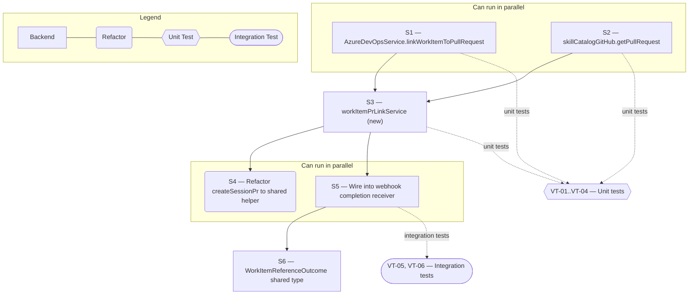

# Technical Specification — Host-Agnostic Work-Item Integrate

> **PRD slug:** `start-cloud-development-from-my-work` | **Owning layer:** `src/server/services/` | **Surface:** Backend only
> **Verification builds:** `npx tsc -p tsconfig.server.json --noEmit`
> **Open items:** See [design-doc-assumptions.md](design-doc-assumptions.md) (4 unresolved)
> **Design doc:** [design-doc-design.md](design-doc-design.md)

---

## System Boundary and Owning Layer

**Owning layer:** `src/server/services/`

**Rationale:** This Feature has no client-facing surface and no new Express route — it is a step inside the server-side Cloud Agent completion path introduced by FEAT-001 (webhook completion receiver) and consumed by FEAT-002/FEAT-004's outcome-writer flow. The work belongs entirely in the service layer that already owns git-host writes: `AzureDevOpsService` (`src/server/services/azureDevOps.ts`) for Azure Repos/ADO, and the GitHub skill catalog module (`src/server/services/skillCatalogGitHub.ts`) for GitHub. A new thin coordinating service, `workItemPrLinkService.ts`, is added at the same layer to hold the host-dispatch logic and keep the mention/link convention in one place instead of duplicating it between the existing local-dev PR flow and the new Cloud Agent outcome-writer flow.

**Ownership answers:**
- New or existing Express service in `src/server/services/`? Both — **existing** services extended (`azureDevOps.ts` gains `linkWorkItemToPullRequest`; `skillCatalogGitHub.ts` gains `getPullRequest`) plus one **new** thin coordinating service, `workItemPrLinkService.ts`, that both the pre-existing local-dev PR flow and the new Cloud Agent outcome-writer call.
- New or existing route in `src/server/routes/`? No new route. TBI-008 runs entirely inside the server-to-server completion path; nothing here is reachable from the client, and `devWorkbench.ts`'s existing routes are only touched to redirect their inline AB#-string construction through the new shared service (see S4 in the Implementation Plan).
- New React component in `src/client/components/`? No — Target Surface is backend-only (see design doc).
- New shared type in `src/shared/types/`? Yes, minimal: a `WorkItemReferenceOutcome` type (`{ mechanism: 'ab-mention' | 'native-link'; verified: boolean }`) so FEAT-005's leftover-work summary (TBI-007, Should Have) can optionally surface "missing work-item reference" as a leftover-work line item. This is additive and does not block TBI-008's own completion.
- Database migration needed? No. This Feature persists no new state of its own — it reads the run's `prUrl`/branch/`skillProvider` fields that TBI-001 (FEAT-001) and TBI-006 (FEAT-004) already add to the session/run tables, and writes only to external systems (the git host PR, the ADO work item).

---

## Security Enforcement

- **Authorization mechanism:** None new. TBI-008 is not a user-invoked endpoint — it executes inside the already-authenticated, already-signature-verified Cloud Agent completion path (FEAT-001's HMAC-verified webhook completion receiver, per the PRD's Security and Data Sensitivity section: "Webhook payloads are verified by HMAC signature before any lifecycle state is touched"). No RBAC permission key is added, consistent with the PRD's own stated assumption that "no new RBAC permission key is introduced" (`rbac-governance.mdc`'s catalog is unchanged by this Feature).
- **Layer that enforces scope:** The upstream webhook receiver (FEAT-001) is the sole trust boundary for this data path — it authenticates the completion payload and resolves the Apex run id from the URL path, never from the payload body. `workItemPrLinkService` and its callers accept only already-resolved, already-scoped values (`workItemId`, `repo`, `project`, `prUrl`) passed down from that boundary; they perform no independent identity or ownership check, matching the PRD note: "It never trusts a run or agent identifier carried inside the payload body."
- **Sensitive data handling:** `linkWorkItemToPullRequest` and `getPullRequest` reuse the exact server-side credentials `AzureDevOpsService` (ADO connection) and `skillCatalogGitHub.ts` (`GITHUB_TOKEN`/`GITHUB_PAT`/`GH_SKILL_TOKEN`, per `getToken()` in `skillCatalogGitHub.ts`) already resolve from environment variables. No credential is added, changed, or ever returned to a client response.

---

## Architecture and Approach

### Layers touched

| Layer | Changed | Notes |
|-------|---------|-------|
| Server services (`src/server/services/`) | Yes | Extend `azureDevOps.ts` (new `linkWorkItemToPullRequest` method) and `skillCatalogGitHub.ts` (new `getPullRequest` export); add new `workItemPrLinkService.ts` |
| Server routes (`src/server/routes/`) | Yes (minor) | `devWorkbench.ts`'s `createSessionPr()` is refactored to call the new shared `buildWorkItemReferenceText` helper instead of its inline template literal — no behavior change to the existing local-dev flow |
| Server middleware (`src/server/middleware/`) | No | — |
| Client components (`src/client/components/`) | No | — |
| Client hooks (`src/client/hooks/`) | No | — |
| Shared types (`src/shared/types/`) | Yes (minor) | New `WorkItemReferenceOutcome` type, additive, feeds FEAT-005's optional leftover-work projection |
| Database (`migrations/`) | No | — |
| Drizzle schema (`src/server/db/schema.ts`) | No | — |

### Per-work-item design decisions

**PBI-009 — Have my PR automatically link to its ADO work item**
- Pattern followed: `createSessionPr()` in `src/server/routes/devWorkbench.ts` (~lines 1440–1510) already builds an `AB#{workItemId}` mention into the PR description for both GitHub and ADO PR creation, and `AzureDevOpsService.createPullRequest()` (`azureDevOps.ts:5932`) already sets `prPayload.workItemRefs = [{ id: String(workItemId) }]` when a `workItemId` is supplied — this is Azure Repos' native PR-to-work-item link mechanism, already wired for the local-dev flow today.
- Key decision: Extract the mention-text convention and the native-link convention out of `createSessionPr`'s local closure into the new shared `workItemPrLinkService.ts`, so the Cloud Agent completion path and the pre-existing local-dev PR path share one source of truth instead of two independently-maintained copies of the `AB#` string format.
- Alternative rejected: Duplicating the mention/link logic inline inside the new Cloud Agent outcome-writer step (mirroring how `createSessionPr` currently does it inline) was rejected — it would create a second place that must be kept in sync with the git-host mention convention, which conflicts with `AzureDevOpsService`/`skillCatalogGitHub.ts` already being the sole git-host write boundary in this codebase.

**TBI-008 — Embed host-appropriate work-item reference at PR-creation time**
- Pattern followed: `AzureDevOpsService.createPullRequest()`'s `workItemRefs` branch (`azureDevOps.ts:5950–5953`) and `addWorkItemHyperlink()` (`azureDevOps.ts:5979–5995`), both already reused across `devWorkbench.ts`, `foundationSkillRepoUpdateService.ts`, and `foundationSkillRollback.test.ts`.
- Key decisions (see ⚠ Unresolved Item 1 and 2 in the assumptions file for the load-bearing assumption behind this split):
  1. **GitHub — instruct, then verify.** `cloudAgentService`'s run-launch prompt (FEAT-001/TBI-002, not built by this Feature) is extended with an explicit instruction embedding `buildWorkItemReferenceText(workItemId)`'s output, directing the Cloud Agent to include it when it opens its PR. Once the webhook completion receiver reports the resulting `prUrl`, `workItemPrLinkService.verifyGithubReference()` (backed by the new `skillCatalogGitHub.getPullRequest(repo, prNumber)` export) fetches the PR and checks title+body for the mention string. A miss is logged via `console.warn`, matching the exact non-fatal logging convention `createSessionPr`'s own try/catch already uses (`devWorkbench.ts:1498`), tagged `[work-item-pr-link] missing AB# mention`.
  2. **Azure Repos — write, don't rely on the agent.** Rather than depend on unconfirmed Cloud Agent credentials against Azure Repos (see assumptions), `workItemPrLinkService.linkWorkItemToPullRequest()` calls the new `AzureDevOpsService.linkWorkItemToPullRequest(project, repo, pullRequestId, workItemId)` immediately after the webhook reports the PR URL — guaranteeing the native link exists server-side regardless of what the agent itself attempted. This matches PBI-009 AC (c)'s unconditional wording (no "logged if missing" caveat, unlike GitHub's AC (b)).
  3. **No PR, no link.** If the completion payload's `prUrl` is null (per BR-004, "Run finished, no PR yet"), the outcome-writer short-circuits before either path runs — no work-item link of any kind is attempted, per AC (d) and BR-008.

---

## Data and Contracts

### API endpoints

None. This Feature adds no client-callable route.

### Internal function contracts

| Module | Function | Input | Output |
|--------|----------|-------|--------|
| `workItemPrLinkService.ts` (new) | `buildWorkItemReferenceText` | `workItemId: number` | `string` (`` `AB#${workItemId}` ``) |
| `workItemPrLinkService.ts` (new) | `verifyGithubReference` | `{ repo, prUrl, workItemId }` | `Promise<{ present: boolean }>` |
| `workItemPrLinkService.ts` (new) | `linkWorkItemToPullRequest` | `{ provider, project, repo, prUrl, workItemId }` | `Promise<{ linked: boolean }>` |
| `azureDevOps.ts` (extended) | `AzureDevOpsService.linkWorkItemToPullRequest` | `(project, repo, pullRequestId, workItemId)` | `Promise<void>` |
| `skillCatalogGitHub.ts` (extended) | `getPullRequest` | `(repo, prNumber, org?)` | `Promise<{ title: string; body: string }>` |

### Schema / storage changes

| Target | Change | Reason |
|--------|--------|--------|
| — | None — no new or altered tables | This Feature reuses TBI-001's run/session PR fields and TBI-006's PR-status fields; it introduces no persistent state of its own |

---

## Testing Strategy

**Unit tests:**
- `workItemPrLinkService` — pure-function-style tests for `buildWorkItemReferenceText`, and for the provider-dispatch branch (`skillProvider === 'github'` → verify path; `'ado'` → write path), mirroring the PRD's own prior-art guidance: "the existing dev-start eligibility function is already tested as a pure function against representative work-item shapes."
- `AzureDevOpsService.linkWorkItemToPullRequest` — mock `gitApi`, assert the correct work-item-link REST payload shape, following the existing mock style already used for `createPullRequest`/`addWorkItemHyperlink` in `devWorkbenchRoutes.test.ts` (lines 707–744), `foundationSkillRepoUpdateService.test.ts` (line 38), and `foundationSkillRollback.test.ts` (line 54).
- `skillCatalogGitHub.getPullRequest` — mock `fetch`, assert correct title/body parsing feeding `verifyGithubReference`'s mention check.

**Integration tests:**
- Webhook-to-outcome-writer flow — assert a completed GitHub run with a PR missing the mention logs the expected warning and does not throw or block the run's terminal-state write; assert an Azure-Repos-hosted run always results in exactly one `linkWorkItemToPullRequest` call; assert a no-PR completion (`prUrl: null`) calls neither function. Per the PRD's own testing guidance: assert the *observable outcome* (link exists / warning logged), not internal call ordering.

**E2E tests (if applicable):**
Not applicable. This Feature's outcome (PR body text, or the ADO PR's native work-item link) lives outside Apex's own UI. Row-level E2E coverage for PR link/status rendering belongs to FEAT-002/FEAT-004's existing E2E suite and is unaffected by this Feature.

---

## Observability

- **Custom events/metrics:** A missing GitHub `AB#` mention is logged via `console.warn` today (parity with `devWorkbench.ts`'s existing non-fatal PR-creation logging). Promoting this to a structured, queryable event (mirroring the existing `workerTierTelemetry`/`trackEvent` pattern used elsewhere in the codebase) is an optional follow-up if a dashboard is later required — see ⚠ Unresolved Item 4 in the assumptions file.
- **Alerts:** None beyond standard telemetry.

---

## Rollback and Deployment

- **Schema changes backward compatible:** Not applicable — no schema changes.
- **Rollback procedure:** Revert the two service extensions (`azureDevOps.ts`, `skillCatalogGitHub.ts`) and remove `workItemPrLinkService.ts`; no data migration or backfill is needed since no persistent Apex state is written by this Feature.
- **Deployment dependencies:** None beyond FEAT-001 and FEAT-002 being deployed first, per this Feature's `dependsOn`.
- **Feature flag gates deployment:** Yes — `my-work-cloud-agent` already gates every Cloud Agent code path this Feature touches; no additional flag is introduced.

---

## Verification Test Matrix

| ID | Layer | Arrange | Act | Assert | Linked |
|----|-------|---------|-----|--------|--------|
| VT-01 | Jest (unit) | GitHub-provider run; mocked `getPullRequest` returns a body containing `AB#123` | Call `verifyGithubReference` | Returns `{ present: true }`; no warning logged | PBI-009 (a) |
| VT-02 | Jest (unit) | GitHub-provider run; mocked `getPullRequest` returns a body without the mention | Call `verifyGithubReference` | Returns `{ present: false }`; `console.warn` called once with `workItemId` and `prUrl` | PBI-009 (b) |
| VT-03 | Jest (unit) | ADO-provider run; known `prUrl`/`pullRequestId` | Call `linkWorkItemToPullRequest` | `AzureDevOpsService.linkWorkItemToPullRequest` called once with the correct `project`/`repo`/`pullRequestId`/`workItemId` | PBI-009 (c) |
| VT-04 | Jest (unit) | Completion payload with `prUrl: null` | Run the outcome-writer's work-item-reference step | Neither `verifyGithubReference` nor `linkWorkItemToPullRequest` is called | PBI-009 (d) |
| VT-05 | Jest (integration) | Mocked webhook completion receiver + mocked `gitApi`, simulate a full completion for an Azure-Repos-hosted run | Trigger the completion handler | The mocked `gitApi` work-item-link REST call fires with the expected `repo`/`pullRequestId`/`workItemId` | TBI-008 DoD: "Azure Repos PR creation uses the native work-item link mechanism" |
| VT-06 | Jest (integration) | Mocked webhook completion receiver, GitHub-provider run, PR body missing the mention | Trigger the completion handler | The run reaches its terminal state normally; a single warning-level log entry is emitted; no exception propagates | TBI-008 DoD: "Missing work-item references are logged so they can be detected without a manual audit" |

---

## Implementation Plan

- [ ] S1 — Add `AzureDevOpsService.linkWorkItemToPullRequest()` to `azureDevOps.ts`, alongside the existing `createPullRequest`/`addWorkItemHyperlink` methods _(no blockers)_
  - Covers: `VT-03`, `VT-05`
- [ ] S2 — Add the `getPullRequest()` export to `skillCatalogGitHub.ts` _(no blockers; can run parallel with S1)_
  - Covers: `VT-01`, `VT-02`
- [ ] S3 — Create `src/server/services/workItemPrLinkService.ts` with `buildWorkItemReferenceText`, `verifyGithubReference`, `linkWorkItemToPullRequest` _(blocked by S1, S2)_
  - Covers: `VT-01`, `VT-02`, `VT-03`, `VT-04`
- [ ] S4 — Refactor `createSessionPr()` in `devWorkbench.ts` to call `workItemPrLinkService.buildWorkItemReferenceText` instead of its inline template literal, with no behavior change to the existing local-dev flow _(blocked by S3)_
- [ ] S5 — Wire `workItemPrLinkService` into the Cloud Agent outcome-writer step of the FEAT-001 webhook completion receiver _(blocked by S3; also blocked by the FEAT-001 webhook module landing — cross-feature dependency, see ⚠ Unresolved Item 1)_
  - Covers: `VT-05`, `VT-06`
- [ ] S6 — Add the `WorkItemReferenceOutcome` shared type in `src/shared/types/` and thread it onto the run outcome projection for FEAT-005's optional leftover-work summary _(blocked by S5; optional — FEAT-005 is Should Have)_

**Execution lanes:**
- Lane 1 (start immediately): S1, S2
- Lane 2 (after S1 + S2): S3
- Lane 3 (after S3): S4, S5
- Lane 4 (after S5): S6

---

## Diagram 1 — Code Execution Flow

```mermaid
sequenceDiagram
  actor CloudAgent as Cursor Cloud Agent
  participant WebhookReceiver as Webhook Completion Receiver (FEAT-001)
  participant LinkService as workItemPrLinkService
  participant AdoService as AzureDevOpsService
  participant GitHubCatalog as skillCatalogGitHub

  CloudAgent->>+WebhookReceiver: POST signed completion callback (status, prUrl, branch)
  WebhookReceiver->>WebhookReceiver: verify HMAC signature; resolve run id from URL path
  WebhookReceiver->>+LinkService: recordWorkItemReference(provider, workItemId, prUrl)

  alt provider is github
    LinkService->>+GitHubCatalog: getPullRequest(repo, prNumber)
    GitHubCatalog-->>-LinkService: { title, body }
    LinkService->>LinkService: check title+body for AB#{workItemId}
  else provider is ado
    LinkService->>+AdoService: linkWorkItemToPullRequest(project, repo, pullRequestId, workItemId)
    AdoService-->>-LinkService: linked
  end

  LinkService-->>-WebhookReceiver: { mechanism, verified }
  WebhookReceiver-->>-CloudAgent: 200 OK

  alt GitHub mention missing
    LinkService->>LinkService: console.warn("[work-item-pr-link] missing AB# mention")
  end
```

---

## Diagram 2 — Implementation Dependency Map


