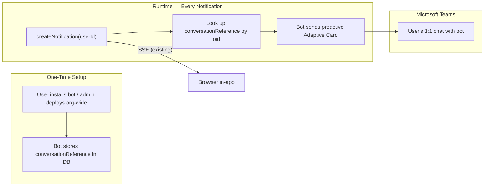

# Teams Per-User Notification Integration (Bot Framework)

## How it works

A lightweight Teams bot runs inside the existing Express server. When a user installs the bot (or an admin deploys it org-wide), the bot stores the user's `conversationReference` (their Teams address) in the database, mapped to their Azure AD `oid`. When `createNotification(userId, ...)` fires, the bot uses that stored reference to proactively send an Adaptive Card directly to the user's 1:1 chat in Teams.



## Azure setup (one-time, free)

1. **Create an "Azure Bot" resource** in Azure Portal (free tier — Teams is a standard channel, unlimited messages at $0)
2. Can reuse the existing Azure AD app (`AZURE_CLIENT_ID` / `AZURE_CLIENT_SECRET`) or create a dedicated one
3. Set messaging endpoint: `https://your-app-url/api/messages`
4. Enable the "Microsoft Teams" channel (one checkbox)
5. Add two env vars: `TEAMS_BOT_APP_ID`, `TEAMS_BOT_APP_PASSWORD`
6. Admin deploys the bot to the org's Teams app catalog (sideload or publish) — users get it automatically

## Storage — new `teams_conversation_references` table

| Column                   | Type        | Description                                  |
| ------------------------ | ----------- | -------------------------------------------- |
| `user_oid`               | TEXT PK     | FK to `app_users(oid)`, one row per user     |
| `conversation_reference` | JSONB       | Bot Framework `ConversationReference` object |
| `created_at`             | TIMESTAMPTZ | When the bot was installed by this user      |

Plus one key in `app_settings`:

- `teams_notification_enabled_types` — JSON array, e.g. `["ai","user-action"]`

## Files to change / create

### 1. New: `src/server/services/teamsBotService.ts`

The core bot service:

- **`createBotAdapter()`** — creates a `CloudAdapter` from `botbuilder` using `TEAMS_BOT_APP_ID` and `TEAMS_BOT_APP_PASSWORD`
- **`handleIncoming(req, res)`** — processes incoming messages/events from Teams (install, uninstall, messages). On `installationUpdate` (bot installed), saves the user's `conversationReference` to the DB keyed by their Azure AD `oid`
- **`sendTeamsNotification(userOid, notification)`** — looks up the user's `conversationReference` from the DB, skips if not found (user hasn't installed the bot). Checks `teams_notification_enabled_types` from `appSettingsService`. Formats an Adaptive Card with title, body, type badge, and deep-link button. Uses `adapter.continueConversationAsync()` for proactive delivery. Fire-and-forget: logs errors, never throws

### 2. New: migration `migrations/YYYYMMDD_add-teams-conversation-references.sql`

```sql
CREATE TABLE teams_conversation_references (
  user_oid TEXT PRIMARY KEY REFERENCES app_users(oid) ON DELETE CASCADE,
  conversation_reference JSONB NOT NULL,
  created_at TIMESTAMPTZ NOT NULL DEFAULT now()
);
```

### 3. Update: [`src/server/db/schema.ts`](src/server/db/schema.ts)

Add the Drizzle table definition for `teams_conversation_references` with a relation to `appUsers`.

### 4. Modify: [`src/server/index.ts`](src/server/index.ts) (requires permission)

Add the bot messaging endpoint **before** `ensureAuthenticated` middleware (Teams sends requests with its own auth, not your Azure AD session):

```typescript
import { handleIncoming } from './services/teamsBotService';
app.post('/api/messages', (req, res) => handleIncoming(req, res));
```

### 5. Modify: [`src/server/services/notificationService.ts`](src/server/services/notificationService.ts)

In `createNotification()`, after the SSE push block (line ~102):

```typescript
import { sendTeamsNotification } from './teamsBotService';
sendTeamsNotification(userId, notification).catch(() => {});
```

### 6. Shared types: [`src/shared/types/notification.ts`](src/shared/types/notification.ts)

```typescript
export interface TeamsNotificationConfig {
  enabledTypes: NotificationType[];
}
```

### 7. Admin API routes: [`src/server/routes/admin.ts`](src/server/routes/admin.ts)

- `GET /api/admin/app-settings/teamsNotifications` — returns `{ enabledTypes }`
- `PUT /api/admin/app-settings/teamsNotifications` — body `{ enabledTypes }`, saves to `app_settings`

### 8. Client hooks: [`src/client/hooks/useNotifications.ts`](src/client/hooks/useNotifications.ts)

- `useTeamsNotificationConfig()` — GET query
- `useUpdateTeamsNotificationConfig()` — PUT mutation

### 9. New: `src/client/components/TeamsNotificationSettings.tsx` (+ `.module.css`)

Admin-only component with per-type toggle checkboxes (AI Completions, User Actions, System Events, Background Jobs) and a save button. Gated by `can('admin:roles')`.

### 10. Wire into admin UI

Embed `TeamsNotificationSettings` in the existing admin settings page.

## Files requiring explicit permission to change

Per workspace rules, these files need approval before editing:

- `package.json` — to add `botbuilder` dependency
- `src/server/index.ts` — to add the `/api/messages` endpoint

## What this plan does NOT change

- No changes to `vite.config.ts` or `tsconfig`
- No Azure AD permission changes on the existing app registration
- No changes to the existing notification flow (SSE delivery is untouched)
- No cost — Azure Bot free tier covers Teams
