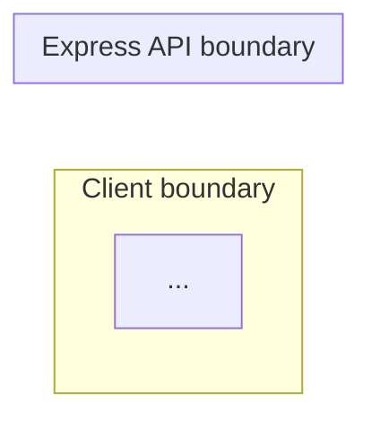

# Design Module Documentation

Generate one source-grounded, principal-engineer-level architecture document from only the source globs listed in the kickoff context. The result must be concise enough to scan, but substantive enough to support implementation, incident response, and design review.

## Procedure

1. Read every existing file matched by the allowed source globs.
2. Do not read or rely on implementation files outside those globs.
3. Trace actual entry points, client calls, Express routes and middleware, service calls, agent or worker execution, workspace files, persistence, external systems, and deployment boundaries.
4. Identify asynchronous transitions, polling/watchers, event fan-out, ownership or leasing, retries, timeouts, cleanup, and startup recovery that are present in source.
5. Identify authentication, authorization, tenant/project, resource-ownership, secret, and network boundaries that are present in source.
6. Use only file names, APIs, tables, files, paths, statuses, and relationships verified in the matched source.
7. Write the final document to `.ai-pilot/output/design-module.md`.
8. Do not create any other output file.

## Required output

Use these sections in this exact order:

````markdown
## Purpose and Scope

[Two to four concise paragraphs defining responsibilities, included and excluded behavior, architectural drivers, and authoritative state.]

## System and Component Architecture



## Runtime Sequence and Data Flow

```mermaid
sequenceDiagram
  participant Browser
  participant Api as Express API
  ...
```

## Persistence and State Model

[Name every verified database table, durable file, ephemeral workspace/output path, external source of truth, and important status transition. If the module is stateless, state that explicitly and identify the external state it reads.]

## Key Files and Layers

| Layer | File            | Responsibility |
| ----- | --------------- | -------------- |
| ...   | `verified/path` | ...            |

## Detailed Runtime Flow

1. [Concrete end-to-end runtime step grounded in source.]

## Reliability, Failure, and Recovery

- [Verified failure mode, detection, retry/recovery, idempotency, timeout, rollback, cleanup, or operational limitation.]

## Security and Operational Boundaries

- [Verified authentication, RBAC, ownership, validation, secret, network, process, or deployment boundary.]

## Related Docs

- [Only verified documentation paths from the allowed globs, or "No related docs are included in this module's source scope."]
````

## Depth requirements

- Include at least two useful Mermaid views: one system/component architecture and one end-to-end runtime `sequenceDiagram` or data-flow diagram.
- Add a third focused view when source establishes a non-trivial state machine, async worker lifecycle, event topology, or deployment topology.
- Draw explicit boundaries for every applicable concern: browser/client, Express API and middleware, domain services, Cursor/agent runtime, isolated workspace, PostgreSQL, durable file storage, worker/process, and external systems.
- For agent workflows, show thread creation, skill/model resolution, kickoff inputs, exact `.ai-pilot` input/output paths, output watchers or post-run synchronization, database persistence, and workspace cleanup/recovery.
- For asynchronous flows, show the acknowledgement boundary and later completion path. Include queues, polling intervals, event fan-out, ownership claims, heartbeats, stale-work recovery, and timeouts only when verified.
- For deployment modules, show build and migration gates, blue/green or slot topology, health and smoke checks, traffic swap, rollback, deployment tracking, and outcome persistence when verified.
- Map architecture statements to implementation files. Tables must use repository-relative paths and distinguish UI, hooks, routes/middleware, services, workers/agents, persistence/schema/migrations, external adapters, and operations.
- Prefer concrete names and status values over generic terms such as "database", "agent", or "processor".

## Mermaid conventions

- Always use a well-formed fenced `mermaid` block with a closing fence.
- Use Mermaid v11-compatible `flowchart LR`, `flowchart TD`, `sequenceDiagram`, or `stateDiagram-v2`.
- Use simple alphanumeric node and participant IDs. Put human-readable text in quoted labels.
- Use `subgraph Boundary["Boundary label"]`; do not use nested bracket syntax in IDs.
- Use plain arrows and labels. Avoid beta/experimental syntax, custom icons, HTML labels, click directives, class definitions, and configuration front matter.
- Keep each diagram focused and readable; split a crowded diagram into additional views.

## Guardrails

- Never invent a file, route, table, queue, service, or dependency.
- Do not infer deployment behavior that the source does not establish.
- Do not modify repository source.
- Do not include generation commentary, confidence notes, or unresolved questions in the output.
- If a relationship cannot be verified, omit it.
- Do not present a design document or comment as implemented behavior when current source contradicts it; call out a verified operational limitation in neutral language.
- Do not expose secret values. Identify only the secret/configuration boundary and verified variable names when useful.
