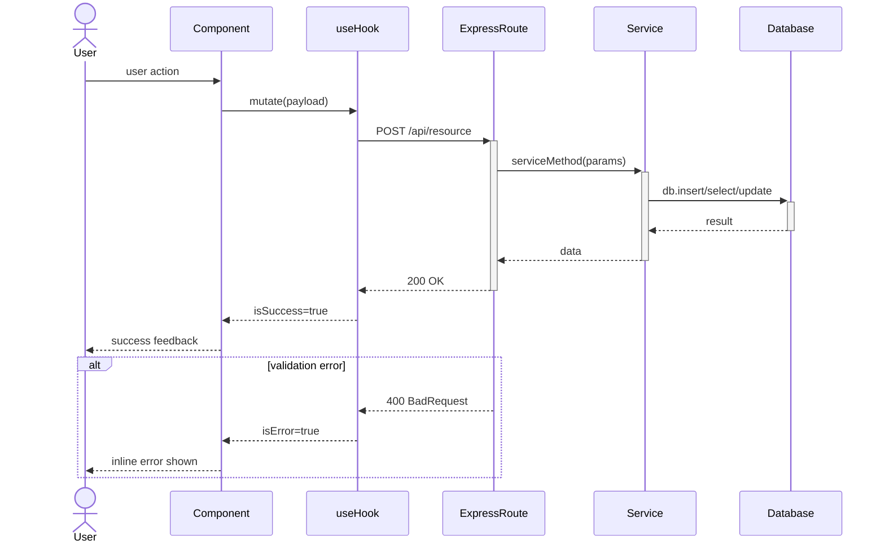
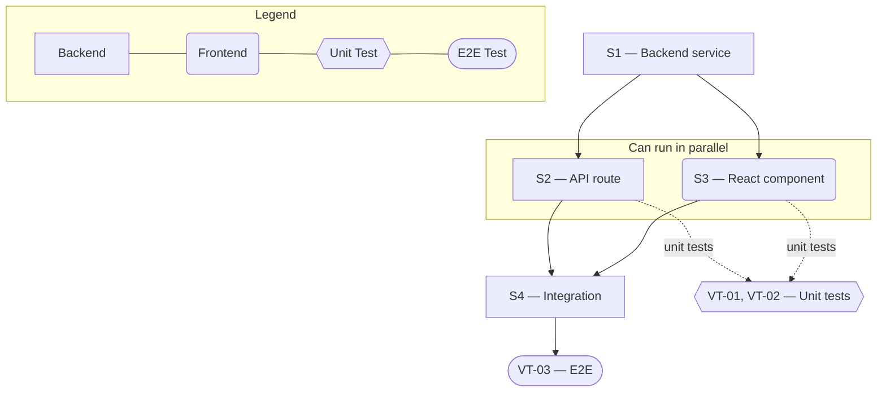

# Technical Specification — {Feature Title}

> **PRD slug:** `{slug}` | **Owning layer:** `{src/server/services/ | src/client/components/ | full-stack}` | **Surface:** {Frontend only | Backend only | Full stack}
> **Verification builds:** `npx tsc -p tsconfig.server.json --noEmit` and/or `npx tsc -p tsconfig.client.json --noEmit`
> **Open items:** See [{feature-slug}-assumptions.md]({feature-slug}-assumptions.md) ({n} unresolved)
> **Design doc:** [{feature-slug}-design.md]({feature-slug}-design.md)

---

## System Boundary and Owning Layer

**Owning layer:** `{src/server/services/ | src/server/routes/ | src/client/components/ | src/shared/types/ | migrations/}`

**Rationale:** {One paragraph — why this layer owns the work.}

**Ownership answers:**
- New or existing Express service in `src/server/services/`? {Yes — reason / No — reason}
- New or existing route in `src/server/routes/`? {Yes — reason / No — reason}
- New React component in `src/client/components/`? {Yes — reason / No — reason}
- New shared type in `src/shared/types/`? {Yes — reason / No — reason}
- Database migration needed? {Yes — reason / No — reason}

---

## Security Enforcement

- **Authorization mechanism:** {Which RBAC permission key or middleware guard — cite existing pattern from `rbac-governance.mdc` (e.g., `can('admin:roles')`, `requirePermission('prds:review')`)}
- **Layer that enforces scope:** {Route middleware | Service layer | Both — describe}
- **Sensitive data handling:** {How sensitive fields are protected — or "Not applicable"}

---

## Architecture and Approach

### Layers touched

| Layer | Changed | Notes |
|-------|---------|-------|
| Server services (`src/server/services/`) | {Yes / No} | {what changes} |
| Server routes (`src/server/routes/`) | {Yes / No} | {what changes} |
| Server middleware (`src/server/middleware/`) | {Yes / No} | {what changes} |
| Client components (`src/client/components/`) | {Yes / No} | {what changes} |
| Client hooks (`src/client/hooks/`) | {Yes / No} | {what changes} |
| Shared types (`src/shared/types/`) | {Yes / No} | {what changes} |
| Database (migrations/) | {Yes / No} | {what changes} |
| Drizzle schema (`src/server/db/schema.ts`) | {Yes / No} | {what changes} |

### Per-work-item design decisions

**PBI-001 — {title}**
- Pattern followed: {cite closest reference service/component in codebase}
- Key decisions: {what and why; alternative rejected}

**TBI-001 — {title}**
- Pattern followed: {cite closest reference}
- Key decisions: {decisions}

---

## Data and Contracts

### API endpoints

| Method | Route | Request shape | Response shape | Auth |
|--------|-------|--------------|----------------|------|
| GET | `/api/{resource}` | {query params} | `{ResponseType}` | `requirePermission('{key}')` |

### Schema / storage changes

| Target | Change | Reason |
|--------|--------|--------|
| `{table_name}` | {intent — no DDL} | {reason} |

---

## Testing Strategy

**Unit tests:**
- {Service name} — {what observable behavior to prove}

**Integration tests:**
- {Module or layer} — {what to cover}

**E2E tests (if applicable):**
- {Surface} — {scenarios}

---

## Observability

- **Custom events/metrics:** {Named events or "None beyond standard request telemetry"}
- **Alerts:** {New alert rules or "None"}

---

## Rollback and Deployment

- **Schema changes backward compatible:** {Yes | No — describe risk}
- **Rollback procedure:** {Steps or "Not applicable"}
- **Deployment dependencies:** {Manual provisioning needed or "None"}
- **Feature flag gates deployment:** {Yes / No}

---

## Verification Test Matrix

| ID | Layer | Arrange | Act | Assert | Linked |
|----|-------|---------|-----|--------|--------|
| VT-01 | {Jest / Playwright} | {setup} | {call} | {result} | PBI-001 (a) |
| VT-02 | {layer} | {setup} | {call} | {result} | PBI-001 (b) |

---

## Implementation Plan

- [ ] S1 — {Step} _(no blockers)_
  - Covers: `VT-01`, `VT-02`
- [ ] S2 — {Step} _(blocked by S1)_
- [ ] S3 — {Step} _(no blockers; can parallel with S2)_
- [ ] S4 — {Step} _(blocked by S2, S3)_

**Execution lanes:**
- Lane 1 (start immediately): S1, S3
- Lane 2 (after S1): S2
- Lane 3 (after S2 + S3): S4

---

## Diagram 1 — Code Execution Flow

---

## Diagram 2 — Implementation Dependency Map

