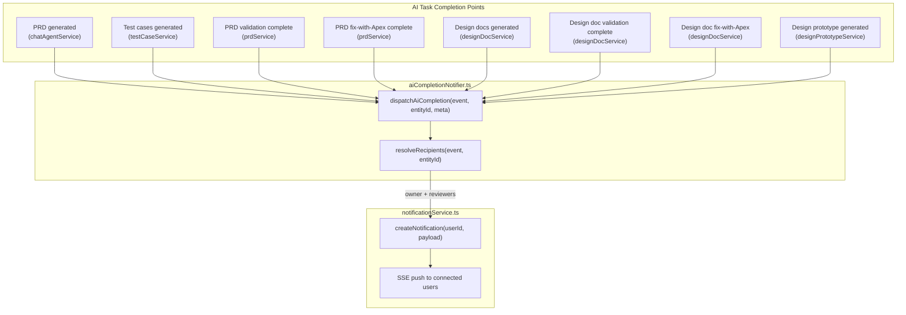
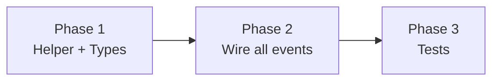

# AI Completion Notifications

## Current State

The notification infrastructure is fully operational — `createNotification()` from `notificationService.ts` handles DB persistence, user preference checks, and SSE push delivery. However, AI completion events are largely silent:

- **PRD generation** completes with no notification to anyone.
- **Test case generation** completes with no notification.
- **PRD validation (spec review)** only notifies approvers when the document reaches `pending_review` status (via `notifyApproversDocumentReady`), but the **owner** is never notified that validation ran.
- **Fix with Apex (PRD)** completes silently — neither owner nor reviewers know the fix landed.
- **Design doc generation** only notifies approvers when the doc reaches `pending_review`.
- **Design doc validation** — same pattern, only approvers on `pending_review`.
- **Fix with Apex (design doc)** — completes silently.
- **Design prototype generation** — assigns approvers but never notifies the owner that generation finished.

The data model already supports resolving recipients: `interviews.prdOwnerId`, `interviews.designDocOwnerId`, `interviews.designPrototypeOwnerId` track section owners, and `document_approver_assignments` tracks assigned reviewers. The missing piece is dispatching `type: 'ai'` notifications at the right moments.

## Architecture



## Server Changes

### Service: `src/server/services/aiCompletionNotifier.ts` (new)

Centralized helper that encapsulates recipient resolution and notification dispatch for all AI completion events. This avoids scattering owner-lookup logic across 5+ service files.

```typescript
export type AiCompletionEvent =
  | 'prd_generated'
  | 'test_cases_generated'
  | 'prd_validation_complete'
  | 'prd_fix_complete'
  | 'design_doc_generated'
  | 'design_doc_validation_complete'
  | 'design_doc_fix_complete'
  | 'design_prototype_generated';

export async function notifyAiCompletion(
  event: AiCompletionEvent,
  entityId: string,
  meta?: { title?: string; score?: number; passed?: boolean },
): Promise<void>
```

**Recipient resolution logic:**

| Event | Owner recipient | Reviewer recipients |
|-------|----------------|---------------------|
| `prd_generated` | `interviews.prdOwnerId` (via `prds.interviewId`) | -- |
| `test_cases_generated` | `interviews.prdOwnerId` (via `testCases.prdId` -> `prds.interviewId`) | -- |
| `prd_validation_complete` | `interviews.prdOwnerId` | assigned PRD approvers |
| `prd_fix_complete` | `interviews.prdOwnerId` | assigned PRD approvers |
| `design_doc_generated` | `interviews.designDocOwnerId` | -- |
| `design_doc_validation_complete` | `interviews.designDocOwnerId` | assigned design doc approvers |
| `design_doc_fix_complete` | `interviews.designDocOwnerId` | assigned design doc approvers |
| `design_prototype_generated` | `interviews.designPrototypeOwnerId` | assigned design prototype approvers |

**Notification payload per event:**

| Event | Type | Title | Body (template) | Link |
|-------|------|-------|-----------------|------|
| `prd_generated` | `ai` | PRD generation complete | Your PRD "{title}" has been generated | `/backlog/prd/{prdId}` |
| `test_cases_generated` | `ai` | Test cases generated | Test cases for "{title}" are ready | `/backlog/prd/{prdId}` |
| `prd_validation_complete` | `ai` | PRD validation complete | Validation {passed ? "passed" : "needs attention"} for "{title}" (score: {score}) | `/backlog/prd/{prdId}` |
| `prd_fix_complete` | `ai` | PRD fix applied | Apex fix applied to "{title}" — re-validation started | `/backlog/prd/{prdId}` |
| `design_doc_generated` | `ai` | Design doc generated | Design doc "{title}" has been generated | `/backlog/design-doc/{docId}` |
| `design_doc_validation_complete` | `ai` | Design doc validation complete | Validation {passed ? "passed" : "needs attention"} for "{title}" (score: {score}) | `/backlog/design-doc/{docId}` |
| `design_doc_fix_complete` | `ai` | Design doc fix applied | Apex fix applied to "{title}" — re-validation started | `/backlog/design-doc/{docId}` |
| `design_prototype_generated` | `ai` | Design prototype ready | Prototype for "{featureName}" is ready for review | `/backlog/design-prototype/{prdId}` |

**Internal helper functions:**

- `resolveInterviewFromPrd(prdId: string): Promise<{ prdOwnerId?, designDocOwnerId?, designPrototypeOwnerId? }>` — joins prds -> interviews to get owners
- `resolveInterviewFromDesignDoc(designDocId: string): Promise<{ ... }>` — joins designDocs -> prds -> interviews
- `resolveInterviewFromTestCase(testCaseId: string): Promise<{ ... }>` — joins testCases -> prds -> interviews
- `getAssignedReviewerIds(documentId: string, documentType: string): Promise<string[]>` — queries `document_approver_assignments`
- `dedupeRecipients(ownerIds: string[], reviewerIds: string[]): string[]` — removes nulls and duplicates

### Integration points (edits to existing services)

Each integration is a single `notifyAiCompletion(...)` call added at the appropriate completion point. All calls are fire-and-forget (`.catch(console.error)`) to avoid blocking the main flow.

**`src/server/services/chatAgentService.ts`** — in `syncOutputToDb`:
- After `syncPrdContent(prdRow.id, content, backlog)` succeeds (line ~891): call `notifyAiCompletion('prd_generated', prdRow.id, { title: prdRow.title })`

**`src/server/services/testCaseService.ts`** — in `syncTestCaseOutput`:
- After test cases are saved to DB: call `notifyAiCompletion('test_cases_generated', testCaseRow.id, { title })`

**`src/server/services/prdService.ts`** — in `syncPrdValidationResult`:
- After scorecard is synced: call `notifyAiCompletion('prd_validation_complete', prdId, { title, score, passed: scorecard.is_ready })`

**`src/server/services/prdService.ts`** — in `acceptFixPrdValidation`:
- After fix is accepted and re-validation starts: call `notifyAiCompletion('prd_fix_complete', prdId, { title })`

**`src/server/services/designDocService.ts`** — in `syncPerFeatureDesignDocs`:
- After all feature docs are inserted: call `notifyAiCompletion('design_doc_generated', seedId, { title })` once for the batch

**`src/server/services/designDocService.ts`** — in `syncValidationResult`:
- After scorecard synced: call `notifyAiCompletion('design_doc_validation_complete', designDocId, { title, score, passed: scorecard.is_ready })`

**`src/server/services/designDocService.ts`** — in fix acceptance path:
- After fix accepted: call `notifyAiCompletion('design_doc_fix_complete', designDocId, { title })`

**`src/server/services/designPrototypeService.ts`** — in `generateSinglePrototype`:
- After HTML is saved to DB (status -> `pending_review`): call `notifyAiCompletion('design_prototype_generated', prototypeId, { title: featureName })`

## Key Design Decisions

1. **Centralized notifier service** — All recipient resolution logic lives in one file rather than being duplicated across 5+ services. This makes it easy to adjust who gets notified, add new events, or change notification copy without hunting through the codebase.

2. **Fire-and-forget pattern** — Notification dispatch never blocks or fails the main AI pipeline. All calls use `.catch(console.error)` to prevent notification failures from affecting document processing.

3. **`type: 'ai'` for all events** — All AI completion notifications use the `'ai'` notification type so users can silence them all at once via their notification preferences (which already support per-type enabled/toast toggles).

4. **No new DB tables or migrations** — This feature only wires existing infrastructure (`createNotification`, `interviews.prdOwnerId`, `document_approver_assignments`) together. No schema changes required.

5. **Owner + Reviewers deduplication** — If the owner is also an assigned reviewer, they receive one notification (not two). The `dedupeRecipients` helper handles this.

6. **Null-safe owner resolution** — If `prdOwnerId` or `designDocOwnerId` is null (owner was never assigned), the notification is simply not sent to that slot. No error, no fallback to author.

7. **Design prototype is per-feature** — Unlike other events that notify once per entity, design prototype notifications fire per-feature because each feature generates independently and the reviewer may want to start reviewing as prototypes trickle in.

## Phase Summary and Parallelization



**Multitask parallelism:**
- **Phase 1** (2 tasks, parallel): the notifier helper and shared types have no dependencies on each other.
- **Phase 2** (8 tasks, parallel): all service integrations are independent — each adds a single call to a different service file. All can run simultaneously once Phase 1 is complete.
- **Phase 3** (1 task): unit tests for the notifier, depends on Phase 1 being complete (can run in parallel with Phase 2 since it mocks dependencies).

## Files Changed / Created

| Action | Path |
|--------|------|
| Create | `src/server/services/aiCompletionNotifier.ts` |
| Edit   | `src/shared/types/notification.ts` |
| Edit   | `src/server/services/chatAgentService.ts` |
| Edit   | `src/server/services/testCaseService.ts` |
| Edit   | `src/server/services/prdService.ts` |
| Edit   | `src/server/services/designDocService.ts` |
| Edit   | `src/server/services/designPrototypeService.ts` |
| Create | `src/server/__tests__/aiCompletionNotifier.test.ts` |
