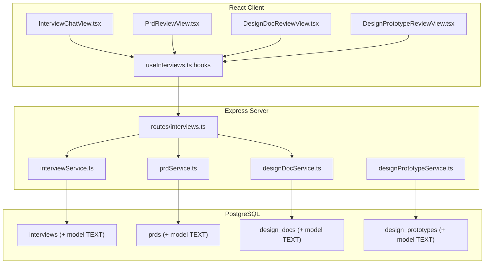
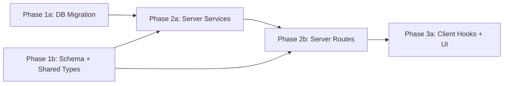

# AI Model Audit Tracking

## Current State

The application generates four types of AI-assisted artifacts: **Interviews**, **PRDs**, **Design Docs**, and **Design Prototypes**. Each uses a model resolved from the project settings chain (`entity-specific model > project default > global default > code default`), but this information is ephemeral -- once the entity is created, there is no record of which model was used.

The model configuration lives in `project_skill_settings` (columns like `interviewModel`, `prdModel`, `designDocModel`, `designPrototypeBedrockModelId`) and can be changed at any time via admin settings. Because there is no snapshot, it is impossible to determine after the fact which model was responsible for a given artifact. This blocks any analysis of model effectiveness.

**Key files today:**
- `src/server/db/schema.ts` -- table definitions (no `model` column on any entity)
- `src/server/services/interviewService.ts` -- `createInterview()` does not capture model
- `src/server/services/prdService.ts` -- `createPrd()` does not capture model
- `src/server/services/designDocService.ts` -- `createDesignDoc()` does not capture model
- `src/server/services/designPrototypeService.ts` -- `generatePrototypesForPrd()` does not capture model
- `src/shared/types/interview.ts` -- `InterviewSummary`, `PrdSummary`, `DesignDocSummary` have no `model` field
- `src/shared/types/designPrototype.ts` -- `DesignPrototypeSummary` has no `model` field

## Architecture



## Database Schema

Single migration: `npm run migrate:create -- add-model-audit-column`

**All four tables get the same change:**

```sql
-- Up Migration
ALTER TABLE interviews ADD COLUMN IF NOT EXISTS model TEXT;
ALTER TABLE prds ADD COLUMN IF NOT EXISTS model TEXT;
ALTER TABLE design_docs ADD COLUMN IF NOT EXISTS model TEXT;
ALTER TABLE design_prototypes ADD COLUMN IF NOT EXISTS model TEXT;

-- Down Migration
ALTER TABLE interviews DROP COLUMN IF EXISTS model;
ALTER TABLE prds DROP COLUMN IF EXISTS model;
ALTER TABLE design_docs DROP COLUMN IF EXISTS model;
ALTER TABLE design_prototypes DROP COLUMN IF EXISTS model;
```

- Column is **nullable** -- existing records will have `NULL` (displayed as empty in the UI)
- No index needed -- this column is for display/reporting, not queried in WHERE clauses
- No foreign key -- model names are free-text strings from the settings

After the migration, update `src/server/db/schema.ts` with `model: text('model')` on all four `pgTable` definitions.

## Server Changes

### Service: `src/server/services/interviewService.ts` (edit)

- `createInterview(opts)` -- add `model?: string` param, include in `.values({ ..., model: opts.model })`
- `listInterviews()` -- add `model: interviews.model` to the explicit select columns, add `model: row.model ?? undefined` to the returned object
- `getInterview()` -- add `model: row.model ?? undefined` to the returned object

### Service: `src/server/services/prdService.ts` (edit)

- `createPrd(opts)` -- add `model?: string` param, include in `.values({ ..., model: opts.model })`
- `rowToPrdSummary()` -- add `model: row.model ?? undefined` to the returned object

### Service: `src/server/services/designDocService.ts` (edit)

- `createDesignDoc(opts)` -- add `model?: string` param, include in `.values({ ..., model: opts.model })`
- `rowToSummary()` -- add `model: row.model ?? undefined` to the returned object

### Service: `src/server/services/designPrototypeService.ts` (edit)

- `generatePrototypesForPrd()` -- save the resolved Bedrock model (`prototypeModel`) into `.values({ ..., model: prototypeModel })`
- `toSummary()` -- add `model: row.model ?? undefined` to the returned object

### Routes: `src/server/routes/interviews.ts` (edit)

**POST `/` (create interview):**
- Extract `model` from `req.body`, pass to `createInterview({ ..., model })`
- Model is sent by the client (same value it used for the chat thread kickoff)

**POST `/:interviewId/prds` (create PRD):**
- Extract `model` from `req.body`, pass to `createPrd({ ..., model })`
- Model is sent by the client (resolved from `prdModel` setting)

**POST `/prds/:prdId/design-docs` (create design doc):**
- Model is already resolved server-side: `const model = skillConfig?.designDocModel ?? globalModel`
- Pass `model` to `createDesignDoc({ ..., model })`

**POST `/design-docs/:id/retry-generate` (retry design doc):**
- Same: pass the resolved `model` to the update (set model on the existing row)

**Design prototypes -- no route change needed:**
- Model is resolved inside `generatePrototypesForPrd()` in the service layer

## Client Changes

### Hook: `src/client/hooks/useInterviews.ts` (edit)

- `useCreateInterview()` -- add `model?: string` to the mutation input type
- `useCreatePrd()` -- add `model?: string` to the mutation input type

### Component: `src/client/components/InterviewChatView.tsx` (edit)

**NewInterviewCompose** (create flow):
- Pass `model` to `createInterview.mutateAsync({ ..., model })` -- the `model` variable is already available in scope (line 328)

**ExistingInterviewView** (header, ~line 833):
- Add to `metaRow`: display `interview.model` when present

**handleGeneratePrd** (~line 784):
- Pass `model: prdModel` to `createPrd.mutateAsync({ ..., model: prdModel })`

### Component: `src/client/components/PrdReviewView.tsx` (edit)

- Add to `metaRow`: display `prd.model` when present (next to Owner/Reviewer metadata)

### Component: `src/client/components/DesignDocReviewView.tsx` (edit)

- Add to `metaRow`: display `doc.model` when present

### Component: `src/client/components/DesignPrototypeReviewView.tsx` (edit)

- Add model display to the per-prototype tab or header area: display `proto.model` when present

### Styles (multiple `.module.css` files)

- No new CSS classes needed -- reuse existing `metaItem` / `metaLabel` / `metaValue` patterns already present in `InterviewChatView.module.css`, `PrdReviewView.module.css`, and `DesignDocReviewView.module.css`

## Key Design Decisions

- **Snapshot at creation time, not lookup at read time**: We store the model name when the entity is created. If the project settings change later, we still know exactly which model produced each artifact. This is critical for accurate audit reporting.

- **Nullable column (no backfill)**: Existing records will show no model. We will NOT backfill because we cannot reliably determine which model was used for historical records. The UI gracefully handles `null` by simply not showing a model label.

- **Client passes model for Interview and PRD; server resolves for Design Doc and Prototype**: For Interviews and PRDs, the model is already resolved on the client side (used for the chat thread kickoff). For Design Docs and Prototypes, model resolution happens server-side. Each path passes the resolved model to the create function.

- **Single `model TEXT` column per entity**: We store the human-readable model identifier (e.g. `"composer-2"`, `"claude-sonnet-4-20250514"`, `"us.anthropic.claude-sonnet-4-20250514-v1:0"`). This matches how models are configured in `project_skill_settings` and keeps reporting simple.

## Phase Summary and Parallelization



**Multitask parallelism:**
- Phase 1 (1a + 1b) -- both tasks have no dependencies; run in parallel
- Phase 2 (2a + 2b) -- can start in parallel once Phase 1 is complete; 2b imports from 2a so coordinate on function signatures
- Phase 3 (3a) -- single task; depends on Phase 2 routes being ready so the hook types match

## Files Changed / Created

| Action | Path |
|--------|------|
| Create | `migrations/<ts>_add-model-audit-column.sql` |
| Edit   | `src/server/db/schema.ts` |
| Edit   | `src/shared/types/interview.ts` |
| Edit   | `src/shared/types/designPrototype.ts` |
| Edit   | `src/server/services/interviewService.ts` |
| Edit   | `src/server/services/prdService.ts` |
| Edit   | `src/server/services/designDocService.ts` |
| Edit   | `src/server/services/designPrototypeService.ts` |
| Edit   | `src/server/routes/interviews.ts` |
| Edit   | `src/client/hooks/useInterviews.ts` |
| Edit   | `src/client/components/InterviewChatView.tsx` |
| Edit   | `src/client/components/PrdReviewView.tsx` |
| Edit   | `src/client/components/DesignDocReviewView.tsx` |
| Edit   | `src/client/components/DesignPrototypeReviewView.tsx` |
