# Async repository checkout worker

## Why not the PDF in-process poller

Clone/refresh today is `await cloneOrRefreshRepository()` in [`src/server/routes/admin.ts`](src/server/routes/admin.ts) on the **same Node process** as HTTP. MaxView/MatterWorx git on Azure Files saturated prod (homepage timeouts, 48s API). A PDF-style poller in [`src/server/index.ts`](src/server/index.ts) would still run `git` on that instance and compete for the same Azure Files mount.

Platform default is “stay on App Service until isolation evidence.” **We have that evidence.** Do **not** add a new App Service (forbidden by [`.cursor/skills/azure-async-infra/SKILL.md`](.cursor/skills/azure-async-infra/SKILL.md)). Do **not** reuse `caj-apex-ai-runs-*` (Cursor keys, 10-wide KEDA, mixed domain).

**Recommended host:** new Container Apps **Job** `caj-apex-repo-checkout-{env}` in the existing AI-runs Container Apps Environment, `max_executions = 1`.

```mermaid
sequenceDiagram
  participant Admin as AdminUI
  participant API as AppService
  participant PG as Postgres
  participant SB as ServiceBusQueue
  participant Job as RepoCheckoutJob

  Admin->>API: POST repository-clone
  API->>PG: status cloning plus job queued
  API->>SB: payload-free message
  API-->>Admin: 202 cloning
  Admin->>API: GET readiness every 2s
  SB->>Job: KEDA start
  Job->>PG: claim job
  Job->>Job: git mirror plus materialize tree
  Job->>PG: ready or failed
```

## Placement decisions

| Concern | Choice | Why |
|---------|--------|-----|
| Compute | New CA Job, not App Service, not AI-runs Job | Isolate git CPU/disk from HTTP; keep Cursor workers separate |
| Queue | New queue `repo-checkout` on **existing** `sbns-apex-ai-*` | Broker already exists; do not create a namespace; do not mix with `ai-runs-background` |
| Source of truth | Postgres job row + existing `project_skill_settings` checkout columns | Same lifecycle the UI already polls |
| Concurrency | One clone globally (`max_executions=1` + `repo_cache_leases`) | Two MaxView clones would re-hang the share |
| Mirrors | Move `repo-cache` onto the Azure Files share | Job cannot see App Service `/home/data/ai-pilot/repo-cache` today |
| Local/dev | In-process poller when no Job | Same code path, no Azure required |

**Infra note:** Terraform under `infra/` needs your explicit OK (scope-discipline). Plan assumes we add [`infra/repo-checkout-worker.tf`](infra/repo-checkout-worker.tf) modeled on [`infra/ai-runs-worker.tf`](infra/ai-runs-worker.tf).

## Filesystem: share the mirror with the Job

Today:

- Bare mirrors: `{dataRoot}/repo-cache` → App Service **local** `/home/data/ai-pilot/repo-cache` (Kudu-visible, **not** on the share)
- Shared trees: `{dataRoot}/workspaces/grounding-shared` → Azure Files `ai-pilot-data` mounted at `/home/data/ai-pilot/workspaces` (App Service + AI-runs Job + interactive host)

The Job already can mount that share (see volume mount in [`infra/ai-runs-worker.tf`](infra/ai-runs-worker.tf) ~298–306). It cannot see local `/home` mirrors.

**Change** [`REPO_CACHE_BASE`](src/server/services/repoCacheService.ts) to `path.join(resolveDataRoot(), 'workspaces', 'repo-cache')` so mirrors live at `/home/data/ai-pilot/workspaces/repo-cache` on every tier.

Prod runbook (one-time): copy existing `/home/data/ai-pilot/repo-cache/*` onto the share (or accept a first Job clone). Do not click in-app Clone to migrate.

## HTTP + UI contract

Keep GET readiness unchanged. Change POST only:

`POST /api/admin/project-settings/:id/repository-clone`

- Set `repository_checkout_status = cloning`, enqueue job, publish SB message, return **202** + `ProjectRepositoryReadiness` (`status: cloning`)
- If already `cloning`: **202** idempotent (no second job)
- `refresh: true` allowed from **Ready** and **Failed** (restore Refresh on Ready — it is safe once off HTTP)
- Clone button stays for `not_cloned` / `snapshot_unavailable`

Client ([`useCloneProjectRepository`](src/client/hooks/useProjectRepositoryReadiness.ts)): treat 202 as success; keep 2s poll while `cloning` (already wired). Revert the “hide Refresh when Ready” guard in [`AdminProjectSettings.tsx`](src/client/components/AdminProjectSettings.tsx) as part of this work.

Job replica timeout must exceed `COLD_CACHE_TIMEOUT_MS` (30 min) — set **60 min**. Heartbeat the Postgres job lease so a dead replica is requeued.

## Admin progress percent

Yes. Cold clone already runs `git clone --progress` ([`repoCacheService.ts`](src/server/services/repoCacheService.ts)); stderr lines look like `Receiving objects: 45% (1234/2742)`. [`asyncGit`](src/server/utils/asyncGit.ts) already reads stderr for the idle timer but discards the text. Parse those lines in the Job and expose them on the readiness poll the UI already does every 2s.

Git’s own percent is **per phase**, not overall (objects 100% then deltas restart at 0%). Map to a single bar:

| Window | Phase |
|--------|--------|
| 0–10% | Queued / Job starting |
| 10–60% | Mirror clone or fetch (`Receiving objects` / `Resolving deltas`) |
| 60–95% | Working-tree materialize (`Checking out files`) |
| 100% | Ready |

Throttle Postgres writes to **at most once per 2s** (do not write on every stderr chunk). Add optional fields on [`ProjectRepositoryReadiness`](src/shared/types/projectSettings.ts):

- `progressPercent: number | null` (0–100)
- `progressLabel: string | null` (e.g. `Receiving objects 45%`)

Store them on the job row (or two nullable columns on `project_skill_settings`). GET readiness returns them while `status === cloning`. Admin UI: bar + label next to “Cloning…”. Clear on ready/failed.

This is approximate on Azure Files (checkout can sit in I/O with little git percent movement). The idle-timeout still proves the process is alive; the label should stay on the last known phase rather than jumping backward.

## Worker implementation

New files (AI-runs shape):

- [`src/server/services/repoCheckoutWorker/entrypoint.ts`](src/server/services/repoCheckoutWorker/entrypoint.ts) — receive-and-delete, claim, run, exit
- [`src/server/services/repoCheckoutWorker/worker.ts`](src/server/services/repoCheckoutWorker/worker.ts) — calls existing `cloneOrRefreshRepository` **without** the HTTP-era “set cloning then await” split (status already cloning)
- [`runners/repo-checkout/Dockerfile`](runners/repo-checkout/Dockerfile) — `node:24-bookworm-slim` + git, `CMD` the entrypoint (same compile graph as [`runners/ai-runs/Dockerfile`](runners/ai-runs/Dockerfile))

Split [`cloneOrRefreshRepository`](src/server/services/projectRepositoryCheckoutService.ts) into:

1. `enqueueRepositoryCheckout(id, { refresh })` — DB + queue (API)
2. `executeRepositoryCheckout(id)` — `cloneRepositoryForAdmin` + `sharedReadCheckoutService.materialize` + ready/failed (Job)

Env on the Job: `DATABASE_URL`, `ADO_PAT` / GitHub token (same as App Service, Key Vault), `AI_PILOT_DATA_DIR=/home/data/ai-pilot`, Service Bus namespace + queue. Managed identity for SB receive; do not put PAT in Terraform tfvars.

Local: `startRepoCheckoutPoller()` from [`index.ts`](src/server/index.ts) when `REPO_CHECKOUT_WORKER_MODE=in-process` (default off in Azure).

## Interview path (same hang class — in scope)

[`pinProjectRepositoryRoot`](src/server/services/projectRepositoryRootPinService.ts) `ensureSnapshot` currently **materializes on the request** when tip SHA is new. That can re-hang Agent Home.

Change: **getReady only** on user-facing paths. On miss: enqueue the same checkout job (or fail closed with snapshot-unavailable / “Refresh in Project Settings”) — never `materialize()` inside chat/interview/ADR. Existing pin SHA still resumes if the tree is present.

Light `fetchRepositoryTip` on new roots can stay (incremental, minutes-not-hours) **or** be moved to the Job if it still shows up in App Service CPU; start with fetch-on-API, materialize-on-Job.

## Concurrency and failure

- Global cap 1 in-flight clone (KEDA `max_executions=1` + claim `FOR UPDATE SKIP LOCKED`)
- Reuse `withRepoCacheLease` so App Service fetch and Job clone cannot corrupt the same mirror
- Idle git kill stays (`COLD_CACHE_IDLE_TIMEOUT_MS` 5 min)
- Failed → UI Refresh retries (new job)
- Do not let App Service HTTP ever call `executeRepositoryCheckout`

## Tests

- API: POST returns 202, sets cloning, does not invoke git
- Duplicate POST while cloning is idempotent
- Worker execute success/failure updates readiness DTO
- `pinProjectRepositoryRoot` does not call `materialize` on miss
- Client mutation accepts 202; Refresh visible when Ready
- Git `--progress` parse maps to throttled `progressPercent` / `progressLabel`; UI shows them while cloning

## Out of scope

- New App Service / new Storage Account / new Service Bus namespace
- Changing idle TTL (30 min) — separate product decision
- MaxView-Infra clone (still a button; Job will handle it when clicked)
