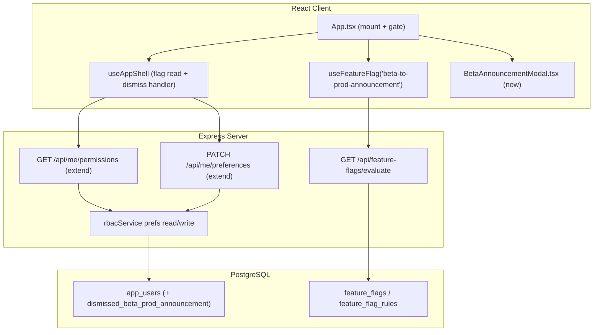
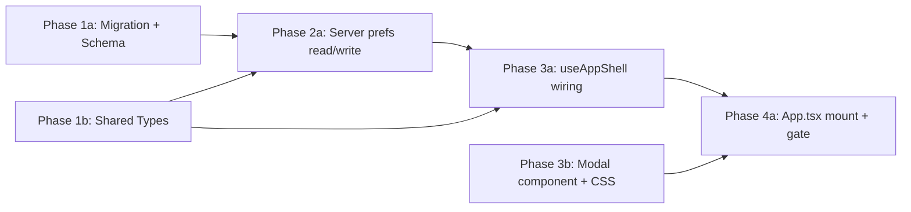

# Beta-to-Production Announcement Modal

## Current State

There is no mechanism to show an app-wide, blocking announcement. The closest analog is `Changelog` (`src/client/components/Changelog.tsx`), which is a dismissible-by-anyone overlay mounted in `App.tsx` and backed by per-user "last seen version" columns on `app_users`. We need a stronger variant: a modal that blocks all interaction for regular users (no dismiss), while letting platform admins permanently dismiss it.

The feature-flag system already exists and supports targeting `everyone | project | user | group` (`src/server/services/featureFlagService.ts`, `src/client/hooks/useFeatureFlags.ts`), so it can fully control rollout/visibility without new infrastructure. This MVP does NOT build a Pendo-style element picker; it renders one hardcoded, centered announcement.

## Architecture



## Database Schema

Create one migration: `npm run migrate:create -- add-beta-announcement-dismissal`

**`app_users`** (alter existing table)
- `dismissed_beta_prod_announcement` BOOLEAN NOT NULL DEFAULT false — true once a platform admin has dismissed the modal.

After creating the migration, add the column to the `appUsers` `pgTable` definition in `src/server/db/schema.ts` (alongside `showChangelogOnLogin`).

## Server Changes

### Service: `src/server/services/rbacService.ts` (edit)

Follow the existing `getChangelogPrefs` / `updateChangelogPrefs` pattern.
- Extend the prefs read (or add a small helper) to also return `dismissedBetaProdAnnouncement: boolean`.
- Extend `updateChangelogPrefs` (or add `updateBetaAnnouncementDismissed(userId, dismissed)`) to write the new column.

### Routes: `src/server/routes/api.ts` (edit — no new mount, `index.ts` untouched)

- `GET /api/me/permissions`: include `betaAnnouncementDismissed: boolean` in the response (near `showChangelogOnLogin`, ~line 3911-3930).
- `PATCH /api/me/preferences`: accept `dismissBetaAnnouncement?: boolean`; when `true`, set the column to true (~line 3936-3954).

| Method | Path | Auth | Body | Returns |
|--------|------|------|------|---------|
| `GET` | `/api/me/permissions` | session | — | `MyPermissionsResponse` (+ `betaAnnouncementDismissed`) |
| `PATCH` | `/api/me/preferences` | session | `{ dismissBetaAnnouncement?: boolean }` | `204` |

## Client Changes

### Shared types: `src/shared/types/rbac.ts` (edit)

Add `betaAnnouncementDismissed: boolean;` to `MyPermissionsResponse`.

### Hook: `src/client/hooks/useAppShell.ts` (edit)

- In the `/api/me/permissions` effect (~line 106-121), capture `betaAnnouncementDismissed` into new state `betaAnnouncementDismissed`.
- Add `handleDismissBetaAnnouncement` mirroring `handleMarkChangelogAsRead` (optimistic `setBetaAnnouncementDismissed(true)` + `PATCH /api/me/preferences` with `{ dismissBetaAnnouncement: true }`).
- Return `betaAnnouncementDismissed`, `handleDismissBetaAnnouncement`, and existing `isSuperAdmin`, `userId`, `selectedProject`.

### Component: `src/client/components/BetaAnnouncementModal.tsx` + `.module.css` (new)

- Props: `{ isSuperAdmin: boolean; onDismiss: () => void }`.
- Full-viewport blocking overlay: `position: fixed; inset: 0; z-index: 10000; backdrop-filter: blur(8px)` (match `.loading-overlay` in `App.css`), centered card using CSS variables (`--bg-primary`, `--text-primary`, `--accent-color`, etc.).
- Hardcoded copy: thanks the user for being part of the Apex beta initiative and announces the move to a production instance with new features and enhancements.
- Overlay has NO backdrop-click / Escape dismiss. Render the dismiss button ONLY when `isSuperAdmin` is true.
- Lock background scroll while open (`document.body.style.overflow = 'hidden'` in a `useEffect`, restore on unmount).
- `role="dialog"`, `aria-modal="true"`, `aria-labelledby`.

### `App.tsx` changes (edit)

Mount beside `Changelog` inside the main-shell return:

```tsx
{useFeatureFlag('beta-to-prod-announcement', selectedProject)
  && !(isSuperAdmin && betaAnnouncementDismissed) && (
  <BetaAnnouncementModal
    isSuperAdmin={isSuperAdmin}
    onDismiss={handleDismissBetaAnnouncement}
  />
)}
```

(Note: `useFeatureFlag` must be called at the top of the `App` component body, not inline in JSX — compute a `showBetaAnnouncement` boolean and reference it here.)

## Key Design Decisions

- **Lean on feature flags for visibility & targeting**: No new "announcement" DB tables. The `beta-to-prod-announcement` flag's kill switch and `everyone` rule control who sees it and when it turns off. "Keep on for X days" = admin flips the kill switch off manually (chosen over auto-expiry to avoid new infra).
- **Hardcoded copy (MVP)**: The announcement text lives in the component, not the DB. If editable content is needed later, promote it to `app_settings` without changing the gating.
- **Per-user boolean dismissal, super-admin only**: `dismissed_beta_prod_announcement` on `app_users` mirrors the changelog "seen" pattern. Non-super-admins get no dismiss control. Because it is a single boolean (not version-keyed), a future re-announcement would require resetting the column or migrating to a version key — acceptable for a one-time beta→prod message.
- **Dismiss audience = super-admin email allowlist** (`isSuperAdmin` from `useAppShell`), per the interview. Regular RBAC admins cannot dismiss.
- **Client-only enforcement (known limitation)**: A determined user with devtools can delete the overlay node; React will not forcibly re-add it, and there is no sensitive server data behind the modal (it is purely informational). True tamper-proofing is out of scope — the modal blocks normal interaction (pointer + scroll lock + top z-index) but is not a security boundary. Called out explicitly so no one assumes it gates protected data.
- **Mount point = main app shell** (beside `Changelog`). The pre-app `project-selector` and `platform-admin` early-return branches are not blocked; super admins reach Platform Admin (to toggle the flag) via that unblocked path even before dismissing.

## Feature Flag

- **Flag key**: `beta-to-prod-announcement` (create in Platform Admin > Feature Flags; super admin turns kill switch ON and adds an `everyone` targeting rule).
- **Server gating**: None required — the modal is purely client-side/informational with no protected endpoint. The dismissal prefs endpoints are always available.
- **Client gating**: `useFeatureFlag('beta-to-prod-announcement', selectedProject)` at the mount point in `App.tsx` (top-level split). When off → render nothing.
- **Disabled path**: Renders `null` (no modal); app behaves exactly as today.
- **Targeting**: Initial rollout rule = `everyone`. Can be narrowed to specific projects/groups/users using existing rule types if desired.

## Phase Summary and Parallelization



**Multitask parallelism:**
- Phase 1 (1a + 1b) — independent; run in parallel.
- Phase 2 (2a) — single server task; depends on Phase 1.
- Phase 3 (3a + 3b) — run in parallel; 3a depends on Phase 2 (needs the new response field), 3b (pure UI) only depends on Phase 1b for prop types and can effectively start once types exist.
- Phase 4 (4a) — single integration task; depends on 3a + 3b.

## Files Changed / Created

| Action | Path |
|--------|------|
| Create | `migrations/<ts>_add-beta-announcement-dismissal.sql` |
| Edit   | `src/server/db/schema.ts` |
| Edit   | `src/shared/types/rbac.ts` |
| Edit   | `src/server/services/rbacService.ts` |
| Edit   | `src/server/routes/api.ts` |
| Edit   | `src/client/hooks/useAppShell.ts` |
| Create | `src/client/components/BetaAnnouncementModal.tsx` |
| Create | `src/client/components/BetaAnnouncementModal.module.css` |
| Edit   | `src/client/App.tsx` |
