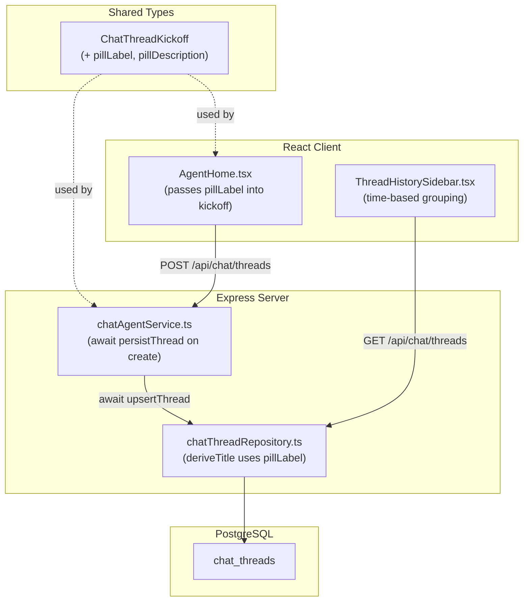
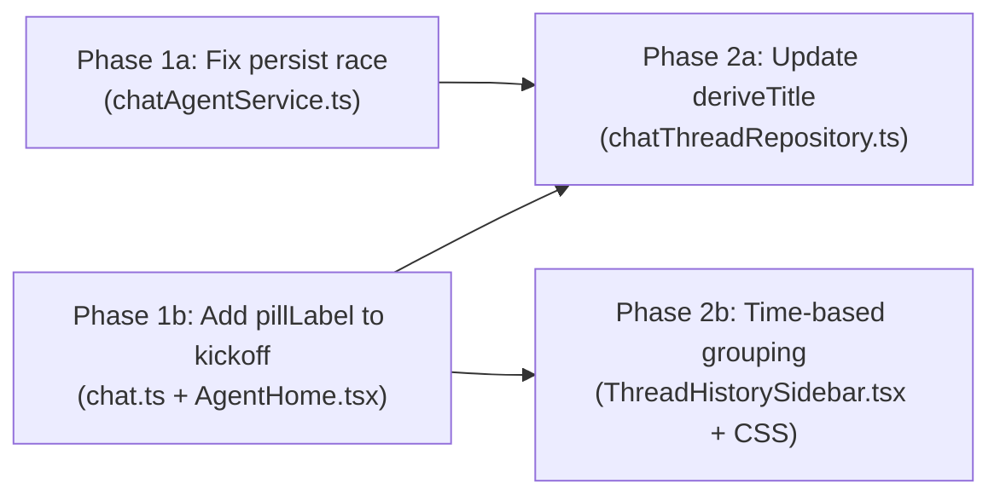

# Chat History from Home Page

## Current State

Threads are persisted to PostgreSQL via the `chatThreadRepository.ts` module. The persistence layer was built out in a prior design doc ([`chat-thread-history.md`](chat-thread-history.md)) and all todos there are marked done.

Three problems remain:

1. **Race condition on creation** — `persistThread()` in [`chatAgentService.ts`](../src/server/services/chatAgentService.ts) (line 105) fires `pgUpsertThread` without awaiting it. The `POST /api/chat/threads` handler returns the new `threadId` before the Postgres row exists. The client immediately invalidates the `chat-thread-list` query, the `GET` refetch hits Postgres, and the new thread is absent from the results.

2. **Poor thread titles** — [`deriveTitle()`](../src/server/services/chatThreadRepository.ts) (line 244) extracts the skill folder name from `kickoff.skillPath` (e.g., `"Grill With Docs"`). The `QuickSkillPill.label` (e.g., `"Document Griller"`) and its `description` are never passed into the kickoff, so the title is less user-friendly than the pill text users see on the home page. For MCP pills with no `skillPath`, the title falls back to `"Free chat"` even when a label exists.

3. **Flat history list** — [`ThreadHistorySidebar`](../src/client/components/ThreadHistorySidebar.tsx) renders all threads in a flat list sorted by `lastActivityAt`. There are no date-based section dividers, making it hard to scan.

## Architecture



## Database Schema

No migration required. The `chat_threads.kickoff` column is `JSONB` and already stores the full `ChatThreadKickoff` object. Adding `pillLabel` and `pillDescription` fields to the kickoff type simply adds new keys to the existing JSON — no DDL change needed. The `title` column (TEXT) is already present and will receive the improved derived title on the next `upsertThread` call.

## Server Changes

### 1. Fix persist race — [`chatAgentService.ts`](../src/server/services/chatAgentService.ts)

**Current (fire-and-forget):**

```typescript
function persistThread(thread: ChatThread) {
  pgUpsertThread(thread).catch((err: Error) =>
    console.error('[chat] pg upsertThread failed:', err.message),
  );
}
```

**New:** Add an async variant used only by `createThread`:

```typescript
async function persistThreadSync(thread: ChatThread): Promise<void> {
  await pgUpsertThread(thread);
}
```

In `createThread`, replace `persistThread(thread)` with `await persistThreadSync(thread)`. All other call sites (status updates, activity timestamps) remain fire-and-forget because their writes are not timing-sensitive.

### 2. Improve title derivation — [`chatThreadRepository.ts`](../src/server/services/chatThreadRepository.ts)

Update `deriveTitle()`:

```typescript
function deriveTitle(thread: ChatThread): string {
  // 1. Prefer explicit pill label from kickoff
  if (thread.kickoff.pillLabel) {
    const desc = thread.kickoff.pillDescription;
    return desc
      ? `${thread.kickoff.pillLabel} — ${desc}`.slice(0, 120)
      : thread.kickoff.pillLabel;
  }

  // 2. Fall back to skill folder name
  if (thread.kickoff.skillPath) {
    const parts = thread.kickoff.skillPath.split('/');
    const skillFolder = parts[parts.length - 2] ?? parts[parts.length - 1] ?? 'Skill';
    return skillFolder.replace(/-/g, ' ').replace(/\b\w/g, (c) => c.toUpperCase());
  }

  // 3. Fall back to first user message
  const firstUserMsg = thread.messages.find((m) => m.role === 'user');
  if (firstUserMsg?.text) {
    return firstUserMsg.text.slice(0, 80).replace(/\n/g, ' ').trim();
  }

  return 'Free chat';
}
```

## Shared Type Changes — [`chat.ts`](../src/shared/types/chat.ts)

Add two optional fields to `ChatThreadKickoff`:

```typescript
export interface ChatThreadKickoff {
  // ... existing fields ...
  /** Human-readable label from the QuickSkillPill or QuickMcpPill selected on the home page */
  pillLabel?: string;
  /** Short description from the pill, appended to the title */
  pillDescription?: string;
}
```

## Client Changes

### 3. Pass pill metadata into kickoff — [`AgentHome.tsx`](../src/client/components/AgentHome.tsx)

In `handleSend`, when building the kickoff object (~line 772), spread in the pill metadata:

```typescript
const result = await startChat.mutateAsync({
  kickoff: {
    project: selectedProject,
    repo: resolvedRepoName!,
    branch: defaultBranch,
    skillPath: effectiveSkillPath,
    freeformContext,
    model,
    ...(selectedMcpPill ? { mcpPill: selectedMcpPill } : {}),
    // NEW: pass pill label/description for thread title
    pillLabel: selectedQuickSkill?.label ?? selectedMcpPill?.label,
    pillDescription: selectedQuickSkill?.description ?? selectedMcpPill?.description ?? undefined,
  },
  skipAutoKickoff: !skillSlugOnlyKickoff,
});
```

### 4. Time-based grouping — [`ThreadHistorySidebar.tsx`](../src/client/components/ThreadHistorySidebar.tsx)

Add a `groupThreadsByDate` utility that buckets threads into four groups:

```typescript
type DateGroup = 'Today' | 'Yesterday' | 'Last 7 Days' | 'Older';

function groupThreadsByDate(threads: ChatThreadSummary[]): { label: DateGroup; threads: ChatThreadSummary[] }[] {
  const now = new Date();
  const startOfToday = new Date(now.getFullYear(), now.getMonth(), now.getDate());
  const startOfYesterday = new Date(startOfToday.getTime() - 86_400_000);
  const startOf7DaysAgo = new Date(startOfToday.getTime() - 7 * 86_400_000);

  const groups: Record<DateGroup, ChatThreadSummary[]> = {
    'Today': [],
    'Yesterday': [],
    'Last 7 Days': [],
    'Older': [],
  };

  for (const thread of threads) {
    const ts = new Date(thread.lastActivityAt).getTime();
    if (ts >= startOfToday.getTime()) groups['Today'].push(thread);
    else if (ts >= startOfYesterday.getTime()) groups['Yesterday'].push(thread);
    else if (ts >= startOf7DaysAgo.getTime()) groups['Last 7 Days'].push(thread);
    else groups['Older'].push(thread);
  }

  return (['Today', 'Yesterday', 'Last 7 Days', 'Older'] as DateGroup[])
    .filter((label) => groups[label].length > 0)
    .map((label) => ({ label, threads: groups[label] }));
}
```

Render grouped output with date dividers styled as sticky section headers (subtle, muted text separators):

```css
.dateGroupHeader {
  position: sticky;
  top: 0;
  padding: 8px 16px 4px;
  font-size: 0.7rem;
  font-weight: 600;
  text-transform: uppercase;
  letter-spacing: 0.05em;
  color: var(--text-muted);
  background: var(--bg-secondary);
}
```

### 5. CSS changes — [`ThreadHistorySidebar.module.css`](../src/client/components/ThreadHistorySidebar.module.css)

Add the `.dateGroupHeader` class above. No existing classes are removed.

## Key Design Decisions

- **Await only on creation:** Only `createThread` awaits the Postgres insert. All other `persistThread` calls (status transitions, activity timestamps) remain fire-and-forget to avoid blocking the SSE stream. The creation path is the only one with a timing-sensitive race condition.
- **No DB migration:** `pillLabel` and `pillDescription` are stored in the existing `kickoff` JSONB column. Older threads without these fields simply fall through to the folder-name or first-message heuristic in `deriveTitle`.
- **Title length cap:** The combined `pillLabel — pillDescription` string is truncated to 120 chars to avoid overflowing the sidebar row.
- **Groups use `lastActivityAt`:** Threads are bucketed by their last activity timestamp (not creation time), matching the existing sort order and giving the most intuitive "recent conversations" view.

## Phase Summary and Parallelization



**Multitask parallelism:**
- Phase 1 (1a + 1b) — no dependencies on each other; run in parallel
- Phase 2 (2a + 2b) — both depend on Phase 1b (shared types); 2a depends on 1a (persist fix must exist so title updates stick). 2a and 2b are independent of each other so they can run in parallel once Phase 1 is complete.

## Files Changed / Created

| Action | Path |
|--------|------|
| Edit   | `src/shared/types/chat.ts` |
| Edit   | `src/server/services/chatAgentService.ts` |
| Edit   | `src/server/services/chatThreadRepository.ts` |
| Edit   | `src/client/components/AgentHome.tsx` |
| Edit   | `src/client/components/ThreadHistorySidebar.tsx` |
| Edit   | `src/client/components/ThreadHistorySidebar.module.css` |
