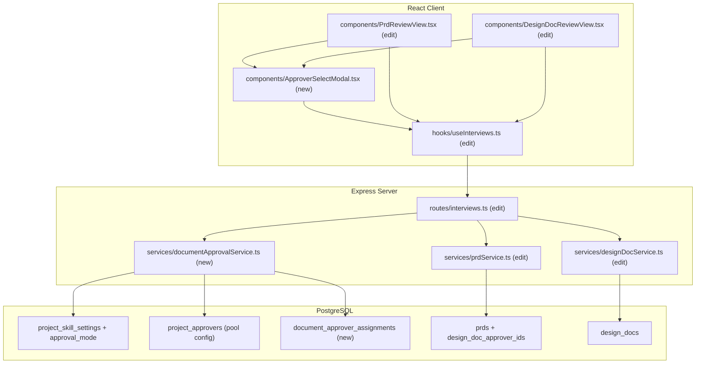
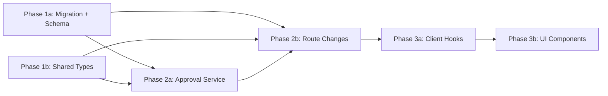

# Document Approver Assignments

## Current State

The `project_approvers` table and admin UI already exist — admins can configure which users are available as approvers per project per document type (`design_doc` or `prd`). However, this configuration is not wired into the actual review workflow:

1. **No author-facing assignment** — "Submit for Review" is a one-click action on both PRDs and design docs. Authors cannot choose which approver(s) should review their document.

2. **No enforcement** — Anyone with the `prds:review` or `design-docs:review` RBAC permission can approve any document. The `project_approvers` pool is purely informational.

3. **Single reviewer tracking** — Both `prds.reviewer_id` and `design_docs.reviewer_id` track a single reviewer post-hoc. There's no concept of "assigned but not yet responded" or "multiple approvers required."

4. **Design doc auto-flow** — Design docs auto-transition through `generating` → `validating` → `pending_review` without any user interaction, so there's no natural moment for the author to assign approvers.

### Key files today

- `src/server/services/prdService.ts` — `submitForReview()`, `reviewPrd()` (no approver check)
- `src/server/services/designDocService.ts` — `submitForReview()`, `reviewDesignDoc()` (no approver check)
- `src/server/services/projectSettingsService.ts` — `getApproversForDocument()` (exists but unused in review flow)
- `src/server/routes/interviews.ts` — `POST .../submit`, `POST .../review` endpoints
- `src/client/components/PrdReviewView.tsx` — submit/review buttons
- `src/client/components/DesignDocReviewView.tsx` — submit/review buttons
- `src/shared/types/interview.ts` — `PrdSummary`, `DesignDocSummary`, review request types

## Architecture



## Database Schema

Create migration: `npm run migrate:create -- document-approver-assignments`

**`document_approver_assignments`** (new table)
- `id` UUID PK DEFAULT gen_random_uuid()
- `document_id` UUID NOT NULL — references either prds.id or design_docs.id (no FK constraint due to polymorphism)
- `document_type` TEXT NOT NULL CHECK (document_type IN ('prd', 'design_doc'))
- `approver_user_id` TEXT NOT NULL REFERENCES app_users(oid) ON DELETE CASCADE
- `status` TEXT NOT NULL DEFAULT 'pending' CHECK (status IN ('pending', 'approved', 'revision_requested'))
- `comment` TEXT — reviewer's comment when responding
- `responded_at` TIMESTAMPTZ — when the approver responded
- `assigned_at` TIMESTAMPTZ NOT NULL DEFAULT now()
- `assigned_by` TEXT NOT NULL — the author who assigned (Azure OID)
- UNIQUE constraint on `(document_id, document_type, approver_user_id)`
- INDEX on `(document_id, document_type)`
- INDEX on `(approver_user_id, status)` — for "my pending reviews" queries

**ALTER `project_skill_settings`** — add column:
- `approval_mode` TEXT NOT NULL DEFAULT 'any_one' CHECK (approval_mode IN ('any_one', 'all_required'))

**ALTER `prds`** — add column:
- `design_doc_approver_ids` JSONB DEFAULT NULL — stores `string[]` of user OIDs selected at PRD submit time; propagated to design docs on creation

After creating the migration, update `src/server/db/schema.ts` with:
- `documentApproverAssignments` pgTable definition + relations
- `approvalMode` column on `projectSkillSettings`
- `designDocApproverIds` column on `prds`

## Server Changes

### Service: `src/server/services/documentApprovalService.ts` (new)

Follow patterns from `src/server/services/projectSettingsService.ts` (Drizzle queries, typed returns).

- `assignApprovers(documentId: string, documentType: 'prd' | 'design_doc', approverUserIds: string[], assignedBy: string): Promise<DocumentApproverAssignment[]>` — creates assignment rows; validates all userIds are in the project's configured pool
- `getAssignments(documentId: string, documentType: 'prd' | 'design_doc'): Promise<DocumentApproverAssignment[]>` — returns all assignments with joined user display names
- `recordApproverResponse(documentId: string, documentType: 'prd' | 'design_doc', approverUserId: string, status: 'approved' | 'revision_requested', comment?: string): Promise<void>` — updates one assignment row
- `isApprovalComplete(documentId: string, documentType: 'prd' | 'design_doc', project: string): Promise<{ complete: boolean; mode: ApprovalMode }>` — checks if threshold met based on project's `approval_mode`
- `isAssignedApprover(documentId: string, documentType: 'prd' | 'design_doc', userId: string): Promise<boolean>` — checks if a user is an assigned approver for this document
- `getAvailableApprovers(project: string, documentType: 'prd' | 'design_doc', excludeUserId?: string): Promise<ProjectApprover[]>` — wraps `getApproversForDocument` and excludes the author
- `propagateDesignDocApprovers(prdId: string, designDocId: string, assignedBy: string): Promise<void>` — reads `prds.design_doc_approver_ids` and creates assignment rows for a new design doc

### Service edits: `src/server/services/prdService.ts`

- `submitForReview(id, userId)` → `submitForReview(id, userId, opts: { prdApproverIds: string[], designDocApproverIds: string[] })` — stores `designDocApproverIds` on the PRD row; calls `assignApprovers` for PRD approvers
- `reviewPrd(id, reviewerId, opts)` — add check: `isAssignedApprover(id, 'prd', reviewerId)` or `isAdminUser(reviewerId)`; call `recordApproverResponse`; check `isApprovalComplete` before transitioning to `approved`

### Service edits: `src/server/services/designDocService.ts`

- `submitForReview(id, userId)` → `submitForReview(id, userId, opts?: { approverIds?: string[] })` — for manual submission only; calls `assignApprovers`
- `reviewDesignDoc(id, reviewerId, opts)` — add same enforcement as PRD review
- `syncPerFeatureDesignDocs(...)` / `startDesignDocWatcher(...)` — after creating a design doc row, call `propagateDesignDocApprovers(prdId, newDocId, authorId)`
- `syncValidationResult(...)` — no change needed; approvers are already assigned at creation time

### Routes: `src/server/routes/interviews.ts` (edit)

| Method | Path | Changes |
|--------|------|---------|
| `POST` | `/prds/:prdId/submit` | Accept body: `{ prdApproverIds: string[], designDocApproverIds: string[] }` |
| `POST` | `/prds/:prdId/review` | Enforce assigned approver (or admin); record per-approver response; check completion threshold |
| `GET` | `/prds/:prdId/assignments` | New: return `DocumentApproverAssignment[]` for this PRD |
| `POST` | `/design-docs/:id/submit` | Accept body: `{ approverIds: string[] }` (manual submit path) |
| `POST` | `/design-docs/:id/review` | Same enforcement as PRD |
| `GET` | `/design-docs/:id/assignments` | New: return `DocumentApproverAssignment[]` for this design doc |
| `GET` | `/available-approvers/:project/:documentType` | New: return available approvers for project+type (excludes requesting user) |

## Client Changes

### Hook edits: `src/client/hooks/useInterviews.ts`

- `useSubmitPrd()` — mutationFn accepts `{ prdId, prdApproverIds, designDocApproverIds }` body; POST with JSON
- `useSubmitDesignDoc()` — mutationFn accepts `{ designDocId, approverIds }` body; POST with JSON
- `useAvailableApprovers(project: string, documentType: 'prd' | 'design_doc')` — new query hook hitting `GET /api/interviews/available-approvers/:project/:documentType`
- `useDocumentAssignments(documentId: string | null, documentType: 'prd' | 'design_doc')` — new query hook hitting `GET /api/interviews/prds/:id/assignments` or `GET /api/interviews/design-docs/:id/assignments`

### Component: `src/client/components/ApproverSelectModal.tsx` (new)

Modal shown when the author clicks "Submit for Review" on a PRD:
- Two sections: "PRD Approvers" and "Design Doc Approvers"
- Each section lists available approvers as selectable chips (name + avatar initial)
- At least one approver required in each section
- Confirm button triggers the submit mutation with selected IDs
- CSS Module: `ApproverSelectModal.module.css`

When shown for a design doc (manual submit), only shows one section: "Design Doc Approvers."

Props:
```typescript
interface ApproverSelectModalProps {
  documentType: 'prd' | 'design_doc';
  project: string;
  onConfirm: (selections: { prdApproverIds?: string[]; designDocApproverIds?: string[]; approverIds?: string[] }) => void;
  onCancel: () => void;
  isSubmitting?: boolean;
}
```

### Component edits: `src/client/components/PrdReviewView.tsx`

- Replace direct `submitPrd.mutateAsync(id)` with opening the `ApproverSelectModal`
- Add approver status panel below the status badge when status is `pending_review`:
  - Shows each assigned approver with their response status (pending/approved/revision_requested)
  - Uses `useDocumentAssignments` hook
- Gate the Approve/Revision buttons: disabled if `userId` is not in assignments list AND not admin
- Show tooltip: "You are not an assigned approver for this document" when disabled

### Component edits: `src/client/components/DesignDocReviewView.tsx`

- Same pattern as PrdReviewView: modal on manual submit, approver status panel, gated review buttons

### Admin settings: `src/client/components/AdminProjectSettings.tsx`

- Add "Approval Mode" toggle (`Any One` / `All Required`) to the Approvers accordion section
- Wire to existing PUT endpoint (add `approvalMode` to the upsert payload)

## Key Design Decisions

- **Single assignment moment at PRD submit** — The author selects both PRD approvers and design doc approvers in one modal when submitting the PRD for review. Design doc approver selections are stored on the PRD row (`design_doc_approver_ids` JSONB) and auto-propagated when design docs are created. This avoids forcing a manual step after auto-generated design docs pass validation.

- **Polymorphic assignment table** — A single `document_approver_assignments` table handles both PRDs and design docs using a `document_type` discriminator column. This is simpler than two separate tables and allows shared service logic. No FK constraint on `document_id` since it references two tables, but the UNIQUE constraint prevents duplicates.

- **Enforcement with admin override** — Assigned approvers are strictly enforced for members (only assigned users can approve). Admins bypass via the existing `isAdminUser()` helper, consistent with all other permission patterns in the codebase.

- **Configurable approval mode** — `approval_mode` on `project_skill_settings` allows per-project configuration of `any_one` (first approval wins) vs `all_required` (all must approve). Default is `any_one` for backward compatibility. In `all_required` mode, a single "revision requested" from any approver immediately transitions the document to `revision_requested`.

- **Backward-compatible `reviewer_id`** — The existing `reviewer_id` / `reviewerName` columns are still populated when a document reaches `approved` (set to the final/first approver). This preserves existing UI that shows "Reviewed by X on date."

- **Design doc manual submit fallback** — If a design doc needs re-submission after revision, the author sees the same approver modal (design doc approvers only). They can change approvers at this point if needed.

## Phase Summary and Parallelization



**Multitask parallelism:**
- Phase 1 (1a + 1b) — no dependencies on each other; run in parallel
- Phase 2 (2a + 2b) — both depend on Phase 1; 2b imports from 2a so run 2a first, then 2b (or coordinate on function signatures)
- Phase 3 (3a + 3b) — 3b depends on 3a for hook APIs; run sequentially or coordinate interfaces

## Files Changed / Created

| Action | Path |
|--------|------|
| Create | `migrations/<ts>_document-approver-assignments.sql` |
| Edit   | `src/server/db/schema.ts` |
| Create | `src/shared/types/approvals.ts` |
| Edit   | `src/shared/types/projectSettings.ts` |
| Create | `src/server/services/documentApprovalService.ts` |
| Edit   | `src/server/services/prdService.ts` |
| Edit   | `src/server/services/designDocService.ts` |
| Edit   | `src/server/routes/interviews.ts` |
| Edit   | `src/client/hooks/useInterviews.ts` |
| Create | `src/client/components/ApproverSelectModal.tsx` |
| Create | `src/client/components/ApproverSelectModal.module.css` |
| Edit   | `src/client/components/PrdReviewView.tsx` |
| Edit   | `src/client/components/DesignDocReviewView.tsx` |
| Edit   | `src/client/components/AdminProjectSettings.tsx` |
