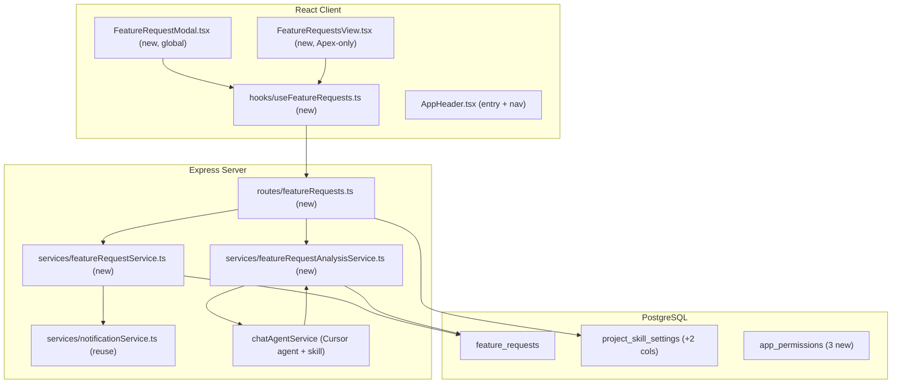
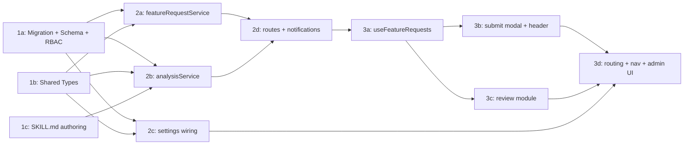

# Feature Requests

## Current State

There is no way for users to submit product feature requests inside AI-Pilot, and no place for the Apex team (the builders of AI-Pilot) to triage them. Related building blocks already exist and will be reused:

- **Notifications** — `createNotification(userId, {...})` in [src/server/services/notificationService.ts](src/server/services/notificationService.ts) delivers both in-app (SSE) and Teams (Bot Framework). There is no "notify all project members" primitive; each feature resolves its own recipients.
- **Modules** — gated by a per-project menu key in `project_menu_settings` (Platform Admin > Menu) plus a global RBAC permission. See [src/shared/types/menuSettings.ts](src/shared/types/menuSettings.ts) and [src/client/components/AppHeader.tsx](src/client/components/AppHeader.tsx). Apex is a virtual project with name `"Apex"` ([src/server/services/projectCatalogService.ts](src/server/services/projectCatalogService.ts)).
- **AI skill + model selection** — `project_skill_settings` maps each workflow to a `SKILL.md` path + model, managed in [src/client/components/AdminProjectSettings.tsx](src/client/components/AdminProjectSettings.tsx). The **validation adapter pattern** in [src/server/services/documentValidationService.ts](src/server/services/documentValidationService.ts) spawns a Cursor-agent thread that writes an output JSON, polled by a watcher, then persisted to Postgres.
- **Project membership** — `user_project_assignments (user_id, project)` records which users belong to a project. Roles/permissions live in `app_user_roles` / `app_role_permissions`.

## Architecture



## Database Schema

Create migrations: `npm run migrate:create -- feature-requests` and `npm run migrate:create -- feature-request-permissions` (RBAC seeds may be a separate migration for clarity).

**`feature_requests`**
- `id` UUID PK DEFAULT gen_random_uuid()
- `title` TEXT NOT NULL
- `request` TEXT NOT NULL — the request body
- `advantage` TEXT NOT NULL — what advantage it brings the user
- `submitted_by` TEXT NOT NULL REFERENCES app_users(oid) ON DELETE CASCADE
- `source_project` TEXT NOT NULL — project the submitter was in
- `status` TEXT NOT NULL DEFAULT 'new' — `new | under-review | planned | declined | done`
- `ai_status` TEXT NOT NULL DEFAULT 'pending' — `pending | analyzing | complete | failed`
- `ai_priority` TEXT — `low | medium | high | critical` (AI suggested)
- `ai_risk` TEXT — `low | medium | high` (AI suggested)
- `ai_rationale` TEXT — the AI's thought/explanation
- `ai_thread_id` TEXT — analysis chat thread id (nullable)
- `team_priority` TEXT — team override (same enum as ai_priority)
- `team_risk` TEXT — team override (same enum as ai_risk)
- `rank` INTEGER — manual ordering within the Apex list (nullable)
- `reviewed_by` TEXT — last Apex user to update
- `created_at` TIMESTAMPTZ NOT NULL DEFAULT now()
- `updated_at` TIMESTAMPTZ NOT NULL DEFAULT now()
- INDEX on `(status, created_at DESC)`; INDEX on `(submitted_by)`

**`project_skill_settings` (add 2 columns)** — mirror the `prd_validation_*` pattern:
- `feature_request_skill_path` TEXT
- `feature_request_model` TEXT

**RBAC permissions (seed into `app_permissions` + `app_role_permissions`)**
- `feature-requests:submit` — assigned to `admin` + `member` (effectively any real user; global submit)
- `feature-requests:view` — assigned to `admin` (Apex review module read)
- `feature-requests:manage` — assigned to `admin` (rank / status / override / re-analyze)

After each migration, update [src/server/db/schema.ts](src/server/db/schema.ts) with the matching `pgTable` + `relations()`.

## Server Changes

### Service: `src/server/services/featureRequestService.ts` (new)

Follow Drizzle patterns from [src/server/services/chatThreadRepository.ts](src/server/services/chatThreadRepository.ts).

- `createFeatureRequest(userId, project, { title, request, advantage }): Promise<FeatureRequest>` — inserts row (`ai_status: 'pending'`), returns it.
- `listFeatureRequests(opts?): Promise<FeatureRequest[]>` — ordered by `rank NULLS LAST, created_at DESC`; joins submitter display name.
- `getFeatureRequest(id): Promise<FeatureRequest | null>`
- `updateFeatureRequest(id, userId, patch): Promise<FeatureRequest>` — status / team_priority / team_risk / rank; sets `reviewed_by`, `updated_at`.
- `resolveApexReviewers(): Promise<string[]>` — users in `user_project_assignments` where `project = 'Apex'` that hold `feature-requests:manage`, unioned with super admins; deduped. Used for notifications.

### Service: `src/server/services/featureRequestAnalysisService.ts` (new)

Mirror the adapter/watcher pattern in [src/server/services/documentValidationService.ts](src/server/services/documentValidationService.ts).

- `autoStartFeatureRequestAnalysis(requestId): Promise<void>`
  - `resolveSkillConfig({ project: 'Apex' })` → `skillPath = config.featureRequestSkillPath`, `model = config.featureRequestModel ?? getDefaultModel()`.
  - If no skill configured, mark `ai_status = 'failed'` and return (module still works, just no AI).
  - `createChatThread(submitter, { project: 'Apex', repo, branch, skillPath, model, freeformContext })` where `freeformContext` = title/request/advantage. Store `ai_thread_id`, set `ai_status = 'analyzing'`.
  - Start a watcher polling `.ai-pilot/output/feature-request-analysis.json` (shape `{ priority, risk, rationale }`), timeout-guarded. On success persist `ai_priority/ai_risk/ai_rationale`, set `ai_status = 'complete'`; on failure set `'failed'`.
- `reanalyzeFeatureRequest(requestId)` — manage-only re-run.

### Routes: `src/server/routes/featureRequests.ts` (new)

Mount at `/api/feature-requests` behind `ensureAuthenticated` in [src/server/index.ts](src/server/index.ts) (protected file — mount line only, with permission).

| Method | Path | Auth | Body / Params | Returns |
|--------|------|------|---------------|---------|
| `POST` | `/` | `feature-requests:submit` | `{ title, request, advantage, project }` | `201` + created request; fires analysis + notifications |
| `GET` | `/` | `feature-requests:view` + project must be `Apex` | `?project=Apex` | `FeatureRequest[]` |
| `GET` | `/:id` | `feature-requests:view` | — | `FeatureRequest` |
| `PATCH` | `/:id` | `feature-requests:manage` | `{ status?, teamPriority?, teamRisk?, rank? }` | updated request |
| `POST` | `/:id/reanalyze` | `feature-requests:manage` | — | `202` |

On `POST /`: after create, call `resolveApexReviewers()` and `createNotification(reviewerId, { type: 'user-action', title: 'New feature request', body: title, link: '/feature-requests' })` per reviewer (this also delivers to Teams). Then fire `autoStartFeatureRequestAnalysis(id)` (fire-and-forget). Enforce `project === 'Apex'` server-side on list/view/manage endpoints.

## Client Changes

### Hook: `src/client/hooks/useFeatureRequests.ts` (new)

```typescript
export function useFeatureRequests() {
  return useQuery<FeatureRequest[]>({
    queryKey: ['feature-requests'],
    queryFn: () => apiFetch('/api/feature-requests?project=Apex'),
    staleTime: 15_000,
  });
}
// + useSubmitFeatureRequest(), useUpdateFeatureRequest(), useReanalyzeFeatureRequest()
```

### Component: `src/client/components/FeatureRequestModal.tsx` (new, global)

- Triggered from a "Request a Feature" entry in [src/client/components/AppHeader.tsx](src/client/components/AppHeader.tsx), visible to users with `feature-requests:submit` in any project.
- `react-hook-form` + `zod`; **all three fields required**: Title, Request, Advantage. Submits the current `selectedProject` as `project`.
- CSS Module using variables from `App.css`.

### Component: `src/client/components/FeatureRequestsView.tsx` (new, Apex-only)

- Lazy-loaded at `/feature-requests`. Lists requests with AI priority/risk badges, AI rationale, submitter, status.
- Team controls (with `feature-requests:manage`): override priority/risk, change status dropdown, drag/keyboard re-rank (persist `rank` via PATCH), re-analyze button.
- CSS Module using `App.css` variables.

### `App.tsx` + `AppHeader.tsx` changes

- Add `'feature-requests'` to `CurrentView` union; add `/feature-requests` path matching; lazy-import `FeatureRequestsView` in `Suspense` + `ErrorBoundary`.
- Route guard: `selectedProject === 'Apex' && enabledViews.includes('feature-requests') && can('feature-requests:view')` (redirect to `/home` otherwise; super admin skips menu check).
- Nav item in `AppHeader.tsx` with the same Apex-name guard (mirrors the extra-guard pattern used for `my-work`).

### `AdminProjectSettings.tsx` changes

- Add "Feature Request Analysis" skill-path + model dropdown fields, wired to the new `feature_request_skill_path` / `feature_request_model` config.

## Key Design Decisions

- **Global submit, Apex-only review**: submission is available to any authenticated user in any project via a header entry (`feature-requests:submit`), but the review module and all list/manage endpoints enforce `project === 'Apex'`. This centralizes triage with the AI-Pilot builders.
- **"Apex admins" as recipients**: RBAC is global, so `resolveApexReviewers()` intersects `user_project_assignments (project = 'Apex')` with holders of `feature-requests:manage`, plus super admins. This operationalizes "admin users within Apex" without a new project-scoped permission model.
- **AI via Cursor-agent skill + per-project override**: analysis uses the existing skill/model pattern (`feature_request_skill_path` + `feature_request_model` on `project_skill_settings`), so Apex ships a default skill but any project can later point at its own repo/skill/model. Runs async via the validation watcher pattern so submission is never blocked on the LLM.
- **AI suggests, team decides**: AI writes `ai_priority/ai_risk/ai_rationale`; the team can override via `team_priority/team_risk`, set `status`, and manually re-order via `rank`. AI values are preserved for reference.
- **Apex-only hardening beyond the menu toggle**: because unconfigured projects default to all menu keys on, we also add a structural `selectedProject === 'Apex'` guard (client nav + route + server endpoints). Platform Admin > Menu then controls on/off *within* Apex, matching the requested admin control.
- **No feature flag**: per decision, gating relies on the Apex-only menu setting + RBAC permissions.

## Phase Summary and Parallelization



**Multitask parallelism:**
- **Phase 1 (1a, 1b, 1c)** — no interdependencies; run all three in parallel.
- **Phase 2 (2a, 2b, 2c)** — start in parallel once Phase 1 is done; **2d** depends on 2a + 2b (coordinate on service signatures first). 2c is independent of 2a/2b.
- **Phase 3 (3a → 3b/3c → 3d)** — 3a first (needs 2d endpoints); 3b and 3c run in parallel after 3a; 3d integrates last.

## Files Changed / Created

| Action | Path |
|--------|------|
| Create | `migrations/<ts>_feature-requests.sql` |
| Create | `migrations/<ts>_feature-request-permissions.sql` |
| Edit   | `src/server/db/schema.ts` |
| Create | `src/shared/types/featureRequest.ts` |
| Edit   | `src/shared/types/projectSettings.ts` |
| Edit   | `src/shared/types/menuSettings.ts` |
| Create | `src/server/services/featureRequestService.ts` |
| Create | `src/server/services/featureRequestAnalysisService.ts` |
| Edit   | `src/server/services/projectSettingsService.ts` |
| Create | `src/server/routes/featureRequests.ts` |
| Edit   | `src/server/routes/api.ts` (skill-config response) |
| Edit   | `src/server/index.ts` (mount route — protected file) |
| Create | `src/client/hooks/useFeatureRequests.ts` |
| Create | `src/client/components/FeatureRequestModal.tsx` (+ `.module.css`) |
| Create | `src/client/components/FeatureRequestsView.tsx` (+ `.module.css`) |
| Edit   | `src/client/components/AppHeader.tsx` |
| Edit   | `src/client/App.tsx` |
| Edit   | `src/client/components/AdminProjectSettings.tsx` |
| Create | `<apex-skill-repo>/skills/feature-request-analysis/SKILL.md` (authored content; added to Apex ADO skill repo) |
