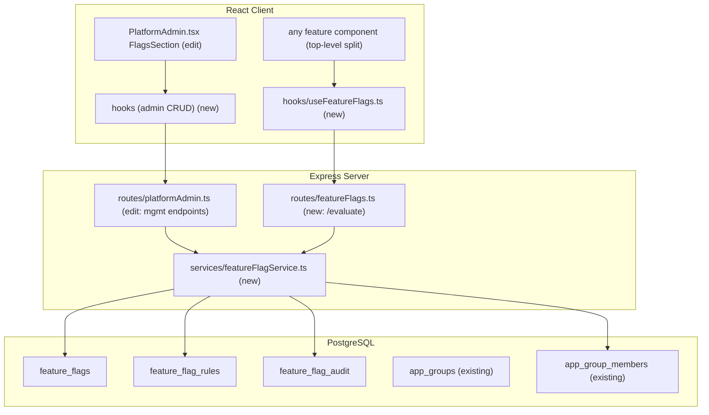
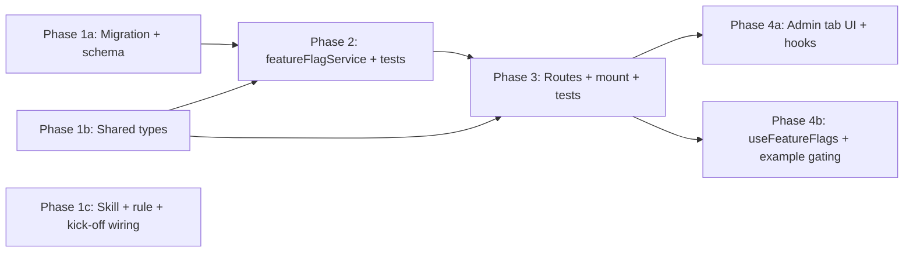

# Feature Flags System

In-house, boolean feature flags gating this AI-Pilot app's own features. Default OFF; ON only for explicitly targeted projects, users, or project-scoped groups (allow-list). Per-flag kill switch, audit log, lifecycle/staleness metadata, super-admin-only management UI, client evaluation hook, plus an authored skill + rule wired into `/kick-off`.

Note: This plan is the design doc. On approval (agent mode), the first action is to write it to `design-docs/feature-flags.md` using the kick-off template frontmatter, then implement.

## Current State

- No feature-flag tables, service, or UI exist. Gating today is only RBAC permissions (`can()` / `requirePermission`), which are coarse, global, and not project/user/group targeted.
- Platform Admin (`src/client/components/PlatformAdmin.tsx`) is super-admin-only with local-state tabs via the `PlatformAdminTab` union (currently `'access' | 'menu'`) — the natural home for a flags tab.
- There is no `projects` table: a project is a TEXT name. Users = `app_users.oid`. Project-scoped groups already exist: `app_groups` (has `project` column) + `app_group_members`. This satisfies "groups within projects" directly.
- Service/test/route/hook patterns are established by `rbacService.ts` + `__tests__/rbacService.test.ts`, `routes/admin.ts`, and `hooks/useRbac.ts`. Migrations use `node-pg-migrate` SQL files, with `schema.ts` kept in sync manually.

## Architecture

## Database Schema

Single migration via `npm run migrate:create -- add-feature-flags`, then sync `src/server/db/schema.ts`.

`feature_flags`
- `id` UUID PK DEFAULT gen_random_uuid()
- `key` TEXT UNIQUE NOT NULL — stable identifier used in code, e.g. `new-dashboard`
- `description` TEXT
- `enabled` BOOLEAN NOT NULL DEFAULT false — master kill switch; when false the flag is OFF for everyone regardless of rules
- `lifecycle` TEXT NOT NULL DEFAULT 'active' — one of `active | stale | archived` (typed via `$type<FlagLifecycle>()`)
- `cleanup_ready` BOOLEAN NOT NULL DEFAULT false — marker the cleanup skill reads
- `created_by` TEXT, `created_at` TIMESTAMPTZ NOT NULL DEFAULT now(), `updated_at` TIMESTAMPTZ NOT NULL DEFAULT now()

`feature_flag_rules` (targeting; allow-list)
- `id` UUID PK DEFAULT gen_random_uuid()
- `flag_id` UUID NOT NULL REFERENCES feature_flags(id) ON DELETE CASCADE
- `type` TEXT NOT NULL — one of `everyone | project | user | group`
- `value` TEXT — `project`: project name; `user`: `app_users.oid`; `group`: `app_groups.id`; `everyone`: NULL
- `created_by` TEXT, `created_at` TIMESTAMPTZ NOT NULL DEFAULT now()
- INDEX on `(flag_id)`

`feature_flag_audit`
- `id` UUID PK DEFAULT gen_random_uuid()
- `flag_id` UUID REFERENCES feature_flags(id) ON DELETE SET NULL
- `flag_key` TEXT NOT NULL — snapshot so history survives deletion
- `action` TEXT NOT NULL — e.g. `created | updated | enabled | disabled | rule_added | rule_removed | lifecycle_changed | deleted`
- `actor_id` TEXT, `actor_email` TEXT
- `details` JSONB — typed `FlagAuditDetails`
- `created_at` TIMESTAMPTZ NOT NULL DEFAULT now()
- INDEX on `(flag_id, created_at DESC)`

Add Drizzle `relations()`: `feature_flags` has many `rules` and many `audit`.

## Evaluation Semantics (default-off allow-list + kill switch)

`evaluateFlags(ctx)` where `ctx = { userId, email, project, groupIds }` returns `Record<flagKey, boolean>`:
- If `flag.enabled === false` -> `false` (kill switch wins).
- Else `true` if ANY rule matches: `everyone` -> always; `project` -> `value === ctx.project`; `user` -> `value === ctx.userId`; `group` -> `ctx.groupIds.includes(value)`.
- Else `false`.
- `groupIds` are the current user's `app_group_members` group ids resolved for the current project context (new helper, project-filtered join on `app_groups.project`). This is how "groups within projects" targeting works.
- `lifecycle === 'archived'` flags are excluded from evaluation (treated OFF) but kept for audit/history.

## Server Changes

### Service: `src/server/services/featureFlagService.ts` (new)
Follows `rbacService.ts` (named exports, Drizzle `db`, transactions, audit writes inside the same tx).
- `listFlags(): Promise<FeatureFlagWithRules[]>`
- `getFlag(id): Promise<FeatureFlagWithRules | null>`
- `createFlag(input, actor): Promise<FeatureFlag>` — validates key uniqueness + format, writes audit
- `updateFlag(id, patch, actor)` — enabled/description/lifecycle/cleanup_ready; writes audit
- `addRule(flagId, rule, actor)` / `removeRule(ruleId, actor)` — writes audit
- `deleteFlag(id, actor)` — cascade rules, audit `deleted`
- `getFlagAudit(flagId)`
- `getUserGroupIdsForProject(userId, project): Promise<string[]>` — join `app_group_members`/`app_groups` filtered by project
- `evaluateFlags(ctx): Promise<Record<string, boolean>>`
- `isFeatureEnabled(key, ctx): Promise<boolean>` — server-side gating helper for routes

Test: `src/server/__tests__/featureFlagService.test.ts` mocking `../db/drizzle` (same pattern as `rbacService.test.ts`), with focused unit tests on `evaluateFlags` matching logic (kill switch, each rule type, archived exclusion).

### Routes
- Management (super-admin) added to existing `src/server/routes/platformAdmin.ts` (already `router.use(requireSuperAdmin)`), under `/api/platform-admin/feature-flags`:
  - `GET /feature-flags` -> list with rules
  - `POST /feature-flags` -> create
  - `PATCH /feature-flags/:id` -> update (toggle enabled/kill switch, lifecycle, cleanup_ready)
  - `DELETE /feature-flags/:id`
  - `POST /feature-flags/:id/rules` / `DELETE /feature-flags/:id/rules/:ruleId`
  - `GET /feature-flags/:id/audit`
- Evaluation (all authenticated users): new `src/server/routes/featureFlags.ts` -> `GET /api/feature-flags/evaluate?project=...` returns `Record<string, boolean>`. Reads `getUserId(req)` / `getUserEmail(req)` and `req.query.project`.
- Mount in `src/server/index.ts` (PROTECTED FILE — one added line): `app.use('/api/feature-flags', ensureAuthenticated, featureFlagRoutes);`. Requires explicit approval (included here).
- Route tests mock the service module (pattern from `adminRoutes.test.ts`).

## Client Changes

### Admin hooks
Add flag CRUD hooks (React Query) following `usePlatformAdmin.ts` / `useRbac.ts` shape (`apiFetch`, `useQuery`, `useMutation` + `invalidateQueries`). Either extend `usePlatformAdmin.ts` or add `src/client/hooks/usePlatformAdminFeatureFlags.ts`. Keys under `['platform-admin','feature-flags']`.

### Platform Admin tab
- Extend `PlatformAdminTab` union to include `'flags'`.
- Add a `<button role="tab">` in the existing `tabBar` and a matching `role="tabpanel"`.
- New `FeatureFlagsSection` (sub-component in `PlatformAdmin.tsx` consistent with `AccessRequestsSection`/`MenuVisibilitySection`, or a dedicated component + CSS Module). Capabilities: list flags with enabled/lifecycle badges; create flag (react-hook-form + zod); toggle kill switch; add/remove targeting rules choosing type `everyone | project | user | group` with pickers (projects from `usePlatformAdminProjects`, users from `usePlatformAdminUsers`, groups via a groups-by-project fetch); lifecycle controls (active/stale/archived, cleanup_ready); view audit. Styling via CSS variables/tokens per `ui-design-standards`.

### Evaluation hook + gating
- `src/client/hooks/useFeatureFlags.ts` -> `useFeatureFlags(project)` querying `/api/feature-flags/evaluate?project=...`, plus a `useFeatureFlag(key, project)` convenience returning boolean. Keyed by project; `staleTime` ~60s; invalidated when admin mutates.
- Demonstrate the "top-level split" by gating one existing entry point (a small, reversible example) so the pattern is concrete for the skill.

## Skill and Rule (authored assets)

### Skill: `.cursor/skills/feature-flags/SKILL.md` (new, WITH frontmatter)
Frontmatter `description` triggers on "feature flag" mentions (wrap/gate/rollout/retire/clean up). Body documents two workflows:
1. Wrap an existing feature ("top-level split"): create flag (admin UI or seed migration) -> add `isFeatureEnabled(key, ctx)` guard on server route/branch -> wrap the feature's top-level client entry point with `useFeatureFlag(key)`, keeping the legacy path in the `else` branch -> key naming conventions -> add targeting rules in the admin tab.
2. Automated cleanup/retire: detect `cleanup_ready` / `stale` flags -> find ALL references (`useFeatureFlag('key')`, `useFeatureFlags`, `isFeatureEnabled('key')`) -> inline the winning branch (keep the ON path, delete the dead else) -> remove flag + rules via a `node-pg-migrate` migration (audit row retained) -> set lifecycle archived/delete -> run `tsc` (both configs) + tests.
Includes the canonical service/route/hook references and the evaluation contract.

### Rule: `.cursor/rules/feature-flags.mdc` (new)
- `description` mentioning feature flags so it auto-loads when flag-related files are touched; `globs` covering `featureFlag*`, `useFeatureFlags*`, the skill, and the flags UI; `alwaysApply: false`.
- Content: when introducing/removing a feature flag, load the `feature-flags` skill; never scatter flag checks (top-level split only); always add an audit-aware path; pair every new flag with a lifecycle/cleanup plan.

### Wire into `/kick-off`
Edit `.cursor/skills/kick-off/SKILL.md` Phase 2 "Skills to check" list to add: `feature-flags` — load when the feature is gated behind, introduces, or retires a feature flag. This satisfies "evaluated whenever a feature flag is mentioned from /kick-off."

## Key Design Decisions

- Default-OFF allow-list with a separate `enabled` kill switch: safest rollout model; kill switch gives instant global disable without deleting targeting rules.
- Reuse existing `app_groups`/`app_group_members` (already project-scoped) instead of inventing flag-specific groups; a `group` rule references `app_groups.id`, so "groups within projects" comes for free.
- Project context comes from the client via `?project=` (matches existing app convention — no server session project). Evaluation hook is keyed per project.
- Management lives on the existing super-admin `platformAdmin.ts` router (no new RBAC key, consistent with the Platform Admin model); only the public `evaluate` endpoint needs a new mount line in `index.ts`.
- Boolean only for v1; percentage/gradual rollout deliberately deferred (schema leaves room to add a `rollout_percentage` rule type later without breaking the API).
- Audit stores `flag_key` snapshot so history survives flag deletion.

## "Am I Missing Anything?" — gaps folded in or flagged

Included in v1 (per your selections): kill switch, audit log, lifecycle/staleness + `cleanup_ready`, client evaluation hook, super-admin-only management.
Also designed in: key uniqueness/format validation; archived flags excluded from evaluation; `everyone` rule = global on; group rules resolved against the current project.
Flagged for your awareness (not blocking; sensible defaults chosen):
- Internal/agent-token requests (no user/project) evaluate to all-OFF unless `everyone` rule exists — acceptable default.
- Stale-flag detection is manual via lifecycle markers in v1; an automated "flags older than N days" report can be added later.
- Optional seed-via-migration path for flags that must exist before the UI is used (documented in the skill).
- Percentage rollouts, environment scoping (dev/prod), and scheduled enable/disable are explicitly out of scope for v1.

## Phase Summary and Parallelization

- Phase 1 (1a, 1b, 1c): no inter-dependencies; run in parallel. 1c is docs-only and independent.
- Phase 2: service depends on schema (1a) + types (1b).
- Phase 3: routes depend on service signatures (2) + types (1b); includes the protected `index.ts` mount.
- Phase 4 (4a, 4b): both depend on routes + types; can run in parallel (coordinate on the evaluate response shape).

## Files Changed / Created

- Create `migrations/<ts>_add-feature-flags.sql`
- Edit `src/server/db/schema.ts`
- Create `src/shared/types/featureFlags.ts`
- Create `src/server/services/featureFlagService.ts`
- Create `src/server/__tests__/featureFlagService.test.ts`
- Edit `src/server/routes/platformAdmin.ts` (management endpoints)
- Create `src/server/routes/featureFlags.ts` (evaluate endpoint)
- Edit `src/server/index.ts` (PROTECTED — add one mount line; needs approval)
- Create `src/server/__tests__/featureFlagRoutes.test.ts`
- Create `src/client/hooks/useFeatureFlags.ts`
- Create or edit client admin hooks (`usePlatformAdminFeatureFlags.ts` or extend `usePlatformAdmin.ts`)
- Edit `src/client/components/PlatformAdmin.tsx` (+ optional `FeatureFlagsSection` component/module CSS)
- Edit one existing feature entry point to demonstrate the top-level split
- Create `.cursor/skills/feature-flags/SKILL.md`
- Create `.cursor/rules/feature-flags.mdc`
- Edit `.cursor/skills/kick-off/SKILL.md` (Phase 2 skills list)

## Phase 4 (Multitask) — subagent prompts will be produced on approval

On approval I will emit copy-paste-ready Multitask subagent prompts grouped by phase, each carrying the Context Block above and the appropriate TDD (red-to-green) block (server tests mock `../db/drizzle`; client tests use Testing Library; type-check both `tsconfig.server.json` and `tsconfig.client.json`). Dependency gating: run Phase 1 prompts in parallel, gate on type-check + tests, then Phase 2, then Phase 3, then Phase 4a/4b in parallel.