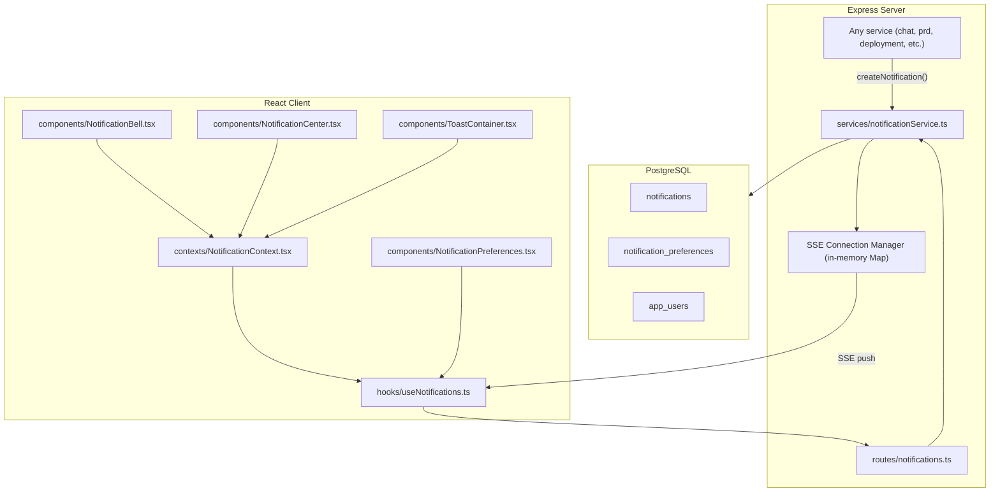
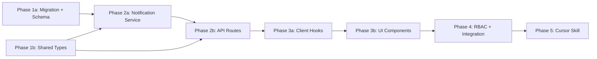

# In-App Notification Framework

## Current State

The application has no notification infrastructure. Feedback to users is handled through ad-hoc inline banners (e.g. `.error-banner` in `App.tsx`, `.generatingBanner` in `PrdReviewView`), `window.alert()` calls in a few hooks, and component-local status messages. There is no way to:

- Inform a user about something that happened while they were on a different view
- Persist notifications so users see them on their next login
- Push real-time updates from the server without the user polling or refreshing
- Let users control which categories of notifications they receive

The chat feature already uses Server-Sent Events (SSE) for real-time streaming (`src/server/routes/chat.ts` line 150, `src/client/hooks/useChatStream.ts`), proving the SSE pattern works in this stack. The notification framework extends this proven pattern to a user-scoped, persistent, preference-aware system.

## Architecture



## Database Schema

Create a single migration: `npm run migrate:create -- add-notifications-tables`

**`notifications`**
- `id` UUID PK DEFAULT gen_random_uuid()
- `user_id` TEXT NOT NULL REFERENCES app_users(oid) ON DELETE CASCADE
- `type` TEXT NOT NULL — one of `system`, `ai`, `user-action`, `background`
- `title` TEXT NOT NULL
- `body` TEXT — optional longer description
- `link` TEXT — optional in-app deep-link path (e.g. `/backlog/prd/123`)
- `read` BOOLEAN NOT NULL DEFAULT false
- `created_at` TIMESTAMPTZ NOT NULL DEFAULT now()
- INDEX on `(user_id, read, created_at DESC)`

**`notification_preferences`**
- `id` UUID PK DEFAULT gen_random_uuid()
- `user_id` TEXT NOT NULL REFERENCES app_users(oid) ON DELETE CASCADE
- `notification_type` TEXT NOT NULL — one of `system`, `ai`, `user-action`, `background`
- `enabled` BOOLEAN NOT NULL DEFAULT true — master switch; when false, notifications of this type are stored but not pushed via SSE
- `toast_enabled` BOOLEAN NOT NULL DEFAULT true — when false, the notification appears in the bell center but no transient toast popup
- `updated_at` TIMESTAMPTZ NOT NULL DEFAULT now()
- UNIQUE on `(user_id, notification_type)`

After creating the migration, update `src/server/db/schema.ts` with matching `pgTable` definitions and `relations()`.

## Server Changes

### Service: `src/server/services/notificationService.ts` (new)

Follow patterns from `src/server/services/rbacService.ts` (Drizzle queries, typed returns) and `src/server/services/chatAgentService.ts` (in-memory SSE subscriber map).

**Notification CRUD:**
- `createNotification(userId: string, payload: { type, title, body?, link? }): Promise<AppNotification>` — inserts the notification row, looks up user preferences, then pushes via SSE if `enabled !== false`. The SSE event includes `toast: boolean` based on `toast_enabled`.
- `getNotifications(userId: string, opts: { limit?: number, offset?: number }): Promise<AppNotification[]>` — paginated list, newest first
- `markAsRead(userId: string, notificationId: string): Promise<void>` — sets `read = true` for a single notification owned by the user
- `markAllAsRead(userId: string): Promise<void>` — sets `read = true` for all unread notifications for the user
- `getUnreadCount(userId: string): Promise<number>` — count of unread notifications

**Preference management:**
- `getPreferences(userId: string): Promise<NotificationPreference[]>` — returns all preference rows; missing types default to `{ enabled: true, toastEnabled: true }`
- `upsertPreference(userId: string, notificationType: NotificationType, updates: { enabled?: boolean, toastEnabled?: boolean }): Promise<void>` — inserts or updates a preference row

**SSE connection manager:**
- `subscribe(userId: string, res: Response): void` — adds the Express response to an in-memory `Map<string, Set<Response>>`
- `unsubscribe(userId: string, res: Response): void` — removes it
- `pushToUser(userId: string, event: NotificationSseEvent): void` — writes `data: JSON\n\n` to all active connections for the user

### Routes: `src/server/routes/notifications.ts` (new)

Mount at `/api/notifications` behind `ensureAuthenticated` in `src/server/index.ts`.

| Method | Path | Auth | Body / Params | Returns |
|--------|------|------|---------------|---------|
| `GET` | `/` | session | `?limit=20&offset=0` | `AppNotification[]` |
| `GET` | `/stream` | session | — | SSE stream (`text/event-stream`) |
| `PATCH` | `/:id/read` | session | — | `204` |
| `PATCH` | `/read-all` | session | — | `204` |
| `GET` | `/unread-count` | session | — | `{ count: number }` |
| `GET` | `/preferences` | session | — | `NotificationPreference[]` |
| `PATCH` | `/preferences` | session | `UpsertNotificationPreferenceRequest` | `204` |

## Client Changes

### Context: `src/client/contexts/NotificationContext.tsx` (new)

Provides shared notification state to `NotificationBell`, `NotificationCenter`, and `ToastContainer`:

```typescript
interface NotificationContextValue {
  unreadCount: number;
  toasts: AppNotification[];
  dismissToast: (id: string) => void;
  isConnected: boolean;
}
```

The provider opens the SSE stream on mount (when authenticated and `can('notifications:view')`), maintains unread count from SSE events, and manages the toast queue (adding on `toast: true` SSE events, auto-removing after 5s).

### Hook: `src/client/hooks/useNotifications.ts` (new)

```typescript
export function useNotifications(opts?: { limit?: number; offset?: number }) {
  return useQuery<AppNotification[]>({
    queryKey: ['notifications', opts],
    queryFn: () => apiFetch(`/api/notifications?limit=${opts?.limit ?? 20}&offset=${opts?.offset ?? 0}`),
    staleTime: 30_000,
  });
}

export function useMarkAsRead() { /* useMutation wrapping PATCH /:id/read */ }
export function useMarkAllAsRead() { /* useMutation wrapping PATCH /read-all */ }
export function useNotificationPreferences() { /* useQuery for GET /preferences */ }
export function useUpdateNotificationPreference() { /* useMutation for PATCH /preferences */ }
```

### Component: `src/client/components/NotificationBell.tsx` (new)

- Bell SVG icon with an unread count badge (red dot with number, hidden when 0)
- Click toggles the `NotificationCenter` dropdown
- Consumes `unreadCount` from `NotificationContext`
- CSS Module: `NotificationBell.module.css`

### Component: `src/client/components/NotificationCenter.tsx` (new)

- Dropdown panel anchored below the bell
- Lists notifications grouped by date (Today, Yesterday, Earlier)
- Each item shows: type icon, title, body preview, relative timestamp, unread dot
- Clicking a notification with a `link` navigates to that path and marks it read
- "Mark all as read" button in the header
- Gear icon linking to `NotificationPreferences`
- Click outside closes the dropdown
- CSS Module: `NotificationCenter.module.css`

### Component: `src/client/components/ToastContainer.tsx` (new)

- Fixed-position container at bottom-right of the viewport
- Renders transient toast popups that slide in, display for 5s, then slide out
- Each toast shows: type icon, title, dismiss X button
- Clicking the toast body navigates to the `link` (if present)
- Stacks up to 3 toasts; older toasts are dismissed when a 4th arrives
- CSS Module: `ToastContainer.module.css`

### Component: `src/client/components/NotificationPreferences.tsx` (new)

- Settings panel accessible from the `UserMenu` dropdown and the `NotificationCenter` header
- Lists each `NotificationType` with human-friendly labels:
  - System Events (`system`) — deployments, builds, releases
  - AI Completions (`ai`) — design doc reviews, PRD reviews, interviews
  - User Actions (`user-action`) — mentions, assignments, approvals
  - Background Jobs (`background`) — job status updates
- Each row has two toggles: "Enabled" (master on/off) and "Show toast" (disabled when Enabled is off)
- Saves on toggle via `useUpdateNotificationPreference` mutation
- CSS Module: `NotificationPreferences.module.css`

### `App.tsx` changes

- Wrap the `DndProvider` content in `<NotificationProvider>` (only when authenticated and `can('notifications:view')`)
- Add `<ToastContainer />` as a sibling inside the provider

### `AppHeader.tsx` changes

- Add `<NotificationBell />` in the `header-controls` div, before the `<UserMenu>`
- Pass `can` prop so the bell is only rendered when `can('notifications:view')`

### `UserMenu.tsx` changes

- Add a "Notification Settings" menu item (with a bell icon) between "What's New" and the theme section
- Clicking it opens the `NotificationPreferences` panel (either inline in the dropdown or as a modal)

## Key Design Decisions

- **SSE over WebSockets** — SSE is simpler, unidirectional (server-to-client), auto-reconnects natively, works through proxies, and the project already has a proven SSE pattern in chat streaming. No new dependencies needed.
- **In-memory connection map over Redis pub/sub** — Single-instance deployment (Azure App Service). If multi-instance scaling is needed later, swap the in-memory map for Redis pub/sub without changing the service API surface.
- **Database-backed over ephemeral** — Notifications persist so users see them on next login. The `notifications` table also enables future analytics (delivery rates, read rates).
- **Generic `createNotification` API** — Any service can call `notificationService.createNotification(userId, { type, title, body, link })`. No coupling to specific features. The notification service handles preferences and SSE delivery internally.
- **Separate `notification_preferences` table over JSONB column** — A normalized table with `(user_id, notification_type)` unique constraint gives per-category control over both delivery (`enabled`) and toast display (`toast_enabled`). More extensible than a `muted_types` JSONB array on `app_users` — future categories or per-category options (e.g. email digest) can be added as columns without schema redesign. Follows the existing opt-out pattern (changelog `showChangelogOnLogin`) but with finer granularity.

## Phase Summary and Parallelization



**Multitask parallelism:**
- Phase 1 (1a + 1b) — both tasks have no dependencies; run in parallel
- Phase 2 (2a + 2b) — service and routes can start in parallel once Phase 1 is complete; routes import from the service so coordinate on function signatures
- Phase 3 (3a + 3b) — hooks first, then components; 3b depends on 3a exports
- Phase 4 — single task: RBAC migration + wiring into AppHeader/App.tsx/UserMenu (depends on Phase 3)
- Phase 5 — single task: Cursor skill creation (depends on Phase 4; needs to reference the completed implementation)

## Files Changed / Created

| Action | Path |
|--------|------|
| Create | `migrations/<ts>_add-notifications-tables.sql` |
| Edit   | `src/server/db/schema.ts` |
| Create | `src/shared/types/notification.ts` |
| Create | `src/server/services/notificationService.ts` |
| Create | `src/server/__tests__/notificationService.test.ts` |
| Create | `src/server/routes/notifications.ts` |
| Create | `src/server/__tests__/notificationRoutes.test.ts` |
| Edit   | `src/server/index.ts` (mount route) |
| Create | `src/client/hooks/useNotifications.ts` |
| Create | `src/client/hooks/__tests__/useNotifications.test.ts` |
| Create | `src/client/contexts/NotificationContext.tsx` |
| Create | `src/client/components/NotificationBell.tsx` |
| Create | `src/client/components/NotificationBell.module.css` |
| Create | `src/client/components/NotificationCenter.tsx` |
| Create | `src/client/components/NotificationCenter.module.css` |
| Create | `src/client/components/ToastContainer.tsx` |
| Create | `src/client/components/ToastContainer.module.css` |
| Create | `src/client/components/NotificationPreferences.tsx` |
| Create | `src/client/components/NotificationPreferences.module.css` |
| Edit   | `src/client/components/AppHeader.tsx` (add bell) |
| Edit   | `src/client/components/UserMenu.tsx` (add notification preferences link) |
| Edit   | `src/client/App.tsx` (add provider + toast container) |
| Create | `migrations/<ts>_add-notifications-permission.sql` |
| Create | `.cursor/skills/in-app-notifications/SKILL.md` |
