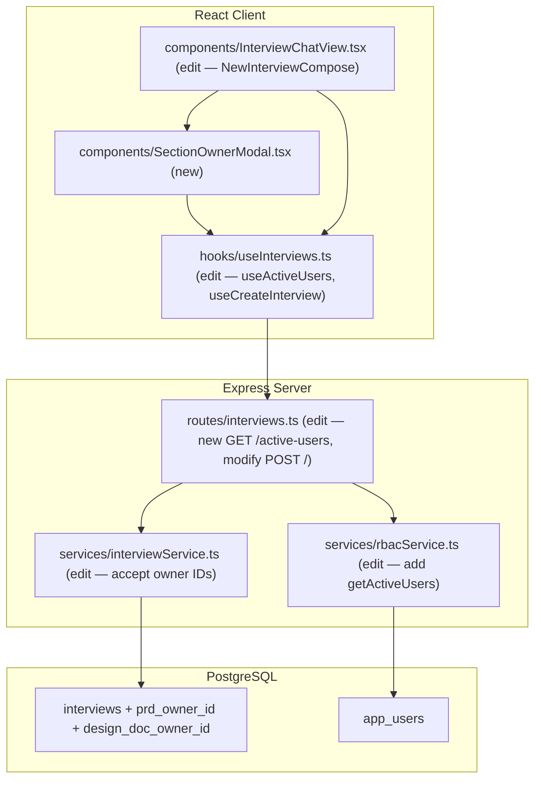
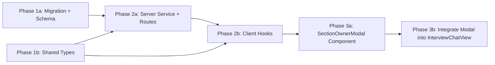

# Interview Section Owner Assignment

## Current State

When a user starts a new interview via `NewInterviewCompose` in `InterviewChatView.tsx`, the flow is:

1. User fills in title, message, model, and optional attachments
2. User clicks send
3. A chat thread is created (`startChat.mutateAsync`)
4. An interview record is created (`createInterview.mutateAsync`)
5. The first message is sent to the thread
6. User is navigated to the interview view

There is no concept of **section ownership** — no way to declare who is the SME responsible for the PRD (typically a BA) or the Design Doc (typically a developer). The `interviews` table only tracks `author_id` (the person who started the interview).

This ownership data is needed as a prerequisite for future notification features (e.g., notifying the PRD owner when their document is done generating, or when a reviewer requests revisions).

### Key files today

- `src/client/components/InterviewChatView.tsx` — `NewInterviewCompose` handles interview creation; `ExistingInterviewView` displays the interview
- `src/server/services/interviewService.ts` — `createInterview()` inserts into `interviews` table
- `src/server/routes/interviews.ts` — `POST /` accepts `{ project, repo, title, chatThreadId }`
- `src/shared/types/interview.ts` — `InterviewSummary`, `Interview`, `CreateInterviewRequest`
- `src/server/db/schema.ts` — `interviews` pgTable definition
- `src/server/services/rbacService.ts` — `listUsers()` returns all users with roles

## Architecture



## Database Schema

Create migration: `npm run migrate:create -- interview-section-owners`

**ALTER `interviews`** — add columns:
- `prd_owner_id` TEXT REFERENCES app_users(oid) ON DELETE SET NULL — nullable; the BA/SME who owns the PRD section
- `design_doc_owner_id` TEXT REFERENCES app_users(oid) ON DELETE SET NULL — nullable; the developer/SME who owns the Design Doc section

After creating the migration, update `src/server/db/schema.ts`:
- Add `prdOwnerId` and `designDocOwnerId` columns to the `interviews` pgTable
- Add relations from interviews to appUsers for both owner fields

## Server Changes

### Service edit: `src/server/services/rbacService.ts`

Add a lightweight function for the user picker (unlike `listUsers()` which returns full role details and is admin-only):

- `getActiveUsers(): Promise<ActiveUser[]>` — returns `{ oid, displayName, email }` for all `app_users` with `last_seen_at IS NOT NULL`, ordered by `display_name ASC`

### Service edit: `src/server/services/interviewService.ts`

- `createInterview(opts)` — extend the `opts` parameter to accept optional `prdOwnerId?: string` and `designDocOwnerId?: string`; include them in the `.values()` insert
- `getInterview(id)` — include `prdOwnerId`, `designDocOwnerId` plus joined display names (`prdOwnerName`, `designDocOwnerName`) in the return object
- `listInterviews(filters)` — include `prdOwnerId`, `designDocOwnerId` in the select

### Routes: `src/server/routes/interviews.ts` (edit)

| Method | Path | Permission | Changes |
|--------|------|------------|---------|
| `GET` | `/active-users` | `interviews:manage` | New: returns `ActiveUser[]` from `getActiveUsers()` |
| `POST` | `/` | `interviews:manage` | Accept optional `prdOwnerId` and `designDocOwnerId` in body; pass to `createInterview` |

## Client Changes

### Shared types: `src/shared/types/interview.ts`

Add to `InterviewSummary`:
```typescript
prdOwnerId?: string;
prdOwnerName?: string;
designDocOwnerId?: string;
designDocOwnerName?: string;
```

Add new type:
```typescript
export interface ActiveUser {
  oid: string;
  displayName: string | null;
  email: string | null;
}
```

Update `CreateInterviewRequest` (not currently used by the mutation, but for documentation):
```typescript
prdOwnerId?: string;
designDocOwnerId?: string;
```

### Hook edits: `src/client/hooks/useInterviews.ts`

- `useActiveUsers()` — new query hook hitting `GET /api/interviews/active-users`; `staleTime: 60_000`
- `useCreateInterview()` — update the mutation type to accept `prdOwnerId?: string` and `designDocOwnerId?: string` in the body

### Component: `src/client/components/SectionOwnerModal.tsx` (new)

Modal shown after the user clicks send on `NewInterviewCompose`, before the interview is actually created.

**Layout:**
- Overlay + centered modal card (same pattern as `ConfirmDeleteModal` / `StartChatModal`)
- Title: "Assign Section Owners"
- Subtitle: "Select the subject matter expert responsible for each section of this interview."
- Two select/dropdown fields:
  1. "PRD Owner" — select from active users; shows display name + email
  2. "Design Doc Owner" — select from active users; shows display name + email
- Both fields are optional (user can skip if owners aren't known yet)
- Footer: "Skip" button (proceeds without owners) and "Confirm" button

**Props:**
```typescript
interface SectionOwnerModalProps {
  project: string;
  onConfirm: (owners: { prdOwnerId?: string; designDocOwnerId?: string }) => void;
  onSkip: () => void;
  isSubmitting?: boolean;
}
```

**CSS Module:** `SectionOwnerModal.module.css` — uses CSS variables from `App.css`, consistent spacing (8, 12, 16, 24 px), `transition: all 0.3s ease` for modal animation.

### Component edit: `src/client/components/InterviewChatView.tsx`

**`NewInterviewCompose` changes:**
- Add state: `showOwnerModal: boolean`, `pendingOwners: { prdOwnerId?: string; designDocOwnerId?: string } | null`
- Modify `handleSend`:
  - Instead of immediately creating the interview, set `showOwnerModal = true` and stash the input state
  - After the modal confirms or skips, proceed with the actual creation flow, passing owner IDs to `createInterview.mutateAsync`
- Render `SectionOwnerModal` when `showOwnerModal` is true

**`ExistingInterviewView` changes:**
- In the header `titleMeta` area, show owner badges if `prdOwnerId` or `designDocOwnerId` are set:
  - "PRD: {prdOwnerName}" and "Design Doc: {designDocOwnerName}" as small info chips

## Key Design Decisions

- **Modal after compose, before creation** — The modal appears after the user has filled in all interview details and clicked send, but before the API calls fire. This avoids showing the modal before the user has committed to starting an interview, and ensures we have the project context needed to fetch the user list. If the user dismisses/skips, the interview is still created (owners are optional).

- **Columns on interviews table, not a separate table** — Since there are exactly two fixed ownership slots (PRD and Design Doc), simple nullable FK columns are cleaner than a polymorphic join table. If ownership types need to grow beyond two, a separate table can be introduced later.

- **All active app_users as the pool** — Per the user's direction, the initial implementation uses all `app_users` who have logged in at least once. This will become more granular (e.g., per-project role-based filtering) in a future iteration.

- **Optional owners (skip button)** — Not every interview may have known owners at creation time. Making the fields optional with a "Skip" button preserves the current zero-friction creation flow while encouraging assignment.

- **ON DELETE SET NULL** — If an owner's user record is deleted, the interview keeps its data but the owner reference becomes null. This is safer than CASCADE (which would delete the interview) and more practical than RESTRICT (which would block user deletion).

## Phase Summary and Parallelization



**Multitask parallelism:**
- Phase 1 (1a + 1b) — no dependencies on each other; run in parallel
- Phase 2 (2a + 2b) — both depend on Phase 1; 2b needs the route from 2a to exist; can coordinate on endpoint shape
- Phase 3 (3a + 3b) — 3a builds the modal; 3b integrates it into the compose flow. 3b depends on 3a.

## Files Changed / Created

| Action | Path |
|--------|------|
| Create | `migrations/<ts>_interview-section-owners.sql` |
| Edit   | `src/server/db/schema.ts` |
| Edit   | `src/shared/types/interview.ts` |
| Edit   | `src/server/services/rbacService.ts` |
| Edit   | `src/server/services/interviewService.ts` |
| Edit   | `src/server/routes/interviews.ts` |
| Edit   | `src/client/hooks/useInterviews.ts` |
| Create | `src/client/components/SectionOwnerModal.tsx` |
| Create | `src/client/components/SectionOwnerModal.module.css` |
| Edit   | `src/client/components/InterviewChatView.tsx` |
