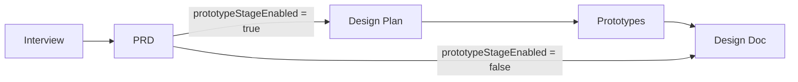

# Interview Flow Configuration

Two related per-project enhancements, both implemented as new columns on the existing `project_skill_settings` table (edited in `AdminProjectSettings.tsx`, resolved at runtime via `resolveSkillConfig()`), following the exact pattern of the existing skill/model fields. No new tables or services.

## Classification
- Type: enhancement (x2)
- Scope: medium (~10-13 files: server, client, shared, db)
- Feature flag: no (per your choice)

## Feature 1 - Configurable interview skills

Today `InterviewChatView.tsx` hardcodes the default: `skills.find(s => s.name === 'grill-with-docs')` (line 273), with a single admin `interviewSkillPath` override. We replace this with an admin-managed **list** of `{ path, friendlyName }` options and a user-facing picker.

- New JSONB column `interview_skill_options` on `project_skill_settings` holding `InterviewSkillOption[]` = `{ path: string; friendlyName: string }[]`.
- Admin (`AdminProjectSettings.tsx`, "Process Skills" accordion): replace the single Interview Skill dropdown with a repeatable list editor - each row = skill dropdown (from `useSkillList`) + friendly-name text input, with add/remove. Keep the legacy `interviewSkillPath` column as a fallback.
- Interview start (`InterviewChatView.tsx`): build options from `skillConfig.interviewSkillOptions`.
  - 0 options -> current fallback (`interviewSkillPath` -> `grill-with-docs`).
  - exactly 1 option -> auto-select, show as a read-only pill (no dropdown).
  - 2+ options -> render a dropdown (friendly names) above the composer; selected `path` is passed as `kickoff.skillPath` (line 328).

## Feature 2 - Configurable workflow (skip prototype stage)

The prototype stage is already optional at the data layer. We add a project toggle that suppresses the prototype/design-plan auto-triggers and UI so the flow becomes Interview -> PRD -> Design Doc.

- New boolean column `prototype_stage_enabled` (default `true`).
- Admin: a checkbox in the "Repository & Branch" section: "Enable Design Prototype stage. When off: Interview -> PRD -> Design Doc."
- Server runtime gate (`src/server/routes/interviews.ts`, owner-approve ~line 2066): when a PRD is approved, only fire `generateDesignPlan(prdId)` if the resolved config has `prototypeStageEnabled !== false`. When disabled, skip it - the existing "Generate Design Doc" banner in `PrdReviewView.tsx` (~line 1897, `POST /prds/:prdId/design-docs`) becomes the next step (human-initiated; no schema change needed).
- Client UI gates (read config via `useProjectSkillConfig`):
  - `PrdReviewView.tsx`: hide "View Design Plan" / "Generate prototypes" banners when disabled; keep the direct "Generate Design Doc" banner.
  - `InterviewsDashboard.tsx`: hide the "Design Prototypes" tab when disabled for the active project.

## End-to-end wiring checklist (per existing conventions)
For both new columns: migration -> `src/server/db/schema.ts` -> `src/shared/types/projectSettings.ts` (`ProjectSkillConfig`, `UpsertProjectSkillConfigRequest`, `ProjectSkillConfigResponse`) -> `projectSettingsService.ts` (`UpsertSkillConfigOptions` + `values` object) -> `GET /api/skill-config` response in `src/server/routes/api.ts` -> `AdminProjectSettings.tsx` (`EditState`, `emptyEdit()`, `handleEditRow()`, `handleSave()`) -> consumers.

Note: the existing `standupSkillPath`/`uiLabSkillPath` fields are a known example where the upsert `values` object omits columns the UI sends - we will make sure the two new fields are wired all the way through the upsert.

## Key files
- `src/server/db/schema.ts` - `projectSkillSettings` table (~line 441)
- `src/shared/types/projectSettings.ts` - config types
- `src/server/services/projectSettingsService.ts` - `upsertSkillConfig` (~line 116)
- `src/server/routes/api.ts` - `GET /api/skill-config` response (~line 4002)
- `src/server/routes/interviews.ts` - PRD owner-approve auto-trigger (~line 2066)
- `src/client/components/AdminProjectSettings.tsx` - `SKILL_FIELDS` (~line 253), `EditState`, save flow
- `src/client/components/InterviewChatView.tsx` - skill resolution (~line 271) + composer picker
- `src/client/components/PrdReviewView.tsx` - stage banners (~line 1810, 1897)
- `src/client/components/InterviewsDashboard.tsx` - tabs (~line 29)

## Phasing
- Phase 1 (foundation, one task - tightly coupled): migration + `schema.ts` + shared types.
- Phase 2 (parallel after Phase 1): server service + API + interviews gate; admin UI; interview picker; workflow UI gating.

On approval I will switch to agent mode, write the full design doc to `design-docs/interview-flow-configuration.md`, then produce copy-paste Multitask subagent prompts (with TDD blocks) for each phase.