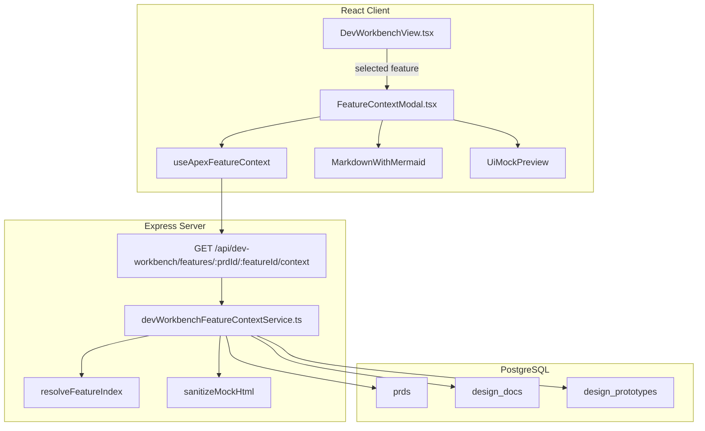
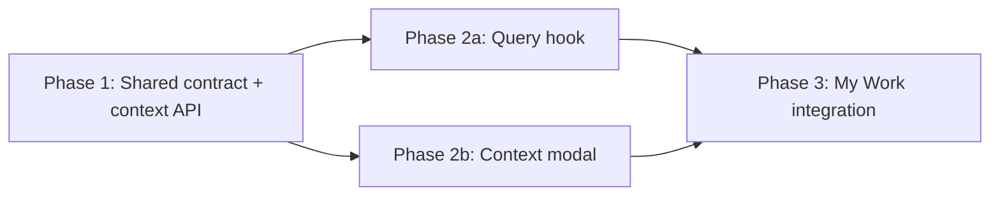

# My Work Feature Context Viewer

## Current State

`src/client/components/DevWorkbenchView.tsx` shows approved Apex PRDs as PRD → Epic → Feature rows. A feature row exposes priority, PBI/TBI counts, design status, and development actions, but it does not expose the content a developer is expected to implement. Developers must leave My Work and locate the corresponding PRD, feature backlog, design document, technical specification, assumptions, and prototype across separate review views.

The required data already exists in PostgreSQL:

- `prds.content` and `prds.backlog_json` contain the approved PRD and nested backlog.
- `design_docs` stores per-feature design, technical specification, and assumptions content using `feature_index`.
- `design_prototypes` stores per-feature sanitized HTML and version history using the same `feature_index`.
- `src/server/services/devContextService.ts` already provides the canonical `resolveFeatureIndex` helper used to align a backlog feature with its design artifacts.

The existing `GET /api/dev-workbench/backlog-features` response intentionally contains only row summary data. Embedding all artifact content there would make every My Work load transfer every PRD and prototype, even when no viewer is opened.

The approved visual reference is the Cursor canvas at `C:\Users\ryamiller\.cursor\projects\c-Users-ryamiller-ASM-ai-poc-AI-Pilot\canvases\my-work-feature-context.canvas.tsx`.

## Architecture



The context request is lazy: opening “View Context” selects the feature and enables the query. Closing the dialog retains TanStack Query cache data for quick reopening but does not preload content for every row.

## Server Changes

### Shared contract: `src/shared/types/devWorkbench.ts`

Add:

- `ApexFeatureContextBacklogItem` — normalized feature child item with `id`, `type`, `title`, optional status/priority/description, acceptance criteria, definition of done, and dependencies.
- `ApexFeatureContextDocument` — design document identity, status, and the three markdown artifacts.
- `ApexFeatureContextPrototype` — prototype identity, status, current sanitized HTML, version, and sanitized history entries.
- `ApexFeatureContextResponse` — PRD metadata/content, Epic and Feature metadata, feature-scoped backlog items, nullable design document, and nullable prototype.

The contract uses `null` for a missing design document or prototype and empty strings/arrays only where the corresponding artifact exists but has no content. This lets the client distinguish “not generated” from an empty section.

### Service: `src/server/services/devWorkbenchFeatureContextService.ts` (new)

- `getApexFeatureContext(project, prdId, featureId): Promise<ApexFeatureContextResponse | null>`:
  - Rejects non-`Apex` project requests.
  - Loads only an approved PRD matching both `prdId` and project.
  - Resolves the requested nested feature and global `featureIndex`.
  - Normalizes only that feature’s PBI/TBI children rather than returning the full backlog JSON.
  - Loads the design document and prototype matching the PRD and feature index.
  - Prefers the design document’s `designPrototypeId` when present, then falls back to `(prdId, featureIndex)`.
  - Sanitizes current and historical prototype HTML with `sanitizeMockHtml` before returning it.
  - Returns `null` if the approved PRD or requested feature does not exist.

Use Drizzle through `src/server/db/drizzle.ts`; no raw SQL or schema changes are needed.

### Route: `src/server/routes/devWorkbench.ts`

The router already applies `requirePermission('dev-workbench:view')` and `requireGroupMembership('Developer')`, so the new endpoint inherits the existing My Work authorization boundary.

| Method | Path | Auth | Params | Returns |
|---|---|---|---|---|
| `GET` | `/api/dev-workbench/features/:prdId/:featureId/context?project=Apex` | Session + `dev-workbench:view` + Developer group | PRD UUID, feature ID, project | `200 ApexFeatureContextResponse`, `400` for missing/unsupported project, `404` when the approved PRD/feature is absent |

No new router mount is required, so protected `src/server/index.ts` remains unchanged.

### Server tests

- Create `src/server/__tests__/devWorkbenchFeatureContextService.test.ts` for feature-index resolution, feature-only backlog normalization, document/prototype association, HTML sanitization, missing artifacts, and not-found behavior.
- Extend `src/server/__tests__/devWorkbenchRoutes.test.ts` for parameter validation, successful delegation, 404 behavior, and inherited access gates.

## Client Changes

### Hook: `src/client/hooks/useApexBacklog.ts`

Add:

```typescript
useApexFeatureContext(
  project: string | null,
  prdId: string | null,
  featureId: string | null,
)
```

The query key is `['dev-workbench', 'feature-context', project, prdId, featureId]`. It calls the relative authenticated route only when `project === 'Apex'` and both identifiers are present. The existing generic `apiFetch` error behavior is reused.

Create `src/client/hooks/__tests__/useApexBacklog.test.ts` to verify disabled-query behavior, URL encoding, response delivery, and API error propagation.

### Component: `src/client/components/FeatureContextModal.tsx` (new)

Props contract:

```typescript
interface FeatureContextModalProps {
  project: string;
  feature: BacklogFeatureItem;
  onClose: () => void;
}
```

Behavior:

- Render a wide, read-only dialog matching the approved canvas.
- Header shows feature ID/title, priority, work status, PRD title, and Epic title.
- Left-side tabs: PRD, Backlog, Design Doc, Tech Spec, Assumptions, and Prototype.
- PRD/design/tech/assumptions use `MarkdownWithMermaid` for the same markdown and Mermaid rendering used in review views.
- Backlog shows only the selected feature’s normalized PBI/TBI items with expandable descriptions and acceptance criteria.
- Prototype maps the response into the existing read-only `UiMockPreview`, preserving sandboxed `iframe sandbox="allow-scripts"`, version selection, and fullscreen viewing without edit/regenerate controls.
- Loading, request error, retry, and per-tab unavailable states are explicit.
- Escape and backdrop close the dialog; focus moves into the dialog on open and returns to the invoking row action on close.
- The tab list is keyboard-operable and collapses into a horizontally scrollable tab strip on narrow screens.

Create `src/client/components/FeatureContextModal.module.css` using existing CSS variables, the 4/8/12/16/24/32 spacing scale, and 0.3-second modal transitions.

Create `src/client/components/__tests__/FeatureContextModal.test.tsx` covering loading/error/retry, tab switching, feature-only backlog rendering, missing artifacts, markdown content, sandboxed prototype rendering, Escape/backdrop close, and accessible roles.

### My Work integration: `src/client/components/DevWorkbenchView.tsx`

For Apex PRD-backed feature rows only:

- Add `selectedContextFeature: BacklogFeatureItem | null`.
- Show “View Context” for every feature status and open `FeatureContextModal` for the selected feature.
- Remove “Start Development” and the Apex path’s cloud session creation logic.
- Remove “Resume Session” and “Close Session” actions from Apex feature rows.
- Keep “Start Local Development” on incomplete feature rows.
- Keep “Mark Complete” on incomplete feature rows.
- Show “Clear Progress” whenever an incomplete feature is in progress, regardless of whether the legacy session was cloud or local; it reuses `useCloseDevSession`.
- Completed rows show “View Context” plus the existing “Done” label.
- Preserve the non-Apex assigned-work-item behavior unchanged.

Update `src/client/components/DevWorkbenchView.module.css` for the secondary View Context action and responsive row wrapping. Update `src/client/components/__tests__/DevWorkbenchView.test.tsx` to assert the new action order, modal selection, removal of Apex cloud actions, conditional Clear Progress, and unchanged non-Apex behavior.

## Key Design Decisions

- **Lazy detail endpoint instead of expanding the backlog list payload:** Prototype HTML and markdown can be large. Fetching one feature on dialog open preserves fast My Work list loads and avoids transferring artifacts the developer never opens.
- **Dedicated Dev Workbench endpoint instead of reusing review endpoints:** Prototype and PRD review routes require interview permissions that Developers may not have. The new read-only endpoint remains inside the existing `dev-workbench:view` plus Developer-group boundary and returns only approved Apex artifacts.
- **Feature index remains the artifact join contract:** Existing design docs and prototypes are keyed by PRD plus `featureIndex`. The service uses the canonical resolver rather than introducing a migration or a second linking scheme.
- **Reuse existing renderers:** `MarkdownWithMermaid` keeps document rendering consistent, while `UiMockPreview` provides the same sandboxed, version-aware prototype experience as Design Prototype review without exposing editing controls.
- **Preserve Clear Progress while retiring cloud row actions:** Apex feature rows stop initiating or resuming cloud development sessions, but any in-progress legacy or local session can still be cleared so the feature is not stranded.
- **Viewer remains available after completion:** Context remains useful for maintenance and review, so completed features retain “View Context” even though development actions are removed.
- **No feature flag:** The agreed rollout ships directly. Existing My Work authorization and Apex-only route validation bound exposure.

## Phase Summary and Parallelization



**Multitask parallelism:**

- Phase 1 has one cohesive server/shared contract task because the route, normalization, and response type must evolve atomically.
- Phase 2a and Phase 2b may run in parallel after Phase 1 passes. The modal task mocks the agreed hook signature in tests; the hook task owns its fetch implementation.
- Phase 3 starts only after both Phase 2 tasks pass and integrates the independently tested pieces into existing row behavior.
- After Phase 3 verification, the coordinator evaluates and updates `context.md` and `AGENTS.md` under kick-off Phase 7.

## Files Changed / Created

| Action | Path |
|---|---|
| Edit | `src/shared/types/devWorkbench.ts` |
| Create | `src/server/services/devWorkbenchFeatureContextService.ts` |
| Edit | `src/server/routes/devWorkbench.ts` |
| Create | `src/server/__tests__/devWorkbenchFeatureContextService.test.ts` |
| Edit | `src/server/__tests__/devWorkbenchRoutes.test.ts` |
| Edit | `src/client/hooks/useApexBacklog.ts` |
| Create | `src/client/hooks/__tests__/useApexBacklog.test.ts` |
| Create | `src/client/components/FeatureContextModal.tsx` |
| Create | `src/client/components/FeatureContextModal.module.css` |
| Create | `src/client/components/__tests__/FeatureContextModal.test.tsx` |
| Edit | `src/client/components/DevWorkbenchView.tsx` |
| Edit | `src/client/components/DevWorkbenchView.module.css` |
| Edit | `src/client/components/__tests__/DevWorkbenchView.test.tsx` |
| Evaluate after implementation | `context.md` |
| Evaluate after implementation | `AGENTS.md` |
