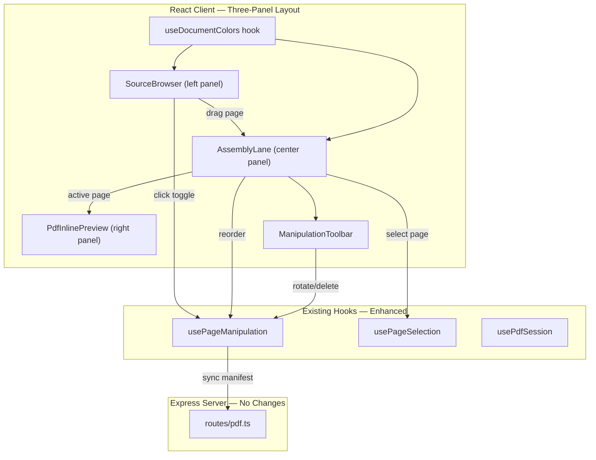
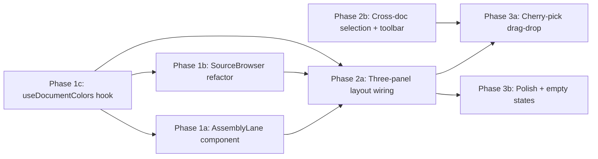

# PDF Assembly Three-Panel UX

## Current State

The PDF Tools view (`/pdf-tools`) uses a **two-panel layout**:

- **Left sidebar** (280px fixed): `PdfDocumentSidebar` shows uploaded documents as a list. When a document is selected and expanded, its page thumbnails (`PageThumbnailGrid`) appear nested under it in the sidebar.
- **Right main column**: `ManipulationToolbar` + `PdfInlinePreview` showing a large preview of the active page.

**Key limitation:** Pages are filtered by `selectedFileId` throughout the view (`docVisiblePages`, `docFilteredManifest`). Reordering, rotation, and deletion only operate within a single document at a time. To stitch pages from multiple documents (e.g., Doc A page 3 → Doc B page 1 → Doc A page 5), users must constantly switch between documents in the sidebar — there is no unified view of the final assembled output.

The server-side `pageManifest` API already supports a flat, cross-document page ordering. The limitation is purely client-side.

**Files involved today:**
- `src/client/components/PdfAssemblyView.tsx` — orchestrator (533 lines)
- `src/client/components/PdfDocumentSidebar.tsx` — sidebar with nested page grid
- `src/client/components/PageThumbnailGrid.tsx` — virtualized thumbnail grid (doc-scoped)
- `src/client/components/PageThumbnail.tsx` — individual page thumbnail card
- `src/client/components/ManipulationToolbar.tsx` — rotate/delete/move/save toolbar
- `src/client/components/PdfInlinePreview.tsx` — full-page preview
- `src/client/hooks/usePageManipulation.ts` — local manifest state + sync
- `src/client/hooks/usePageSelection.ts` — multi-select with shift/ctrl

## Architecture



## Database Schema

No database changes required. The existing `pdf_sessions` table with its `page_manifest` JSONB column already supports the flat cross-document page ordering model.

## Server Changes

No server changes required. The existing `PATCH /api/pdf/sessions/:id/manifest` endpoint accepts the full `PageManifestEntry[]` array regardless of how many source documents are represented.

## Client Changes

### Hook: `src/client/hooks/useDocumentColors.ts` (new)

Assigns a stable, visually distinct color from a predefined palette to each uploaded document. Colors are deterministic based on document order so they remain consistent across renders.

```typescript
export function useDocumentColors(fileMetadata: PdfFileMetadata[]): Map<string, DocumentColor> {
  // Returns a map of fileId → { bg, border, text, label } using CSS variable-compatible values
}
```

Palette uses 8 distinct hues that work in both light and dark themes via opacity-based backgrounds.

### Component: `src/client/components/SourceBrowser.tsx` (new)

Replaces the document-listing portion of `PdfDocumentSidebar`. This is the left panel.

- Shows uploaded documents as expandable cards
- Each document expands to show mini-thumbnails (smaller than the current 180px — approximately 80px wide)
- Mini-thumbnails are draggable — users can drag them into the assembly lane
- A small include/exclude toggle (checkbox or eye icon) on each mini-thumbnail indicates whether the page is in the assembly
- Pages already in the assembly show a subtle "included" indicator (filled dot or checkmark)
- The compact dropzone for uploading more files lives at the top of this panel
- Color indicator (left border or dot) matches the document's assigned color

**Width:** 260px, collapsible to icon-only 48px.

### Component: `src/client/components/AssemblyLane.tsx` (new)

The central panel — the primary workspace. Shows all non-deleted pages from all documents in a single flat grid.

- Uses `react-window` virtualized grid (similar to existing `PageThumbnailGrid`)
- Each thumbnail card shows a color-coded left border matching its source document
- Source document name shown in the label beneath each thumbnail
- Full drag-to-reorder within the lane (reuses existing DnD pattern from `PageThumbnail`)
- Accepts drops from the `SourceBrowser` (cross-panel drag-and-drop)
- Drop indicator shows where a dragged page will be inserted
- Assembly position numbers update live during drag
- `ManipulationToolbar` is embedded at the top of this panel

**Thumbnail size:** 160px wide (slightly smaller than current 180px to fit more in the grid).

### Component: `src/client/components/PdfAssemblyView.tsx` (edit — major refactor)

Rewired to the three-panel layout:

```
┌─────────────┬──────────────────────────────┬─────────────────────┐
│ SourceBrowser│     AssemblyLane             │  PdfInlinePreview   │
│ (260px)      │     (flex: 1)                │  (flex: 0 0 auto)   │
│              │                              │                     │
│ • Upload     │  [Toolbar: Rotate|Del|...]   │  ┌───────────────┐  │
│ • Doc A ▸    │  ┌────┐ ┌────┐ ┌────┐       │  │               │  │
│   p1 p2 p3   │  │ A1 │ │ B2 │ │ A3 │ ...   │  │  Full-size    │  │
│ • Doc B ▸    │  └────┘ └────┘ └────┘       │  │  preview of   │  │
│   p1 p2      │  ┌────┐ ┌────┐              │  │  selected pg  │  │
│              │  │ B1 │ │ A5 │              │  │               │  │
│ [+ Upload]   │  └────┘ └────┘              │  └───────────────┘  │
└─────────────┴──────────────────────────────┴─────────────────────┘
```

Key data flow changes:
- `docVisiblePages` → replaced by `manipulationVisiblePages` (all docs, unfiltered)
- `selectedFileId` → still used in SourceBrowser for expand/collapse, but no longer gates the assembly grid
- `handleDocReorder` → replaced by direct global reorder
- New: `handleAddToAssembly(pageId, insertIndex?)` — sets `deleted: false` and repositions
- New: `handleRemoveFromAssembly(pageIds)` — sets `deleted: true`

### Component: `src/client/components/PageThumbnail.tsx` (edit — minor)

- Add optional `colorIndicator` prop (CSS color string) for the document color stripe
- Add a thin left-border accent in the assigned color when `colorIndicator` is provided

### Component: `src/client/components/ManipulationToolbar.tsx` (edit — minor)

- Remove doc-scoped move up/down restriction (already works globally via `manipulationVisiblePages`)
- Add "Select All" / "Deselect All" buttons for the assembly lane
- Add page count display: "12 pages in assembly"

### Hook: `src/client/hooks/usePageManipulation.ts` (edit — minor)

- Add `addToAssembly(pageId: string, insertIndex?: number)` — marks page as `deleted: false` and optionally repositions it
- Add `removeFromAssembly(pageIds: Set<string>)` — marks pages as `deleted: true` (similar to existing `deletePages` but without the "at least one page" guard, since the assembly can be empty during building)
- Add `isPageInAssembly(pageId: string): boolean` helper

### Styles

- `src/client/components/PdfAssemblyView.module.css` — rewrite `.body` to three-panel flex layout
- `src/client/components/SourceBrowser.module.css` (new) — left panel styles with mini-thumbnails
- `src/client/components/AssemblyLane.module.css` (new) — center panel grid styles
- `src/client/components/PageThumbnail.module.css` — add `.colorStripe` class

## Key Design Decisions

- **Flat assembly model over nested document tabs**: A single flat grid for the assembly output makes the final page order immediately visible and editable. Tabbed or accordion-based approaches hide the cross-document interleaving that is the core use case.

- **Cherry-pick via include/exclude toggle (not a separate "add" action)**: All pages start included when uploaded (preserving current behavior). Users can exclude pages from the assembly via the source browser or delete from the assembly lane. This avoids an "empty assembly" state on first upload and matches user expectations from tools like Adobe Acrobat.

- **Document color coding over numbered badges**: Assigning each source document a distinct color (border stripe + legend) makes it immediately scannable which pages came from which document, even when heavily interleaved. Color is more perceptually efficient than reading source file names on every thumbnail.

- **Reuse existing `pageManifest` with `deleted` flag for cherry-pick**: Rather than introducing a new "included" concept, we leverage the existing `deleted: boolean` field. Pages excluded from assembly are `deleted: true` in the manifest. This requires zero server/API changes and the existing save/sync logic works unchanged.

- **Keep `PdfInlinePreview` as the right panel (not a modal)**: The always-visible preview panel provides immediate feedback when selecting or reordering pages, which is critical for a document assembly workflow where users need to verify page content frequently.

## Phase Summary and Parallelization



**Multitask parallelism:**
- **Phase 1** (1a + 1b + 1c) — `useDocumentColors` (1c) has no dependencies and should complete first as 1a and 1b consume it. 1a (AssemblyLane) and 1b (SourceBrowser) are independent components that can be built in parallel once 1c is done. In practice, run all three in parallel — 1a and 1b can stub the color prop initially.
- **Phase 2** (2a + 2b) — 2a wires the three panels together (depends on all Phase 1 outputs). 2b updates selection and toolbar to work globally (can start once Phase 1 is complete, parallel with 2a).
- **Phase 3** (3a + 3b) — 3a implements cross-panel drag-drop (depends on 2a + 2b). 3b polishes empty states and transitions (depends on 2a). Can run in parallel.

## Files Changed / Created

| Action | Path |
|--------|------|
| Create | `src/client/hooks/useDocumentColors.ts` |
| Create | `src/client/components/SourceBrowser.tsx` |
| Create | `src/client/components/SourceBrowser.module.css` |
| Create | `src/client/components/AssemblyLane.tsx` |
| Create | `src/client/components/AssemblyLane.module.css` |
| Edit   | `src/client/components/PdfAssemblyView.tsx` |
| Edit   | `src/client/components/PdfAssemblyView.module.css` |
| Edit   | `src/client/components/PdfDocumentSidebar.tsx` (may be replaced by SourceBrowser) |
| Edit   | `src/client/components/PageThumbnail.tsx` |
| Edit   | `src/client/components/PageThumbnail.module.css` |
| Edit   | `src/client/components/ManipulationToolbar.tsx` |
| Edit   | `src/client/hooks/usePageManipulation.ts` |
| Edit   | `src/client/hooks/usePageSelection.ts` |
