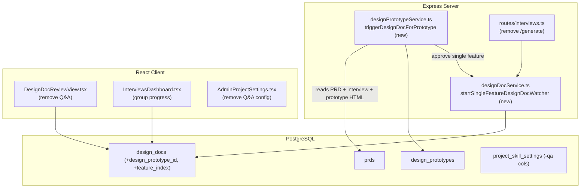
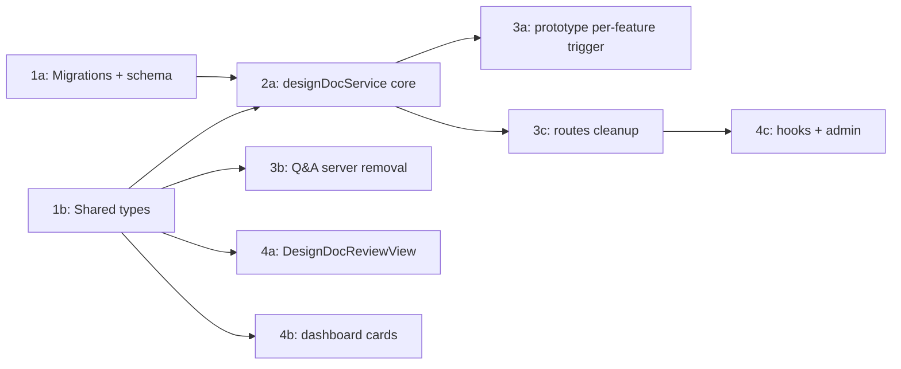

# Per-Feature Design Doc Kickoff

## Current State

The pipeline is **Interview -> PRD -> Design Plan -> Design Prototypes (one per feature) -> Design Docs**. Today:

- Design doc generation only fires when **every** prototype for a PRD reaches `approved`. `reviewPrototype()` (approve) calls `checkAllApprovedAndProceed()`, which gates on `all.every(p => p.status === 'approved')` before calling `triggerDesignDocGeneration(prdId)` — see [src/server/services/designPrototypeService.ts](src/server/services/designPrototypeService.ts) (lines ~877-995). One generation thread then fans out to multiple `design_docs` rows via `startDesignDocWatcher` / `syncPerFeatureDesignDocs`.
- A Q&A "interview" stage exists: when `designDocQaSkillPath` is configured, the doc is created in status `interviewing` and the user chats in `DesignDocQaChat` until clicking "Generate Design Doc" (`POST /design-docs/:id/generate`). See [DesignDocReviewView.tsx](src/client/components/DesignDocReviewView.tsx) and [src/server/routes/interviews.ts](src/server/routes/interviews.ts) (lines ~1149-1254).
- A design doc has **no FK** to its prototype/feature — features are matched only by humanized slug/title.
- `DesignDocGroupCard` in [InterviewsDashboard.tsx](src/client/components/InterviewsDashboard.tsx) already groups multiple docs per PRD with a text summary, but no progress treatment that mirrors the prototype groups.

This blocks feature-level parallelism (a fast-approved feature waits for slow siblings) and forces an unwanted Q&A step.

## Architecture

## Database Schema

Two migrations (`npm run migrate:create`):

**Migration A — link design docs to prototypes** (`design-doc-prototype-link`)
- `ALTER TABLE design_docs ADD COLUMN design_prototype_id UUID REFERENCES design_prototypes(id) ON DELETE SET NULL` (nullable — manual PRD-bypass docs leave it null)
- `ALTER TABLE design_docs ADD COLUMN feature_index INTEGER`
- `CREATE UNIQUE INDEX design_docs_prototype_unique ON design_docs(design_prototype_id) WHERE design_prototype_id IS NOT NULL` — guarantees one design doc per prototype (idempotency for retries / double approvals)

**Migration B — remove Q&A** (`remove-design-doc-qa`)
- `ALTER TABLE design_docs DROP COLUMN qa_chat_thread_id`
- `ALTER TABLE project_skill_settings DROP COLUMN design_doc_qa_skill_path`
- `ALTER TABLE project_skill_settings DROP COLUMN design_doc_qa_model`

Update [src/server/db/schema.ts](src/server/db/schema.ts): add `designPrototypeId`/`featureIndex` to `designDocs`, drop `qaChatThreadId`; drop the two `project_skill_settings` columns; add a `designDocs` relation to `designPrototypes`.

## Server Changes

### `designPrototypeService.ts`
- **New** `triggerDesignDocForPrototype(prototype)`: idempotent (return early if a design doc already exists for `prototype.id`). Builds per-feature `freeformContext`:
  - PRD content + the single feature's backlog slice (from `extractFeatures(prd.backlogJson)` matched by `featureIndex`)
  - Interview transcript (reuse/export `readInterviewTranscript` from `prdService.ts`)
  - That prototype's `mockHtml` + the existing "Existing Code Protection Rules" block
  - Creates the design doc row (`status: 'generating'`, `designPrototypeId`, `featureIndex`, `title: featureName`), creates the generation thread, calls `startSingleFeatureDesignDocWatcher(docId, threadId)`.
- In `reviewPrototype()` on `approve`: replace `checkAllApprovedAndProceed(proto.prdId)` with `triggerDesignDocForPrototype(proto)`.
- In the auto-approve paths (no-ui / no-PBI features, ~lines 371-440): call `triggerDesignDocForPrototype` per auto-approved feature.
- Remove `checkAllApprovedAndProceed` and the Q&A branch + old all-prototype `triggerDesignDocGeneration` (keep only what the manual PRD-bypass path needs, or fold its non-Q&A logic into the per-feature variant).

### `designDocService.ts`
- `createDesignDoc`: add `designPrototypeId?`/`featureIndex?`; remove `qaChatThreadId`; status defaults to `generating`.
- **New** `startSingleFeatureDesignDocWatcher(docId, threadId)`: polls the thread output, syncs the **one** design/tech-spec/assumptions triplet into the existing `docId` row (no fan-out), then sets `validating` (if validation skill) or `pending_review`, runs `autoStartValidation`, and times out to `draft`.
- Remove `interviewing` defaulting and `qaChatThreadId` from `rowToSummary`/`getDesignDoc`; surface `designPrototypeId`/`featureIndex`.
- Keep `startDesignDocWatcher`/`syncPerFeatureDesignDocs` for the manual PRD-bypass path.

### `projectSettingsService.ts`, `chatAgentService.ts`, `threadAccessService.ts`
- Remove all `designDocQaSkillPath`/`designDocQaModel` reads/writes; remove Q&A-thread output sync; remove `qaChatThreadId` access checks.

### Routes: `interviews.ts`
- Delete `POST /design-docs/:id/generate` and its now-unused imports (`getThreadAsync`, transcript builders for Q&A). Remove `interviewing` status checks. Keep `POST /prds/:prdId/design-docs` (manual bypass).

## Client Changes

### `DesignDocReviewView.tsx`
- Remove `DesignDocQaChat`, the `isInterviewing` branch, and the "Generate Design Doc" button.

### `InterviewsDashboard.tsx` + `InterviewsDashboard.module.css`
- Remove `interviewing` from the design-doc status label/badge maps.
- Enhance `DesignDocGroupCard`: add a progress indicator to the header (e.g. `N of M approved` + a thin progress bar) so multi-feature design-doc groups mirror the prototype grouping look and feel. Add a shared `.groupCardProgress` bar class (use CSS tokens). Mirror the same bar on `DesignPrototypeGroupCard` for visual parity.

### `useInterviews.ts` + `AdminProjectSettings.tsx`
- Remove `useGenerateDesignDoc` hook and Q&A skill/model fields/inputs.

## Key Design Decisions

- **Per-prototype FK + partial unique index** (not slug matching): gives a robust 1:1 prototype->doc link and makes per-feature triggering idempotent across retries and duplicate approvals.
- **Full Q&A removal** (not a dormant bypass): drops the `interviewing` status, `qa_chat_thread_id`, the `/generate` route, Q&A UI, and the `designDocQaSkillPath`/`Model` project settings, so docs always go straight to `generating`.
- **New single-feature watcher** rather than reusing the fan-out watcher: each per-feature thread writes exactly one triplet into its own pre-created row, avoiding title-collision logic. The fan-out watcher stays only for the manual PRD-bypass path.
- **Group progress indicator** added to both group cards so the design-doc tab visually matches the prototype tab grouping.

## Phase Summary and Parallelization

**Multitask parallelism:**
- Phase 1 (1a + 1b) — independent; run in parallel.
- Phase 2 (2a) — single core service task; gates the server consumers. Lock the `createDesignDoc` signature and `startSingleFeatureDesignDocWatcher` signature here.
- Phase 3 (3a + 3b + 3c) — parallel once Phase 2 is done (3a depends on 2a's new functions; 3b/3c depend on types + service).
- Phase 4 (4a + 4b + 4c) — parallel; 4c depends on 3c's route removal.

## Files Changed / Created

| Action | Path |
|--------|------|
| Create | `migrations/<ts>_design-doc-prototype-link.sql` |
| Create | `migrations/<ts>_remove-design-doc-qa.sql` |
| Edit   | `src/server/db/schema.ts` |
| Edit   | `src/shared/types/interview.ts` |
| Edit   | `src/shared/types/projectSettings.ts` |
| Edit   | `src/server/services/designDocService.ts` |
| Edit   | `src/server/services/designPrototypeService.ts` |
| Edit   | `src/server/services/prdService.ts` (export `readInterviewTranscript`) |
| Edit   | `src/server/services/projectSettingsService.ts` |
| Edit   | `src/server/services/chatAgentService.ts` |
| Edit   | `src/server/services/threadAccessService.ts` |
| Edit   | `src/server/routes/interviews.ts` |
| Edit   | `src/server/routes/admin.ts` |
| Edit   | `src/client/components/DesignDocReviewView.tsx` |
| Edit   | `src/client/components/InterviewsDashboard.tsx` |
| Edit   | `src/client/components/InterviewsDashboard.module.css` |
| Edit   | `src/client/components/AdminProjectSettings.tsx` |
| Edit   | `src/client/hooks/useInterviews.ts` |
| Edit   | Tests: `designDocService.*`, `designPrototypeService` (new), `projectSettingsService.test.ts`, `adminRoutes.test.ts`, `threadAccessService.test.ts`, `DesignDocReviewView.*`, `designDocValidationFlow.test.ts` |
