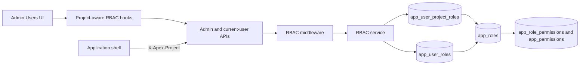
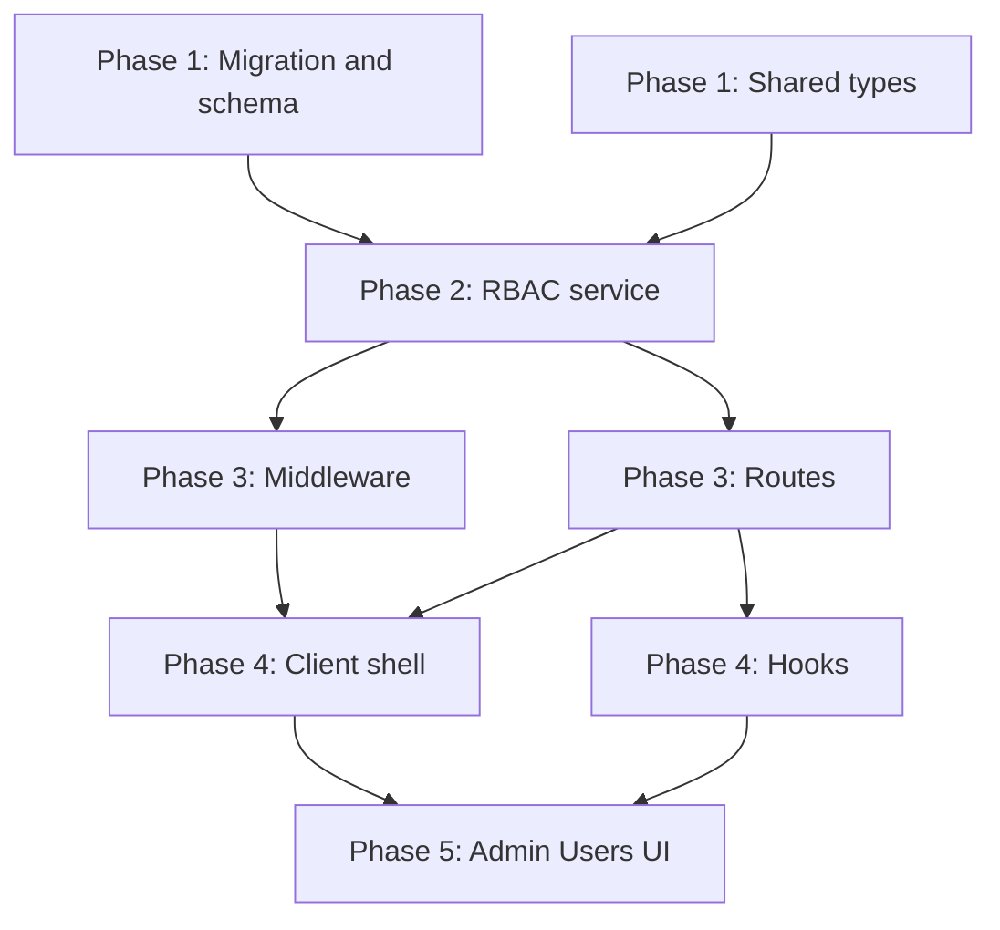

# Per-User Project RBAC

## Summary

The RBAC model will support assigning one or more existing global roles to a user for a specific project. When project assignments exist, they fully replace that user's global roles for permission resolution in that project. When none exist, resolution falls back to global roles and then the default role.

Project role assignments are separate from `user_project_assignments`: membership controls which projects a user belongs to, while RBAC controls what the user can do within a project.

## Decisions

- Roles and permissions remain global catalog entities; only user-to-role assignments gain project scope.
- Project-scoped roles override, rather than merge with, global roles for the selected project.
- Requests without project context continue to resolve global permissions.
- Super-admin bypass behavior remains unchanged.
- Project context resolution order is query, route parameter, request body, then `X-Apex-Project`.
- Existing role and permission administration is reused without changing the permission catalog.

## Architecture

Effective permission resolution:

1. Preserve the super-admin bypass.
2. If a project is supplied and the user has project-scoped role assignments, resolve permissions only from those roles.
3. Otherwise resolve permissions from global user-role assignments.
4. If the user has no applicable assignments, use the default role.

## Schema Changes

Add `app_user_project_roles`:

| Column | Type | Constraints |
|---|---|---|
| `id` | UUID | Primary key, defaults to `gen_random_uuid()` |
| `user_id` | TEXT | Not null, references `app_users.oid` on delete cascade |
| `project` | TEXT | Not null |
| `role_id` | UUID | Not null, references `app_roles.id` on delete cascade |
| `assigned_by` | TEXT | Nullable |
| `assigned_at` | TIMESTAMPTZ | Not null, defaults to `now()` |

The table has a unique constraint on `(user_id, project, role_id)` and an index on `(user_id, project)`. Existing RBAC tables remain unchanged.

Drizzle adds the matching `appUserProjectRoles` table and relations from the assignment to its user and role, plus collection relations from `appUsers` and `appRoles`.

## Server Changes

- `rbacService.ts`
  - Extend `getUserPermissions(userId, project?)` with override/fallback resolution.
  - Add `getUserProjectRoles(userId, project)`.
  - Add `assignProjectRole(userId, project, roleId, assignedBy)`.
  - Add `removeProjectRole(userId, project, roleId)`.
  - Include project role names in `listUsersForProject(project)`.
- `middleware/rbac.ts`
  - Add `resolveRequestProject(req)`.
  - Pass the resolved project into permission loading.
- `routes/admin.ts`
  - Add `POST /api/admin/users/:oid/project-roles` with `{ project, roleId }`.
  - Add `DELETE /api/admin/users/:oid/project-roles/:roleId?project=...`.
  - Return project roles from `GET /api/admin/users?project=...`.
- `routes/api.ts`
  - Accept optional `project` on `GET /api/me/permissions`.

## Client Changes

- Attach `X-Apex-Project` in the central fetch helper whenever a project is selected.
- Refetch current-user permissions when `selectedProject` changes and hold route gating until the refresh completes.
- Extend `useMyPermissions` with optional project context.
- Add assign/remove project-role mutations and invalidate affected user/permission queries.
- Update Admin Users to show and manage project roles for the selected project while retaining global-role visibility.

## Shared Contracts

- Extend `UserWithRoles` with optional `projectRoles: string[]`.
- Add a database-mirroring `AppUserProjectRole` contract.
- Add request DTOs for assigning and removing a project role. The route path may carry `roleId`, but a shared removal contract keeps service/client calls explicit.

## Phase Dependencies

## Parallelization

- Phase 1 migration/schema work and shared-contract work can proceed in parallel.
- Phase 2 starts only after both Phase 1 tracks are verified.
- Phase 3 middleware and route work can proceed in parallel after the service contract stabilizes.
- Phase 4 shell and hook work can proceed in parallel after the relevant Phase 3 APIs are available.
- Phase 5 integrates the completed client contracts and must follow Phase 4.
- Each phase gates the next with focused tests and both TypeScript checks when shared code is affected.

## Files

| Phase | File | Change |
|---|---|---|
| 1 | `migrations/<timestamp>_<token>_add-app-user-project-roles.sql` | Create and roll back the project-role assignment table and index. |
| 1 | `src/server/db/schema.ts` | Add the Drizzle table and relations. |
| 1 | `src/shared/types/rbac.ts` | Add project-role entity and request contracts and extend users. |
| 2 | `src/server/services/rbacService.ts` | Implement project-aware resolution and assignment operations. |
| 3 | `src/server/middleware/rbac.ts` | Resolve project context for authorization. |
| 3 | `src/server/routes/admin.ts` | Expose project-role administration. |
| 3 | `src/server/routes/api.ts` | Return project-aware current-user permissions. |
| 4 | Central client fetch helper | Add the selected-project header. |
| 4 | `src/client/hooks/useAppShell.ts` | Refresh permissions on project changes. |
| 4 | `src/client/hooks/useRbac.ts` | Add project-aware queries and mutations. |
| 5 | `src/client/components/AdminUsers.tsx` | Manage project roles in the selected project. |

## Verification

- Apply the migration locally, inspect its table, constraints, and index, then exercise the down migration when a local database is available.
- Run focused service, route, middleware, hook, and UI tests in their respective phases.
- Run `npx tsc -p tsconfig.server.json --noEmit`.
- Run `npx tsc -p tsconfig.client.json --noEmit`.
