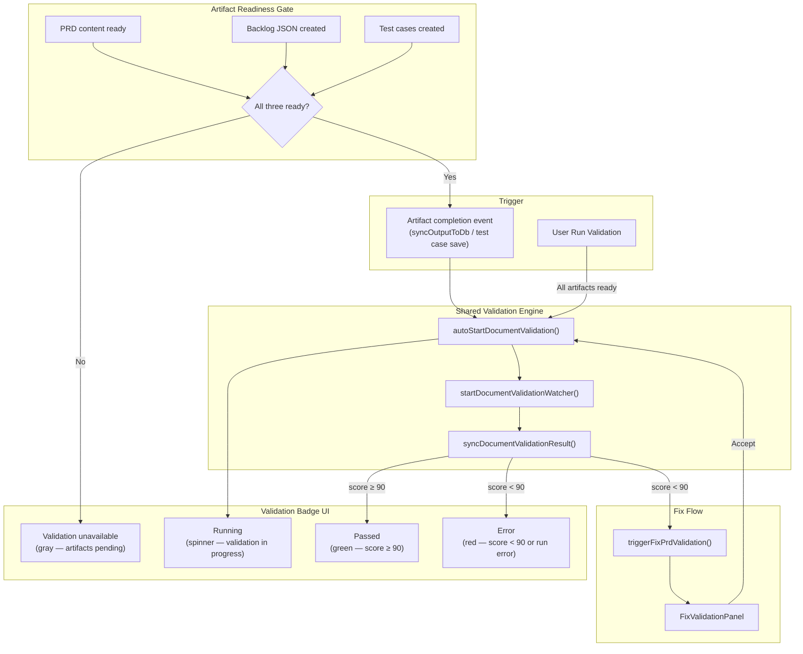
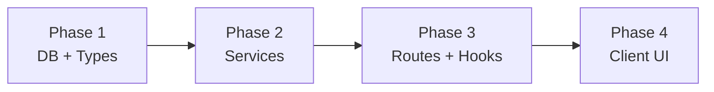

# PRD Spec Review

## Current State

PRDs have no validation step. After generation, a PRD goes directly to `pending_review`. There is no quality gate, no scorecard, and no automated spec review before human approval.

Design docs already have a full validation pipeline via `designDocService.ts`: auto-start validation thread, watcher polling for `review-scorecard.json`, sync to DB, validation report tab, fix-with-Apex flow, and a 90% approval gate. The PRD flow should mirror this using the external `prd-spec-review` skill (configured per project).

## Architecture

Validation is **gated on all three artifacts being ready**: the PRD content, the backlog JSON, and the test cases. Validation cannot start until all three exist. The badge reflects readiness and execution state at all times.

## Database Schema

Migration: `npm run migrate:create -- prd-validation`

**`prds`** — add columns:
- `validation_thread_id` UUID
- `validation_score` INTEGER
- `validation_scorecard` JSONB
- `validation_report_md` TEXT
- `validation_phase` TEXT
- `fix_baseline` JSONB

**`project_skill_settings`** — add columns:
- `prd_validation_skill_path` TEXT
- `prd_validation_model` TEXT

Update `src/server/db/schema.ts` to match.

## Server Changes

### Service: `src/server/services/documentValidationService.ts` (new)

Adapter-based shared validation: `autoStartDocumentValidation`, `startDocumentValidationWatcher`, `syncDocumentValidationResult`, `cancelDocumentValidation`, `generateFallbackReport`.

### Service: `src/server/services/prdService.ts`

- `autoStartPrdValidation`, `cancelPrdValidation`, `syncPrdValidationResult`
- `triggerFixPrdValidation`, `acceptFixPrdValidation`
- Add `arePrdValidationArtifactsReady(prdId)` — returns `true` only when PRD content, backlog JSON, and test cases all exist for the interview
- Update `startPrdWatcher` and `syncPrdContent` to call `arePrdValidationArtifactsReady` before routing to `validating`; if not ready, remain in `draft` / `pending_review` without starting validation

### Service: `src/server/services/testCaseService.ts`

After saving test cases, call `arePrdValidationArtifactsReady` and, if true, invoke `autoStartPrdValidation`. This is the final artifact that unblocks validation in the normal generation flow.

### Service: `src/server/services/chatAgentService.ts`

Post-run `syncOutputToDb` must also trigger PRD validation when applicable (dual sync path). After syncing backlog output, call `arePrdValidationArtifactsReady` — if all artifacts are now ready, start validation.

### Service: `src/server/services/startupRecovery.ts`

Re-hydrate PRD validation watchers for PRDs stuck in `validating`.

### Service: `src/server/services/projectSettingsService.ts`

Add `prdValidationSkillPath` / `prdValidationModel` to `upsertSkillConfig`.

### Routes: `src/server/routes/interviews.ts`

| Method | Path | Purpose |
|--------|------|---------|
| POST | `/api/interviews/prds/:prdId/validation-thread` | Start/re-run validation |
| POST | `/api/interviews/prds/:prdId/validation/cancel` | Cancel validation |
| POST | `/api/interviews/prds/:prdId/validation/refresh` | Sync scorecard |
| GET | `/api/interviews/prds/:prdId/validation/report` | Get report markdown |
| POST | `/api/interviews/prds/:prdId/validation/mark-ready` | Mark ready (score >= 90) |
| POST | `/api/interviews/prds/:prdId/fix-validation` | Trigger AI fix |
| POST | `/api/interviews/prds/:prdId/fix-validation/accept` | Accept fix + re-validate |
| PATCH | `/api/interviews/prds/:prdId/revert-section` | Revert to baseline |

Mirror design doc validation route patterns in the same file.

## Client Changes

### Types: `src/shared/types/interview.ts`, `projectSettings.ts`

Add `validating` to `PrdStatus`; validation fields on PRD types; `prdValidationSkillPath`/`prdValidationModel` on config types.

### Hooks: `src/client/hooks/useInterviews.ts`

Mirror design doc validation hooks for PRDs.

### Components

- `PrdReviewView.tsx` — validation badge, tab, banner, fix flow (mirror `DesignDocReviewView.tsx`)
  - Badge renders one of four states driven by `PrdStatus` + `validation_score`:
    - **Unavailable** (gray, static) — shown when PRD, backlog, or test cases are not yet all created; label "Validation unavailable"
    - **Running** (animated spinner) — shown while `prdStatus === 'validating'`; label "Running"
    - **Passed** (green) — shown when validation completes with `score >= 90`
    - **Error** (red) — shown when validation completes with `score < 90` or a thread-level error occurred
  - Manual "Run Validation" button is enabled only when all artifacts are ready and status is not already `validating`
- `PrdReviewView.module.css` — validation styles for all four badge states: `.badgeUnavailable`, `.badgeRunning`, `.badgePassed`, `.badgeError`
- `AdminProjectSettings.tsx` — PRD Validation Skill + Model in Process Skills / Model Overrides accordions

## Key Design Decisions

1. **Shared validation service** — adapter pattern avoids duplicating watcher/sync/fix logic.
2. **Same `ValidationScorecard` type** — PRD dimensions map to `features[]` entries (PRD markdown, backlog JSON, test cases).
3. **All-artifact gate before `validating`** — validation only starts when PRD content, backlog JSON, and test cases are all present. The status flow is: `generating` → `draft` (artifacts accumulating) → `validating` (all three ready) → `draft` | `pending_review`. Without the gate, partial artifacts would produce meaningless validation scores.
4. **Test case save is the final trigger** — in the normal generation flow, test cases are the last artifact created. `testCaseService.ts` checks readiness after each save and fires `autoStartPrdValidation` when the gate opens.
5. **Validation badge states** — four explicit states drive the UI badge:
   - `unavailable` (gray) — artifacts are not all ready yet; badge reads "Validation unavailable"
   - `running` (spinner/animated) — validation thread is active; badge reads "Running"
   - `passed` (green) — score ≥ 90; badge reads "Passed"
   - `error` (red) — score < 90 or thread error; badge reads "Error"
6. **Optional per project** — no `prdValidationSkillPath` → badge is hidden entirely; skip to `pending_review`.
7. **Fix flow uses `prdAssistantThreadId`** and existing `update_prd` MCP tool.
8. **Admin settings** — `prdValidationSkillPath` in Process Skills; `prdValidationModel` in Model Overrides (same pattern as design doc validation).

## Phase Summary and Parallelization

- **Phase 1** (2 tasks, parallel): migration + shared types.
- **Phase 2** (3 tasks, parallel): shared service first is ideal but prd adapter can stub until shared service lands; design doc refactor depends on shared service existing.
- **Phase 3** (2 tasks, parallel): routes + hooks after Phase 2.
- **Phase 4** (3 tasks, parallel): UI, admin settings, CSS after Phase 3.

## Files Changed / Created

| Action | Path |
|--------|------|
| Create | `migrations/*_prd-validation.sql` |
| Create | `src/server/services/documentValidationService.ts` |
| Create | `src/server/__tests__/documentValidationService.test.ts` |
| Create | `src/server/__tests__/prdValidationFlow.test.ts` |
| Modify | `src/server/db/schema.ts` |
| Modify | `src/server/services/prdService.ts` |
| Modify | `src/server/services/designDocService.ts` |
| Modify | `src/server/services/chatAgentService.ts` |
| Modify | `src/server/services/startupRecovery.ts` |
| Modify | `src/server/services/projectSettingsService.ts` |
| Modify | `src/server/routes/interviews.ts` |
| Modify | `src/server/routes/admin.ts` |
| Modify | `src/shared/types/interview.ts` |
| Modify | `src/shared/types/projectSettings.ts` |
| Modify | `src/client/hooks/useInterviews.ts` |
| Modify | `src/client/components/PrdReviewView.tsx` |
| Modify | `src/client/components/PrdReviewView.module.css` |
| Modify | `src/client/components/AdminProjectSettings.tsx` |
