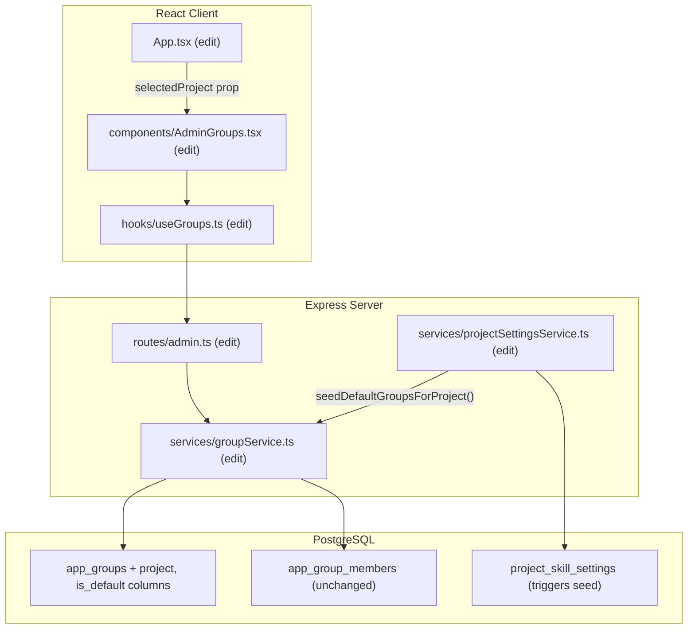
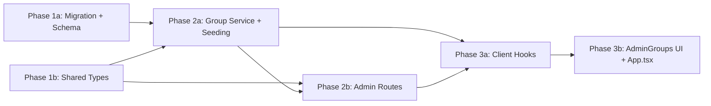

# Project-Scoped Default Groups

## Current State

Groups exist as a global concept in `app_groups` with a `UNIQUE(name)` constraint. They are used primarily as approver pools via `project_approver_groups`, which maps a group to a specific project's approver configuration. However, the group definition itself and its membership (`app_group_members`) are global — the same "Developers" group with the same members is shared across all projects.

This is insufficient because:
- Different projects need different people in the same role (e.g., "Developer" on Project A is not the same as "Developer" on Project B)
- There is no way to auto-provision standard organizational groups when a new project is set up
- Future features (content visibility, group-specific dashboards) require project-scoped group membership

**Key files:**
- `migrations/20260606120000_groups-and-kickoff-approvers.sql` — original groups DDL
- `src/server/db/schema.ts` — Drizzle schema (lines 144-171)
- `src/server/services/groupService.ts` — CRUD operations
- `src/server/routes/admin.ts` — API endpoints (lines 164-246)
- `src/client/components/AdminGroups.tsx` — Admin UI
- `src/shared/types/groups.ts` — Shared DTOs

## Architecture



## Database Schema

Create migration: `npm run migrate:create -- add-project-scoped-groups`

**Changes to `app_groups`:**
- `project TEXT` — nullable (existing global groups keep NULL; new groups require a project)
- `is_default BOOLEAN NOT NULL DEFAULT false` — tracks auto-seeded groups
- Drop `UNIQUE(name)`, replace with `UNIQUE INDEX ON (name, COALESCE(project, ''))` — allows same group name across projects while preventing duplicates within a project

**Seed data:** For every existing row in `project_skill_settings`, insert the 5 default groups:

| Default Group | Description |
|--------------|-------------|
| Product-Owner | Product ownership and strategy |
| BA | Business analysis and requirements |
| UI/UX | User interface and experience design |
| Manager | Project and team management |
| Developer | Software development and engineering |

After migration, update `src/server/db/schema.ts`:
- Add `project: text('project')` to `appGroups`
- Add `isDefault: boolean('is_default').notNull().default(false)` to `appGroups`

## Server Changes

### Service: `src/server/services/groupService.ts` (edit)

- `listGroups(project?: string)` — add optional `WHERE project = ?` filter
- `listGroupsWithMembers(project?: string)` — same filter
- `createGroup(name, description, createdBy, project?, isDefault?)` — accept project param
- `seedDefaultGroupsForProject(project: string, createdBy?: string)` — idempotent upsert of the 5 default groups for a given project; skip any that already exist

### Service: `src/server/services/projectSettingsService.ts` (edit)

- In `upsertSkillConfig()`, after upserting the project settings row, call `groupService.seedDefaultGroupsForProject(project)` to ensure default groups exist.

### Routes: `src/server/routes/admin.ts` (edit)

| Method | Path | Change |
|--------|------|--------|
| `GET` | `/groups` | Accept `?project=X` query param; pass to service |
| `POST` | `/groups` | Accept `project` in request body |
| `POST` | `/groups/seed/:project` | New endpoint to manually trigger seeding for a project |

All other group endpoints (`GET /:id`, `PUT /:id`, `DELETE /:id`, `PUT /:id/members`) remain unchanged — they operate on group UUID which is already project-scoped via the group's `project` column.

## Client Changes

### Hook: `src/client/hooks/useGroups.ts` (edit)

- `useGroupsWithMembers(project?: string)` — include `?project=X` in query string and query key
- `useCreateGroup()` — include `project` in POST body
- Query keys update: `['admin', 'groups', project]` for project-scoped invalidation

### Component: `src/client/components/AdminGroups.tsx` (edit)

- Accept new props: `selectedProject: string`, `availableProjects: string[]`
- Add a project selector dropdown in the page header (follow pattern from `AdminProjectSettings`)
- Filter groups list by selected project
- When creating a group, auto-set the project to the currently selected project
- Show a "Default" badge on groups where `isDefault === true`
- CSS Module updates for project selector and default badge styling

### `src/client/App.tsx` (edit)

- Pass `selectedProject` and `availableProjects` to `<AdminGroups />`

```tsx
// Before
<AdminGroups />

// After
<AdminGroups selectedProject={selectedProject} availableProjects={availableProjects} />
```

## Key Design Decisions

- **Nullable `project` column for backward compatibility**: Existing global groups (if any) retain `project = NULL` and remain accessible. All new groups created through the UI will have a project assigned. This avoids a destructive migration that would break existing `project_approver_groups` references.

- **COALESCE-based unique index instead of composite UNIQUE constraint**: PostgreSQL treats NULL as distinct in UNIQUE constraints, which would allow duplicate global group names. Using `UNIQUE INDEX ON (name, COALESCE(project, ''))` prevents this edge case while supporting the nullable column.

- **Auto-seed on project settings upsert**: Seeding happens in `upsertSkillConfig()` rather than a standalone endpoint. This ensures every project that has been configured gets its default groups without requiring a separate admin action. The seed function is idempotent (uses `ON CONFLICT DO NOTHING`).

- **`is_default` column for UX, not enforcement**: Default groups are tracked for display purposes (badge in the UI). They are fully editable and deletable — admins have complete control. If a default is deleted, re-saving project settings will re-seed it.

## Phase Summary and Parallelization



**Multitask parallelism:**
- Phase 1 (1a + 1b) — no dependencies; run in parallel
- Phase 2 (2a + 2b) — both depend on Phase 1; 2b imports from 2a so coordinate on function signatures; can run in parallel with agreed signatures
- Phase 3 (3a + 3b) — 3b depends on 3a hook signatures; can run in parallel with agreed interfaces

## Files Changed / Created

| Action | Path |
|--------|------|
| Create | `migrations/<ts>_add-project-scoped-groups.sql` |
| Edit   | `src/server/db/schema.ts` |
| Edit   | `src/shared/types/groups.ts` |
| Edit   | `src/server/services/groupService.ts` |
| Edit   | `src/server/services/projectSettingsService.ts` |
| Edit   | `src/server/routes/admin.ts` |
| Edit   | `src/client/hooks/useGroups.ts` |
| Edit   | `src/client/components/AdminGroups.tsx` |
| Edit   | `src/client/components/AdminGroups.module.css` |
| Edit   | `src/client/App.tsx` |
