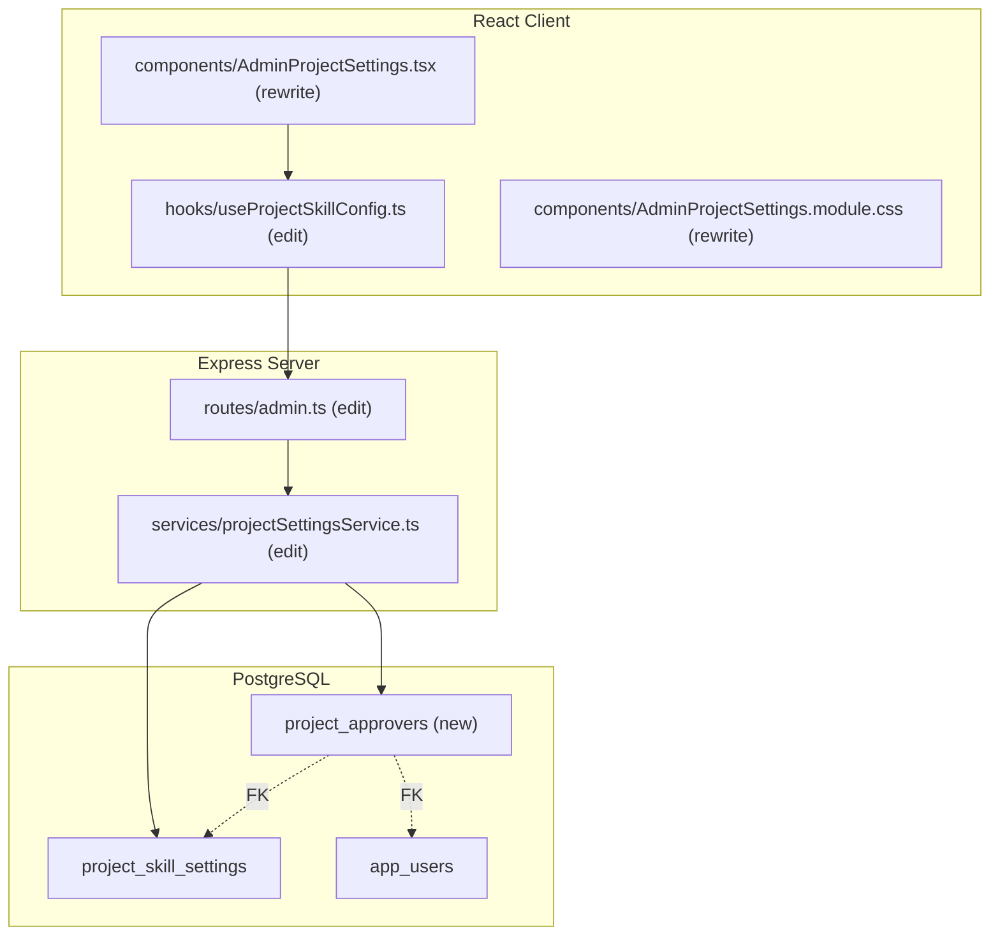
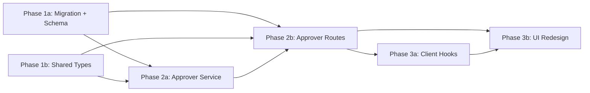

# Project Settings Redesign & Approver Management

## Current State

The admin project settings page (`AdminProjectSettings.tsx`) suffers from several UX problems:

1. **Information overload** — The edit form displays ~18 dropdown selectors simultaneously (6 skill paths + 6 model selectors + quick pill management + global model) with no logical grouping. Users are confronted with every option at once.

2. **No contextual help** — Field labels like "Design Doc Q&A Skill" and "Design Doc Validation Model" don't explain what each setting controls or how it affects the pipeline. New admins have no idea what to configure.

3. **Flat data table** — The project list is a wide table with 8 columns, most showing truncated model IDs. It doesn't surface the most useful at-a-glance info.

4. **Clunky edit flow** — The add/edit form appears inline above the table, pushing the table out of view. There's no visual hierarchy distinguishing required settings from optional overrides.

5. **No approver management** — Design docs and PRDs have `reviewer_id` columns in the database, and `design-docs:review` / `prds:review` RBAC permissions exist, but there's no way to configure **who** should be the designated approvers for each project. Any member can currently review any document.

### Key files today

- `src/client/components/AdminProjectSettings.tsx` — 927-line monolithic component
- `src/client/components/AdminProjectSettings.module.css` — 537-line stylesheet
- `src/client/hooks/useProjectSkillConfig.ts` — hooks for CRUD + global model + available models
- `src/server/services/projectSettingsService.ts` — Drizzle queries for project_skill_settings
- `src/server/routes/admin.ts` — admin router (gated by `admin:roles`)
- `src/server/db/schema.ts` — `projectSkillSettings` table definition
- `src/shared/types/projectSettings.ts` — shared DTOs

## Architecture



## Database Schema

Create migration: `npm run migrate:create -- add-project-approvers`

**`project_approvers`**
- `id` UUID PK DEFAULT gen_random_uuid()
- `project` TEXT NOT NULL — references project_skill_settings(project) ON DELETE CASCADE
- `user_id` TEXT NOT NULL — references app_users(oid) ON DELETE CASCADE
- `document_type` TEXT NOT NULL — CHECK (document_type IN ('design_doc', 'prd'))
- `assigned_by` TEXT — display name of admin who configured
- `assigned_at` TIMESTAMPTZ NOT NULL DEFAULT now()
- UNIQUE constraint on `(project, user_id, document_type)`
- INDEX on `(project, document_type)`

After creating the migration, update `src/server/db/schema.ts` with a `projectApprovers` pgTable definition and appropriate relations.

## Server Changes

### Service: `src/server/services/projectSettingsService.ts` (edit)

Add the following functions:

- `listApprovers(project: string): Promise<ProjectApprover[]>` — returns all approvers for a project, joined with app_users for display names
- `listApproversForAllProjects(): Promise<Record<string, ProjectApprover[]>>` — batch-fetch approvers grouped by project (for the list view)
- `setApprovers(project: string, documentType: 'design_doc' | 'prd', userIds: string[], assignedBy?: string): Promise<ProjectApprover[]>` — full-replace: delete existing approvers for this project+type, insert new set. Returns the new list.
- `getApproversForDocument(project: string, documentType: 'design_doc' | 'prd'): Promise<ProjectApprover[]>` — public API for the review workflow to check allowed approvers

### Routes: `src/server/routes/admin.ts` (edit)

Add to the existing admin router (already gated by `admin:roles`):

| Method | Path | Auth | Body / Params | Returns |
|--------|------|------|---------------|---------|
| `GET` | `/project-settings/:project/approvers` | admin:roles | — | `ProjectApprover[]` |
| `PUT` | `/project-settings/:project/approvers` | admin:roles | `{ designDocApprovers: string[], prdApprovers: string[] }` | `{ designDoc: ProjectApprover[], prd: ProjectApprover[] }` |

Also modify `GET /project-settings` to include approver counts in the response (lightweight — just counts, not full user objects) to power the list view badges.

## Client Changes

### Hook: `src/client/hooks/useProjectSkillConfig.ts` (edit)

Add hooks:

```typescript
export function useProjectApprovers(project: string | null) {
  return useQuery<ProjectApprover[]>({
    queryKey: ['admin', 'project-approvers', project],
    queryFn: () => fetch(`/api/admin/project-settings/${project}/approvers`, { credentials: 'include' }).then(r => r.json()),
    enabled: !!project,
    staleTime: 60_000,
  });
}

export function useSetProjectApprovers() {
  const queryClient = useQueryClient();
  return useMutation({
    mutationFn: async ({ project, designDocApprovers, prdApprovers }: SetApproversRequest) => {
      const res = await fetch(`/api/admin/project-settings/${project}/approvers`, {
        method: 'PUT', credentials: 'include',
        headers: { 'Content-Type': 'application/json' },
        body: JSON.stringify({ designDocApprovers, prdApprovers }),
      });
      if (!res.ok) throw new Error('Failed to save approvers');
      return res.json();
    },
    onSuccess: (_, { project }) => {
      queryClient.invalidateQueries({ queryKey: ['admin', 'project-approvers', project] });
      queryClient.invalidateQueries({ queryKey: ['admin', 'project-settings'] });
    },
  });
}
```

### Component: `src/client/components/AdminProjectSettings.tsx` (rewrite)

Complete rewrite from the current monolithic form into a sectioned accordion layout:

#### Project List View (default state)

Replace the current 8-column table with a cleaner card/table showing:
- Project name (primary)
- Skill repo + branch (secondary, monospace)
- Approver badges: "2 design doc · 1 PRD" or "No approvers"
- Last updated by + timestamp
- Edit / Delete actions

#### Project Detail View (edit state)

When editing, replace the flat form with **collapsible accordion sections**:

**Section 1: Repository & Branch** (expanded by default, always visible)
- Project selector (for new) / project name (for edit)
- Skill Repo dropdown
- Branch combobox (reuse existing BranchCombobox)
- Help text: "Select the Azure DevOps repository and branch containing your agent skills."

**Section 2: Process Skills** (collapsed by default)
- 6 skill dropdowns in 2-column grid
- Each with a one-line description of what the skill controls
- Help text: "Assign skills from the selected repo to each stage of the document pipeline."

**Section 3: Model Overrides** (collapsed by default)
- 6 model selectors in 2-column grid
- Visual hierarchy: show "Using: global default (composer-2)" when no override set
- Help text: "Override the AI model for specific pipeline stages. Unset fields use the global default."

**Section 4: Approvers** (collapsed by default)
- Two sub-sections: "Design Doc Approvers" and "PRD Approvers"
- User picker component: searchable dropdown of all system users (from `GET /api/admin/users`)
- Selected approvers shown as removable chips/tags
- Help text: "Designate who can approve documents for this project. Users must also have the appropriate review permission."

**Section 5: Quick Skill Pills** (collapsed by default)
- Existing pill management UI, cleaned up
- Help text: "Shortcut pills displayed on the home page for quick skill access."

#### BranchCombobox

Preserve the existing `BranchCombobox` as-is — it works well. Extract it to a private sub-component or keep it inline.

### CSS: `src/client/components/AdminProjectSettings.module.css` (rewrite)

Rewrite to support the accordion pattern:

- `.accordion-section` — collapsible container with header + body
- `.accordion-header` — clickable header with chevron rotation
- `.accordion-body` — animated expand/collapse
- `.user-chip` — approver tag with remove button
- `.user-picker` — searchable user dropdown
- Keep all existing token usage (no hardcoded colors)

## Key Design Decisions

- **Accordion over tabs**: Accordion sections let users see all settings on one scrollable page, work top-to-bottom during setup, and collapse irrelevant sections when making targeted edits. Tabs would hide content behind clicks and risk users missing configuration in non-visible tabs.

- **Full-replace approver API**: The `PUT /approvers` endpoint does a full replacement (delete all + insert new) rather than individual add/remove endpoints. This is simpler for the client (send the complete desired state) and avoids race conditions. The number of approvers per project is small enough that this is always efficient.

- **Approver counts on list view, not full user objects**: The project list view shows approver counts (e.g., "2 design doc · 1 PRD") rather than fetching and displaying full user objects. This keeps the list response fast. Full approver details are loaded only when editing a specific project.

- **No new RBAC permissions**: Approver management is an admin function that lives within the existing `admin:roles`-gated admin router. The existing `design-docs:review` and `prds:review` permissions remain the primary access control for the review action itself. The approver list adds a second constraint: "has permission AND is a designated approver."

- **Reuse existing user list**: The approver picker reuses data from `GET /api/admin/users` (already served by `rbacService.listUsers()`). No new user-listing endpoint needed.

## Phase Summary and Parallelization



**Multitask parallelism:**
- Phase 1 (1a + 1b) — no dependencies; run in parallel
- Phase 2 (2a + 2b) — both depend on Phase 1; 2b imports from 2a so run 2a first, then 2b (or coordinate on function signatures)
- Phase 3 (3a + 3b) — 3b depends on 3a for hook APIs; run sequentially or coordinate interfaces

## Files Changed / Created

| Action | Path |
|--------|------|
| Create | `migrations/<ts>_add-project-approvers.sql` |
| Edit   | `src/server/db/schema.ts` |
| Edit   | `src/shared/types/projectSettings.ts` |
| Edit   | `src/server/services/projectSettingsService.ts` |
| Edit   | `src/server/routes/admin.ts` |
| Edit   | `src/client/hooks/useProjectSkillConfig.ts` |
| Rewrite | `src/client/components/AdminProjectSettings.tsx` |
| Rewrite | `src/client/components/AdminProjectSettings.module.css` |
