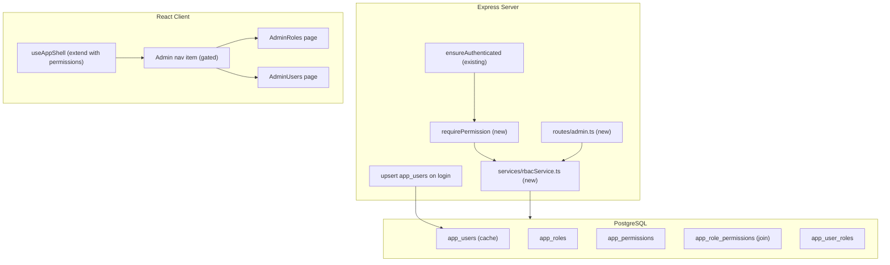
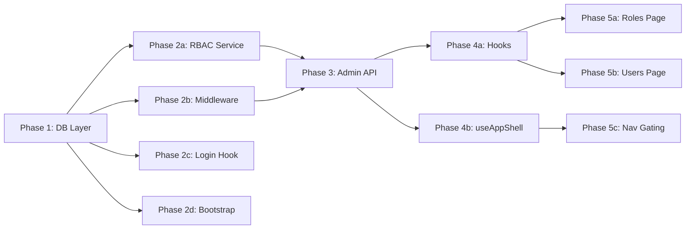

# RBAC Full Build Plan

## Architecture

---

## Phase 1 — Database Layer (no dependencies, run first)

### 1a. Migration SQL

Create `migrations/<timestamp>_rbac-tables.sql` with Up/Down sections following existing conventions.

**Tables:**
- `app_users` — `oid TEXT PK`, `display_name TEXT`, `email TEXT`, `last_seen_at TIMESTAMPTZ`
- `app_roles` — `id UUID PK DEFAULT gen_random_uuid()`, `name TEXT UNIQUE NOT NULL`, `description TEXT`, `is_default BOOLEAN DEFAULT false`, `created_at TIMESTAMPTZ`
- `app_permissions` — `id UUID PK DEFAULT gen_random_uuid()`, `key TEXT UNIQUE NOT NULL`, `description TEXT`, `category TEXT`
- `app_role_permissions` — composite PK `(role_id, permission_id)`, both FK with `ON DELETE CASCADE`
- `app_user_roles` — composite PK `(user_id, role_id)`, FK to `app_roles` with `ON DELETE CASCADE`, plus `assigned_by TEXT`, `assigned_at TIMESTAMPTZ`

**Seed data** in the same migration:
- 3 roles: `admin`, `member` (default), `viewer`
- Permission keys grouped by category: `admin:roles`, `admin:users`, `chat:create`, `chat:view_all`, `deployments:create`, `deployments:manage`, `workitems:write`, `wiki:write`, `skills:manage`, `cost:view`
- Wire all permissions to `admin`; a sensible subset to `member`; read-only subset to `viewer`

**Indexes:** `idx_app_user_roles_user` on `(user_id)`, `idx_app_role_permissions_role` on `(role_id)`

### 1b. Drizzle Schema

Update [src/server/db/schema.ts](src/server/db/schema.ts) — add `pgTable` definitions for all 5 tables plus `relations()` exports. Use `primaryKey({ columns: [...] })` for composite keys. Follow existing timestamp convention: `timestamp('col', { withTimezone: true, mode: 'string' })`.

### 1c. Shared Types

Create [src/shared/types/rbac.ts](src/shared/types/rbac.ts):
- `AppRole`, `AppPermission`, `AppUserRole`, `AppUser`
- `RoleWithPermissions` (role + nested permission keys)
- `UserWithRoles` (user + nested role names)
- Request/response DTOs: `AssignRoleRequest`, `UpdateRolePermissionsRequest`

---

## Phase 2 — Server: Service + Middleware (depends on Phase 1)

Can be split into **2 parallel tasks** once Phase 1 is complete.

### 2a. RBAC Service

Create [src/server/services/rbacService.ts](src/server/services/rbacService.ts) following `chatThreadRepository.ts` patterns (Drizzle queries, typed returns):

- `getUserPermissions(userId: string): Promise<Set<string>>` — join user_roles -> role_permissions -> permissions; fall back to default role if no explicit assignment
- `listRoles(): Promise<RoleWithPermissions[]>`
- `getRole(id: string): Promise<RoleWithPermissions | null>`
- `createRole(name, description, permissionIds[]): Promise<AppRole>`
- `updateRole(id, name?, description?, isDefault?): Promise<void>`
- `updateRolePermissions(roleId, permissionIds[]): Promise<void>` — delete + re-insert in transaction
- `deleteRole(id): Promise<void>` — prevent deleting default role
- `listPermissions(): Promise<AppPermission[]>`
- `listUsers(): Promise<UserWithRoles[]>` — join app_users with user_roles
- `assignRole(userId, roleId, assignedBy): Promise<void>`
- `removeRole(userId, roleId): Promise<void>`
- `upsertAppUser(oid, displayName, email): Promise<void>` — called on login

### 2b. RBAC Middleware

Create [src/server/middleware/rbac.ts](src/server/middleware/rbac.ts):

- `requirePermission(...keys: string[])` — loads permissions via `rbacService.getUserPermissions()`, caches on `(req as any)._permissions` for the request lifetime, returns 403 with `{ error: 'Forbidden', missing }` if any key is absent
- `requireAnyPermission(...keys: string[])` — same but OR logic
- `attachPermissions` — optional middleware that loads permissions onto the request for downstream use without blocking (for the `/api/me` endpoint)

### 2c. Login Hook

Modify the auth callback in [src/server/routes/auth.ts](src/server/routes/auth.ts) — after `req.logIn` succeeds, call `rbacService.upsertAppUser(profile.oid, profile.displayName, profile.upn)` to populate the user cache table. This is a fire-and-forget call (don't block login on it).

### 2d. Bootstrap Admin

In [src/server/index.ts](src/server/index.ts), add a startup function that checks if any user has the `admin` role; if not, reads `BOOTSTRAP_ADMIN_OID` from env and assigns the admin role. Log clearly. Only runs once.

---

## Phase 3 — Server: Admin API Routes (depends on Phase 2a)

Create [src/server/routes/admin.ts](src/server/routes/admin.ts) and mount at `/api/admin` behind `ensureAuthenticated` + `requirePermission('admin:roles')`.

**Endpoints:**

| Method | Path | Body / Params | Returns |
|--------|------|---------------|---------|
| `GET` | `/roles` | — | `RoleWithPermissions[]` |
| `POST` | `/roles` | `{ name, description, permissionIds }` | `201` + created role |
| `PUT` | `/roles/:id` | `{ name?, description?, isDefault? }` | updated role |
| `PUT` | `/roles/:id/permissions` | `{ permissionIds: string[] }` | `204` |
| `DELETE` | `/roles/:id` | — | `204` or `400` if default |
| `GET` | `/permissions` | — | `AppPermission[]` |
| `GET` | `/users` | — | `UserWithRoles[]` |
| `POST` | `/users/:oid/roles` | `{ roleId }` | `201` |
| `DELETE` | `/users/:oid/roles/:roleId` | — | `204` |

Add `GET /api/me/permissions` (on existing api routes or a new lightweight route) — returns `{ permissions: string[], roles: string[] }` for the logged-in user. This powers the client-side gating.

---

## Phase 4 — Client: Hooks + Permissions Context (depends on Phase 3)

### 4a. Permissions Hook

Create [src/client/hooks/useRbac.ts](src/client/hooks/useRbac.ts):
- `useMyPermissions()` — `useQuery` calling `GET /api/me/permissions`, returns `{ permissions: string[], roles: string[], isAdmin: boolean, can: (key: string) => boolean }`
- `useRoles()` — `useQuery` for `GET /api/admin/roles`
- `usePermissions()` — `useQuery` for `GET /api/admin/permissions`
- `useUsers()` — `useQuery` for `GET /api/admin/users`
- Mutations: `useCreateRole`, `useUpdateRole`, `useDeleteRole`, `useUpdateRolePermissions`, `useAssignRole`, `useRemoveRole` — each invalidates the relevant query keys

### 4b. Extend `useAppShell`

Update [src/client/hooks/useAppShell.ts](src/client/hooks/useAppShell.ts) — after authentication check succeeds, also fetch `/api/me/permissions` and expose `permissions` and `can()` helper alongside `isAuthenticated`. This makes permission-gating available app-wide without a separate provider.

---

## Phase 5 — Client: Admin UI Pages (depends on Phase 4)

### 5a. Admin Roles Page

Create `src/client/components/AdminRoles.tsx` + `AdminRoles.module.css`:
- Lazy-loaded from `App.tsx` at route `/admin/roles`
- Table listing roles: name, description, user count, default badge
- "Create Role" button opens modal with name + description fields (react-hook-form + zod)
- Each role row: edit (inline or modal), delete (confirmation modal), "Manage Permissions" button
- Permission editor: grouped checklist by `category`, toggle individual permission keys, save

### 5b. Admin Users Page

Create `src/client/components/AdminUsers.tsx` + `AdminUsers.module.css`:
- Lazy-loaded at route `/admin/users`
- Table of `app_users`: display name, email, last seen, assigned roles (as badges/chips)
- Per-user: dropdown or multi-select to assign/remove roles
- Search/filter by name

### 5c. Navigation Gating

Update [src/client/components/AppHeader.tsx](src/client/components/AppHeader.tsx):
- Add "Admin" button, only rendered when `can('admin:roles')` is true
- Navigates to `/admin/roles`

Update [src/client/App.tsx](src/client/App.tsx):
- Add `'admin'` to `CurrentView` union
- Add `/admin` path matching
- Render lazy `AdminRoles` or `AdminUsers` based on sub-path
- Gate rendering: if user lacks `admin:roles`, redirect to home

---

## Phase Summary and Parallelization

**Multitask parallelism:**
- Phase 1 (1a + 1b + 1c) — all 3 subtasks can run in parallel
- Phase 2 (2a + 2b + 2c + 2d) — 2a and 2b can run in parallel; 2c and 2d are small and can also parallel
- Phase 3 — single task (depends on 2a + 2b)
- Phase 4 (4a + 4b) — can run in parallel
- Phase 5 (5a + 5b + 5c) — all 3 can run in parallel

---

## Files Changed / Created

| Action | Path |
|--------|------|
| Create | `migrations/<ts>_rbac-tables.sql` |
| Edit | `src/server/db/schema.ts` |
| Create | `src/shared/types/rbac.ts` |
| Create | `src/server/services/rbacService.ts` |
| Create | `src/server/middleware/rbac.ts` |
| Edit | `src/server/routes/auth.ts` (login hook) |
| Edit | `src/server/index.ts` (mount admin routes + bootstrap) |
| Create | `src/server/routes/admin.ts` |
| Create | `src/client/hooks/useRbac.ts` |
| Edit | `src/client/hooks/useAppShell.ts` |
| Edit | `src/client/components/AppHeader.tsx` |
| Edit | `src/client/App.tsx` |
| Create | `src/client/components/AdminRoles.tsx` |
| Create | `src/client/components/AdminRoles.module.css` |
| Create | `src/client/components/AdminUsers.tsx` |
| Create | `src/client/components/AdminUsers.module.css` |

## Environment Variable

- `BOOTSTRAP_ADMIN_OID` — Azure AD Object ID of the first admin user (only needed until the first admin is assigned)

---

## AI Execution — Context & Token Consumption

This feature was fully implemented by Cursor AI agents in a single session using **Multitask Mode** (parallel background subagents). The data below reflects the actual transcript sizes recorded by Cursor, which serve as a proxy for context window consumption since raw token counts are not exposed in the JSONL transcript format.

### Session overview

| Metric | Value |
|--------|-------|
| Date | 2026-05-14 |
| Wall-clock time | ~17 minutes (1:39 PM → 1:56 PM ET) |
| Phases executed | 5 (sequential, with internal parallelism) |
| Subagents launched | 13 |
| Files created / edited | 16 |
| TypeScript errors at completion | 0 (client + server) |

### Transcript size by subagent

Transcript size (KB) is the closest available proxy for total context consumed — it includes all prompts, tool call inputs/outputs, and model responses for each agent.

| Phase | Subagent task | Transcript size |
|-------|--------------|----------------|
| 1a | Migration SQL (5 tables + seed) | 9.1 KB |
| 1b | Drizzle schema.ts additions | 10.4 KB |
| 1c | `src/shared/types/rbac.ts` | 6.4 KB |
| 2a | `rbacService.ts` (11 functions) | 16.5 KB |
| 2b | `middleware/rbac.ts` | 7.8 KB |
| 2c | `auth.ts` login hook | 5.8 KB |
| 2d | `index.ts` bootstrap admin | 12.3 KB |
| 3 | `routes/admin.ts` (9 endpoints) + `/api/me/permissions` | 18.5 KB |
| 4a | `useRbac.ts` (4 queries + 6 mutations) | 14.1 KB |
| 4b | `useAppShell.ts` permissions extension | 11.0 KB |
| 5a | `AdminRoles.tsx` + CSS module | 48.1 KB |
| 5b | `AdminUsers.tsx` + CSS module | 54.0 KB |
| 5c | `AppHeader` nav gating + `App.tsx` routing | 34.1 KB |
| — | **Coordinator (main conversation)** | 60.4 KB |
| | **Grand total** | **308.5 KB** |

> **Token usage: ~77,000 / 200,000 context window (38.5%)** — well within the 200k limit with headroom to spare.

### Notes on cost distribution

- The **coordinator** (main conversation thread) consumed 60.4 KB — primarily reading existing files, writing subagent prompts, and managing the 5-phase dependency chain.
- The **two largest subagents were the UI pages** (5a + 5b at 48–54 KB each) — they required reading multiple existing components for style conventions before generating the full TSX + CSS modules.
- The **smallest subagents were the narrow surgical edits** (2b, 2c at ~6–8 KB) — single-file changes with tightly scoped prompts.
- Phases 1–3 (pure backend) together consumed ~87 KB; Phases 4–5 (hooks + UI) consumed ~161 KB — the UI layer was ~2× more context-intensive than the full backend.

### Parallelism savings

Without Multitask Mode, all 13 subagents would have run serially. With parallel execution per phase, the actual wall-clock time was constrained only by the longest subagent within each phase:

| Phase | Agents | Longest agent | Parallel saving (est.) |
|-------|--------|--------------|----------------------|
| 1 | 3 | 1b (10.4 KB) | ~2 serial agents skipped |
| 2 | 4 | 2a (16.5 KB) | ~3 serial agents skipped |
| 3 | 1 | — | — |
| 4 | 2 | 4a (14.1 KB) | ~1 serial agent skipped |
| 5 | 3 | 5b (54 KB) | ~2 serial agents skipped |
