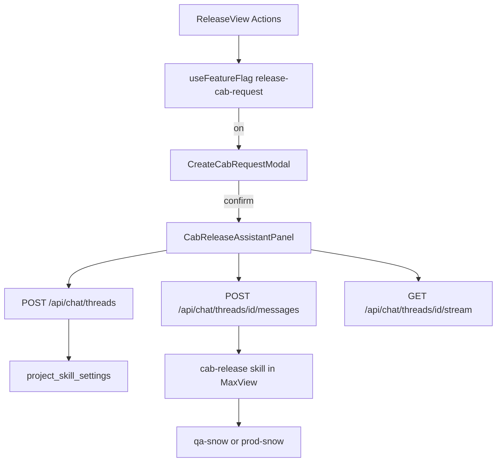
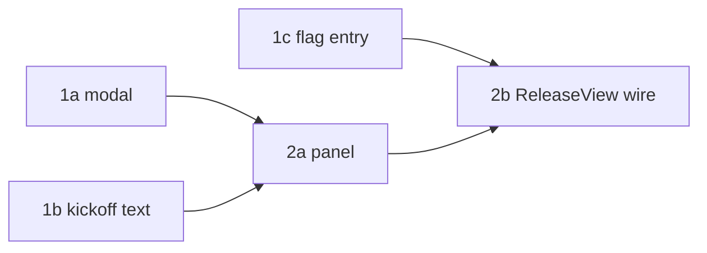

# Release CAB Request

ADO [55352](https://dev.azure.com/amergis/MaxView/_workitems/edit/55352/) — Phase 3 ServiceNow CAB ticket.

## Current State

`ReleaseView.tsx` Actions include Edit, Link Items, Deployment Outcome, a stub Create Changelog, and Delete. There is no Create CAB request control.

Release related work item IDs already load via `GET /api/releases/:epicId/related-items`.

The MaxView `cab-release` skill drafts the ServiceNow CAB body, updates the Manual Release wiki, queues `mv-application-qa-snow.yml` or `mv-application-prod-snow.yml`, and optionally cuts `Release/{version}` from `development` only after snow succeeds. That skill explicitly leaves the Apex Actions button to this repo.

`ChatAgentPanel` only opens on Agent Home. Other in-page assistants (calendar, PRD) use `AgentPanelShell` plus `useAgentChatSession`.

## Architecture

No new tables. No new routes.

## Database Schema

None.

## Server Changes

None. Reuse existing chat thread APIs and `GET /api/releases/:epicId/related-items`.

## Client Changes

### Utility: `src/client/utils/cabReleaseKickoff.ts`

Builds the first user message from target version, epic id, related ids, previous branch, snow mode, and cut-branch.

Skill path constant: `.cursor/skills/cab-release/SKILL.md`.

### Component: `src/client/components/CreateCabRequestModal.tsx`

react-hook-form + zod. Confirm before any thread is created.

### Component: `src/client/components/ReleaseCabRequestAction.tsx`

Feature entry. Flag `release-cab-request` top-level split. Also requires `planning:releases`, `chat:create`, BA group, and the project skill list to include cab-release.

### Component: `src/client/components/CabReleaseAssistantPanel.tsx`

`AgentPanelShell` + `AgentComposer` + `useAgentChatSession`. `useStartChat` with `skipAutoKickoff: true` and project skill config from `useProjectSkillConfig`.

### `ReleaseView.tsx`

Actions item opens the modal; confirm opens the panel.

## Key Design Decisions

1. Reuse interactive chat instead of Apex calling ADO pipelines — the skill owns snow, wiki, and git.
2. Pre-answer dry-run/run and cut-branch in the first message so confirmation lives in Apex UI; remaining skill asks stay in the thread.
3. Flag only the Releases button, not Agent Home skill pills.
4. Skill repo and branch come from admin `project_skill_settings` only. Do not hardcode `tbi/55352-phase-3-service-now-cab-ticket`.

## Feature Flag

- **Flag key**: `release-cab-request` (create in Platform Admin → Feature Flags)
- **Server gating**: none
- **Client gating**: `useFeatureFlag('release-cab-request', project)` on `ReleaseCabRequestAction`
- **Disabled path**: omit the Actions item, modal, and panel (`null`)
- **Targeting**: MaxView project (and users/groups as needed)
- **Cleanup**: retain enabled after two stable sprints at full rollout

## Phase Summary and Parallelization

Phase 1 tasks have no dependencies on each other. Phase 2 starts after Phase 1 type-check and tests.

## Files Changed / Created

| Action | Path |
|--------|------|
| Create | `design-docs/release-cab-request.md` |
| Create | `src/client/utils/cabReleaseKickoff.ts` |
| Create | `src/client/utils/__tests__/cabReleaseKickoff.test.ts` |
| Create | `src/client/components/CreateCabRequestModal.tsx` |
| Create | `src/client/components/CreateCabRequestModal.module.css` |
| Create | `src/client/components/__tests__/CreateCabRequestModal.test.tsx` |
| Create | `src/client/components/ReleaseCabRequestAction.tsx` |
| Create | `src/client/components/__tests__/ReleaseCabRequestAction.test.tsx` |
| Create | `src/client/components/CabReleaseAssistantPanel.tsx` |
| Create | `src/client/components/CabReleaseAssistantPanel.module.css` |
| Create | `src/client/components/__tests__/CabReleaseAssistantPanel.test.tsx` |
| Edit | `src/client/components/ReleaseView.tsx` |
| Edit | `src/client/components/__tests__/ReleaseView.delete.test.tsx` (and related if needed) |
