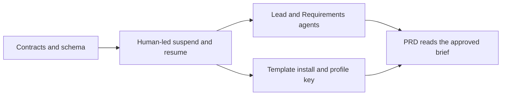

# Reusable Playbook Interview Step

Design for the decision in `.ai-pilot/output/reusable-playbook-interview-step.adr.md`. This document settles the Phase 1 contracts that the ADR left open. It does not reopen the decision.

The ADR is still **Proposed**. Implementation starts after it is Accepted.

## What Phase 1 ships

A project can install one shared Playbook template. The template contains a single `interview` node. Starting a run opens an interview, parks the Playbook until the Business Analyst approves a brief, then resumes the run with a reference to that brief.

The node has two modes:

- `human_led` uses the current interview workspace and the profile's Skill. The default Skill remains `/grill-with-docs`.
- `multi_agent_assisted` uses a Lead Agent and a Requirements Agent inside the interview service. The BA still sees one interviewer.

Projects that do not install the template keep the current Interview dashboard and `/grill-with-docs` path.

UX and Technical specialists, group defaults, a template catalog UI, and a general installer for arbitrary Playbooks are out of Phase 1. The `interview` input and output schemas below are the contract they must keep.

## Resolved choices

| ADR open item | Phase 1 choice |
|---|---|
| Interview deadline | 7 days by default. A node may set `deadlineMs` from 1 hour through 14 days. The reconciliation sweep expires the step the same way it expires other suspensions. |
| Facilitator reassignment | Not supported. The run initiator is the interview author. |
| Permission keys | No new key. See Access. |
| Missing profile key | The step fails before it creates an interview. The run is failed, and the error names the key. |
| Cost budget | No new cap. Existing Playbook spend admission still applies. Specialist calls are recorded as interview AI usage. A measured cap waits for pilot data. |
| Template mechanism | One template shipped in the server, installed as a project-owned draft. Not a shared definition row and not a catalog UI. |

## Playbook step

Register `interview` in `src/server/services/playbookSteps/registry.ts`, which is the only place a step type is declared.

| Descriptor field | Value | Why |
|---|---|---|
| `canSuspend` | `true` | The interview outlives the request that started it. |
| `suspendReason` | `interview` | Distinct from `approval_gate` and `agent_run` in `PlaybookSuspendReason`. |
| `defaultDeadlineMs` | 7 days | Long enough for a BA to leave and return. Short enough for the sweep to end an abandoned run. |
| `deadlineOverridable` | `true` | A definition may shorten or extend within the 1 hour–14 day range. |
| `isAgentStep` | `false` | Specialist calls are not Playbook agent steps, so they do not consume the ten-agent-step cap or the `cursor-agent` Skill allow-list. |
| `sideEffect` | `writes-apex` | The step creates Apex interview and brief rows. It does not itself hand work to an external system, so it does not require a preceding approval gate. |
| `requiredPermissions` | `playbooks:run` | The run initiator must already be allowed to start a Playbook. Conducting the interview is checked separately. |

Add `interview` to `PlaybookSuspendReason` in `src/shared/types/playbook.ts`. The status view reads that reason and links to the interview workspace.

### Input

```ts
interface InterviewStepConfig {
  /** human_led opens the current interview workspace. multi_agent_assisted uses the Lead and Requirements agents. */
  mode: 'human_led' | 'multi_agent_assisted';
  /**
   * Stable slug of an interview profile in the target project.
   * A template stores a slug, never a settings row id or a Skill path.
   * May be a `${input.interviewProfileKey}` binding.
   */
  profileKey: string;
  deadlineMs?: number;
}
```

`profileKey` is resolved when the step starts, after `resolveRunStepConfig` substitutes `${input.*}` and `${steps.*}` bindings. Resolution uses the run's project and the run's pinned skill settings. The match is a new `key` field on `InterviewSkillOption`, unique within that project configuration. `friendlyName` stays display text and is not an identifier.

If the key is missing or the profile is disabled, the adapter fails the step and does not insert an interview. The message names the project and the key.

On success the adapter snapshots the profile onto the interview: mode, key, Skill path, model, effort, and whether prototypes and test cases are wanted. Later edits to Project Settings do not change that snapshot.

### Output

```ts
interface InterviewStepOutput {
  interviewId: string;
  briefId: string;
  briefVersion: number;
  approvedBy: string;
  approvedAt: string;
  unresolvedCount: number;
}
```

The Playbook step row stores this object only. The brief body, transcript, and specialist findings stay on interview-owned tables. A later step may bind `${steps.<interviewStepId>.briefId}`.

Completion is idempotent. A second approval of the same brief version returns the existing output and does not resume the run twice.

### Cancel and expiry

Cancelling the Playbook run archives the interview and keeps the transcript and any approved checkpoints. Expiry does the same and marks the step `expired`. Neither path deletes the conversation.

## Interview service

`interviewOrchestratorService` owns turns while the Playbook step is suspended. The Playbook engine does not call it per message.

### Human-led

The BA opens the existing `InterviewChatView` for the linked thread. The profile's Skill path is the interviewer. `/grill-with-docs` remains the fallback when a profile has no path.

When the BA marks the interview complete, the service drafts a brief from the transcript. The BA edits and approves it. Approval completes the Playbook step.

### Multi-agent-assisted

Phase 1 runs two Skills. Both return structured JSON. Neither is added to the `cursor-agent` Playbook allow-list, because the interview service invokes them.

| Skill | Role |
|---|---|
| `interview-orchestrator` | The only Skill that writes the BA-facing question. It enforces one question, the phase checklist, and the brief update. |
| `interview-requirements-review` | Reviews the latest answer for problem, users, scope, rules, scenarios, acceptance criteria, assumptions, and gaps. |

For each BA answer:

1. Run the Requirements Agent once.
2. If it times out or returns invalid JSON, record the failed review and continue with the last valid brief.
3. The Lead Agent asks at most one follow-up, or offers a checkpoint when the Discovery topics are complete.
4. Do not run a second specialist pass on the same answer.

The router interface accepts a specialist list so UX and Technical can be added later without changing the step schema. Phase 1 always passes `['requirements']`.

Discovery topics, in order: problem and outcome, users, in scope and out of scope, main scenarios, acceptance criteria. Delivery and Technical phases are visible as later sections of the brief and are not required before approval in Phase 1.

### Brief

Store the brief apart from `chat_messages`.

- `interview_briefs` — one current row per interview: status (`draft` or `approved`), version, approved by, approved at.
- `interview_brief_revisions` — immutable JSON for each save and for approval.
- `interview_specialist_reviews` — one row per specialist attempt: specialist, status, structured result, model, duration, interview id, and brief version. No chain-of-thought.

Brief sections:

- problem and outcome
- users
- scope
- business rules
- scenarios
- acceptance criteria
- assumptions
- unresolved items

The BA can edit any section before approval. Approval freezes that version. Reopening an approved brief creates the next version and returns the Playbook step to `suspended` only when the step has not yet resumed. After the Playbook has resumed, the brief is read-only from the Playbook's point of view; corrections happen in the PRD.

### PRD handoff

When an interview has an approved brief, `/to-prd` reads that brief as the requirements source and treats the transcript and specialist reviews as supporting evidence. Interviews with no brief keep today's transcript-only behavior, so the existing dashboard path does not change.

## Template install

Phase 1 ships one template in source, `src/server/playbookTemplates/interview.json`, identified by `templateKey: core-interview` and a monotonic `templateVersion`.

The graph is one `interview` node:

```json
{
  "mode": "human_led",
  "profileKey": "${input.interviewProfileKey}"
}
```

A caller with `playbooks:author` installs it into a project. Install:

1. Loads the template.
2. Inserts a project-owned `playbook_definitions` row and a draft version whose graph is a copy of the template graph.
3. Records `template_key` and `template_version` on the definition.
4. Does not publish.

The existing unique name index on `(project, name)` applies. A second install in the same project updates the draft only when that draft has never been published and the caller passes the same definition. It never rewrites a published version or a running run.

Publish runs the existing graph guards plus one new check: every `interview` node resolves `profileKey` against the target project, using a sample run input supplied by the publisher when the key is a binding. Publish fails with the missing key in the message. The admin creates an `InterviewSkillOption.key` of that slug, then publishes again.

A project that wants assisted interviews changes `mode` on its own draft before publish. The shared template stays `human_led` so install is safe by default.

Updating the shipped template version does not change installed definitions. A later install into a project that already published the template creates no new version by itself. The admin copies the new graph into a draft explicitly. That copy flow can be a button in a later phase. Phase 1 documents the rule and rejects silent upgrades.

## Access

| Action | Who |
|---|---|
| Install or edit the draft | `playbooks:author` in the target project |
| Publish | `playbooks:author` |
| Start a run | `playbooks:run`, and Playbook spend admission when that flag is on |
| Answer and approve the brief | `interviews:manage` plus membership in BA, Manager, or Product-Owner, matching `POST /api/interviews` |
| Change a Skill file | Super Admin, outside this feature |
| Add or rename a profile key | Project Admin through Project Settings |

A BA still cannot edit a Skill. Choosing `multi_agent_assisted` selects an approved mode. It does not open the Skill.

## Rollback

Ship the step and the installer behind a feature flag `playbook-interview-step`, default off. When the flag is off, install and new runs that contain an `interview` node are refused. Runs already suspended keep their interview and can still be completed. The Interview dashboard continues to start `/grill-with-docs` interviews with no Playbook.

## Build order



1. **Contracts.** Migration and Drizzle tables for the brief, revisions, specialist reviews, profile `key`, and template columns. Shared step config and output types. Registry descriptor and suspend reason. Flag.
2. **Human-led path.** Adapter starts an interview, suspends, and resumes on brief approval. Interview workspace shows the Playbook link and the brief editor. Cancel and expiry archive the interview.
3. **Assisted path.** Orchestrator, two Skills, structured-output validation, and the Discovery checkpoint. Mode is selected from the node.
4. **Template.** Shipped JSON, install endpoint, publish-time key check.
5. **PRD.** `/to-prd` prefers the approved brief when one exists.

Steps 3 and 4 can proceed in parallel after step 2.

## Tests

- A human-led run survives a process restart while suspended and resumes once when the brief is approved.
- A duplicate approval does not resume the run twice.
- A missing `profileKey` fails the step and leaves no interview row.
- An assisted turn persists one Requirements review and shows the BA one question.
- An invalid specialist payload is stored as a failed review and the Lead still replies.
- Installing the template into two projects creates two definitions. Publishing one does not change the other.
- A published project version does not change when the shipped template version changes.
- With the flag off, install is refused and an in-flight interview can still be approved.
- An interview without a brief still generates a PRD from the transcript.

## Files

| Action | Path |
|---|---|
| Create | `src/server/services/playbookSteps/interviewAdapter.ts` |
| Create | `src/server/services/interviewOrchestratorService.ts` |
| Create | `src/server/playbookTemplates/interview.json` |
| Create | `.cursor/skills/interview-orchestrator/SKILL.md` |
| Create | `.cursor/skills/interview-requirements-review/SKILL.md` |
| Edit | `src/server/services/playbookSteps/registry.ts` |
| Edit | `src/shared/types/playbook.ts` |
| Edit | `src/shared/types/projectSettings.ts` |
| Edit | `src/shared/types/interview.ts` |
| Edit | `src/server/db/schema.ts` |
| Edit | `src/server/services/prdService.ts` |
| Edit | `src/client/components/InterviewChatView.tsx` |
| Edit | `src/client/components/AdminProjectSettings.tsx` |
| Create | migration for brief tables, profile key storage, and template columns |
