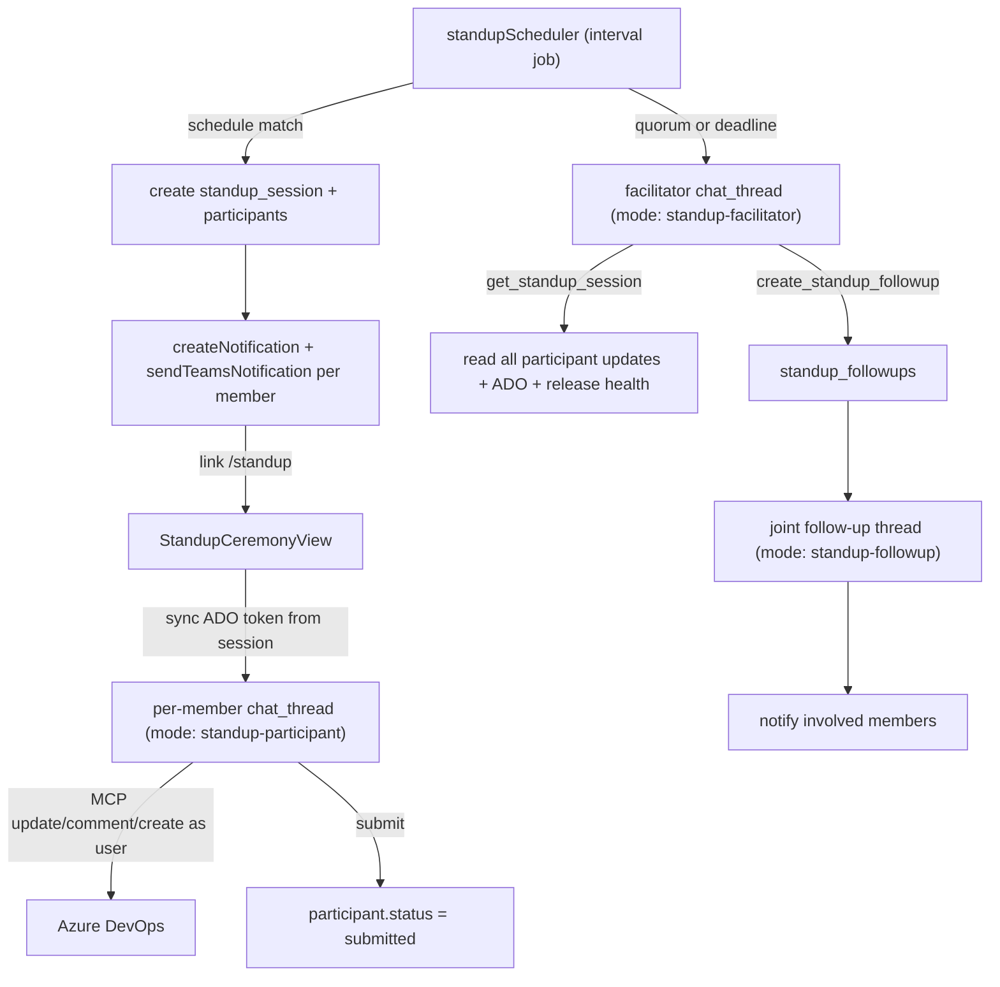

# Standup Ceremony Bot

An AI bot conducts agile standups across all members of a configured group: each member gets a private, interactive chat where the agent asks the standup questions, grounds the conversation in their ADO work items, and can update / comment / create (never delete) those items as the logged-in user. A facilitator agent then reads every member's updates, identifies cross-cutting follow-ups, and starts joint follow-up threads that notify only the people involved.

## Confirmed decisions
- Follow-up model: per-member private threads + a separate facilitator agent that creates joint follow-up threads (@-notifying relevant members).
- ADO writes attributed to the logged-in user (per-user token), never delete.
- Groups: reuse existing `app_groups` / `app_group_members`; add a thin `standup_configs` binding (schedule + ADO project/area/sprint).
- Delivery: both in-app notification (deep link) and Teams.
- Skill model (hybrid): facilitator/orchestration logic stays in code; the **participant conversation** procedure is driven by a skill. The **default lives in Apex (the app)**: bundled in the participant prompt builder in code, with a source-of-truth `.cursor/skills/daily-standup/SKILL.md` committed to this repo for humans to read/edit. A team can **override** by adding a `daily-standup/SKILL.md` to their own Azure DevOps project repo and setting `standup_skill_path` on that project's config (loaded at runtime via the `ado-skills` MCP).
- Hosting constraint: Apex/AI-Pilot is a GitHub repo (`github.com/ryamiller-amergis/Scrum`), but the runtime `ado-skills` MCP only fetches from Azure DevOps repos. So the default cannot be a runtime-fetched skill — it must be app-bundled; only per-team ADO overrides are fetched via `get_skill`.

## Architecture

## Data model (new migration + `schema.ts` sync)

New tables (`migrations/<ts>_standup-ceremony.sql`, then mirror in [src/server/db/schema.ts](src/server/db/schema.ts)):
- `standup_configs`: `id`, `group_id` (FK `app_groups.id`), `project`, `area_path`, `iteration_mode` (`current` | `explicit`), `iteration_path` (nullable), `schedule_time` (e.g. `09:00`), `timezone`, `weekdays` (jsonb `[1..5]`), `skill_settings_id` (nullable, resolves repo/branch/model), `enabled`, `created_at`, `updated_at`.
- `standup_sessions`: `id`, `config_id`, `group_id`, `session_date`, `status` (`open`|`collecting`|`facilitating`|`completed`), `facilitator_thread_id` (nullable FK `chat_threads.id`), `summary_markdown` (nullable), `created_at`, `completed_at`.
- `standup_participants`: `id`, `session_id`, `user_id` (FK `app_users.oid`), `thread_id` (FK `chat_threads.id`), `status` (`pending`|`notified`|`in_progress`|`submitted`), `structured_update` (jsonb: yesterday/today/blockers), `ado_access_token` (nullable, short-lived), `ado_token_expires_at` (nullable), `submitted_at`.
- `standup_followups`: `id`, `session_id`, `title`, `description`, `participant_user_ids` (jsonb), `related_work_item_ids` (jsonb), `status` (`open`|`thread_created`|`resolved`), `followup_thread_id` (nullable FK `chat_threads.id`), `created_at`.
- Permissions (same migration, mirror `developer-workbench` pattern): `standup:participate` (admin, member), `standup:manage` (admin).

Store the ADO token on `standup_participants` (not on the generic `chat_threads`) so the MCP write tools can resolve `threadId -> participant -> token`, and tokens aren't broadly exposed.

Skill path resolution: add a `standup_skill_path` column to `project_skill_settings` (mirrors the existing `*_skill_path` columns like `design_doc_validation_skill_path`), plus an admin UI field. `standup_configs.skill_settings_id` selects which project config (repo/branch/model + standup skill path) a group uses. If a config has **no** `standup_skill_path`, the agent uses the **app-bundled default** (no `get_skill` fetch). If set, the participant agent `get_skill`-loads that team's ADO `SKILL.md` and follows it instead. Same resolution pattern `useProjectSkillConfig` already uses for PRD/design-doc skills.

## Per-user ADO writes from the agent (the key plumbing)

Today [adoUserToken.ts](src/server/services/adoUserToken.ts) reads the refresh token from the live Passport session — unavailable to the stateless MCP server. Solution that avoids persisting refresh tokens:
- The Standup UI calls `POST /api/standup/threads/:threadId/sync-token` on open and before each send. That route runs in the user's session, calls `getAdoTokenForUser(req)`, and stores the resulting ADO access token + expiry on the participant row.
- New MCP write tools accept `threadId`, resolve the participant + token, and build the ADO service with `adoWriteFromToken(token, ...)` from [adoFactory.ts](src/server/services/adoFactory.ts). Token is fresh (~1h) for the duration of an active conversation; refreshed each turn.

## Server changes

New ADO MCP write tools in [src/server/mcp/ado/server.ts](src/server/mcp/ado/server.ts) (alongside `create_work_items`):
- `update_work_item` — `{ threadId, project, areaPath?, workItemId, fields }`; resolves per-user token via `threadId`, calls `AzureDevOpsService.updateWorkItemField` per field (state, assignedTo, iterationPath, targetDate, ...).
- `add_work_item_comment` — `{ threadId, project, workItemId, comment }`; needs a new `AzureDevOpsService.addWorkItemComment(id, text)` (ADO Comments API) in [azureDevOps.ts](src/server/services/azureDevOps.ts).
- `get_standup_session` — `{ sessionId }`; returns every participant's structured update + transcript for the facilitator.
- `create_standup_followup` — `{ sessionId, title, description, participantUserIds, relatedWorkItemIds }`; persists a `standup_followups` row.
- Reuse existing `query_work_items` (WIQL with `@CurrentIteration` + `[System.AssignedTo]`) — no new query tool required. Never expose delete.

New `standupService.ts`:
- `generateDailySessions()` — for each due `standup_config`, create session + participant rows, create a per-member `chat_thread` (`createThread`, `mode: 'standup-participant'`, auto-kickoff so the agent greets), send in-app + Teams notification (`link: '/standup'`).
- `submitParticipant(participantId)` — mark submitted, extract `structured_update`; trigger facilitator on quorum/deadline.
- `runFacilitator(sessionId)` — create facilitator thread (`mode: 'standup-facilitator'`), let it read all updates and emit follow-ups; persist `summary_markdown`; for each follow-up create a joint thread (`mode: 'standup-followup'`) and notify involved members; mark session `completed`.

New `standupScheduler.ts` — singleton interval service mirroring [featureAutoComplete.ts](src/server/services/featureAutoComplete.ts): every ~5 min, create due sessions and trigger facilitator for sessions past deadline. Registered in [src/server/index.ts](src/server/index.ts) `app.listen` callback (protected file — see note).

New router `src/server/routes/standup.ts` (mounted in `index.ts`):
- `GET/POST/PUT/DELETE /api/standup/configs` (`standup:manage`)
- `GET /api/standup/sessions`, `GET /api/standup/sessions/:id` (board + detail)
- `GET /api/standup/my-session` (current user's participant + `threadId` for today)
- `POST /api/standup/threads/:threadId/sync-token` (refresh per-user ADO token)
- `POST /api/standup/participants/:id/submit`
- `POST /api/standup/sessions/:id/facilitate` (manual trigger)

Prompt builders in [chatAgentService.ts](src/server/services/chatAgentService.ts): widen `kickoff.mode` and add `buildStandupParticipantPrompt` / `buildStandupFacilitatorPrompt` / `buildStandupFollowupPrompt`, routed in `buildInitialPrompt`.
- **Participant**: the prompt injects standup session context (`sessionId`, `participantId`, `threadId`, project/area, display name/email) and the available MCP write tools. By default it embeds the **app-bundled standup procedure** (questions, definition-of-done, on-track criteria, write-back guidance). If the resolved config has a `standup_skill_path`, the prompt instead instructs the agent to `get_skill`-load that team's ADO `SKILL.md` and follow it (reusing the existing skill-load prompt path). Either way, code guarantees the contract: ground in the member's sprint items via `query_work_items`, offer `update_work_item` / `add_work_item_comment` / `create_work_items` (always confirm, never delete), then summarize.
- **Facilitator** and **follow-up** stay code-driven (no repo fetch) for reliability on the scheduled path, since they run on structured session data and may execute when no user is present.

Default procedure lives in Apex (the app): the canonical text is bundled in the participant prompt builder, with a mirror `.cursor/skills/daily-standup/SKILL.md` committed to this repo as the editable source of truth. Teams customize by adding their own `daily-standup/SKILL.md` to their Azure DevOps project repo and setting `standup_skill_path` on that project's config.

Shared type change: extend `ChatThreadKickoff.mode` and add `standupSessionId` / `standupParticipantId` / `skillPath` (resolved standup skill) in [src/shared/types/chat.ts](src/shared/types/chat.ts).

## Client changes

- New `currentView: 'standup'` in [src/client/App.tsx](src/client/App.tsx) with routes `/standup` (participant), `/standup/manage` (admin), `/standup/session/:id` (summary); nav entry gated by `standup:participate`.
- `StandupCeremonyView.tsx` — resolves `GET /api/standup/my-session`, opens the participant chat thread reusing the existing chat stream/render components (`useChatStream` + message list from [ChatAgentPanel.tsx](src/client/components/ChatAgentPanel.tsx) / [AgentHome.tsx](src/client/components/AgentHome.tsx)); calls `sync-token` on open and before each send; "Submit standup" button -> submit endpoint.
- `StandupManageView.tsx` (admin) — config CRUD (group picker via `useGroupsWithMembers`, project/area pickers, schedule), plus a live board of each member's status and follow-ups.
- `StandupSummaryView.tsx` — renders `summary_markdown`, follow-ups, and links to joint threads.
- Notification deep links: `/standup` (participant) and `/standup/session/:id` (summary).

## Notes / risks
- `src/server/index.ts` is a protected file under the scope-discipline rule (registering the scheduler + mounting the router). I will ask for explicit approval before editing it. The standup token-sync endpoint deliberately avoids touching the protected `chat.ts`/`auth.ts`.
- Cross-conversation association is done by the facilitator agent reading all transcripts/structured updates via `get_standup_session` and emitting follow-ups via `create_standup_followup` — no brittle keyword matching baked into code.
- "Current sprint" uses WIQL `@CurrentIteration` (no new ADO helper needed); explicit iteration path supported via config.
- No new dependencies (MSAL, Cursor SDK, Teams bot, node-pg-migrate all already present).