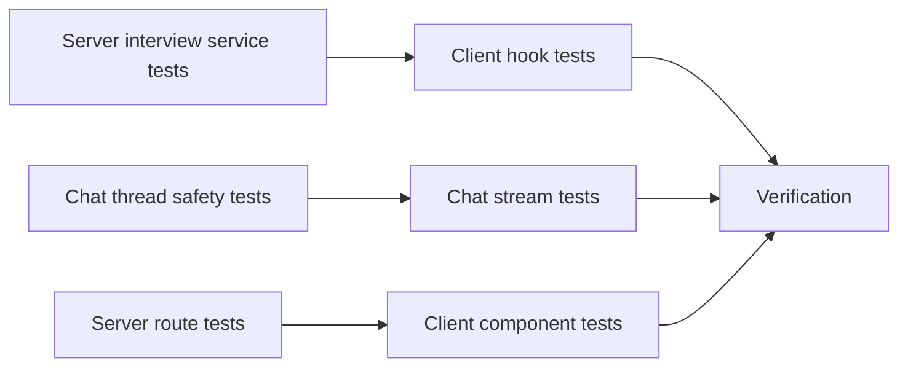

# Unit Tests for Current Git Changes

## Current State
The current working tree adds section-owner assignment to interviews, owner-related database fields and relationships, active-user lookup, owner assignment notifications, chat stream retry state, and document/thread retention safety in the chat agent service. Existing tests already cover baseline interview CRUD, route behavior, and chat stream mechanics, but they do not yet assert the new owner fields, notification side effects, active-user endpoint, retry UI state, or document-backed thread retention rules.

## Architecture
```mermaid
flowchart TD
  User[User starts interview] --> Compose[InterviewChatView]
  Compose --> OwnerModal[SectionOwnerModal]
  OwnerModal --> Hooks[useInterviews hooks]
  Hooks --> Routes[/api/interviews routes]
  Routes --> InterviewService[interviewService]
  InterviewService --> DB[(PostgreSQL via Drizzle)]
  InterviewService --> Notifications[notificationService]
  ChatStream[useChatStream] --> SSE[/api/chat thread stream]
  ChatAgent[chatAgentService] --> ThreadDB[(chat_threads)]
  ChatAgent --> Documents[(interviews, prds, design_docs)]
```

## Database Schema
The current changes add nullable owner columns to `interviews`:

```sql
ALTER TABLE interviews
  ADD COLUMN prd_owner_id TEXT REFERENCES app_users(oid) ON DELETE SET NULL,
  ADD COLUMN design_doc_owner_id TEXT REFERENCES app_users(oid) ON DELETE SET NULL;
```

The Drizzle schema mirrors these fields and adds `prdOwner` and `designDocOwner` relations to `app_users`. Tests should not run migrations or touch a live database; they should verify mocked Drizzle calls and mapped DTO output.

## Server Changes
Server tests should extend existing suites rather than create parallel scaffolding:

- `src/server/__tests__/interviewService.test.ts`
  - Assert `createInterview` persists `prdOwnerId` and `designDocOwnerId`.
  - Assert owner notifications are sent to the selected users with `user-action` type and interview links.
  - Assert notification failures are logged but do not fail interview creation.
  - Assert `getInterview` maps `prdOwnerName` and `designDocOwnerName`.
  - Assert `listInterviews` includes owner IDs.
  - Assert `getActiveUsers` returns active users ordered by display name.
- `src/server/__tests__/interviewRoutes.test.ts`
  - Assert `POST /api/interviews` forwards `prdOwnerId` and `designDocOwnerId`.
  - Assert `GET /api/interviews/active-users` returns service results.
- `src/server/__tests__/chatAgentService.test.ts` or an existing chat-agent suite
  - Assert closing an interview-backed thread does not delete its `chat_threads` row.
  - Assert PRD/design-doc backed threads are retained to prevent cascade or orphan data loss.

## Client Changes
Client tests should focus on behavior visible through hooks/components:

- `src/client/hooks/__tests__/useInterviews.test.ts`
  - Assert `useActiveUsers` fetches `/api/interviews/active-users`.
  - Assert `useCreateInterview` includes owner IDs in the POST body.
- `src/client/hooks/__tests__/useChatStream.test.ts`
  - Assert `retrying` events set retry state/reason and clear on token/message/done.
  - Assert transient/rate-limit errors show retrying state before fallback message after timeout.
  - Assert auth errors add the session-expired message and set error status.
- `src/client/components/__tests__/SectionOwnerModal.test.tsx`
  - Assert users load into PRD and design-doc owner comboboxes.
  - Assert selecting owners calls `onConfirm` with IDs.
  - Assert Skip, close, overlay click, and Escape call `onSkip`.
- `src/client/components/__tests__/InterviewChatView.NewInterviewCompose.test.tsx`
  - Assert starting a valid interview opens the owner modal before creation.
  - Assert confirmed owners are passed to `useCreateInterview`.
  - Assert skipping owners creates the interview without owner IDs.

## Key Design Decisions
The tests should extend existing files where those files already own the behavior, because the repo has established mocked Drizzle, mocked route-service, and Testing Library hook patterns. Component coverage should stay focused on the owner handoff and modal behavior instead of re-testing CSS or visual layout. Chat agent service tests may need isolated module loading because `chatAgentService` holds module-level thread state; tests should prefer existing patterns if present and avoid broad refactors.

No protected config files are required. If Jest environment or TypeScript config changes appear necessary, stop and ask for explicit permission rather than modifying `jest.config.*`, `tsconfig*.json`, or `package.json`.

## Phase Summary and Parallelization


Phase 1 server tasks are independent and can run in parallel because they touch separate test suites and mock boundaries. Phase 2 client tasks are independent after Phase 1 defines the API contracts. Phase 3 must run after all test files are updated so the final test command and type-checks cover the combined surface.

## Files Changed / Created
| Action | Path |
|---|---|
| Update | `src/server/__tests__/interviewService.test.ts` |
| Update | `src/server/__tests__/interviewRoutes.test.ts` |
| Create or update | `src/server/__tests__/chatAgentService.test.ts` |
| Update | `src/client/hooks/__tests__/useInterviews.test.ts` |
| Update | `src/client/hooks/__tests__/useChatStream.test.ts` |
| Create | `src/client/components/__tests__/SectionOwnerModal.test.tsx` |
| Update | `src/client/components/__tests__/InterviewChatView.NewInterviewCompose.test.tsx` |
| Create | `design-docs/unit-tests-for-git-changes.md` |
